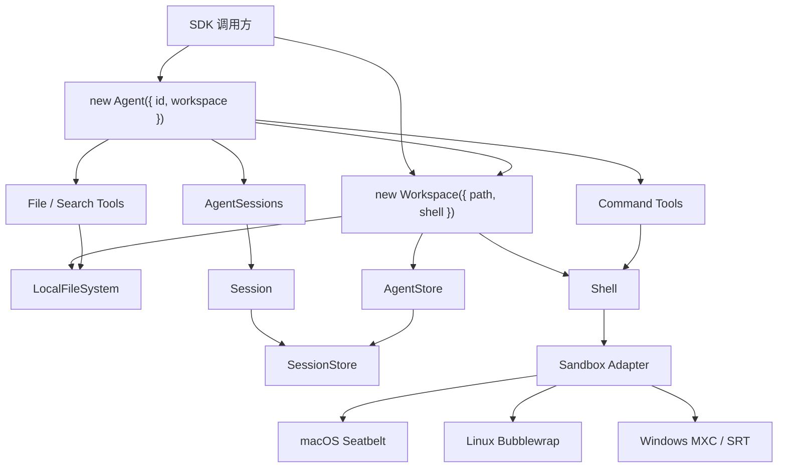

# Agent 本地 Runtime 架构设计

> 状态：Implemented（SQLite 与 Plugin 进程隔离除外）
>
> 范围：`@downcity/agent`、`@downcity/shell`、Session 持久化、跨平台执行和安全边界。
>
> 本文基于 2026-07-25 对 Codex、Anthropic Sandbox Runtime、OpenHands 与 VS Code 的公开源码调研形成，同时记录目标设计与实际迁移进度。

实现进度：Workspace 已统一提供 LocalFileSystem、AgentTools、AgentStore 与可选 Shell；SessionStore 领域边界和新的 Agent 构造 API 已实现。默认 Store 沿用 Workspace 内 `.downcity` JSONL 布局；SQLite 与 Plugin 进程隔离仍属于后续阶段。

## 1. 最终结论

Downcity 当前是运行在本机 Node.js 进程中的 Agent SDK。Node.js 已经统一了 macOS、Linux、Windows 的常规文件、路径、网络和数据处理能力。Downcity 不需要额外的 `Host` 或 `SystemHandler`，但需要一个明确的 `Workspace`，将 Agent 可以访问的项目路径、文件能力和命令能力收敛到同一个安全作用域。

目标结构：

```text
Agent
└─ Workspace            统一资源容器
   ├─ FileSystem        Node.js 跨平台文件能力
   │  ├─ AgentTools     模型可调用的文件与搜索工具
   │  └─ AgentStore     结构化 Session 持久化
   └─ Shell?            命令、进程、PTY 与 Sandbox
      └─ Platform Sandbox Adapter
```

公开 API 保持简单：

```ts
const workspace = new Workspace({
  path: process.cwd(),
  shell: new Shell({
    sandbox: new MacOsSeatbeltSandbox(),
  }),
});

const agent = new Agent({
  id: "demo",
  workspace,
});
```

Windows 只替换 Sandbox：

```ts
const workspace = new Workspace({
  path: process.cwd(),
  shell: new Shell({
    sandbox: new WindowsMxcSandbox(),
  }),
});

const agent = new Agent({
  id: "demo",
  workspace,
});
```

核心边界：

| 模块 | 职责 | 不负责 |
| --- | --- | --- |
| `Agent` | 装配 Workspace、Tool、Plugin、Session 与 Store | 项目路径和平台 Sandbox 细节 |
| `Workspace` | 统一提供 FileSystem、AgentTools、AgentStore 与可选 Shell | Agent 和 Session 领域编排 |
| `LocalFileSystem` | Workspace 范围内的安全文件操作 | Session 领域规则和命令执行 |
| `AgentStore` | 基于 Workspace FileSystem 提供结构化 Session 持久化 | 通用文件 Tool 和 Shell 命令 |
| `Shell` | Command、Shell Session、PTY、审批和 Sandbox | Session 历史与通用系统服务 |
| `Sandbox Adapter` | 将统一策略映射到当前 OS | Agent 和 Session 业务 |

## 2. 设计意图

### 2.1 简约

- 不增加没有当前业务价值的公共对象。
- `Workspace` 只表达当前项目资源边界，不为尚未存在的远程协议增加能力。
- 不把 Node.js 已经解决的问题重复包装成平台 adapter。
- 用户只需要理解 Agent、Workspace、Shell 和 Sandbox。

### 2.2 跨平台

- 常规能力优先使用 Node.js 标准 API。
- 只有操作系统语义确实不同的能力使用 adapter。
- Agent、Session、Message、Memory 和 Store contract 不写平台分支。
- 平台 package 独立安装，避免非当前系统的原生依赖。

### 2.3 安全

- 模型文件工具只能访问项目根目录。
- Session 历史位于 Workspace `.downcity`，与其他项目资源使用同一访问边界。
- Shell 子进程通过 OS Sandbox 强制限制。
- Tool input 不能修改根目录、Store 路径或 Sandbox Policy。
- 不可信 Plugin 不在 Agent Core 进程中运行。

### 2.4 稳定

- Session 历史通过 Store contract 持久化。
- 本地 Store 负责事务、锁、sequence 与崩溃恢复。
- 文件遍历有深度、数量、大小限制。
- 生命周期所有权明确，dispose 可以完整收口。

## 3. Node.js 已经解决什么

以下能力直接使用 Node.js 即可跨平台：

- `node:fs` / `node:fs/promises`：文件与目录。
- `node:path`：平台路径分隔符、resolve、relative。
- `node:os`：用户目录、临时目录、平台信息。
- `node:http` / `fetch`：网络请求。
- SQLite、JSON、JSONL：Session 与状态数据。
- `AbortController`、Timer、EventEmitter：运行时控制。
- 普通 `child_process.spawn()`：基础子进程启动。

Node.js 没有统一以下安全与系统语义：

- macOS Seatbelt、Linux Bubblewrap、Windows MXC/SRT。
- Unix PTY 与 Windows ConPTY。
- Signal、进程组与 Windows Job Object。
- Unix mode、Windows ACL 与 reparse point。
- launchd、systemd、Windows Service。
- Keychain、Credential Manager、Secret Service。

因此跨平台原则是：

```text
Node.js 统一常规能力
Platform Adapter 统一原生安全与进程差异
```

## 4. 为什么使用 Workspace，但不使用 Host 或 SystemHandler

### 4.1 不使用 AgentHost

```text
Agent → Host → FileSystem / Shell / Store / Logger / Clock
```

Host 没有独立业务语义，容易成为 Service Container。它只增加一层转发，并不形成安全边界。

### 4.2 不让 Shell 持有 SystemHandler

```text
Agent → Shell → SystemHandler → Files / Session / Logs / Cache
```

这会让 Shell 变成 God Object：

- Session 历史被迫依赖 Shell 生命周期。
- 没有 Shell Tool 的执行场景仍然需要 Store。
- 命令执行和领域持久化形成错误耦合。
- SystemHandler 最终会吸收 env、time、logger、network 等所有系统能力。

### 4.3 Workspace 是资源边界，不是平台抽象

`path`、项目文件和在该项目内执行的 Shell 天然共享同一个根目录与安全策略。如果分别交给 Agent 装配，会让 Agent 承担基础设施细节，也可能产生 FileSystem 与 Shell 根目录不一致的问题。

因此公开 `Workspace`，但严格限制它的职责：

- canonicalize 一次项目根目录。
- 创建并持有 rooted FileSystem。
- 将可选 Shell 绑定到相同根目录。
- 向 Agent 提供文件、搜索和命令能力。
- 不管理 Session、Message、Memory、Task 或模型。

当前 `Workspace` 只有本地 Node.js 实现。macOS、Linux 和 Windows 使用同一个类，只替换 Shell 的 Sandbox Adapter。它不是为了假设中的 Remote Workspace 提前设计的通用协议。

### 4.4 AgentStore 是 Workspace 的结构化分支

- Workspace 是 Agent 可使用的统一资源容器。
- AgentStore 与 AgentTools 共用相同的 FileSystem 和项目目录。
- AgentTools 与 Shell 可以正常读取或修改 `.downcity` 中的历史、Instruction 和审计数据。
- AgentStore 不是权限边界，只负责路径布局、Message sequence、Metadata、归档和崩溃恢复等领域语义。

因此 Store 由 Workspace 提供，创建 Agent 时不再单独注入 Store。

## 5. 公开项目参考

### 5.1 OpenAI Codex

Codex 支持本地和远程 execution environment，因此使用独立文件系统能力：

- [`ExecutorFileSystem`](https://github.com/openai/codex/blob/main/codex-rs/file-system/src/lib.rs) 抽象本地与远程文件操作。
- [`ToolCallContext`](https://github.com/openai/codex/blob/main/codex-rs/tools/src/tool_call.rs) 分别持有 file system 和 sandbox context，没有把文件系统放入 Shell。
- [`SandboxManager`](https://github.com/openai/codex/blob/main/codex-rs/sandboxing/src/manager.rs) 只在进程执行边界转换平台 Sandbox。
- [`ThreadStore`](https://github.com/openai/codex/blob/main/codex-rs/thread-store/src/store.rs) 独立负责线程历史持久化。

Downcity 应借鉴“文件、执行、历史分离”，不需要照搬 Codex 的远程 Environment 抽象。

### 5.2 Anthropic Sandbox Runtime

[`Anthropic Sandbox Runtime`](https://github.com/anthropic-experimental/sandbox-runtime) 使用 OS 原生机制限制任意进程树：

- `SandboxManager.wrapWithSandbox*()` 包装命令。
- 调用方使用 `spawn()` 启动包装后的子进程。
- SRT 不管理 Agent Message、Session Store 或应用文件服务。

Downcity 应让 Sandbox 继续属于 Shell process boundary，而不是所有本地资源访问的入口。

### 5.3 OpenHands

OpenHands 同时支持本地和云端 Workspace：

- [`BaseWorkspace`](https://github.com/OpenHands/software-agent-sdk/blob/main/openhands-sdk/openhands/sdk/workspace/base.py) 统一命令和文件操作。
- [`LocalConversation`](https://github.com/OpenHands/software-agent-sdk/blob/main/openhands-sdk/openhands/sdk/conversation/impl/local_conversation.py) 分别接收 workspace 与 file_store。
- [`EventStore`](https://github.com/OpenHands/software-agent-sdk/blob/main/openhands-sdk/openhands/sdk/conversation/event_store.py) 独立保存 Conversation Event。
- [`FileStore`](https://github.com/OpenHands/software-agent-sdk/blob/main/openhands-sdk/openhands/sdk/io/base.py) 定义持久化和锁接口。

Downcity 应借鉴“Workspace 与 Conversation Store 分离”，但当前 Workspace 只实现本地项目资源边界，不照搬云端协议抽象。

### 5.4 VS Code

[`IFileService` / `IFileSystemProvider`](https://github.com/microsoft/vscode/blob/main/src/vs/platform/files/common/files.ts) 与 Terminal 分离，并用 capability 表达 atomic write、realpath、stream 和 readonly。

Downcity 应借鉴：

- 文件系统是一等内部服务，不属于 Shell。
- 原子写入和稳定错误码由底层统一实现。
- 上层不解析平台原始错误文本。

## 6. 目标组件关系



依赖方向：

```text
Agent → Workspace
Workspace → LocalFileSystem
Workspace → Shell
Workspace → AgentStore
Shell → Sandbox Adapter
Session → SessionStore
```

禁止：

- Shell 依赖 Agent、Session 或 AgentStore。
- Workspace 依赖 Agent 或 Session。
- AgentStore 依赖 Shell。
- Session 直接调用 `node:fs`。
- File Tool 通过 Shell command 读取普通文件。
- Sandbox package 依赖 Agent。

## 7. Agent API

```ts
/** 本地 Agent 构造参数。 */
interface AgentOptions {
  /** 当前 Agent 的稳定标识。 */
  id: string;

  /** 当前 Agent 可以访问的项目资源边界。 */
  workspace: Workspace;

  /** 当前 Agent 默认模型。 */
  model?: AgentModel;

  /** 当前 Agent 显式安装的 Plugin。 */
  plugins?: Plugin[];

  /** 当前 Agent 的基础指令。 */
  instruction?: string | string[];

  /** 当前 Agent 默认额外 Tool。 */
  tools?: Record<string, Tool>;

  /** Agent 级环境变量覆盖。 */
  env?: Record<string, string>;
}
```

Workspace 中的 Shell 保持可选：

- 没有 Shell 时，Agent 仍可使用模型、Session、Store 与调用方提供的 Tool。
- 传入 Shell 时，Agent 增加 Command Tool 和 Sandbox 能力。

## 8. Workspace 与 Agent 构造

```ts
/** 本地 Workspace 构造参数。 */
interface WorkspaceOptions {
  /** Workspace 绑定的本地项目根目录。 */
  path: string;

  /** Workspace 内可选的受控命令执行能力。 */
  shell?: Shell;
}

class Workspace {
  /** 已解析且不可变的项目根目录。 */
  readonly path: string;

  /** 项目根目录内的受控文件能力。 */
  readonly files: FileSystem;

  /** 唯一绑定指定 Agent，并基于当前 FileSystem 创建结构化 Store。 */
  bind_agent(agent_id: string): AgentStore;

  /** 项目根目录内可选的受控命令能力。 */
  readonly shell?: Shell;

  constructor(options: WorkspaceOptions) {
    this.path = canonicalize_workspace_path(options.path);
    this.files = new LocalFileSystem({
      root_path: this.path,
    });
    this.shell = options.shell;
    this.shell?.bind(this.path);
  }

  /** 关闭 Workspace 持有的 Shell 与底层平台资源。 */
  async dispose(): Promise<void>;
}
```

```ts
class Agent {
  constructor(options: AgentOptions) {
    this.id = require_agent_id(options.id);
    this.workspace = options.workspace;

    this.store = this.workspace.bind_agent(this.id);

    this.tools = {
      ...create_file_tools(this.workspace.files),
      ...create_search_tools(this.workspace.files),
      ...(this.workspace.shell
        ? create_shell_tools(this.workspace.shell, {
            env: resolve_agent_env(options.env),
          })
        : {}),
      ...(options.tools ?? {}),
    };

    this.sessions = new AgentSessions({
      store: this.store,
      files: this.workspace.files,
      tools: this.tools,
    });
  }
}
```

关键点：

- Workspace 只 canonicalize 一次项目根目录。
- Workspace 保证 LocalFileSystem 与 Shell 共享同一个已解析 root。
- AgentStore 与 AgentTools 共用 Workspace FileSystem 和根目录。
- 模型不能控制任何装配参数。

## 9. LocalFileSystem

`LocalFileSystem` 是 Workspace 的内部实现，不属于 `@downcity/shell`，也不要求用户手动创建。

```ts
/** 项目根目录内的受控文件能力。 */
interface FileSystem {
  /** 将 Workspace 相对路径解析为受控本地路径。 */
  resolve_path(...segments: string[]): string;

  /** 通过临时文件、fsync 与 rename 原子覆盖完整文件。 */
  write_file_atomically(file_path: string, content: string | Buffer): Promise<void>;

  /** 创建目录、扫描直接子项、删除或原子移动 Workspace 路径。 */
  ensure_directory(directory_path: string): Promise<void>;
  read_directory(directory_path: string): Promise<WorkspaceDirectoryEntry[]>;
  remove_path(target_path: string): Promise<void>;
  move_path(source_path: string, target_path: string): Promise<void>;

  /** 读取项目内文件并执行大小限制。 */
  read_file(
    path: ProjectPath,
    options?: FileReadOptions,
  ): Promise<Uint8Array>;

  /** 原子写入项目内文件。 */
  write_file(
    path: ProjectPath,
    content: Uint8Array,
    options?: FileWriteOptions,
  ): Promise<void>;

  /** 返回目录直接子项。 */
  read_directory(path: ProjectPath): Promise<FileEntry[]>;

  /** 在明确限制内遍历项目目录。 */
  walk(
    path: ProjectPath,
    options: FileWalkOptions,
  ): Promise<FileWalkResult>;

  /** 返回文件或目录元数据。 */
  stat(path: ProjectPath): Promise<FileMetadata | null>;

  /** 删除项目内文件或目录。 */
  remove(
    path: ProjectPath,
    options?: FileRemoveOptions,
  ): Promise<void>;
}
```

### 9.1 ProjectPath

```ts
/** 当前项目根目录内的逻辑相对路径。 */
type ProjectPath = string & {
  readonly __project_path: unique symbol;
};

/** 创建经过统一语法校验的 ProjectPath。 */
function project_path(input: string): ProjectPath;
```

必须拒绝：

- NUL 和非法编码。
- `..` 越界。
- POSIX 绝对路径。
- Windows drive、UNC 和 device path。
- Windows 保留设备名。

### 9.2 安全规则

- root 初始化时执行 realpath/canonicalize。
- Windows 比较路径时兼容大小写不敏感语义。
- `/repo` 不能匹配 `/repo-secret`。
- 读取验证最终 realpath。
- 写入验证所有已存在父目录。
- Windows 检测 junction 与 reparse point。
- 文件错误只返回逻辑相对路径。

### 9.3 有界遍历

参考 Codex 的 bounded walk，目录遍历必须要求：

- `max_depth`。
- `max_directories`。
- `max_entries`。
- `max_response_bytes`。
- 是否跟随目录 symlink。

禁止无界递归扫描。

## 10. File/Search Tool

File/Search Tool 属于 Agent Tool Runtime，不属于 Shell：

```ts
function create_file_tools(files: FileSystem): FileToolSet {
  return {
    read_file: tool({
      input_schema: read_file_schema,
      execute: async (input) =>
        await files.read_file(project_path(input.path), {
          max_bytes: input.max_bytes,
        }),
    }),
  };
}
```

模型只能输入项目相对路径，不能输入：

- root_path。
- Store 路径。
- Sandbox Policy。
- 任意系统 scope。
- Agent ID 或 Session ID。

## 11. Shell

Shell 回归进程执行职责：

```ts
interface Shell {
  /** 当前 Shell 的平台 Sandbox Adapter。 */
  readonly sandbox: ShellSandboxAdapter;

  /** 将 Shell 一次性绑定到项目根目录。 */
  bind(root_path: string): void;

  /** 累加必须对所有子进程隐藏的可信私有路径。 */
  protect_paths(paths: readonly string[]): void;

  /** 执行一次性命令。 */
  exec(input: ShellExecInput): Promise<ShellExecResult>;

  /** 启动长时间运行的交互进程。 */
  start(input: ShellStartInput): Promise<ShellSession>;

  /** 关闭活动进程并释放 Sandbox。 */
  dispose(): Promise<void>;
}
```

Shell 负责：

- Command parsing。
- `cmd.exe`、PowerShell、bash、zsh 差异。
- Pipe、PTY、ConPTY。
- 子进程、signal 与 timeout。
- Safe/Unrestricted 模式。
- Approval Gateway。
- Sandbox Policy 和 Adapter。

Shell 不负责：

- 普通 File/Search Tool。
- Session Message Store。
- Agent Memory、Task 与日志。
- 通用 SystemHandler。

## 12. Sandbox Adapter

```ts
interface ShellSandboxAdapter {
  /** 当前平台执行后端标识。 */
  readonly backend: string;

  /** 检查平台版本与依赖。 */
  preflight(input: SandboxPreflightInput): Promise<SandboxPreflightResult>;

  /** 使用已解析的最终策略启动受限进程。 */
  spawn(input: SandboxSpawnInput): Promise<SandboxProcess>;

  /** 释放代理、ACL、临时用户和平台资源。 */
  dispose?(): Promise<void>;
}
```

平台实现：

```text
@downcity/sandbox-macos
@downcity/sandbox-linux
@downcity/sandbox-windows-mxc
@downcity/sandbox-windows-srt
```

CLI 负责根据当前系统选择 adapter。`@downcity/agent` 不自动依赖所有平台 package。

## 13. AgentStore 与 SessionStore

Store 是领域持久化接口，不暴露通用文件 API：

```ts
interface AgentStore {
  /** 返回指定 Session 的持久化视图。 */
  session(session_id: string): SessionStore;

  /** 返回 Memory 存储。 */
  memory(): MemoryStore;

  /** 返回 Task 存储。 */
  tasks(): TaskStore;

  /** flush 并释放锁与数据库连接。 */
  dispose(): Promise<void>;
}

interface SessionStore {
  /** 初始化并执行结构校验与崩溃恢复。 */
  initialize(): Promise<void>;

  /** 在事务内分配 sequence 并提交 Message。 */
  commit_message(input: CommitMessageInput): Promise<SessionMessage>;

  /** 返回当前 Active Message。 */
  load_active_messages(): Promise<SessionMessage[]>;

  /** 返回全部可审计历史。 */
  load_history(): Promise<SessionMessage[]>;

  /** 原子提交 Segment、Summary 与 Active 集合。 */
  compact(input: CompactSessionInput): Promise<SessionSegment>;

  /** 返回 Session Metadata Store。 */
  metadata(): SessionMetadataStore;
}
```

### 13.1 默认存储位置

runtime 数据位于当前 Workspace：

```text
.downcity/agents/<encoded_agent_id>/
├─ sessions/
├─ memory/
├─ tasks/
├─ cache/
└─ logs/
```

AgentStore 与 AgentTools 使用相同的 Workspace FileSystem。Store 不承担访问控制；模型和 Shell 可以像访问其他项目文件一样访问 `.downcity`。

### 13.2 Store 实现

- 当前阶段：JSONL LocalAgentStore。
- 稳定阶段：SQLite LocalAgentStore。
- 测试：InMemoryAgentStore。
- 未来服务端：PostgresAgentStore。

Store 替换不影响 Agent、Session 或 Shell API。

## 14. Session

```ts
class Session {
  constructor(options: SessionOptions) {
    this.id = require_session_id(options.id);
    this.store = options.agent_store.session(this.id);

    this.messages = new SessionMessages({
      session_id: this.id,
      store: this.store,
    });
  }
}
```

Session 不接收 project_root，不拼接消息路径，不直接调用 `node:fs`，也不通过 Shell Tool 读取历史。

调用关系：

```text
Session → SessionStore → JSONL / SQLite / Remote DB
```

## 15. Session 稳定性

### 15.1 并发

- 单个 Session 在进程内只有一个 commit queue。
- 跨进程使用 Store lock 或数据库 transaction。
- sequence 在锁或事务内生成。
- Message 和 Metadata 的相关更新保持原子性。

### 15.2 崩溃恢复

- Segment 先完整提交，再更新 Active。
- Active 可根据 Segment sequence 去重。
- Assistant Draft 带 session_id、revision 和 checksum。
- 初始化验证 sequence 单调和 Segment 范围。
- 数据损坏返回明确错误，不静默丢弃。

### 15.3 SQLite

长期稳定性优先 SQLite：

- transaction 比文件锁更可靠。
- sequence、Message、Metadata 可以一致提交。
- Windows 文件占用和 rename 差异更少。
- 查询、分页、归档和恢复更简单。

JSONL 可以作为导入导出和审计格式，不必永久承担并发数据库职责。

## 16. 安全模型

### 16.1 信任等级

| 主体 | 信任等级 | 能力 |
| --- | --- | --- |
| Agent Core | 可信 | Workspace、AgentStore 与 Tool 装配 |
| Session Domain | 可信、最小依赖 | SessionStore |
| 模型输入 | 不可信 | Tool Schema |
| Shell 子进程 | 不可信 | OS Sandbox 后的能力 |
| 官方 Plugin | 有条件可信 | 声明后的 facade |
| 第三方 Plugin | 不可信 | 独立进程 RPC |

### 16.2 强制边界

- File Tool：可信实现、rooted FileSystem、路径校验。
- Shell Tool：审批、Platform Sandbox、network policy。
- AgentStore：结构化状态接口，与 AgentTools 共用 rooted FileSystem。
- 第三方 Plugin：独立 Plugin Host 和 OS Sandbox。

### 16.3 TOCTOU

`realpath → open` 的字符串路径校验不能消除 symlink/reparse point 竞态。高安全阶段需要：

- 使用安全目录句柄或最终 handle path 校验。
- 高风险 File Tool 进入 file broker 进程。
- broker 使用 Seatbelt、Bubblewrap 或 Windows ACL/Token 隔离。

接口只能减少误用，OS 强制机制才是恶意代码安全边界。

## 17. 环境变量

- Agent 只使用调用方传入 env 和受控项目 `.env`。
- 不把完整 `process.env` 自动传给模型或子进程。
- Shell 使用 allowlist 构建子进程 env。
- 密钥不写入 Message、Tool Result 和普通日志。
- Windows 环境变量名称按大小写不敏感处理。
- Agent env 修改不回写宿主进程。

## 18. 生命周期

所有权：

```text
Application creates Agent and its exclusive Workspace
Agent owns one Workspace instance
Workspace owns LocalFileSystem, AgentStore and optional Shell
Shell owns child processes and Sandbox Adapter
```

释放顺序：

1. 停止接收新 Turn。
2. Session 完成或中止活动 Turn。
3. 停止 Plugin lifecycle 和 Schedule。
4. AgentStore flush 并释放锁/连接。
5. Agent 释放对 Workspace 的引用。
6. Workspace 关闭 Shell 的活动进程与 PTY。
7. Workspace 释放 Shell Sandbox Adapter。

Workspace 实例与 Agent 严格一对一绑定，`agent.dispose()` 必须同时释放 Store、Shell 与 Sandbox。多个 Agent 可以操作同一物理目录，但必须分别创建 Workspace 实例，避免共享 PTY、审批状态和生命周期。

所有 dispose 必须幂等。单步失败不能阻止其他资源清理，最终返回聚合错误。

## 19. 错误模型

```ts
type RuntimeErrorCode =
  | "invalid-path"
  | "path-outside-project"
  | "link-escape"
  | "permission-denied"
  | "resource-limit"
  | "storage-locked"
  | "storage-corrupted"
  | "unsupported-platform"
  | "runtime-disposed";

class RuntimeError extends Error {
  /** 跨平台稳定机器码。 */
  readonly code: RuntimeErrorCode;

  /** 可安全展示的项目相对路径。 */
  readonly logical_path?: string;

  /** 只供可信日志记录的底层错误。 */
  readonly cause?: unknown;
}
```

Agent、Session 和 Tool 不解析 `ENOENT`、HRESULT 或平台错误文本。

## 20. 测试框架

### 20.1 LocalFileSystem contract

- 正常读写、原子替换和 stat。
- 绝对路径、`..`、drive、UNC、NUL 拒绝。
- symlink、junction、reparse point 逃逸拒绝。
- bounded walk 限制。
- 大小写、Unicode、长路径和大文件。
- dispose 后稳定错误。

### 20.2 AgentStore contract

- sequence 并发唯一和单调。
- Segment/Active 中间崩溃恢复。
- Draft revision/checksum。
- 锁 lease 和异常进程恢复。
- Local 与 InMemory 实现行为一致。

### 20.3 Shell contract

- cmd/bash/zsh 参数和 quoting。
- pipe stdin EOF。
- PTY/ConPTY。
- timeout、signal 和进程清理。
- protected Store 路径不可读取。
- workspace 外不可写。

### 20.4 平台矩阵

| 测试 | macOS | Linux | Windows |
| --- | ---: | ---: | ---: |
| LocalFileSystem | 必跑 | 必跑 | 必跑 |
| LocalAgentStore | 必跑 | 必跑 | 必跑 |
| Shell contract | 必跑 | 必跑 | 必跑 |
| Native Sandbox | Seatbelt | Bubblewrap | MXC + SRT |

## 21. 迁移计划

项目不保留旧 API 兼容层，但按阶段保持测试可运行。

### Phase 1：引入 Workspace

- 从 Shell 中移出 File/Search Tool 的文件实现。
- 建立 Workspace、内部 FileSystem contract 和 LocalFileSystem。
- Workspace 统一 canonical path、LocalFileSystem 与可选 Shell。
- Agent 从 Workspace 创建 File/Search/Command Tool。
- 补齐跨平台路径 contract tests。

### Phase 2：抽出 AgentStore

- [x] 定义 AgentStore、SessionStore 与显式 SessionMessageStore contract。
- [x] Session 的 Message、Metadata、Instruction 与归档不再拼接物理路径。
- [x] JSONL 读写与既有目录约定收敛到 LocalAgentStore。
- [ ] runtime 数据迁移到用户级目录。

### Phase 3：收敛 Shell

- Shell 只保留 Command、Session、PTY、审批和 Sandbox。
- Agent 将 canonical root 与 Store protected paths 绑定给 Shell。
- 平台 adapter 保持独立 package。

### Phase 4：稳定 Store

- 实现 SQLite LocalAgentStore。
- 增加 transaction、分页、归档和 crash recovery。
- JSONL 变成审计与导出格式。

### Phase 5：Plugin 强隔离

- 官方 Plugin 使用最小 capability facade。
- 第三方 Plugin 迁入独立 Plugin Host。
- 将文件、网络和资源限制映射到 OS Sandbox。

### Phase 6：按需评估远程执行

只有真实远程文件与命令协议出现后，才评估是否抽取 Workspace contract：

```ts
interface WorkspaceBackend {
  files: FileSystem;
  shell?: Shell;
}
```

当前 `Workspace` 不承诺远程能力，也不得为了未来可能性增加连接、同步或 RPC API。

## 22. 验收标准

1. 公共 API 使用 `new Workspace({ path, shell? })` 与 `new Agent({ id, workspace })`。
2. 不存在 AgentHost 或通用 SystemHandler。
3. Agent 与 Session 不包含平台分支。
4. File/Search Tool 不依赖 Shell command protocol。
5. Shell 不负责 Session Store、Memory 或普通文件服务。
6. Session 不知道物理存储路径与格式。
7. AgentStore 与 AgentTools 共用 Workspace FileSystem；Store 不作为权限边界。
8. Workspace 保证 LocalFileSystem 与 Shell 使用同一个 canonical project root。
9. runtime 数据默认位于 Workspace `.downcity`，可由 AgentTools 与 Shell 访问。
10. macOS、Linux、Windows 运行同一 Node.js contract tests。
11. Platform Adapter 只处理原生 Sandbox 与进程差异。
12. 不可信 Plugin 使用进程级强制隔离。

## 23. 最终框架

```text
new Agent({ id, workspace })
              │
              ▼
new Workspace({ path, shell? })
       ┌──────┼─────────────┐
       ▼      ▼             ▼
 FileSystem  AgentTools    Shell
       │                    │
       ▼                    ▼
 AgentStore          Sandbox Adapter
       │              macOS/Linux/Windows
       ▼
 SessionStore
```

最终原则：

> Node.js 负责跨平台常规能力；Workspace 统一提供 Store、Tool 与 Shell 资源；Agent 负责领域装配；Store 只负责结构化持久化语义；Sandbox Adapter 只负责操作系统强制隔离。
