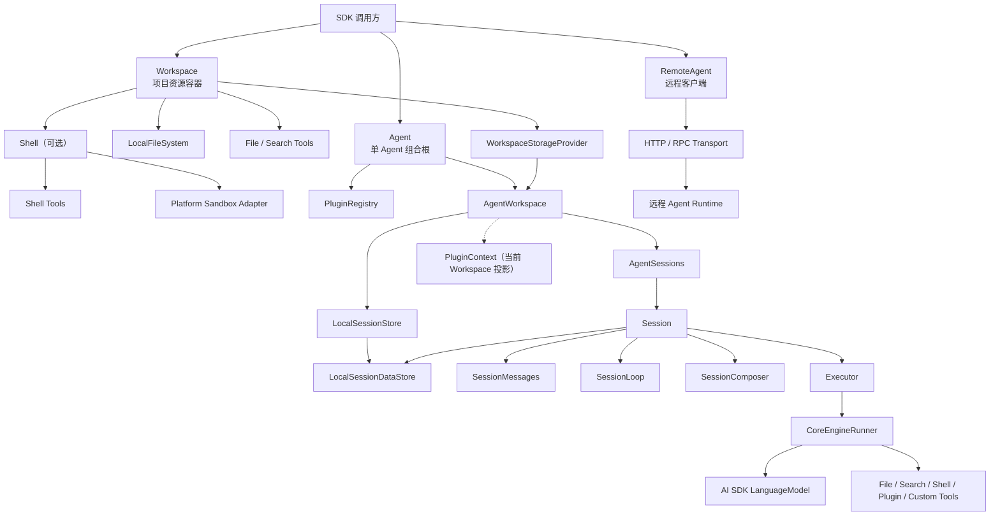
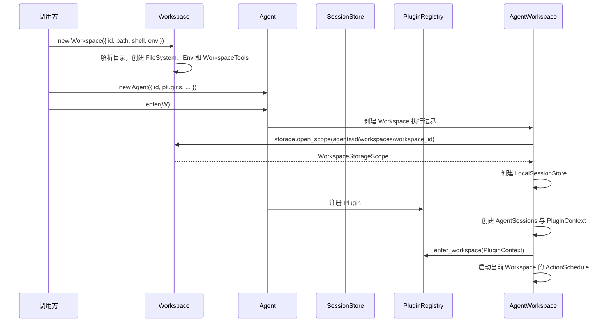

# Downcity Agent SDK 完整架构说明

> 状态：当前实现
>
> 适用包：`@downcity/agent`、`@downcity/workspace` 与平台 Sandbox Packages
>
> 更新时间：2026-07-25

## 1. 一句话定义

`@downcity/agent` 是一个运行在 Node.js 进程中的单 Agent SDK。它把模型、指令、工具、Plugin、Session 历史和本地项目资源装配成一个可持续运行、可以恢复、可以观察的 Agent runtime。

SDK 的组合根只有两个核心对象：

```ts
const agent = new Agent({ id, model, instruction, plugins });
const workspace = new Workspace({ id: "sdk", path, shell });
const sdk = agent.enter(workspace);
```

其中：

- `Agent` 回答“谁在执行，并持有哪些模型、指令和 Plugin”。
- `Workspace` 回答“一个项目提供哪些资源”。
- `AgentWorkspace` 回答“这个 Agent 进入项目后如何使用 Tool、Session 与 Plugin Context”。
- `Session` 回答“某段连续对话如何排队、执行、持久化和恢复”。
- `Executor` 回答“一个 Step 如何调用模型并完成 Tool Loop”。
- `Shell` 回答“命令和进程如何在当前操作系统上安全执行”。

## 2. 总体架构



最重要的依赖方向是：

```text
调用方
  → Agent + Workspace
  → AgentWorkspace
  → Session
  → Composer / Executor
  → Model 与 Tools

Workspace
  → FileSystem
  → WorkspaceStorageProvider
  → Shell（可选）
```

下层不知道上层的业务对象：

- `LocalFileSystem` 不知道 Agent、Session 和 Plugin。
- `Shell` 不知道 Session 历史和模型。
- `SessionStore` 不知道模型和 Tool Loop。
- `Executor` 不知道物理存储路径。
- Sandbox Adapter 不知道 Agent 业务，只负责启动受限进程。

## 3. 包边界

### 3.1 `@downcity/agent`

负责单 Agent 执行面：

- 本地 `Agent` 和 `Session` facade。
- AgentWorkspace、Session 与 Agent 领域 Store。
- Session 队列、消息、审批、压缩与恢复。
- 模型调用和 Tool Loop。
- Plugin registry、action、hook、system 和生命周期。
- `RemoteAgent` / `RemoteSession` 客户端协议。

它不负责：

- 多 Agent registry。
- daemon 和控制面进程。
- 平台级模型目录和账号管理。
- HTTP/RPC Server 生命周期。
- 选择当前操作系统的 Sandbox Package。

### 3.2 `@downcity/workspace`

负责项目资源边界与跨平台一致的命令执行协议：

- Workspace、WorkspaceBase 与 WorkspaceStorageProvider。
- 本地 Rooted FileSystem、File/Search Tools 与 Workspace Env。
- 短命令执行。
- 长期 Shell Session。
- 输出读取、状态查询、stdin、等待和关闭。
- Safe / unrestricted 模式与审批衔接。
- 将统一 Sandbox Policy 交给平台 Adapter。

Workspace 不负责 SessionStore、Session 历史、Agent 配置或模型调用。

### 3.3 平台 Sandbox Packages

平台包只实现 `ShellSandboxAdapter`：

- macOS：Seatbelt Adapter。
- Linux：Linux Sandbox Adapter。
- Windows：MXC 或 SRT Adapter。

调用方只安装和注入当前系统需要的平台包。`@downcity/agent` 不直接捆绑所有平台原生实现。

## 4. 当前源码结构

```text
packages/agent/src/
├─ index.ts                    公共入口
├─ agent/
│  ├─ Agent.ts                 本地 Agent facade 与组合根
│  ├─ AgentWorkspace.ts        Agent 进入 Workspace 后的执行边界
│  ├─ AgentWorkspaceLifecycle.ts  Workspace 级 Plugin 与调度生命周期
│  ├─ AgentSessions.ts         Session 集合、缓存和生命周期
│  ├─ AgentModel.ts            模型实例规范化
│  └─ ExecutionBinding.ts      执行目标配置校验
├─ workspace/
│  ├─ Workspace.ts             项目资源容器
│  ├─ LocalFileSystem.ts       Node.js 本地文件原子能力
│  ├─ WorkspacePaths.ts        Workspace 内路径约定
│  ├─ WorkspaceEnv.ts          Workspace 环境变量装配
│  ├─ file/                    文件 Tool Runtime
│  ├─ search/                  搜索 Tool Runtime
│  ├─ tool/                    Tool schema 与 AI SDK Tool 定义
│  ├─ setup/                   项目初始化
│  └─ store/                   Agent / Session / Message 本地 Store
├─ session/
│  ├─ Session.ts               Session facade 与内部装配
│  ├─ SessionState.ts          Metadata 与 Session 配置
│  ├─ SessionLoop.ts           Command 消费与 Turn 编排
│  ├─ SessionQueue.ts          Session 持有的 Command FIFO
│  ├─ SessionCommand.ts       Session FIFO 中的可执行对象
│  ├─ SessionMessages.ts       canonical Message 唯一事实源
│  ├─ DefaultSessionComposer.ts 默认模型上下文组装策略
│  ├─ approval/                Tool 审批
│  ├─ messages/                Message codec、writer 与 compaction
│  ├─ runtime/                 Mutation Event Hub
│  └─ storage/                 Session 状态读写辅助
├─ executor/
│  ├─ Executor.ts              单 Session 执行器
│  ├─ core-engine/             AI SDK Tool Loop
│  ├─ composer/                System 组装
│  ├─ messages/                UI/Model Message 转换和附件映射
│  ├─ services/                恢复与重试策略
│  └─ tools/                   Tool 执行桥接
├─ plugin/
│  ├─ core/                    Registry、Action、Schedule、生命周期
│  └─ types/                   Plugin 内部实现类型
├─ remote/                     HTTP/RPC 客户端
├─ types/                      跨模块和公共协议类型
└─ utils/                      日志、ID 与通用辅助能力
```

`agent/` 放 Agent 自身运行状态，`workspace/` 放项目资源与其结构化存储。用户级全局路径、数据库和密钥属于 CLI/City 宿主，不进入 Agent 包。共享类型始终集中在 `types/`。

## 5. Workspace：统一资源容器

### 5.1 为什么需要 Workspace

文件工具、搜索工具、环境变量和 Shell 都围绕同一个项目目录工作。如果分别把路径传给各模块，会出现：

- File Tool 和 Shell 指向不同目录。
- Store 自己拼接另一套路径。
- Agent 承担过多基础设施装配。
- 安全边界在多个对象里重复解释。

Workspace 在构造阶段只做一次真实路径解析，然后把项目资源绑定到这个稳定根目录。AgentWorkspace 私有状态位于用户级目录，不属于项目目录。

### 5.2 Workspace 提供什么

```ts
class Workspace {
  readonly id: string;
  readonly path: string;
  readonly files: FileSystem;
  readonly tools: WorkspaceTools;
  readonly shell?: Shell;
  readonly storage: WorkspaceStorageProvider;

  get_env(): Record<string, string>;
  set_env(next: WorkspaceEnvPatch): void;
  patch_env(patch: WorkspaceEnvPatch): void;
  dispose(): Promise<void>;
}
```

- `path`：经过 `resolve + realpath` 的真实绝对目录。
- `files`：Workspace 根目录内的文件原子能力。
- `tools`：默认 File/Search Tools，加上可选 Shell Tools。
- `get_env/set_env/patch_env`：读取和修改 Workspace 执行环境。
- `shell`：可选命令能力。
- `storage`：不理解 Agent 语义的通用私有存储 Provider。
- `dispose()`：统一释放 Shell、进程和 Sandbox 资源。

### 5.3 Workspace 实例的所有权唯一

Workspace 实例的 Storage 与 Shell 只允许绑定到一个 AgentWorkspace。原因不是物理目录不能共享，而是生命周期所有权必须唯一：

```text
一个 Workspace 实例 → 一个 AgentWorkspace → 一次 leave/dispose
```

多个 Agent 可以指向同一物理目录，但必须分别创建 Workspace：

```ts
const agent_a = new Agent({ id: "a" });
agent_a.enter(new Workspace({ id: "project-a", path: project_path }));

const agent_b = new Agent({ id: "b" });
agent_b.enter(new Workspace({ id: "project-b", path: project_path }));
```

AgentWorkspace 使用 `agent_id/workspace_id` 分区，因此两者的 Session 数据不会混在一起。

### 5.4 Workspace 不是 Host 或 Service Container

Workspace 只持有与项目资源直接相关的能力，不吸收：

- Model。
- Session 生命周期。
- Plugin registry。
- HTTP/RPC transport。
- Clock、Network、Auth 等通用服务。

因此不需要额外的 `Host` 或 `SystemHandler`。这些对象没有独立领域语义，只会增加转发和耦合。

## 6. FileSystem、WorkspaceTools 与 AgentWorkspace Store

项目 FileSystem 和 WorkspaceTools 属于 Workspace；SessionStore 使用 AgentWorkspace 打开的私有 FileSystem，职责与访问边界不同。

### 6.1 LocalFileSystem

`LocalFileSystem` 是基于 Node.js 的 rooted 文件能力：

- 安全解析 Workspace 相对路径。
- 读取、追加、移动和删除文件。
- 同目录临时文件、`fsync` 和 `rename` 原子覆盖。
- 跨进程 lock file。
- 有界文件与搜索操作。

它是 Workspace File/Search Tools 的底层原子能力。AgentWorkspace 私有 Store 使用另一个限制在用户级数据作用域的 LocalFileSystem 实例。

### 6.2 WorkspaceTools

WorkspaceTools 是 Workspace 提供给 Agent 注册的 AI SDK Tools：

- `read`、`write`、`edit` 等结构化文件操作。
- `find`、`grep` 等项目搜索。
- Shell 存在时加入 `shell_exec`、`shell_session` 等命令工具。
- Plugin Tool 和调用方自定义 Tool 不属于 WorkspaceTools。

结构化 File/Search Tools 始终限制在 Workspace 根目录内。它们不提供 unrestricted 模式。

### 6.3 SessionStore

SessionStore 不是 Workspace 能力，而是 AgentWorkspace 私有存储作用域上的领域实现：

- 负责 Agent/Session 路径布局。
- 创建稳定的 SessionDataStore。
- 管理 Session 列表、删除、归档和清理。
- 管理 Message sequence、revision、Segment 和崩溃恢复。

模型的项目文件工具无法读取 AgentWorkspace 私有状态。Store 的价值是结构化语义、写入一致性和恢复能力；应用通过 Session API 访问这些状态。

## 7. Agent：单 Agent 组合根

### 7.1 构造过程

`new Agent(options)` 按以下顺序装配：



`enter()` 后 Workspace 生命周期开始启动。Session 第一次执行会等待当前
AgentWorkspace 的初始化屏障。

### 7.2 Agent 持有的状态

- `id`：稳定 Agent 标识，也是 Store 分区键。
- `model`：宿主传入的默认模型实例。
- `custom_tools`：跨 Workspace 注册的自定义工具。
- `plugins`：唯一 PluginRegistry。
- `workspaces()`：当前已进入的 AgentWorkspace。
- `instruction`：Agent 当前基础指令。

Agent 不选择模型，也不通过字符串 model id 自动恢复模型。模型实例由宿主创建并传入。

### 7.3 Workspace 环境变量

Env 由 Workspace 持有。构造时的合并顺序是：

```text
Workspace 根目录 .env < WorkspaceOptions.env
```

SDK 不修改 `process.env`。`workspace.set_env()` 和 `workspace.patch_env()` 修改 Workspace configured env；Agent 订阅变化并向已有 Session 广播 command。Session 在下一个 Step 检查点提交 effective env，避免执行中的模型调用突然切换环境。

### 7.4 Instruction

`AgentOptions.instruction` 是显式、稳定的基础指令。SDK 还会加入最小 core instruction、Plugin system 和 Session context。

`set_instruction()` 更新 Agent 当前 instruction，但已经固化 system snapshot 的 Session 不会被无条件覆盖。Session 可以显式调用 `syncshot()` 重新生成。

## 8. Session：有状态执行主体

Session 是 SDK 最重要的运行边界。每个 Session 拥有：

- 独立 ID 和 Metadata。
- 独立模型覆盖配置。
- 独立 Message 历史。
- Session 持有的可执行 Command 对象队列。
- 独立 Tool 审批状态。
- 独立 Executor。
- 独立实时 Mutation 流。

### 8.1 Session 生命周期

```ts
const agent_workspace = agent.enter(workspace);
const session = await agent_workspace.sessions.create();
const existing = await agent_workspace.sessions.get(session_id);

const page = await agent_workspace.sessions.list();
await agent_workspace.sessions.archive({ id: session_id });
await agent_workspace.sessions.remove(session_id);
```

`AgentSessions` 缓存当前进程中的 Session 实例。未缓存但 Store 中存在的 Session 会从本地数据恢复。

### 8.2 Prompt 返回 Turn Handle

```ts
const turn = await session.prompt({ query: "检查项目并修复问题" });
const result = await turn.finished;

if (!result.success) {
  console.error(result.error);
}
```

`prompt()` 返回的不是直接文本，而是已经绑定到 Turn 的 Handle：

- `id`：最终 Turn ID。
- `result`：完成前为 `null`。
- `finished`：无论成功或失败都会 resolve，调用方读取 `success/error`。

### 8.3 有序输入队列

Session 将所有影响下一 Step 的输入放入统一队列：

- User Prompt。
- Workspace env 更新。
- Plugin registry 更新。
- Session model 更新。
- 显式 compact。

这样可以保证状态变化发生在确定的 Step 检查点，而不是在模型或工具执行中途改变运行材料。

同一 Session 只允许一个活跃执行循环。新的 Prompt 会根据当前时机并入后续 Step 或排到下一 Turn。

### 8.4 Session 配置和模型解析

模型优先级：

```text
Session model > Agent model
```

Agent 和 Session 都只持有运行时模型实例。真正进入 Executor 前才规范化为 AI SDK `LanguageModel`。

### 8.5 System Snapshot

Session 支持三种语义：

- 默认：使用 Agent 当前 instruction 和 Plugin system 生成运行时 system。
- `snapshot()`：把当前完整 system 固化为 Session 的 `instruction.md`。
- `syncshot()`：使用 Agent 当前状态重新生成 system，并在已有快照时覆盖它。

`system()` 可以读取当前实际生效的完整结构化 System Snapshot。

### 8.6 实时事件

```ts
const unsubscribe = session.subscribe((mutation) => {
  // message / part / delta / turn / session
});
```

统一 `SessionMutation` 包含：

- `message`：完整 Message 创建或 revision 更新。
- `part`：Assistant Part 创建或更新。
- `delta`：文本或 reasoning 原始增量。
- `turn`：Turn start / finish。
- `session`：标题等 Session 状态变化。

Mutation 是订阅之后发生的实时变化，不等同于磁盘 JSONL 格式。完整状态应通过 `messages()`、`get_info()` 或 `system()` 读取。

## 9. 一次 Prompt 的完整执行链

```mermaid
sequenceDiagram
    participant App as 调用方
    participant Session
    participant Queue as SessionQueue
    participant Loop as SessionLoop
    participant Messages as SessionMessages
    participant Composer
    participant Executor
    participant Model as LanguageModel
    participant Tool as Tool Runtime

    App->>Session: prompt({ query })
    Session->>Loop: prompt({ query })
    Loop->>Queue: enqueue(SessionCommand)
    Loop->>Queue: take_next / drain
    Queue-->>Loop: concrete command object
    Loop->>Loop: command.execute()
    Loop->>Messages: 持久化 User Message
    Loop->>Executor: execute(query, turn_context)
    Executor->>Composer: compose(system, history, tools)
    Composer->>Messages: 读取 canonical history
    Executor->>Model: 调用模型
    Model-->>Executor: text / reasoning / tool chunks
    Executor->>Messages: 写 Assistant 草稿和 Mutation
    Executor->>Tool: 执行 Tool Call
    Tool-->>Executor: Tool Result
    Executor->>Model: 继续下一 Step
    Executor->>Messages: finalize Assistant Message
    Loop-->>App: turn.finished
```

关键保证：

1. User Message 在执行前持久化。
2. 流式 Assistant 先写 `assistant_message.json` 草稿。
3. Tool 输入、审批、输出和最终文本按 canonical Part 顺序合并。
4. Assistant 完成后才进入 `active.jsonl`。
5. 中断或崩溃后可以从草稿和 Action 状态恢复，而不是丢失整个 Step。

## 10. Composer 与 Executor 的边界

### 10.1 SessionComposer

Composer 是模型上下文策略：

- 组合 system blocks。
- 将 canonical Session Message 转换为模型历史。
- 提供当前 tools。
- 生成历史压缩计划。
- 判断错误是否属于上下文超限。

默认实现是 `DefaultSessionComposer`。调用方可以通过自定义 `Session` 子类注入其他 Composer，而不需要修改 Agent 或 Executor。

### 10.2 Executor

Executor 是单 Session 的模型执行器：

- 保证同一 Session 不并发执行 Turn。
- 消费 `SessionLoop` 创建的显式 `SessionTurnContext`。
- 调用 Composer。
- 驱动 CoreEngineRunner 和 Tool Loop。
- 处理重试和上下文超限恢复；取消生命周期由 `SessionTurnContext` 持有。
- 在 Step 边界刷新历史和 Plugin execution view。

Executor 不负责：

- Session 列表。
- 物理 Store 路径。
- Agent 生命周期。
- Plugin 注册生命周期。
- HTTP/RPC transport。

## 11. Message 与持久化模型

### 11.1 物理目录

```text
~/.downcity/agents/<encoded-agent-id>/workspaces/<encoded-workspace-id>/
├─ sessions/
│  └─ <encoded-session-id>/
│     ├─ instruction.md
│     ├─ meta.json
│     └─ messages/
│        ├─ active.jsonl
│        ├─ assistant_message.json
│        └─ segments/
│           └─ <start-sequence>-<end-sequence>.jsonl
├─ archived-sessions/
├─ logs/
├─ schedule.jsonl
└─ sandbox/
```

### 11.2 Active、Draft 与 Segment

- `active.jsonl`：上次压缩之后的真实 Message。
- `assistant_message.json`：当前流式 Assistant 的最新完整草稿。
- `segments/*.jsonl`：压缩后不可变的历史前缀。
- Segment footer：累计 Summary，用于恢复长上下文。
- `meta.json`：标题、时间、模型标签等 Session Metadata。
- `instruction.md`：显式固化的完整 System Snapshot。

### 11.3 一致性策略

- 所有 Message 使用全局单调 `sequence`。
- 同一 Message 的流式更新使用递增 `revision`。
- 写入通过 AgentWorkspace 私有 FileSystem lock 串行化。
- 完整 JSON 文件使用原子覆盖。
- Compact 先落不可变 Segment，再覆盖 Active。
- 若进程在 Compact 两步之间退出，初始化时根据 sequence 去除重复前缀。
- 最终 Assistant 已提交但草稿未清理时，初始化会识别 revision 并清理遗留草稿。

## 12. Plugin Runtime

Plugin 属于 Agent，不属于 Workspace。Agent 只有一个 PluginRegistry，并可通过 `enter(workspace)` 同时进入多个 Workspace。

一个 Plugin 可以提供：

- Actions。
- System 文本。
- Pipeline / Guard / Effect Hooks。
- Resolve points。
- Lifecycle。
- Availability 检查。
- Setup / Usage 描述。
- HTTP 注入定义。

### 12.1 本地定义与 Profile

CLI 与 Desktop 使用同一套用户级文件协议：

```text
~/.downcity/
├─ agents/<agent_id>/
│  ├─ agent.json                 身份、执行配置和 Plugin 引用
│  └─ SOUL.md                    Agent 主体指令
└─ plugins/<plugin_id>/
   ├─ config.toml                明文 profile 配置
   ├─ plugin.json                第三方 Plugin 唯一定义
   ├─ package.json               第三方 Plugin ESM package 边界
   └─ dist/setup.js              plugin.json 指向的自包含 setup 示例
```

Agent 的 `plugins` 对象以 Plugin ID 为键，值只包含可选 `profile`。TOML profile 是原始配置值，Loader 通过第三方 setup 模块导出的 `schema` 完成 JSON Schema 校验，再调用 `setup(context)`。账号、渠道与端点等结构由具体 Plugin 自己定义。框架不持久化 Binding、Resource 或 Installation，也不把 Plugin 配置写入 `downcity.db`。

`config.toml` 是 City 级 Plugin 配置，多个 Agent 可以引用同一个 profile；Agent 不复制配置，也不在 Agent 目录保存 Plugin profile。`setup(context)` 收到的是当前装配的 profile 快照，`context.data_path` 则专门用于运行时状态、缓存和私有文件，宿主可以按 Agent 或 Workspace 隔离。

第三方 setup 模块导出 `schema` 与 `setup(context)`，SDK Class 的 constructor 参数由 Plugin 作者自由定义。配置 JSON Schema 不复制到 `plugin.json`，TypeScript 配置类型由 Plugin 代码独立维护。安装器只保留 `plugin.json`、声明 `"type": "module"` 的 `package.json` 与自包含 setup，不复制源码或构建配置。Definition ID、目录名、Agent 引用、实例 `name` 和 Registry key 必须一致；更新原子替换整个 Plugin 目录并保留 `config.toml`。

### 12.2 生命周期

- Agent 构造时注册显式传入的 Plugin 实例。
- PluginRegistry 启动 Agent 级 `start/stop` lifecycle。
- AgentWorkspace 启动当前项目的 `enter_workspace/leave_workspace` lifecycle。
- Action、Hook、System 与 Availability 始终接收当前 Workspace Context；是否使用由 Plugin 自己决定。
- 不存在 workspace plugin、scope、binding 或 requirements 概念。
- 单个 Plugin 启动失败只隔离自身，不阻断其他 Plugin 和 Agent ready。
- 动态注册或卸载会广播到现有 Session。
- 正在执行的 Step 使用稳定 execution view；变化在后续检查点生效。
- Agent dispose 时停止 ActionSchedule 并卸载 Plugin。

### 12.3 Plugin Tools

PluginRegistry 在存在至少一个 Action 时提供：

- `plugin_read`：读取已注册 Plugin 及 Action schema。
- `plugin_call`：执行结构化 Plugin Action。

Agent 将 PluginRegistry Tools 注册到最终工具集合。Workspace、Plugin 和自定义 Tool 出现重名时直接报错，不进行静默覆盖；`plugin_read` 与 `plugin_call` 是保留名称。

### 12.4 ActionSchedule

ActionSchedule 是 Agent 内部的延迟 Plugin Action 调度能力，不是独立 Plugin，也不是分布式调度系统。

- 事件写入当前 AgentWorkspace 私有目录的 `schedule.jsonl`。
- 状态包括 pending、running 和终态。
- 多实例文件操作通过 Workspace lock 串行。
- Agent 重启时把遗留 running 恢复为 pending。
- 它不提供 lease owner、分布式选主或跨机器一致性。

## 13. Workspace 基类与 Cloudflare Computer

`WorkspaceBase` 定义 Agent 所需的 Workspace 资源契约；`Workspace` 仍是本地文件系统实现。
`@downcity/workspace-cloudflare-computer` 通过继承 `WorkspaceBase` 接入 Cloudflare Computer 的
Durable Object 虚拟文件系统，并提供通用 WorkspaceStorageProvider；AgentWorkspace 继续负责创建 SessionStore。

Cloudflare Computer 的文件、目录与发布 Tool 由适配器内部调用官方 `createAITools()` 创建，Shell 则由适配器包装为 `exec` Tool。
适配器不把 Worker RPC、Container 或 Dynamic Worker 的实现细节引入 `@downcity/agent`。

```text
WorkspaceBase
├── Workspace                         本地 Node.js Workspace
└── CloudflareComputerWorkspace       Durable Object 虚拟 Workspace
```

## 14. Shell、安全与跨平台

### 14.1 Node.js 负责常规跨平台能力

以下能力直接使用 Node.js：

- 文件与目录。
- 路径分隔和规范化。
- JSON / JSONL。
- 网络请求。
- Timer、AbortController 和事件。
- 普通子进程基础能力。

因此 macOS、Linux 和 Windows 使用同一个 `Workspace`、`Agent`、`Session`、Store 与 Executor。

### 14.2 平台差异只进入进程安全边界

真正需要平台 Adapter 的部分包括：

- macOS Seatbelt。
- Linux namespace / sandbox backend。
- Windows MXC / SRT。
- Unix PTY 与 Windows ConPTY。
- Signal、进程组和 Job Object。
- 系统目录、ACL 和 reparse point 语义。

组合方式：

```ts
const shell = new Shell({
  sandbox: new CurrentPlatformSandbox(),
});

const workspace = new Workspace({
  id: "project",
  path: process.cwd(),
  shell,
});
```

Agent SDK 不根据 `process.platform` 自动导入平台包。平台选择属于应用组合根，这可以避免：

- macOS 安装 Windows 原生依赖。
- Windows 安装 Linux 原生依赖。
- Agent 核心包体积随平台实现增长。
- 平台故障污染 Agent/Session 领域代码。

### 14.3 Safe Sandbox

Safe 模式的核心策略：

- Workspace 可读写。
- 宿主额外目录只能由宿主配置为只读。
- 模型 Tool input 不能扩展宿主只读路径。
- HOME、tmp 和 cache 收敛到 AgentWorkspace 私有目录的 `sandbox/`。
- 平台 Adapter 只消费 Shell Core 已经校验好的统一策略。

unrestricted 模式是 Shell 专属的显式能力升级，需要审批网关。它不是 File/Search、Plugin 或自定义 Tool 的通用参数，也不会隐式改变 Workspace FileSystem。Plugin 使用自己的业务授权，自定义 Tool 的权限由注册它的宿主负责。

### 14.4 附件是显式输入，不等同于模型文件工具

Session Prompt 可以携带 AI SDK file part，也允许宿主显式提供绝对附件路径。附件映射层会读取该明确输入并转成模型内容。

这与模型主动调用 File/Search Tools 不同：

- 显式附件代表宿主已经选择并交给本次 Session 的输入资源。
- 模型文件工具仍然只能主动遍历和修改 Workspace。
- Assistant 文件由生成它的 Tool 或 Plugin 决定本地保存位置，Session 只持久化其 File Part。

## 15. 本地与远程 SDK

### 15.1 本地 Agent

本地 `Agent` 持有身份、Plugin 和模型；`AgentWorkspace` 持有真实 Workspace、Store 与 Session。

```ts
const agent_workspace = agent.enter(workspace);
const session = await agent_workspace.sessions.create();
const turn = await session.prompt({ query: "hello" });
const result = await turn.finished;
```

### 15.2 RemoteAgent

`RemoteAgent` 是客户端 facade：

```ts
const agent = new RemoteAgent({
  url: "https://example.com/agent",
  token,
});
```

- `http://` / `https://` 使用 HTTP transport。
- `rpc://` 使用长连接 RPC transport。
- RemoteSession 尽量保持与本地 Session 相同的方法命名和 Mutation 协议。
- 远程客户端不复制本地 Session 编排、Store 或 Tool Loop。
- Server 和 transport 生命周期由 `@downcity/city` 或上层宿主管理。

## 16. 生命周期与资源释放

```mermaid
flowchart LR
    Construct["new Agent"] --> Enter["agent.enter(workspace)"]
    Enter --> StartWorkspace["启动 Workspace Plugin lifecycle 与 ActionSchedule"]
    StartWorkspace --> Running["Session 执行等待内部初始化屏障"]
    Running --> Dispose["agent.dispose()"]
    Dispose --> Leave["离开全部 AgentWorkspace"]
    Leave --> StopSchedule["停止 ActionSchedule"]
    StopSchedule --> SaveLogs["刷新 Store 与日志"]
    SaveLogs --> DisposeWorkspace["Workspace.dispose()"]
    DisposeWorkspace --> CloseShell["关闭进程与 Sandbox"]
    CloseShell --> StopPlugins["卸载 Agent Plugin"]
```



调用方必须在不再使用 Agent 时执行：

```ts
await agent.dispose();
```

Agent 可以进入多个 Workspace；Agent dispose 会逐一离开并关闭它们。HTTP/RPC Server 不属于 Agent，必须由其拥有者独立关闭。

## 17. 推荐用法

### 17.1 只有文件与模型

```ts
import { Agent } from "@downcity/agent";
import { Workspace } from "@downcity/workspace";

const workspace = new Workspace({
  id: "project",
  path: process.cwd(),
});

const agent = new Agent({
  id: "demo",
  model,
  instruction: "你负责维护当前项目。",
});

try {
  const agent_workspace = agent.enter(workspace);
  const session = await agent_workspace.sessions.create();
  const turn = await session.prompt({ query: "先理解项目结构" });
  console.log(await turn.finished);
} finally {
  await agent.dispose();
}
```

### 17.2 带平台 Shell

```ts
import { Agent } from "@downcity/agent";
import { Shell, Workspace } from "@downcity/workspace";
import { MacOsSeatbeltSandbox } from "@downcity/sandbox-macos";

const workspace = new Workspace({
  id: "project",
  path: process.cwd(),
  shell: new Shell({
    sandbox: new MacOsSeatbeltSandbox(),
  }),
});

const agent = new Agent({
  id: "demo",
  model,
});

const agent_workspace = agent.enter(workspace);
```

Windows 或 Linux 只替换 Sandbox Adapter，Agent SDK 代码保持一致。

### 17.3 带 Plugin 与自定义 Tool

```ts
const agent = new Agent({
  id: "demo",
  model,
  plugins: [calendar_plugin, task_plugin],
  tools: {
    company_search: company_search_tool,
  },
});

const agent_workspace = agent.enter(workspace);
```

Plugin 是 Agent 能力，自定义 Tool 与 Workspace Tools 合并后供所有 Session 共享。

## 18. 核心设计原则

### 18.1 一个对象只表达一种意图

- Workspace：项目资源。
- Agent：单 Agent 运行时。
- Session：连续对话与有序执行。
- Composer：模型上下文策略。
- Executor：模型与工具执行。
- Store：领域持久化。
- Shell：命令与进程。
- Sandbox Adapter：平台原生隔离。

### 18.2 能力组合，不做万能抽象

不引入 Host、SystemHandler 或全局 Service Container。上层组合明确对象，下层通过最小接口工作。

### 18.3 平台差异推迟到最底层

常规逻辑使用 Node.js；只有进程隔离和终端语义进入平台 Adapter。Agent、Session、Message 和 Store 不出现平台分支。

### 18.4 状态变化必须有检查点

Env、Plugin、Model 和 compact 等变化通过 Session Queue 在 Step 边界提交，避免运行中的上下文发生隐式漂移。

### 18.5 持久化服务于恢复和观察

历史不是 Executor 内存的副产品。Message、Metadata、System Snapshot、草稿和 Segment 都是可恢复、可检查的明确状态。

## 19. 当前明确不做的事情

- 不提供第二套 Host 抽象。
- 不把 FileSystem 放进 Shell。
- 不把 Store 作为模型不可访问的权限区。
- 不让 Workspace 为 Plugin 的全部行为负责。
- 不在 Agent 包内自动安装全部平台 Sandbox。
- 不在 Agent SDK 内选择或恢复模型服务。
- 不把 ActionSchedule 做成分布式任务系统。
- 不让 RemoteAgent 复制本地 Runtime 实现。
- 不为假设中的远程 Workspace 提前设计复杂协议。

## 20. 最终心智模型

可以用下面这句话理解整个 SDK：

> Agent 是身份、模型、指令和 Plugin 的主体；Workspace 提供项目资源；AgentWorkspace 表达 Agent 进入项目后的执行边界；Session 将输入变成有序、持久、可恢复的 Turn。

对应最简结构：

```text
Workspace = Files + Env + WorkspaceTools + StorageProvider + Shell?

Agent = Identity + Model + Instruction + Plugins

AgentWorkspace = Agent.enter(Workspace) + PrivateStore + Tools + Sessions + PluginContext

Session = State + Queue + Messages + Composer + Executor + Approvals

Executor = Model Call + Tool Loop + Retry/Compaction

Shell = Command/Process Protocol + Sandbox Adapter
```
