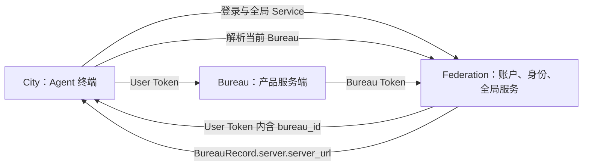
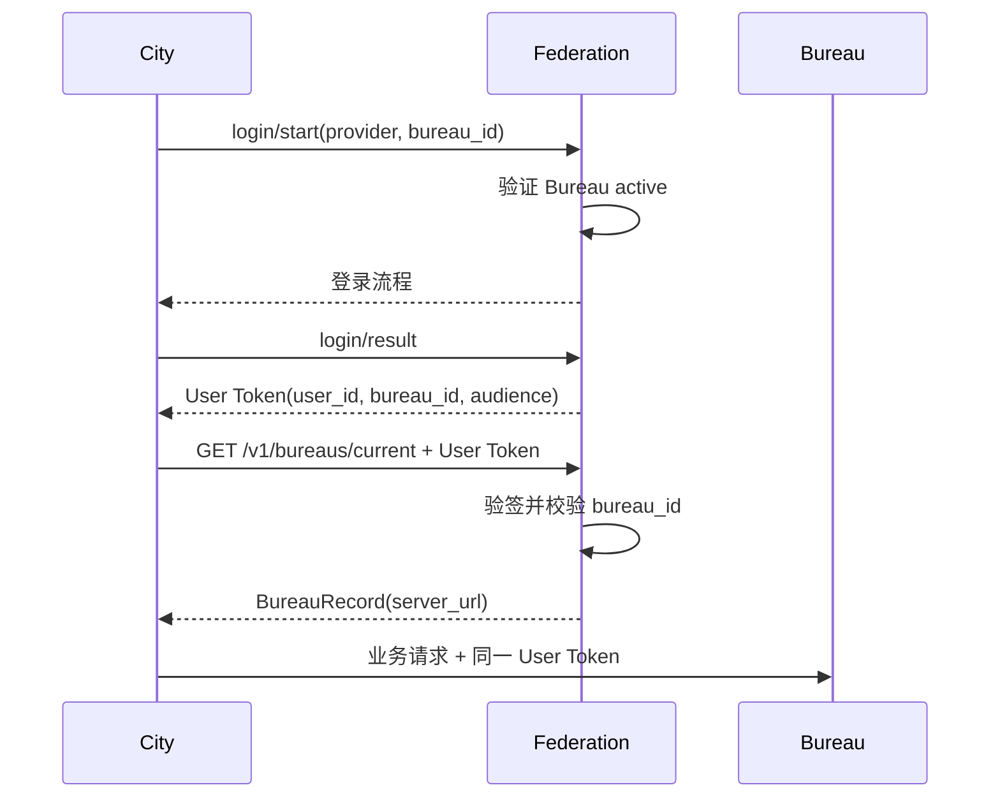
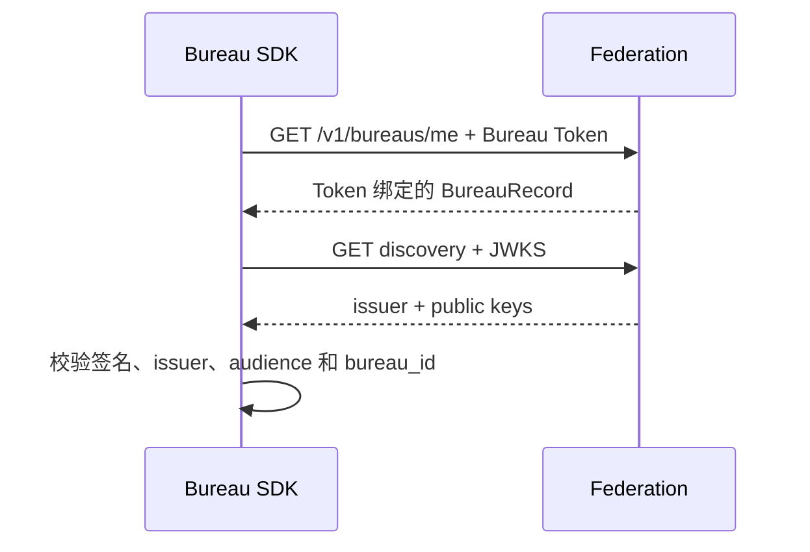

# Federation、Bureau、City 身份与服务边界设计

> 状态：已确认并实施
> 更新时间：2026-08-03

## 1. 结论

Downcity 使用三个边界清晰的核心概念：

- **Federation** 是全局服务、账户与身份信任根。
- **Bureau** 是稳定的产品服务端身份，并一对一拥有独立的 Server 配置。
- **City** 是 Agent 终端，不是产品、服务端或持久身份。

Organization 只表达成员关系与治理范围，不拥有服务地址。Organization 可以是 Federation 全局组织，也可以通过 `bureau_id` 归属于某个 Bureau。



## 2. 产品意图与职责

### 2.1 Federation

Federation 回答“这个用户是谁、当前进入哪个产品、可以调用哪些全局服务”。它负责：

- 用户账户与登录流程；
- 签发和验证 User Token；
- 注册 Bureau 及其唯一服务入口；
- 注册与撤销绑定 Bureau 的机器凭证；
- 提供 Accounts、AI、Credits、Organizations 等全局服务；
- 作为 User Token 的 issuer 和公钥信任根。

Federation 不承担产品业务服务端职责，也不把 City 当成数据库中的产品实体。

### 2.2 Bureau

Bureau 回答“这个产品服务端是谁、它的入口在哪里”。它负责：

- 以稳定的 `bureau_id` 标识产品边界；
- `bureau_id` 不要求 `bureau_` 等语义前缀；从历史身份迁移时必须原样保留 ID，不能拼接或改写；
- 一对一拥有一条 Server 配置；
- 使用绑定自身的 Bureau Token 向 Federation 证明机器身份；
- 使用 Federation JWKS 本地验证本 Bureau 的 User Token；
- 承载产品私有业务、数据与策略。

一个 Bureau 只拥有一个当前 Server。Server 配置与 Bureau 身份分表保存，通过 `bureau_id` 一对一关联。不同 Bureau 可以使用相同 URL，因此 `server_url` 不设置全局唯一约束。更新域名或迁移部署时，只更新 Server 记录，不改变 `bureau_id`。

当前产品模型不引入 Deployment 资源。未来只有在确实需要多区域、多实例、健康检查和流量调度时，才另行设计 Deployment 控制面。

### 2.3 City

City 回答“Agent 终端如何使用 Federation 和当前产品”。它负责：

- 登录前持有 `federation_url`；
- 在 `login/start` 中显式选择 `bureau_id`；
- 登录后持有 User Token；
- 让 Federation 验证 Token 并解析当前 Bureau；
- 使用返回的 `server_url` 调用 Bureau；
- 只向当前 Bureau origin 转发 User Token。

City 不持久化产品身份，不在构造时接受 `bureau_id` 或 `bureau_url`。

### 2.4 Organization

Organization 是一组成员关系和治理规则：

- `scope = federation`：跨 Bureau 的全局组织；
- `scope = bureau`：由 `bureau_id` 隔离的产品组织。

Organization 不拥有 server、URL、Token 或部署生命周期。

## 3. 权威数据模型

### 3.1 BureauRecord 与 BureauServerRecord

```ts
interface BureauRecord {
  /** Federation 内稳定的产品标识。 */
  bureau_id: string;
  /** 面向管理者展示的产品名称。 */
  name: string;
  /** 当前 Bureau 唯一拥有的 Server 配置。 */
  server: BureauServerRecord;
  /** Bureau 当前生命周期状态。 */
  state: "active" | "paused" | "archived";
  /** 创建时间。 */
  created_at: string;
  /** 最近更新时间。 */
  updated_at: string;
  /** 归档时间；未归档时为空字符串。 */
  archived_at: string;
}

interface BureauServerRecord {
  /** 拥有当前 Server 的稳定 Bureau ID。 */
  bureau_id: string;
  /** 当前 Server 的 HTTP(S) 服务入口。 */
  server_url: string;
  /** 创建时间。 */
  created_at: string;
  /** 最近更新时间。 */
  updated_at: string;
}
```

约束：

- 创建时 `name` 和 `server_url` 必填，Federation 在同一事务创建 Bureau 与 Server；
- `federation_bureau_servers.bureau_id` 同时是主键与 Bureau 外键，保证一对一；
- `server_url` 必须是无 credentials 的 HTTP(S) URL，并规范化掉末尾 `/`；
- 不限制不同 Bureau 使用相同 `server_url`；
- archived Bureau 不允许再修改 URL。

### 3.2 Bureau Token

Bureau Token 是机器凭证，不是一个需要调用方重复声明的身份参数。记录必须包含：

- `token_id`；
- `bureau_id`；
- `token_hash`；
- `purpose`；
- `status` 与时间字段。

Federation 只保存 hash。`new Bureau()` 通过 Token 调用 `/v1/bureaus/me`，由 Federation 返回其绑定的 Bureau，调用方不能另传 `bureau_id` 覆盖归属。

### 3.3 User Token

User Token 至少包含：

- `user_id`；
- `bureau_id`；
- Federation issuer；
- `urn:downcity:bureau:<bureau_id>` audience；
- `jti`、签发时间和过期时间。

`bureau_id` 在登录开始时确定，签入 Token 后成为请求身份的一部分。City 不通过未验证的本地 JWT decode 建立信任，而是调用 Federation `/v1/bureaus/current` 获取权威 BureauRecord。

## 4. SDK 公开 API

### 4.1 登录前 City

```ts
const guest = new City({ federation_url });

const login = await guest
  .service("accounts")
  .action("login/start")
  .invoke({ provider: "email", bureau_id });
```

登录前没有 User Token，因此不可能从 Token 推导 Bureau。`bureau_id` 只在登录意图中显式提交，不进入 City 构造参数。

### 4.2 登录后 City

```ts
const city = new City({ federation_url, user_token });
const bureau = await city.bureau();

await city.post("/v1/product/action", input);
```

`city.bureau()` 的结果在实例内缓存。`get()` 与 `post()` 使用 `bureau.server.server_url`，并拒绝把 User Token 发送到不同 origin 的绝对 URL。

### 4.3 Bureau

```ts
const bureau = new Bureau({
  federation_url,
  bureau_token,
});

const machine_identity = await bureau.me();
const user = await bureau.identify(request);
```

`bureau.me()` 返回 Token 绑定的完整 BureauRecord 与 `token_id`。`identify()` 先确定机器凭证对应的 `bureau_id`，再用该 Bureau 的 audience 本地验签，不能验证其他 Bureau 的 User Token。

### 4.4 FederationAdmin

```ts
const created = await admin.bureaus.create({
  name: "My Product",
  server_url: "https://bureau.example.com",
});

await admin.bureaus.server.update({
  bureau_id: created.bureau_id,
  server_url: "https://new-bureau.example.com",
});
```

## 5. 请求流程

### 5.1 登录与 Bureau 发现



### 5.2 Bureau 本地验签



## 6. HTTP 接口边界

管理接口：

- `POST /v1/bureaus/create`：创建 Bureau，`server_url` 必填；
- `POST /v1/bureaus/server/update`：更新一个 Bureau 的唯一 Server 入口；
- `POST /v1/bureaus/tokens/register`：把机器凭证绑定到 `bureau_id`；
- Bureau pause、resume、archive 与 token revoke/list 等既有管理接口。

身份接口：

- `GET /v1/bureaus/current`：使用 User Token 返回当前 Bureau；
- `GET /v1/bureaus/me`：使用 Bureau Token 返回绑定的 Bureau 与 Token 身份；
- `GET /.well-known/downcity.json` 与 `GET /.well-known/jwks.json`：支持本地验签。

不再存在 `/v1/cities/*` 或 `CitiesService`。

## 7. 安全边界

- City 相信 Federation 验证后的 `/v1/bureaus/current`，不相信本地 decode 的 claims。
- Federation 必须校验 User Token claim、audience 与请求上下文的 Bureau 一致。
- Bureau 必须使用机器 Token 绑定的 `bureau_id` 作为验签 audience，不能相信调用方声明。
- City 只向 `BureauRecord.server.server_url` 的同 origin 地址发送 User Token。
- paused 或 archived Bureau 不能作为有效的当前产品入口。
- Token 明文只在签发时出现，数据库只保存 hash。

## 8. Schema 迁移

这次迭代不保留旧模型兼容层。启动守卫会拒绝：

- 存在旧 `cities` 表；
- `federation_bureau_tokens` 缺少 `bureau_id`；
- `federation_bureaus` 仍把 `server_url` 保存在身份表；
- Bureau 身份缺少一对一的 `federation_bureau_servers` 记录。

迁移必须显式完成：删除旧 City 产品身份，为每个 Bureau 填写服务入口，并重新注册能确定归属的 Bureau Token。不能猜测历史 Token 的 Bureau。

## 9. 最终不变量

1. Federation 是用户身份和 Bureau 注册信息的唯一事实源。
2. Bureau 是产品服务端边界，一个 Bureau 一对一拥有一个当前 Server。
3. City 是终端，不拥有 `bureau_id` 或服务部署配置。
4. Bureau Token 自身绑定 `bureau_id`。
5. User Token 自身包含 `bureau_id`，但客户端通过 Federation 权威解析。
6. Organization 只表达关系，不承载 server。
7. Server 对单个 Bureau 必填且唯一，`server_url` 不要求跨 Bureau 唯一。
