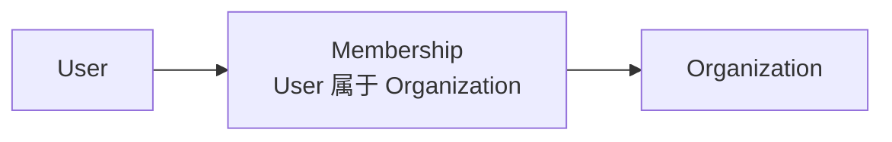
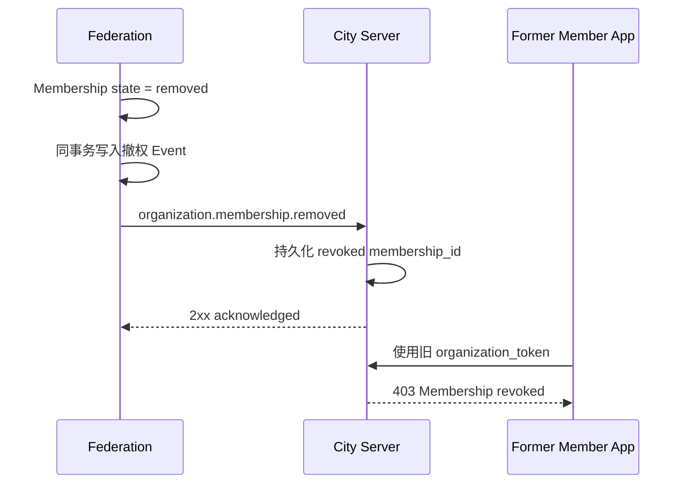

# Downcity Organizations Service 设计文档（历史实现）

> 本文记录当前已实现的 `server_url + organization_token + 撤权事件` 方案，不再作为后续实现依据。
>
> 新设计见 [`federation-organizations-service-redesign.md`](./federation-organizations-service-redesign.md)。新方案让 Organization 只维护组织身份、Membership 和治理关系，并把产品后端、部署路由与资源权限交还 City/Product/Bureau。
>
> 最新身份边界见 [`federation-bureau-city-identity-redesign.md`](./federation-bureau-city-identity-redesign.md)：产品身份统一为 Bureau，City 仅表示 Agent 终端。

## 1. 文档信息

| 字段 | 内容 |
| --- | --- |
| 状态 | Implemented（Phase 1–2） |
| Service ID | `organizations` |
| 所属系统 | Downcity Federation |
| 首个接入项目 | Vibecape |
| 身份依赖 | Downcity `user_token` |
| 数据归属 | Downcity Federation 数据库 |
| 核心范围 | Organization、Membership、Join Request、Organization Token、撤权通知 |

当前仓库已经实现通用 Service 事务能力与 Federation 侧 Organizations Service。
City Server 撤权端点、客户端接入及既有业务迁移属于后续集成阶段，不包含在本次实现中。

## 2. 决策摘要

Organizations Service 是 Federation 中 Organization 及其成员关系的唯一权威事实源。

核心模型只有三个：

- Organization：某个 City 下的组织主体；
- Membership：某个 User 属于某个 Organization 的关系；
- Organization Token：Federation 基于有效 Membership 签发、只允许指定 City Server 使用的访问凭证。

正常资源请求不依赖 Federation：

```text
App
  → organization_token
  → City Server 本地验签
  → City Server 本地撤权检查
  → City 项目资源
```

Membership 退出、被移除，或者 Organization 归档、变更 Server URL 时，Federation 通过可靠事件通知 City Server 注销对应凭证。

```text
Federation Membership Mutation
  → 同事务写入撤权事件
  → 后台可靠投递
  → City Server 持久化撤权状态
  → 旧 organization_token 被拒绝
```

Organizations Service 不定义 Space、文档、Git Repository 等项目资源，也不规定这些资源的生命周期和权限模型。

## 3. 产品意图

Organizations Service 回答一个稳定问题：

> 当前用户属于哪些 Organization，以及用户能否基于这段成员关系访问该 Organization 对应的 City Server。

用户登录 Federation 后，应能知道：

1. 自己属于哪些 Organization；
2. 每个 Organization 属于哪个 City；
3. 自己在 Organization 中的治理角色；
4. Organization 对应的唯一 City Server 地址；
5. 如何取得只允许该 City Server 使用的 Organization Token。

## 4. 领域边界

### 4.1 Federation

Federation 负责：

- Organization 创建、读取、更名和归档；
- Membership 创建、角色变更、退出和移除；
- Join Request 创建、取消、批准和拒绝；
- Owner 转移；
- Organization Token 签发；
- Membership 和 Organization 状态的权威判断；
- 撤权事件持久化和可靠投递；
- Organization 领域审计。

### 4.2 City Server

`server_url` 指向的 City Server 负责：

- 使用 Federation JWKS 本地验证 Organization Token；
- 校验 Token 的 issuer、audience、City、Organization 和 Membership；
- 持久化 Federation 发送的撤权事件；
- 在本地拒绝已经注销的 Membership 或 Organization；
- 保存和管理 City 项目自己的资源；
- 定义项目角色、资源权限和资源生命周期；
- 记录项目资源审计。

### 4.3 客户端

客户端负责：

- 使用 `user_token` 请求 Federation；
- 读取当前用户的 Organization；
- 为指定 Organization 换取 Organization Token；
- 将 Organization Token 发送给对应 City Server；
- 不向 City Server 发送原始 `user_token`；
- 处理 Organization 归档、Membership 注销和 Server 不可用。

### 4.4 非目标

- Organization 内部的 Team 或 Group；
- Organization Key、Slug 或公开组织目录；
- Federation 中的项目资源；
- Space、文档、Git Repository 等资源模型；
- 项目级 editor、viewer、push 等权限；
- Organization 跨 City 共享；
- 一个 Organization 关联多个 Server URL；
- City Server Session；
- 每次资源请求在线查询 Federation；
- Federation 统一账单、额度和项目资源审计。

## 5. 核心关系

Membership 是 User 与 Organization 之间的一段成员关系：



Membership 不是用户账号，不是 Token，也不是 City Server 会话。

每次成功加入 Organization 都创建新的 `membership_id`。Membership 被移除后永久保持 removed；同一用户以后重新加入时创建另一条 Membership，不重新激活旧记录。

这保证旧 Organization Token 永远不会因为用户重新加入而恢复有效。

## 6. Organization 模型

### 6.1 公共字段

```ts
type Organization = {
  organization_id: string;
  city_id: string;
  name: string;
  server_url: string;
  state: "active" | "archived";
};
```

Organization 不包含 `key` 或 `slug`。`organization_id` 已经是稳定、唯一、机器可读的身份，不再引入重复标识。

### 6.2 持久化字段

```ts
type OrganizationRecord = {
  organization_id: string;
  city_id: string;
  name: string;
  server_url: string;
  state: "active" | "archived";
  created_by: string;
  created_at: string;
  updated_at: string;
  archived_at: string | null;
};
```

所有字段类型应放在 Organizations Service 的 `types/` 目录，并为每个字段提供完整中文文档注释。

### 6.3 `organization_id`

`organization_id` 由 Federation 生成：

```text
org_<ULID>
```

它是 Federation 内的全局稳定主键，创建后不可修改。

### 6.4 `city_id`

`city_id` 从当前已验证 `user_token` 取得，不接受请求 Body 自由覆盖，创建后不可修改。

### 6.5 `name`

- 去除首尾空白；
- 长度 1–120；
- Owner 和 Admin 可以修改；
- 修改名称不改变 Organization 身份。

### 6.6 `server_url`

`server_url` 是 Organization 对应的唯一 City Server 入口。

规则：

- 必须是绝对 HTTP 或 HTTPS URL；
- 生产环境应使用 HTTPS；
- 不允许 username 和 password；
- 不允许 query 和 fragment；
- pathname 必须为 `/`；
- 存储时移除末尾 `/`；
- 只有 Owner 可以更新；
- 多个 Organization 可以使用同一个 `server_url`；
- Federation 不在创建或更新时主动探测新 Server。

`server_url` 不包含 Token、Secret 或项目资源信息。

### 6.7 归档

Organization 归档是不可恢复的终态：

- 只有 Owner 可以归档；
- 归档后停止所有 Organization 治理写入；
- 不再接受 Join Request；
- 不再签发 Organization Token；
- 注销该 Organization 已经签发的全部 Token；
- 保留 Organization、Membership、Join Request 和 Event；
- `organizations/my` 继续返回该 Organization，并标记 `archived`；
- `organization_id` 永久保留。

Organizations Service 不规定 City Server 如何保留、读取、归档或删除自己的项目资源。

## 7. Organization 创建额度

任何持有有效 `user_token` 的用户都可以创建 Organization，并自动成为唯一 Owner。

Service 初始化时必须传入每个用户允许拥有的 active Organization 上限：

```ts
new OrganizationsService({
  max_organizations_per_user: n,
});
```

额度规则：

- 只统计用户当前作为 Owner 持有的 active Organization；
- 创建 Organization 占用一个额度；
- Organization 归档释放一个额度；
- Owner 转移时，原 Owner 释放额度，新 Owner 占用额度；
- Owner 转移前必须校验目标用户未达到上限；
- Admin 和 Member 不占用额度；
- 创建和 Owner 转移必须在并发下原子校验额度。

## 8. Membership 模型

### 8.1 字段

```ts
type OrganizationMembershipRecord = {
  membership_id: string;
  organization_id: string;
  user_id: string;
  role: "owner" | "admin" | "member";
  state: "active" | "removed";
  created_at: string;
  updated_at: string;
  removed_at: string | null;
  removed_by: string | null;
};
```

### 8.2 生命周期

```text
Join Request approved
  → 创建新的 active Membership

Member 主动退出 / 管理者移除
  → Membership 变为 removed
  → 永不重新激活

以后重新加入
  → 创建新的 membership_id
```

同一个 `(organization_id, user_id)` 同时最多存在一个 active Membership，但可以保留多条 removed 历史记录。

### 8.3 角色权限

| 能力 | Owner | Admin | Member |
| --- | --- | --- | --- |
| 读取 Organization | ✓ | ✓ | ✓ |
| 读取成员 | ✓ | ✓ | ✓ |
| 修改名称 | ✓ | ✓ |  |
| 修改 Server URL | ✓ |  |  |
| 审批 Join Request | ✓ | ✓ |  |
| 移除普通 Member | ✓ | ✓ |  |
| 任命或撤销 Admin | ✓ |  |  |
| 转移 Owner | ✓ |  |  |
| 归档 Organization | ✓ |  |  |
| 主动退出 | 转移后 | ✓ | ✓ |

约束：

- 每个 active Organization 只有一个 active Owner；
- Owner 不能直接退出或移除自己；
- Owner 离开前必须先转移 Owner；
- Admin 不能操作 Owner 或其他 Admin；
- Admin 不能任命 Admin；
- removed Membership 不参与任何授权；
- Organization Role 只负责组织治理，不表达 City 项目资源权限。

### 8.4 Owner 转移

Owner 转移是单一原子命令：

1. 只允许当前 Owner 调用；
2. 目标用户必须是 active Member；
3. 校验目标用户的 active Organization Owner 数量未达到上限；
4. 当前 Owner 变为 Admin；
5. 目标用户变为 Owner；
6. 写入领域事件；
7. 在同一事务中提交。

## 9. Join Request

### 9.1 字段

```ts
type OrganizationJoinRequestRecord = {
  request_id: string;
  organization_id: string;
  user_id: string;
  state: "pending" | "approved" | "rejected" | "canceled";
  requested_at: string;
  decided_at: string | null;
  decided_by: string | null;
};
```

### 9.2 规则

- 只支持用户主动申请；
- Owner/Admin 不能直接添加 Member；
- 申请使用 `organization_id`，不使用 Key；
- `city_id` 从当前 `user_token` 取得；
- Organization 必须是 active 且属于当前 City；
- active Member 重复申请时返回已加入；
- 已有 pending 申请时幂等返回已有记录；
- 用户可以取消自己的 pending 申请；
- Owner/Admin 可以批准或拒绝；
- 批准与创建新 Membership 在同一事务中完成；
- rejected 或 canceled 后允许重新申请，并创建新的 Join Request。

### 9.3 Organization 发现

Organizations Service 不提供公开搜索、公开列表或按名称发现。

用户通过邀请链接、二维码或其他产品渠道取得 `organization_id`，再发起 Join Request。审批通过前不返回 `server_url`。

## 10. Organization Token

### 10.1 目的

原始 `user_token` 只发送给 Federation，不发送给 Organization 的 City Server。

Federation 根据 active Organization 和 active Membership 签发受众绑定的 Organization Token：

```text
user_token
  → Federation 验证 User、City、Organization、Membership
  → organization_token
  → 指定 City Server 本地验签
```

### 10.2 Claims

```ts
type OrganizationTokenClaims = {
  iss: string;
  aud: string;
  sub: string;
  user_id: string;
  city_id: string;
  organization_id: string;
  membership_id: string;
  iat: number;
  exp: number;
  jti: string;
};
```

语义：

- `iss`：Federation 稳定 issuer；
- `aud`：标准化后的 `server_url` Origin；
- `sub`、`user_id`：当前 Federation 用户；
- `city_id`：Organization 所属 City；
- `organization_id`：当前 Organization；
- `membership_id`：签发依据的唯一 Membership；
- `exp`：长期凭证的最终安全过期时间；
- `jti`：用于审计的 Token 唯一 ID。

Token 不包含 Organization Role 或 City 项目权限。

### 10.3 有效性

Organization Token 可以具有较长有效期。正常撤权不依赖短 TTL，而依赖 Federation 的可靠注销通知和 City Server 本地撤权状态。

当前实现默认 TTL 为 `7d`，也可以通过 `organization_token_ttl` 显式配置，最大不超过 `30d`。

Token 必须同时满足：

- Federation Ed25519 签名有效；
- `iss` 与当前 Federation 一致；
- `aud` 与当前 City Server 标准化 Origin 完全一致；
- `city_id` 与当前项目一致；
- `organization_id` 与目标资源归属一致；
- `membership_id` 未被本地注销；
- Organization 未被本地标记为 archived 或 moved；
- `exp` 未过期。

### 10.4 Token 签发

签发前 Federation 必须：

1. 验证 `user_token`；
2. 从 Token 取得 `user_id` 和 `city_id`；
3. 读取 Organization；
4. 确认 Organization active 且 City 一致；
5. 确认用户存在 active Membership；
6. 使用 Organization 当前 `server_url` 作为 audience；
7. 使用 Federation 当前 active Ed25519 Key 签名。

## 11. 撤权通知

### 11.1 设计目标

正常 City Server 请求不访问 Federation。授权状态变化由 Federation 主动通知 City Server。

首版撤权事件：

| Event | 含义 | City Server 行为 |
| --- | --- | --- |
| `organization.membership.removed` | Member 主动退出或被移除 | 永久注销 `membership_id` |
| `organization.archived` | Organization 归档 | 注销该 Organization 的全部 Token |
| `organization.server_url.changed` | Organization 切换 Server | 旧 Server 注销该 Organization 的全部 Token |

Role 变化不发送资源撤权事件，因为 Organization Role 不参与 City 项目资源权限。

### 11.2 Membership 注销



### 11.3 通知端点

City Server 应公开固定端点：

```http
POST /v1/downcity/organization-events
```

Federation 将固定路径拼接到事件发生时记录的目标 Server Origin，不接受事件 Payload 自由指定通知 URL。

### 11.4 事件格式

```ts
type OrganizationRevocationEvent = {
  event_id: string;
  event_type:
    | "organization.membership.removed"
    | "organization.archived"
    | "organization.server_url.changed";
  city_id: string;
  organization_id: string;
  membership_id: string | null;
  user_id: string | null;
  created_at: string;
};
```

事件必须由 Federation Ed25519 Key 签名。City Server 使用 Federation JWKS 验证签名、issuer 和事件时间。

### 11.5 可靠投递

- 领域 Mutation 与 Event 必须在同一数据库事务中提交；
- Event 状态持久化，不依赖进程内内存队列；
- 后台投递失败后持续重试；
- City Server 必须先持久化撤权状态，再返回 `2xx`；
- `event_id` 用于幂等处理；
- Federation 只有收到成功响应后才能标记 Event delivered；
- Federation 重启后继续投递未完成 Event；
- Server URL 更新事件投递给变更前的旧 Server URL；
- 长时间投递失败必须可观测，但不回滚已经完成的 Membership Mutation。

通知是最终一致的：City Server 收到并持久化撤权事件后，旧 Token 立即在该 Server 失效；网络分区期间存在通知延迟。

## 12. Server URL 更新

Owner 更新 `server_url` 时：

1. 校验 Owner 权限；
2. 标准化新 URL；
3. 记录旧 Server URL；
4. 更新 Organization；
5. 写入以旧 Server URL 为投递目标的撤权事件；
6. 原子提交；
7. 停止为旧 audience 签发 Token；
8. 后续 Organization Token 只绑定新 Server Origin。

Federation 不主动探测或验证新 Server。旧 City Server 自己拥有的资源如何处理，不属于 Organizations Service。

## 13. Service API

Organizations Service 使用 Downcity Action 路由，由 `City.service("organizations")` 调用。

| Method | Action | 用途 | 权限 |
| --- | --- | --- | --- |
| `GET` | `my` | 当前用户的 Organization | authenticated user |
| `GET` | `get` | 读取已加入的 Organization | active member |
| `POST` | `create` | 创建 Organization | authenticated user + Owner 额度 |
| `POST` | `update` | 修改名称 | owner/admin |
| `POST` | `server/update` | 修改 Server URL | owner |
| `POST` | `archive` | 归档 Organization | owner |
| `GET` | `membership/get` | 读取当前用户 Membership | self |
| `GET` | `members/list` | 列出 active Member | active member |
| `POST` | `members/role` | 任命或撤销 Admin | owner |
| `POST` | `members/remove` | 移除 Member/Admin | owner，admin 仅普通 Member |
| `POST` | `members/leave` | 主动退出 | member/admin |
| `POST` | `owner/transfer` | 转移 Owner | owner |
| `POST` | `join-requests/create` | 主动申请加入 | authenticated user |
| `POST` | `join-requests/cancel` | 取消自己的 pending 申请 | applicant |
| `GET` | `join-requests/list` | 列出 pending 申请 | owner/admin |
| `POST` | `join-requests/decide` | 批准或拒绝申请 | owner/admin |
| `POST` | `token/create` | 签发 Organization Token | active member |

不存在以下 Action：

- Organization 公开搜索；
- 按 Key 查询；
- Owner/Admin 直接添加 Member；
- 恢复 archived Organization；
- 重新激活 removed Membership。

## 14. 核心请求

### 14.1 创建 Organization

```http
POST /v1/organizations/create
Authorization: Bearer <user_token>
Content-Type: application/json

{
  "name": "Research Team",
  "server_url": "https://spaces.example.com"
}
```

Federation 从 Token 取得 `user_id` 和 `city_id`，并在一个事务中：

1. 原子校验 Owner 额度；
2. 创建 Organization；
3. 创建 Owner Membership；
4. 写入 Event。

### 14.2 申请加入

```http
POST /v1/organizations/join-requests/create
Authorization: Bearer <user_token>
Content-Type: application/json

{
  "organization_id": "org_01J..."
}
```

审批通过后创建新的 `membership_id`。

### 14.3 签发 Organization Token

```http
POST /v1/organizations/token/create
Authorization: Bearer <user_token>
Content-Type: application/json

{
  "organization_id": "org_01J..."
}
```

响应：

```json
{
  "organization_token": "ot_<JWT>",
  "organization_id": "org_01J...",
  "server_url": "https://spaces.example.com",
  "expires_at": "2026-08-28T12:00:00.000Z"
}
```

### 14.4 列出当前 Organization

```http
GET /v1/organizations/my
Authorization: Bearer <user_token>
```

返回当前 City 下用户拥有 active 或历史 Membership 的 Organization。archived Organization 保留在结果中，但不能签发 Organization Token。

## 15. 数据库设计

### 15.1 逻辑表

```text
organizations
organization_memberships
organization_join_requests
organization_events
```

关键约束：

- 每个 active Organization 只有一个 active Owner；
- 同一用户在同一 Organization 同时最多一条 active Membership；
- 同一用户在同一 Organization 同时最多一条 pending Join Request；
- removed Membership 不可重新变为 active；
- archived Organization 不可重新变为 active；
- Owner 额度校验在并发创建和转移下保持正确；
- SQLite 和 PostgreSQL 提供等价约束和索引。

### 15.2 事务边界

以下操作必须使用单一数据库事务：

- 创建 Organization + Owner Membership + Event；
- 批准 Join Request + Membership + Event；
- Member 退出/移除 + 撤权 Event；
- Owner 转移中的两条角色变更 + Event；
- Organization 归档 + 撤权 Event；
- Server URL 更新 + 旧 Server 撤权 Event；
- Event delivered 状态更新。

## 16. 通用 Service 事务能力

Federation 承载 Organizations Service，并负责提供数据库连接。Organizations Service 不直接创建数据库连接，也不依赖具体 SQLite 或 PostgreSQL Driver。

当前实现支持 better-sqlite3、PostgreSQL 与 Cloudflare D1。三种 Runtime 对上层统一提供
`context.transaction`，Organizations Service 不判断数据库类型：

- PostgreSQL 使用 Drizzle 原生事务；
- better-sqlite3 使用同连接的 `BEGIN IMMEDIATE`、`COMMIT` 与 `ROLLBACK`；
- D1 在 handler 执行期间记录读取快照并缓存写命令，提交时先校验快照，再通过原子
  `batch()` 一次提交全部守卫和写入；快照冲突由 City Runtime 自动重跑 handler。

D1 不能把跨 JavaScript 检查点的 handler 直接交给数据库执行，因此这里采用乐观事务，
而不是用进程锁模拟全局事务。唯一约束、快照守卫和 batch 回滚共同维护并发不变量。

`ServiceInstallContext` 需要增加通用事务能力：

```ts
interface ServiceInstallContext {
  table<TRow>(name: string): CityTableApi<TRow>;

  transaction<TResult>(
    handler: (context: ServiceTransactionContext) => Promise<TResult>,
  ): Promise<TResult>;
}
```

事务 Context 提供绑定同一数据库事务的 Table API：

```ts
interface ServiceTransactionContext {
  table<TRow>(name: string): CityTableApi<TRow>;
}
```

职责边界：

- Federation runtime 提供和管理事务；
- 数据库 Adapter 落实不同方言的事务；
- Organizations Service 定义领域事务边界；
- Repository 只使用传入的 Table API，不持有全局数据库连接。

Service schema 初始化还必须保留 unique index、普通 index、check 和 foreign key，不能继续使用只读取字段的简化 DDL 生成结果。

## 17. 错误语义

| HTTP | Code | 含义 |
| --- | --- | --- |
| 400 | `ORGANIZATION_INPUT_INVALID` | 输入不合法 |
| 400 | `ORGANIZATION_SERVER_URL_INVALID` | Server URL 不合法 |
| 401 | `AUTH_REQUIRED` | 需要有效 Token |
| 403 | `ORGANIZATION_CITY_MISMATCH` | Token City 与 Organization 不匹配 |
| 403 | `NOT_AN_ORGANIZATION_MEMBER` | 当前用户不是 active Member |
| 403 | `ORGANIZATION_ROLE_DENIED` | Organization Role 不允许操作 |
| 403 | `ORGANIZATION_MEMBERSHIP_REVOKED` | Membership 已注销 |
| 404 | `ORGANIZATION_NOT_FOUND` | Organization 不存在或不可见 |
| 409 | `ORGANIZATION_LIMIT_REACHED` | 当前 Owner 额度已满 |
| 409 | `JOIN_REQUEST_PENDING` | 已存在 pending Join Request |
| 409 | `OWNER_TRANSFER_REQUIRED` | Owner 必须先转移身份 |
| 410 | `ORGANIZATION_ARCHIVED` | Organization 已归档 |

错误响应：

```json
{
  "error": {
    "code": "ORGANIZATION_ROLE_DENIED",
    "message": "The current Organization role does not allow this operation",
    "type": "server_error"
  }
}
```

## 18. 安全要求

- City Server 永远不接收原始 `user_token`；
- Organization Token 必须精确绑定 Server Origin；
- Federation 普通用户接口不得接受 Organization Token；
- City Server 必须验证 JWT 算法、签名、issuer、audience、City 和有效期；
- City Server 必须在处理资源权限前检查本地撤权状态；
- 撤权 Event 必须经过 Federation 签名；
- City Server 必须先持久化撤权状态再确认事件；
- 生产 `server_url` 应使用 HTTPS；
- Federation 投递器必须防止凭证、query、fragment 和非固定回调路径；
- 获得 Organization Token 只证明 active Membership，不代表拥有任何项目资源权限。

## 19. 代码结构建议

```text
packages/services/src/organizations/
├── index.ts
├── service.ts
├── routes.ts
├── schema/
│   ├── sqlite.ts
│   └── postgres.ts
├── types/
│   ├── Organization.ts
│   ├── OrganizationMembership.ts
│   ├── OrganizationJoinRequest.ts
│   ├── OrganizationToken.ts
│   ├── OrganizationEvent.ts
│   └── OrganizationServiceOptions.ts
├── domain/
│   ├── OrganizationPolicy.ts
│   ├── OrganizationServerUrl.ts
│   └── OrganizationErrors.ts
├── application/
│   ├── CreateOrganization.ts
│   ├── ManageMembership.ts
│   ├── ManageJoinRequest.ts
│   ├── TransferOwner.ts
│   ├── ArchiveOrganization.ts
│   ├── UpdateOrganizationServer.ts
│   └── IssueOrganizationToken.ts
├── infrastructure/
│   ├── OrganizationRepository.ts
│   ├── OrganizationEventRepository.ts
│   └── OrganizationEventDispatcher.ts
└── test/
```

约束：

- route 只负责输入解析、身份读取和响应映射；
- application 定义事务边界；
- domain 保存稳定规则；
- repository 使用事务 Context，不直接持有 Driver；
- infrastructure 负责可靠事件投递；
- 所有模块包含中文文件注释；
- 所有公共类型字段包含中文文档注释；
- 单模块不超过仓库规定的规模；
- 变量和函数使用 snake_case 命名。

## 20. 测试策略

### 20.1 Organization

- 任何 authenticated user 可以在额度内创建；
- 并发创建不能突破 Owner 额度；
- 创建失败不留下无 Owner Organization；
- Owner 转移正确移动额度；
- 归档释放额度且不可恢复；
- archived Organization 不再签发 Token；
- Server URL 更新不改变 Organization 或 Membership 身份。

### 20.2 Membership 与 Join Request

- 只能由用户主动申请；
- pending 申请幂等；
- 用户可以取消 pending 申请；
- Owner/Admin 可以批准或拒绝；
- 批准创建新的 Membership；
- removed Membership 不可重新激活；
- 重新加入创建新的 `membership_id`；
- Admin 不能操作 Owner 或 Admin；
- Owner 不能直接退出。

### 20.3 Token

- 非 Member 不能签发 Organization Token；
- archived Organization 不能签发；
- Token audience 精确绑定 Server Origin；
- Organization Token 不能调用 Federation 用户接口；
- City Server 拒绝错误 issuer、audience、City 和 Organization；
- 被注销 `membership_id` 的旧 Token 被拒绝；
- 重新加入后的新 Membership Token 可用，旧 Token 仍不可用。

### 20.4 撤权事件

- Mutation 和 Event 原子提交；
- 投递失败持续重试；
- Federation 重启后恢复投递；
- 重复 Event 幂等；
- City Server 落库失败时不得确认；
- Member 退出/移除后旧 Token 被拒绝；
- Organization 归档后全部 Token 被拒绝；
- Server URL 更新后旧 Server 拒绝旧 Token；
- SQLite 和 PostgreSQL 行为一致。

## 21. 实施阶段

### Phase 1：通用 Service 数据能力

- 增加事务 Context；
- 完善 SQLite/PostgreSQL Service schema；
- 保留数据库约束和索引；
- 增加跨方言事务测试。

### Phase 2：Organizations Service

- 实现 Organization、Membership 和 Join Request；
- 实现 Owner 额度与转移；
- 实现 Organization Token；
- 实现撤权事件 Outbox 和可靠投递；
- 暴露公共类型和 Action。

### Phase 3：City Server 接入

- 本地验证 Organization Token；
- 实现固定撤权事件端点；
- 持久化 revoked Membership 和 Organization 状态；
- 在项目授权前执行 Organization 基线检查。

### Phase 4：客户端接入

- 登录后读取 `organizations/my`；
- 主动申请和取消 Join Request；
- 换取并保存 Organization Token；
- 按 `server_url` 请求 City Server；
- 处理 Membership revoked、Organization archived 和 Server 不可用。

### Phase 5：迁移

- 从现有 Group 生成 Organization；
- 为每段 active 成员关系生成新的 `membership_id`；
- 保留项目资源在原 City Server；
- 切换客户端 Token 和授权链路；
- 校验 Organization、Membership 和资源外部引用。

## 22. 最终不变量

1. Organization 只属于一个 City。
2. `organization_id` 是 Organization 唯一稳定身份，不存在 Organization Key。
3. Federation 是 Organization 和 Membership 的唯一权威事实源。
4. Membership 是 User 与 Organization 的独立关系记录。
5. 每次重新加入都创建新的 `membership_id`。
6. removed Membership 永不重新激活。
7. 每个 active Organization 只有一个 active Owner。
8. 每个用户最多拥有 Service 配置的 n 个 active Organization。
9. 用户只能主动申请加入，Owner/Admin 不能直接添加 Member。
10. Organization 不提供公开搜索，只能通过 `organization_id` 申请。
11. City Server 永远不接收原始 `user_token`。
12. Organization Token 只允许指定 Server Origin 使用。
13. 正常项目资源请求不依赖 Federation。
14. Membership 注销通过可靠事件通知 City Server。
15. Organization 归档不可恢复，并注销全部 Organization Token。
16. Server URL 更新后旧 Server 注销该 Organization 的全部旧 Token。
17. Organizations Service 不拥有或定义 City 项目资源。
18. 所有多表领域变更和 Event 在同一事务中提交。
