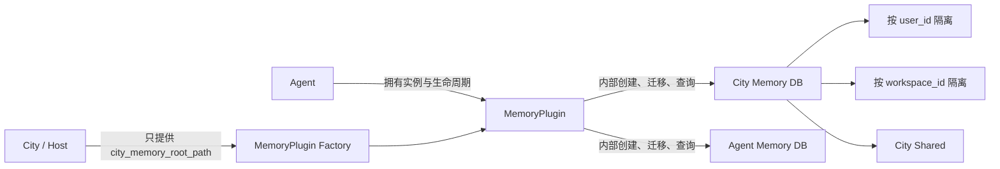
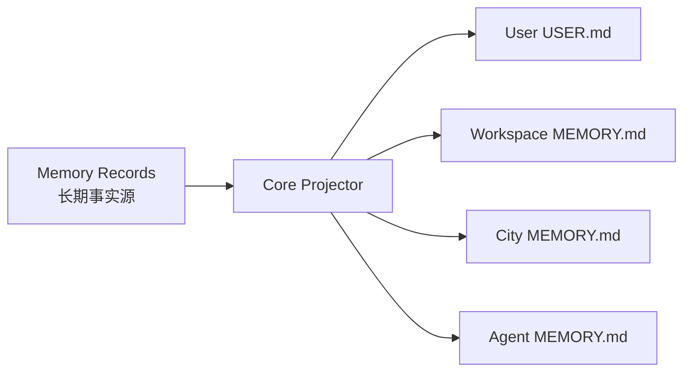
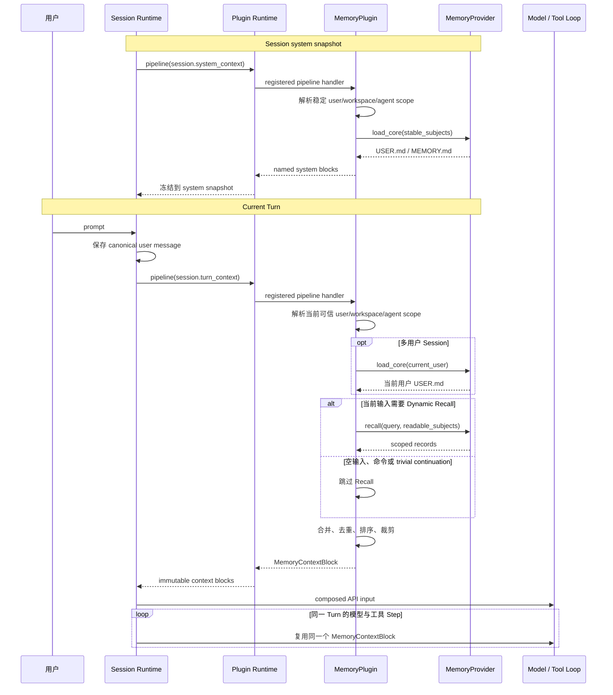
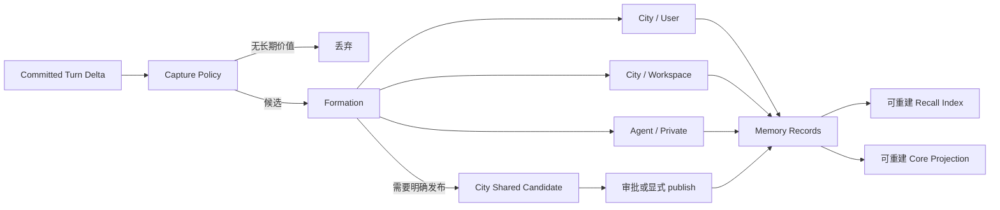
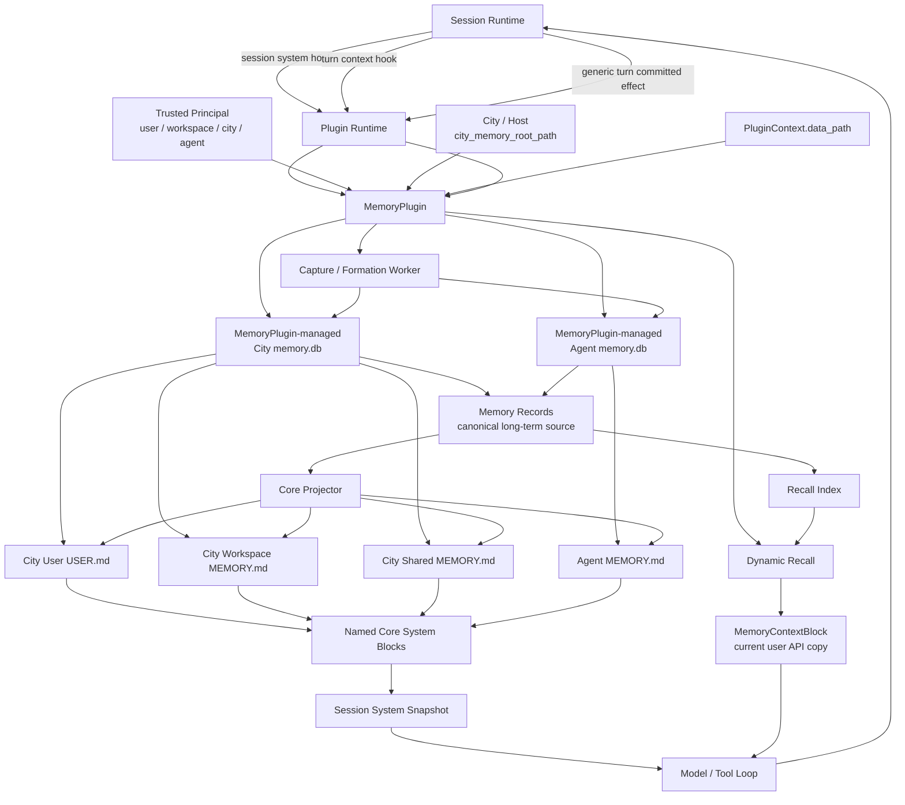

# MemoryPlugin 完整设计

> 状态：目标设计；当前完成 Hook 接入、Agent/City Store 路由和最小 Capture Job
>
> 适用范围：`@downcity/agent` Plugin Runtime、`@downcity/plugins` MemoryPlugin、City 宿主装配与 Memory 持久化
>
> 设计依据：[`engineering-design-standard.md`](./engineering-design-standard.md)

## 1. 文档目的

本文档定义 Downcity MemoryPlugin 的产品意图、领域职责、数据所有权、Session Hook、上下文注入、长期记忆形成以及 City/User/Agent 之间的共享规则。

本文档首先回答四个问题：

1. 用户信息为什么应该属于 City，而不是某个 Agent。
2. MemoryPlugin 如何在不侵入 SessionLoop 的前提下影响模型上下文。
3. `USER.md`、`MEMORY.md`、Core Memory 和 Dynamic Recall 分别是什么。
4. 一条 Session 消息如何形成长期记忆，又如何在后续 Turn 被召回。

本文档只描述目标设计，不要求保留当前 MemoryPlugin 的公开行为和物理文件结构。

### 当前实现进度

已经完成：

- 基于现有 `hooks.pipeline/effect` 的三个 Session 检查点。
- Core system block、每 Turn 一次 Dynamic Recall 及模型输入副本注入。
- Agent Private、City User、City Workspace、City Shared 的 owner/subject 逻辑地址。
- City 只通过 `PluginHostContext.extensions.city_memory_root_path` 提供共享根路径。
- `remember(target)` 的有限目标解析、完整逻辑 `memory_id` 与跨 Agent User Memory 共享。
- 成功 Turn 的 canonical 文本预检和 Agent Store 幂等 Capture Job。

尚未完成：

- 多用户 Session 的 per-Turn 可信 Principal；当前 City User 只使用 Embassy 当前认证用户，不能把聊天正文中的 `user_id` 当作可信身份。
- SQLite Records、FTS、Core Markdown Projector、Formation Worker、publish 与跨库恢复。
- 因此 Capture Job 当前只持久化为 `pending`，不会被伪装成已经形成的长期 Memory。

## 2. 结论先行

MemoryPlugin 的产品定义是：

> MemoryPlugin 根据当前可信身份，从 City 与 Agent 拥有的长期记忆中组装本轮模型上下文，并在 Turn 提交后把值得保留的信息形成到正确的所有者空间。

完整设计遵循以下结论：

1. Session Messages 是完整会话的唯一事实源。
2. Memory Records 是长期记忆的唯一事实源。
3. MemoryPlugin 拥有 Capture、Formation、Recall、Core Projection 和 Context Assembly。
4. SessionLoop 不包含任何 Memory 专用逻辑。
5. Session Runtime 必须提供通用的 Session System Hook、Turn Context Hook 和 Turn Committed Hook。
6. Hook 修改的是本轮模型输入投影，不修改 canonical Session Messages。
7. City Memory 的主要目的，是按可信 `user_id` 统一保存用户信息，让同一 City 内的多个 Agent 共享同一个用户认知。
8. City 只向 MemoryPlugin 提供共享数据根路径，不实现 Memory Repository、数据表、索引或召回逻辑。
9. Agent 持有 MemoryPlugin 实例；MemoryPlugin 是 City 级与 Agent 级 Memory 的唯一领域实现者。
10. Agent Memory 只保存 Agent 自身的私有经验、状态与学习结果，不复制用户画像。
11. `USER.md` 与 `MEMORY.md` 是受预算约束的 Core Memory 投影，进入稳定 system snapshot，但不是另一套事实源。
12. `USER.md` 只有在 Session 绑定唯一可信 `user_id` 时才能进入 system；多用户 Session 必须按 Turn 注入当前用户资料。
13. 每个有实际语义的用户 Turn 最多执行一次 Dynamic Recall；同一 Turn 的所有模型 Step 复用结果。

## 3. 从真实产品场景推导所有权

### 3.1 同一个用户使用多个 Agent

假设用户 `user_123` 同时使用：

- 编程 Agent。
- 日程 Agent。
- 写作 Agent。

用户告诉编程 Agent：

```text
我喜欢简洁回答，不要先讲背景。
```

这是一条用户偏好，而不是编程 Agent 的私有经验。如果它写在编程 Agent 的目录下，日程 Agent 和写作 Agent 都无法看到，同一个 City 会产生三份互相漂移的用户画像。

正确所有权是：

```text
owner      = city
subject    = user:user_123
type       = preference
content    = 用户喜欢简洁回答，不要先讲背景
```

City 是用户记忆的拥有者，`user_id` 是隔离边界；同一 City 内被授权的 Agent 读取同一份用户记忆。

### 3.2 Agent 自己形成的经验

编程 Agent 在多次任务后形成经验：

```text
处理大型 TypeScript 重构时，先运行受影响 package 的 typecheck，定位速度更快。
```

这是 Agent 自身的工作经验，不是用户信息，也不一定适用于其他 Agent。

正确所有权是：

```text
owner      = agent:code_agent
subject    = agent:code_agent
type       = experience
```

### 3.3 多 Agent 共享同一个 Workspace

用户确认：

```text
这个项目统一使用 pnpm，不使用 npm。
```

如果 Workspace 属于 City，并可能被多个 Agent 使用，这条事实不应归某个 Agent。

正确所有权是：

```text
owner      = city
subject    = workspace:open_source_sdk
type       = decision
```

### 3.4 City 公共事实

例如：

```text
生产环境统一使用 APISIX 作为网关。
```

它属于 City 公共知识：

```text
owner      = city
subject    = city
type       = fact
```

City 公共事实影响范围最大，不能由普通对话自动写入；必须由用户明确发布或经过授权审批。

## 4. 领域模型

### 4.1 最少领域概念

Memory 领域只公开三个必要概念：

| 概念 | 回答的问题 |
|---|---|
| `MemoryRecord` | 长期保存了什么 |
| `MemoryAccessContext` | 当前是谁、可以读写哪些空间 |
| `MemoryContextBlock` | 本轮实际提供给模型什么 |

Capture、Formation、Core、Recall、Index 和 Markdown 都是 MemoryPlugin 或 MemoryProvider 的内部策略，不扩展为 Session 领域概念。

### 4.2 Owner 与 Subject 必须分开

`owner` 表示谁维护数据和权限，`subject` 表示这条记忆描述谁或什么。

这里的 `owner = city` 是数据归属语义：记录落在 City 提供的共享根路径下，并对 City 内的 Agent 可见；它不表示 City Runtime 实现或调用 Memory 逻辑。数据库、文件和索引仍由各 Agent 持有的 MemoryPlugin 实例打开和维护。

```text
MemoryRecord
├── memory_id
├── owner
│   ├── kind: city | agent
│   └── id
├── subject
│   ├── kind: user | city | agent | workspace
│   └── id
├── memory_type
├── content
├── status
├── confidence
├── priority
├── observed_at
├── valid_from
├── valid_to
├── source_refs
└── metadata
```

必须满足以下不变量：

- `subject.kind = user` 的记录只能由 City 拥有。
- `subject.kind = workspace` 的共享记录由持有该 Workspace 的 City 拥有。
- `subject.kind = city` 的记录只能由 City 拥有。
- `subject.kind = agent` 的记录由对应 Agent 拥有。
- 一条记录只有一个 owner，不允许 Agent Store 与 City Store 隐式双写。
- 跨 owner 分享时创建新的记录并保留来源引用，不改变原记录所有权。

### 4.3 Memory 类型

第一版使用以下长期类型：

| 类型 | 示例 | 更新方式 |
|---|---|---|
| `profile` | 用户姓名、语言、地区 | 字段级更新 |
| `preference` | 喜欢简洁回答 | 新值替代旧值 |
| `fact` | 项目使用 pnpm | 可被新证据修订 |
| `decision` | 上线日期调整到 9 月 20 日 | 新决策 supersede 旧决策 |
| `episode` | 曾经处理过一次线上事故 | 只追加 |
| `experience` | Agent 总结的执行经验 | Agent 私有、可修订 |

`procedure` 不进入第一版自动形成范围。会改变 Agent 行为的规则必须显式审批，并优先进入 Instruction 或 Skill，而不是伪装成普通 Memory。

## 5. City Memory 与 Agent Memory

### 5.1 City Memory 的内部空间

City Memory 不是一份所有 Agent 无差别共享的大文件，而是一个按 Subject 隔离的共享仓库：

```text
City Memory
├── User Memory
│   └── user_id 隔离，同一用户跨 Agent 共享
├── Workspace Memory
│   └── workspace_id 隔离，使用该 Workspace 的 Agent 共享
└── City Shared Memory
    └── City 公共事实，写入受控
```

读取规则：

- 有可信 `user_id` 时，读取当前用户的 User Memory。
- 有当前 `workspace_id` 时，读取当前 Workspace Memory。
- Agent 加入 City 时，可以读取 City Shared Memory。
- 缺少 `user_id` 时，绝不能读取任意用户或默认用户的 Memory。
- 当前用户不能读取其他用户的 User Memory。

### 5.2 Agent Memory 的范围

Agent Memory 只保存：

- Agent 私有经验。
- Agent 自己的长期工作状态。
- 不应传播给其他 Agent 的观察和草稿。
- Agent 专属的任务处理偏好。

Agent Memory 不保存：

- 用户画像的副本。
- City 公共事实的副本。
- Workspace 公共决策的副本。
- 完整 Session transcript。

### 5.3 City 只提供共享路径

City 不拥有 MemoryPlugin Runtime，也不实现所谓 `CityMemoryRepository` 或 `CityMemoryPort`。



装配边界是：

- Agent Plugin 私有路径来自现有 `PluginContext.data_path`。
- City/宿主通过 `PluginHostContext.extensions` 提供可选的 `city_memory_root_path`。
- MemoryPlugin 自己在两个根路径下创建数据库、索引、投影和后台队列。
- City 不知道 `USER.md`、Memory 表结构、FTS、Core Projector 或 Provider。
- `@downcity/agent` 不依赖 MemoryPlugin 类型。
- 多个 Agent 的 MemoryPlugin 实例可以指向同一个 City Memory 根路径，通过数据库事务安全共享。

Agent 未加入 City 时：

- MemoryPlugin 仍可工作。
- 只启用 Agent Memory。
- 不提供 User、Workspace Shared 或 City Shared Memory。
- 不伪造本地默认用户身份。

## 6. 可信用户身份

### 6.1 用户身份不能从文本推断

MemoryPlugin 不能根据以下信息决定 `user_id`：

- 用户消息中的姓名。
- 模型推断结果。
- 未校验的 Tool 参数。
- 任意结构的 `SessionOrigin` 字段。

否则会产生跨用户数据泄漏。

### 6.2 身份由宿主解析，Session 只携带

Chat Channel、HTTP Transport 或其他已完成认证的宿主负责把来源身份归一化为可信执行身份。

概念上：

```text
SessionExecutionPrincipal
├── city_space_id?
├── user_id?
├── source_type
└── authenticated
```

它进入只读 `PluginExecutionContext`。Session 只携带和持久化必要标识，不解释用户领域；MemoryPlugin 根据该身份生成 `MemoryAccessContext`。

```text
MemoryAccessContext
├── agent_id
├── city_space_id?
├── user_id?
├── workspace_id?
├── readable_subjects
└── writable_subjects
```

`SessionOrigin` 仍然保存来源方的完整元数据，但 MemoryPlugin 不直接解析任意 Origin 结构。

## 7. `USER.md`、`MEMORY.md` 与 Core Memory

### 7.1 它们是逻辑资源

MemoryPlugin 对外使用稳定逻辑标识，不暴露或依赖物理文件路径：

```text
city://users/<user_id>/USER.md
city://workspaces/<workspace_id>/MEMORY.md
city://MEMORY.md
agent://<agent_id>/MEMORY.md
```

含义分别是：

| 逻辑资源 | 内容 |
|---|---|
| User `USER.md` | 当前用户稳定画像与偏好 |
| Workspace `MEMORY.md` | 当前 Workspace 的稳定事实和决策 |
| City `MEMORY.md` | City 公共背景与共享事实 |
| Agent `MEMORY.md` | Agent 私有经验与长期工作状态 |

### 7.2 Core Memory 是投影，不是第二事实源

`USER.md` 和各级 `MEMORY.md` 从 Memory Records 生成：



规则：

- Core 文件只是受预算约束的 materialized view。
- 可以删除并从 Memory Records 重建。
- 用户或 Agent 的修改通过 Memory Action 写回 Memory Records，再重新生成投影。
- 不允许同时把数据库和可直接编辑的 Markdown 都当成事实源。
- 文件存储实现可以真实落为 Markdown；远程 Provider 可以只模拟同样的逻辑资源。

### 7.3 Core 与 Recall 是两种读取策略

Core 回答：

> 哪些稳定信息无论当前问题是什么都应进入本轮上下文？

Dynamic Recall 回答：

> 除了稳定信息，当前问题还需要哪些历史记忆？

它们读取同一批 Memory Records：

```text
Core Context
  = User USER.md
  + Workspace MEMORY.md
  + City MEMORY.md
  + Agent MEMORY.md

Dynamic Recall
  = recall(current_user_query, readable_subjects)
```

同一条记录同时被 Core 和 Recall 命中时，Context Assembler 必须去重。

### 7.4 第一版 Core 更新策略

第一版使用确定性 Projector，不使用额外 LLM 重写 Core：

- 只选择 `active` 记录。
- 用户明确确认或 pinned 的记录优先。
- 按 subject、类型、优先级和有效期组织。
- 已 superseded 的记录不进入 Core。
- 每个逻辑资源有独立 Token Budget。
- 原子发布新版本，失败时继续使用上一个完整版本。

Core 在 Session system snapshot 建立时读取并冻结：

- City、Workspace 和 Agent `MEMORY.md` 随 Session system snapshot 保持稳定。
- `USER.md` 只有在 Session 绑定唯一可信 `user_id` 时进入 system snapshot。
- 多用户 Session 不加载固定 `USER.md`，而是在每个 Turn 按当前可信 `user_id` 放入低权限 Context Block。
- Session 运行中形成的新 Memory 先通过下一 Turn Dynamic Recall 生效。
- 新 Session 或显式刷新 system snapshot 后使用最新 Core Projection。

Core 的稳定性换取一致的 Agent 身份、用户画像和 Prompt Prefix；Dynamic Recall 负责当前问题的实时性。

## 8. MemoryPlugin 如何影响 Session Context

### 8.1 Session 只调用通用 Hook

不存在：

```text
SessionLoop → MemoryPlugin.recall()
SessionLoop → MemoryPlugin.load_user_md()
```

正确方式是控制反转：

```text
Session Runtime
  → 建立 system snapshot 时调用 Plugin Session System Hook
  → 每个 Turn 调用 Plugin Turn Context Hook
      → Plugin Runtime 分发给所有已注册 Plugin
          → MemoryPlugin 返回命名 System Block 或 MemoryContextBlock
```

Hook 仍然需要由 Session Runtime 在明确检查点触发。所谓“Session 不主动调用 MemoryPlugin”，准确含义是：

- Session 不导入 MemoryPlugin。
- Session 不理解 Memory Scope。
- Session 不决定是否 Recall。
- Session 不读取 `USER.md` / `MEMORY.md`。
- Session 只调用通用 Plugin 扩展点。

### 8.2 Plugin System 与 Core Memory 是两个 Block

两者都可以使用模型的 `system` role，但语义、来源和更新周期不同：

```text
memory/plugin-usage
  MemoryPlugin 的静态使用说明、Action 规则和安全边界

memory/core/user
  当前用户经过筛选的 USER.md

memory/core/workspace
  当前 Workspace 的稳定 MEMORY.md

memory/core/city
  City 公共 MEMORY.md

memory/core/agent
  当前 Agent 的稳定 MEMORY.md
```

Plugin Usage 说明“Memory 怎么使用”；Core Memory 提供“当前稳定认知是什么”。它们不能拼成一个不可区分的字符串，也不能共用版本号和更新策略。

Core Memory 可以进入 system 的前提是：

- 来自 Core Projector，而不是原始 Recall 结果。
- 只包含稳定、受预算约束、经过验证的事实与偏好。
- 明确禁止嵌入 Tool 指令、外部网页指令或未经确认的 Procedure。
- 每个 Block 有独立名称、来源、版本与 citation。
- `USER.md` 绑定的 `user_id` 在整个 Session 内稳定。

Dynamic Recall 不满足这些条件，因此不能进入 system。

### 8.3 复用现有 Plugin HookRegistry

不新增 `Plugin.session_system()`、`Plugin.turn_context()` 或
`Plugin.turn_committed()` 等平行协议。Session 只定义三个稳定 point，Plugin 继续使用
现有的 `hooks.pipeline` 和 `hooks.effect` 注册处理器。

Session System Hook 在建立或显式刷新 system snapshot 时执行：

```text
pipeline("session.system_context", value)
  → value.blocks: AgentSessionSystemBlock[]
```

MemoryPlugin 在这里加载符合条件的 `USER.md` 和各级 `MEMORY.md`。结果跟随 Session system snapshot 冻结。

Turn Context Hook 在每个用户 Turn 首次模型执行前执行：

```text
pipeline("session.turn_context", value)
  → value.blocks: SessionPluginContextBlock[]
```

MemoryPlugin 在这里执行 Dynamic Recall；多用户 Session 还在这里加载当前用户 `USER.md`。

`PluginContextBlock` 至少表达：

```text
source_plugin
block_id
content
trust_level
citations
version
```

边界：

- Plugin 返回新 Block，不原地修改 Session Messages。
- Plugin 不能删除或改写 canonical history。
- Turn Context Block 不使用 `system` role。
- Composer 负责把 Block 渲染到当前用户消息的 API 副本。
- Block 在同一 Turn 的所有模型 Step 中复用。
- 上下文超限重试仍使用相同 Block，不重新 Recall。

### 8.4 注入后的模型输入

canonical Session Message 保持：

```text
user: 帮我安装这个项目的依赖
```

模型实际收到的 API 副本可以是：

```text
system:
  [memory/plugin-usage]
  如何使用 MemoryPlugin

  [memory/core/user]
  用户希望回答简洁

  [memory/core/workspace]
  当前项目统一使用 pnpm

user:
  <memory-context trust="reference">
  [recall/decision] 上次依赖升级时遇到过 lockfile 冲突。
  </memory-context>

  <current-request>
  帮我安装这个项目的依赖
  </current-request>
```

该副本：

- 不写回 Session Messages。
- 不参与后续自动 Capture。
- 可以随当前 Turn execution snapshot 保存，用于崩溃恢复和审计。
- 必须带 memory_id、版本与 citation manifest。

### 8.5 不同 Memory 内容使用不同消息通道

不能把“MemoryPlugin 相关内容”都理解为 Memory Context。目标设计固定以下映射：

| 内容 | 模型消息通道 | 持久化与生命周期 |
|---|---|---|
| MemoryPlugin 使用说明、安全规则、Action 说明 | `system` | Session 稳定 system snapshot |
| 单用户 Session 的 `USER.md` Core | 独立命名的 `system` block | Session system snapshot |
| City/Workspace/Agent `MEMORY.md` Core | 独立命名的 `system` block | Session system snapshot |
| 多用户 Session 的当前用户 `USER.md` | 当前 `user` message 的 API 副本 | 仅当前 Turn，不写 canonical message |
| 每 Turn 自动 Dynamic Recall | 当前 `user` message 的 API 副本 | 仅当前 Turn，不写 canonical message |
| 模型主动调用 `memory.search/read` 的结果 | `tool result` | 按正常 Tool 执行记录保存 |
| `remember/revise/forget` 操作结果 | `tool result` | 按正常 Tool 执行记录保存 |
| Memory 数据 | 不使用 `assistant` role | 不适用 |

因此模型请求的逻辑结构是：

```text
system
  Agent instructions
  [memory/plugin-usage] MemoryPlugin usage instructions
  [memory/core/user] USER.md
  [memory/core/workspace] MEMORY.md
  [memory/core/city] MEMORY.md
  [memory/core/agent] MEMORY.md

history
  canonical Session messages

current user API copy
  <memory-context>
    Dynamic Recall
  </memory-context>
  <current-request>
    canonical current user message
  </current-request>
```

选择当前 `user` message 的 API 副本，不表示 Dynamic Recall 是用户刚说的话。`<memory-context trust="reference">` 明确说明它是宿主附加的历史参考数据。这样做是为了：

- 不把临时检索结果提升为 System/Developer Instruction。
- 不伪造成 Assistant 曾经输出的内容。
- 不制造没有对应 Tool Call 的虚假 Tool Result。
- 兼容只有 system/user/assistant/tool 基础角色的不同模型协议。
- 保持 canonical Session Message 原文不变。

如果未来模型协议原生支持低权限 `context` 或 `attachment` 角色，Model Adapter 可以把同一个 `MemoryContextBlock` 映射到该角色；MemoryPlugin 和 Session 领域协议不需要变化。

### 8.6 参考实现并不统一

主流方案没有统一的 Memory role，差异来自它们对“Memory 是指令还是参考数据”的定义不同：

| 方案 | Core / 稳定 Memory | Dynamic Recall | 说明 |
|---|---|---|---|
| Hermes | Provider 可以提供稳定 system block | Prefetch 结果附加到当前 user message 的 API 内容，同一 Turn 复用 | 最接近 Downcity 的动态 Recall 方案 |
| Letta / MemFS | `system/` 下的 Core 文件进入 system prompt | 其他文件通过 search/read 按需获取 | 把 always-visible Core 视为 Agent 自身组成部分 |
| LlamaIndex Memory Blocks | Block 可配置进入 system 或最新 user message | 由 Memory Block 和应用编排决定 | 明确允许两种 placement |
| Mem0 | 不规定模型消息 role | SDK 返回 Memory，由接入方拼装 Prompt | 它是 Memory Engine，不是 Session Runtime |
| Zep / Graphiti / Hindsight / Supermemory | 通常返回结构化 Context | 由 Agent 宿主决定注入位置 | Provider 本身不应决定 Downcity 的消息权限 |

Downcity 对 Core 与 Dynamic Recall 采用不同策略：经过 Core Projector 治理的 `USER.md` / `MEMORY.md` 进入命名 system blocks；临时检索结果仍作为低权限参考数据进入当前 user API 副本。这个边界接近 Letta 的 Core 思路与 Hermes 的 Prefetch 思路的组合。

## 9. 每个 Turn 的读取时序



### 9.1 Recall 触发策略

每个有实际语义的用户 Turn 最多 Recall 一次。

跳过：

- 空输入。
- Slash command。
- 纯确认或寒暄，例如“好的”“谢谢”“继续”。
- 当前 Turn 已经完成 Recall。

第一版不调用额外 LLM 判断是否 Recall。使用确定性规则，其他输入默认执行本地 Recall。

模型仍可显式调用 `memory.search`，用于：

- 自动 Recall 预算不足。
- 需要读取更早、更细的证据。
- 用户明确要求搜索历史记忆。

显式 `memory.search` 是 Tool Action，不替代每 Turn 自动上下文。

### 9.2 读取顺序与预算

Session System Assembler 按以下顺序构造 Core：

1. 当前 User Core。
2. 当前 Workspace Core。
3. Agent Core。
4. City Shared Core。

Turn Context Assembler 构造：

1. 多用户 Session 的当前 User Core。
2. Dynamic Recall 结果。

这不是权限优先级，而是默认的上下文预算优先级。当前用户明确输入始终高于任何 Memory。

Context Assembler 必须执行：

- Scope 权限过滤。
- active/valid 时间过滤。
- 重复内容合并。
- superseded 冲突消解。
- Token Budget 裁剪。
- citation manifest 生成。

## 10. Turn 提交后的写入时序

### 10.1 通用 Turn Committed Hook

读取路径要求同步 Context Hook；写入路径使用异步 Effect Hook：

```text
Session Runtime
  → canonical Turn 已提交
  → Plugin Runtime 发布 session.turn_committed
  → MemoryPlugin 接收本 Turn 的 canonical message delta
  → 加入内部串行队列
```

Session Runtime 只发布通用事件，不调用 `digest_memory()`。

事件必须发生在 canonical user/assistant message 已经成功提交之后。失败或停止的 Turn 第一版不自动形成长期记忆。

### 10.2 Capture 与 Formation



Formation 根据 Subject 路由，而不是让模型自由选择物理 Store：

| 内容 | 写入目标 |
|---|---|
| 当前用户资料、偏好 | City / Current User |
| 当前 Workspace 事实、决策 | City / Current Workspace |
| Agent 自己的执行经验 | Agent / Private |
| City 公共事实 | 只生成候选，明确 publish 后写入 |

### 10.3 Memory 生成算法

Memory 生成分为显式写入和自动形成，两条链路最终提交相同的 `MemoryRecord`。

#### 10.3.1 显式 `remember`

当用户明确说“记住”时，模型调用 `memory.remember`。Action 已经提供了需要保存的内容、类型和语义目标，因此不再调用额外 Formation LLM。

```text
memory.remember
→ AccessResolver 校验当前可信身份和目标
→ 规范化 content / type / subject
→ 查询同 subject 下的相关 active records
→ 确定 create / update / supersede / no-op
→ 在目标 DB 中提交 evidence + record + index
→ 返回真实提交结果
```

默认目标按内容语义选择：

- “我喜欢……”、姓名、语言、个人偏好：`current_user`。
- “这个项目……”、仓库约定、项目决策：`current_workspace`。
- “你以后处理任务时……”且只针对当前 Agent：`agent`。

模型只提交 `current_user | current_workspace | agent`，不能提交任意 `user_id` 或数据库路径。

显式写入是同步操作。只有数据库事务成功后，Action 才能返回“已记住”。Core Markdown 可以异步重建，但下一 Turn 的 Recall 必须能立即读到已提交 Record。

#### 10.3.2 自动形成

自动 Formation 在成功 Turn 提交后后台执行。第一版使用“本地预检 + 一次结构化 Formation 调用 + 确定性校验”的流程：

```text
1. 读取 canonical Turn Delta
2. 确定性预检
3. 按整段 Turn 在当前可写范围查询相关旧 Memory
4. 一次 Formation 模型调用输出结构化 operations
5. MemoryPlugin 校验 operations
6. 按目标 DB 分组并事务提交
7. 标记 Core Projection dirty
```

确定性预检直接跳过：

- 没有用户文本的 Turn。
- 纯寒暄、确认或临时控制指令。
- 失败、停止的 Turn。
- 只有 Memory Recall 内容、没有新事实的 Turn。
- 明显包含密钥、Token、密码等敏感信息的内容。

Formation 模型只能输出候选操作，不能直接写数据库：

```text
MemoryFormationOperation
├── operation: create | update | supersede | noop
├── target: current_user | current_workspace | agent | city_candidate
├── memory_type
├── normalized_content
├── confidence
├── priority
├── valid_from?
├── valid_to?
├── related_memory_id?
└── source_message_ids
```

模型输入包含：

- 当前 Turn 的 canonical user/assistant 文本。
- 当前可信 Subject 的标识类型，但不暴露其他用户数据。
- 本地检索得到的少量相关 active records。
- Memory 类型、隐私和归属规则。

模型输出后，MemoryPlugin 必须再次确定性校验：

- `source_message_ids` 必须属于当前 Turn。
- target 必须存在于当前 `writable_subjects`。
- User 记录必须路由到 City DB，并绑定当前可信 `user_id`。
- Workspace 记录必须路由到 City DB，并绑定当前 `workspace_id`。
- Agent 记录只能绑定当前 `agent_id`。
- `city_candidate` 只保存为待发布候选，不能自动成为 City Shared Memory。
- 低置信度、敏感信息、行为指令或无法归属的候选直接丢弃。
- `related_memory_id` 必须属于相同 owner/subject，不能跨用户 supersede。

第一版不使用第二次 LLM 调用做合并。确定性规则能够确认同一字段或同一 `related_memory_id` 时执行 update/supersede；无法确认时创建独立 Record，后续再通过维护任务合并，不能冒险覆盖。

#### 10.3.3 Evidence 生成

每个实际提交的 Memory Record 必须保留最小充分证据：

```text
MemoryEvidence
├── evidence_id
├── session_id
├── turn_id
├── message_ids
├── quote
├── content_hash
└── created_at
```

`quote` 只保存支持该 Memory 的相关原文片段，不复制整个 Session transcript。Session 被归档或删除后，Memory 仍保留可审核的最小证据；Session Messages 仍是完整对话的事实源。

### 10.4 自动写入不能捕获注入内容

MemoryPlugin 只能读取 canonical Turn Delta：

- 用户原始消息。
- Assistant 最终可见消息。
- 明确允许持久化的 Tool Result 引用。

不能读取：

- MemoryContextBlock。
- System Prompt。
- 隐藏推理内容。
- 其他 Plugin 的私有上下文。

否则 Recall 出来的内容会被下一次 Capture 再次写入，形成递归污染。

### 10.5 后台队列

自动 Capture 的重任务不阻塞用户响应。MemoryPlugin 为自己的异步工作负责：

- 收到 `turn_committed` 后先快速、持久化创建 Capture Job。
- 按 Agent 实例串行消费 Turn。
- 同一个 Session 按 Turn 顺序 Formation。
- 每个 Job 幂等，使用 `session_id + turn_id` 去重。
- Plugin 启动时恢复 `pending/processing` Job。
- Plugin dispose 时停止接收新任务并等待或安全持久化未完成任务。
- 失败进入可观察状态，但不反向修改已提交 Session。

显式 `memory.remember` 不进入后台队列，必须同步返回真实写入结果。

## 11. 显式 Actions

### 11.1 `remember`

用于用户明确要求“记住”。

模型提交语义目标，而不是原始 owner ID：

```text
target = current_user | current_workspace | agent
```

MemoryPlugin 根据可信 Runtime Context 解析实际 owner 与 subject。模型不能伪造 `user_id`、`city_space_id` 或 `agent_id`。

### 11.2 `search`

在当前 `MemoryAccessContext` 允许的范围内执行显式深度召回。默认同时搜索：

- 当前用户。
- 当前 Workspace。
- 当前 Agent。
- City Shared。

可以按 subject 类型缩小范围，但不能传入任意其他 `user_id`。

### 11.3 `read`

读取一个已通过 Recall 返回、且当前主体有权限访问的 `memory_id`。

### 11.4 `revise`

基于新证据修订当前有效记录。事实变化应建立 supersede 关系，不静默覆盖审计历史。

### 11.5 `forget`

使记录失效或删除，并传播到 Core、FTS、Vector 等可重建投影。

### 11.6 `publish`

把 Agent 私有候选或当前 Workspace/User 范围事实发布为 City Shared Memory。它是高影响操作，必须显式授权并保留来源记录。

### 11.7 `digest`

当前公开 `digest` 不再作为正常运行链路。自动 Formation 由 Turn Committed Hook 驱动；批量历史导入可以保留为管理能力，但不要求模型在正常会话中主动调用。

## 12. 完整真实场景

### 12.1 用户偏好跨 Agent 共享

用户在编程 Agent 中说：

```text
记住，我不喜欢太长的回答。
```

流程：

```text
Session 保存消息
→ 模型调用 memory.remember(target=current_user)
→ MemoryPlugin 从可信执行身份获得 user_id
→ 写入 City / User Memory
→ 更新该用户 USER.md
→ 返回写入成功
```

之后用户打开日程 Agent：

```text
新 Turn
→ MemoryPlugin 解析出同一个 user_id
→ 加载同一份 USER.md
→ 日程 Agent 自动获得“回答简洁”的偏好
```

编程 Agent 和日程 Agent 不各自保存一份用户偏好。

### 12.2 Workspace 决策跨 Agent 共享

用户说：

```text
这个仓库以后统一使用 pnpm。
```

Turn 提交后：

```text
MemoryPlugin Formation
→ subject = current_workspace
→ owner = city
→ 写入 Workspace Memory
→ 更新 Workspace MEMORY.md
```

之后另一个 Agent 在同一 Workspace 执行安装任务，可以自动读取该决策。

### 12.3 Agent 私有经验

Agent 从一次失败中总结：

```text
该代码库的完整测试很慢，重构时优先运行受影响 package。
```

如果它只是当前 Agent 的执行经验：

```text
owner = agent
subject = agent
→ Agent MEMORY.md
```

它不会自动影响其他 Agent。用户认为该经验值得共享时，可以显式 publish。

### 12.4 同一 Turn 多次模型调用

用户要求：

```text
检查项目并安装依赖。
```

执行：

```text
Turn 开始
→ MemoryPlugin 加载 Core 并 Recall 一次
→ Model Step 1
→ 文件 Tool
→ Model Step 2
→ Shell Tool
→ Model Step 3
→ 最终回答
```

所有 Step 复用同一个 MemoryContextBlock，不在 Tool Result 后重新 Recall。

## 13. MemoryPlugin 内部结构

```text
MemoryPlugin
├── SystemProvider
│   └── 静态使用说明和安全边界
├── session.system_context Pipeline Handler
│   └── 加载 USER.md / MEMORY.md Core blocks
├── session.turn_context Pipeline Handler
│   └── 每 Turn 组装 Dynamic Recall
├── session.turn_committed Effect Handler
│   └── 接收 canonical Turn Delta
├── AccessResolver
│   └── 可信身份 → 可读写 Subject
├── ContextAssembler
│   └── 合并、去重、冲突、预算、引用
├── CapturePolicy
│   └── 判断是否值得长期保留
├── FormationService
│   └── 分类、归属、合并、supersede
├── BackgroundWorker
│   └── 串行、幂等、失败观测
└── MemoryProvider
    ├── AgentStore（PluginContext.data_path）
    ├── CityStore（optional city_memory_root_path）
    ├── Recall Index
    └── Core Projector
```

只有 `MemoryPlugin`、Actions 和 Provider 协议属于稳定外部边界。其余默认作为内部实现，避免把策略对象全部公开。

## 14. Provider 与持久化

### 14.1 单一 Provider 所有权

一个 MemoryPlugin 实例绑定一个主 MemoryProvider。

Builtin Provider 完整拥有：

- Agent 私有数据库。
- 可选的 City 共享数据库。
- 本地 FTS/BM25 索引。
- Core Markdown 投影。
- Capture Job 队列。
- Schema Migration 和连接生命周期。

City 只提供专属于 MemoryPlugin 的绝对根路径。City 不创建数据库连接，不定义表结构，也不执行迁移。

MemoryPlugin 不同时向多个独立 Provider 双写。需要组合远程后端时，由单一 Composite Provider 负责一致性、融合、删除传播和失败语义。

### 14.2 路径装配

MemoryPlugin 启动时获得两个彼此独立的根路径：

```text
agent_memory_root_path
  = PluginContext.data_path

city_memory_root_path?
  = PluginHostContext.extensions 中由宿主注入的 Memory 专属绝对路径
```

建议内部布局：

```text
<agent_memory_root_path>/
├── memory.db
└── core/
    └── MEMORY.md

<city_memory_root_path>/
├── memory.db
└── core/
    ├── MEMORY.md
    ├── users/<encoded_user_id>/USER.md
    └── workspaces/<encoded_workspace_id>/MEMORY.md
```

路径规则：

- `city_memory_root_path` 已经是 MemoryPlugin 专属目录，Plugin 不猜测 City 上级目录结构。
- 两个根路径必须是绝对路径或宿主提供的 Rooted FileSystem。
- `user_id`、`workspace_id` 不能直接拼接路径，必须使用安全、稳定、可逆的单目录段编码。
- 所有临时文件、数据库和投影必须留在对应根路径内。
- 未提供 City 路径时，Provider 不创建任何 City 数据，也不把 User Memory 降级写入 Agent 路径。

### 14.3 SQLite 数据结构

Agent DB 与 City DB 使用相同 schema，便于复用 Provider 逻辑，但保存不同 owner 的数据。

第一版核心表：

```text
memory_records
  长期 Memory canonical records、状态、revision、有效期

memory_evidence
  支撑 Memory 的最小 Session 原文证据

memory_record_sources
  Record 与 Evidence 的多对多引用

memory_records_fts
  可删除、可重建的 FTS5 索引

core_projection_state
  每个 USER.md / MEMORY.md 的版本、dirty 状态与构建时间

capture_jobs
  自动 Formation 的持久化任务

capture_job_operations
  一个 Job 跨 Agent/City DB 写入时的分项完成状态

schema_metadata
  Schema 版本与迁移状态
```

Agent DB 只接受 `owner = current_agent`。City DB 只接受 City/User/Workspace Subject。Provider 在写事务前再次校验，不能只相信 Formation 输出。

### 14.4 单条 Memory 的事务落盘

显式写入或自动 Formation 产生一个有效 Operation 后，在目标数据库执行：

```text
BEGIN IMMEDIATE
  1. 校验 owner / subject / revision
  2. insert memory_evidence（不存在时）
  3. insert 或 update memory_records
  4. insert memory_record_sources
  5. 同步更新 memory_records_fts
  6. 标记对应 core_projection_state 为 dirty
  7. 更新 capture_job_operation 状态（自动任务）
COMMIT
```

事务成功后才算 Memory 已持久化。任何一步失败都回滚，不允许出现“Record 已写入但 Evidence 或索引缺失”的半提交状态。

`memory_records` 使用 revision 做乐观并发控制。更新时 revision 不匹配，重新读取当前记录后决定 retry、创建新记录或放弃，不能覆盖其他 Agent 刚提交的 City Memory。

### 14.5 跨 Agent DB 与 City DB 的一致性

一个 Turn 可能同时形成：

- 一条 City/User 偏好。
- 一条 City/Workspace 决策。
- 一条 Agent 私有经验。

它们位于两个独立 SQLite DB，不能伪装成一个原子事务。

处理规则：

- Formation 先生成一个稳定 `capture_job_id`。
- 每个候选 Operation 有稳定 `operation_id`。
- 按目标 DB 分组，分别事务提交。
- `capture_job_operations` 记录每个 Operation 的 pending/completed/failed 状态。
- 重试只执行尚未完成的 Operation。
- 每个写入使用唯一 `operation_id` 去重，保证至少一次调度不会生成重复 Memory。
- 部分成功必须可观察，不能回滚另一个已经成功提交的 owner。

显式 `remember` 一次只能写一个语义目标，因此只涉及一个 DB，不存在跨库事务。

### 14.6 FTS 持久化

FTS 是 Recall Index，不是事实源。

- Record 写事务内同步更新 FTS，保证下一 Turn 可以立即 Recall。
- 删除、失效或 supersede 时同步移除不可召回内容。
- FTS 损坏或版本变化时，从 active Memory Records 全量重建。
- 中文默认使用 trigram 或明确的可插拔 tokenizer，不能把完整中文句子当作单个 token。

### 14.7 `USER.md` / `MEMORY.md` 落盘

Core Markdown 是异步物化投影：

```text
Memory Record Transaction Commit
→ core_projection_state.dirty = true
→ Core Projector 读取同 Subject 的 active records
→ 在 Token Budget 内确定性渲染 Markdown
→ 写临时文件
→ fsync / close
→ atomic rename 到 USER.md 或 MEMORY.md
→ 提交 projection version 和 dirty = false
```

如果进程在投影阶段崩溃：

- 已提交的 Memory Record 不丢失。
- 旧的完整 Markdown 继续可读。
- Plugin 下次启动或下一次后台检查会重建 dirty projection。
- 临时文件不是有效投影，可以安全清理。

Session System Hook 由 MemoryPlugin 读取这些文件并组装命名 Core system blocks。如果投影缺失或 dirty，第一版可以继续使用上一完整版本；最新 Record 仍可通过 Dynamic Recall 命中。

### 14.8 Capture Job 持久化与恢复

`turn_committed` 之后分为快速接收和后台处理：

```text
快速接收
  → 在 Agent DB insert capture_job
  → unique(session_id, turn_id)
  → 返回 Hook dispatcher

后台处理
  → pending → processing
  → 预检、检索相关 Memory、Formation
  → 分库提交 operations
  → completed 或 failed
```

Plugin 启动时：

- 把因进程退出遗留的 `processing` Job 恢复为 `pending`。
- 按 Session Turn 顺序继续执行。
- 达到最大重试次数后保留 failed 状态和错误，不静默丢弃。

Capture Job 只保存在 Agent DB，因为执行它的 Worker 跟随当前 Agent MemoryPlugin 生命周期；Job 产生的 City Memory Record 则写入共享 City DB。

### 14.9 多 Agent 并发访问 City DB

多个 Agent 的 MemoryPlugin 实例会打开同一个 `<city_memory_root_path>/memory.db`。

Builtin Provider 必须：

- 启用 SQLite WAL。
- 启用 `foreign_keys`。
- 配置有限 `busy_timeout`。
- 写操作使用短事务，不在事务中调用 LLM 或网络服务。
- Schema Migration 使用独占事务并再次检查版本，允许多个 Plugin 实例并发启动。
- 遇到锁超时进入可重试失败，不无限阻塞 Session。

共享 City SQLite 只支持同一主机上的本地可靠文件系统。网络文件系统或多主机部署必须换用能够提供相同 Provider 语义的远程数据库实现。

### 14.10 Canonical 与 Projection

```text
Canonical
  Memory Records

Rebuildable Projections
  USER.md
  MEMORY.md
  FTS Index
  Vector Index
  Graph Index
```

第一版默认实现建议：

- SQLite Memory Records。
- SQLite FTS5/BM25。
- 中文使用 trigram 或明确的可插拔 tokenizer。
- Markdown Core Projection。
- 不默认启用 Vector 和 Graph。

### 14.11 Provider 最小职责

Provider 需要支持：

```text
initialize
status
load_core
recall
remember
capture_turn
read
revise
forget
publish
dispose
```

`system_context` 应拆分为 `load_core`：Provider 只返回结构化 Core 内容，MemoryPlugin 再通过 Session System Hook 生成独立命名的 system blocks。Provider 不返回整段混合 Plugin 说明与 Memory 的 system prompt。

## 15. 一致性与失败语义

### 15.1 读取失败

- User Core 读取失败：记录 degraded，继续读取其他范围。
- Dynamic Recall 超时：使用 Core 继续执行。
- City Memory 路径或数据库不可用：Agent Memory 继续工作，并明确记录共享记忆降级。
- 缺少可信 user_id：跳过 User Memory，不能降级到其他用户。

Memory 读取失败默认不能阻断 Session 主链路。

### 15.2 写入失败

- 显式 `remember/revise/forget/publish` 失败：Action 必须返回失败，模型不能声称成功。
- 自动 Capture 失败：不影响已提交 Turn，进入后台任务状态和日志。
- Core Projector 失败：保留上一完整版本。
- 索引更新失败：记录 degraded，canonical Memory Records 仍然有效，可重建索引。

### 15.3 并发

- 同一 Memory Record 的修改使用 revision 或乐观并发控制。
- 相同 owner/subject 的 Formation 按顺序提交。
- `session_id + turn_id` 是自动 Capture 的幂等键。
- 一个 Turn 的 Context Block 一旦生成，在该 Turn 内不可变化。

## 16. 安全与权限

Core Memory 虽然使用 `system` role，但其内容仍是受控事实与偏好，不是任意可执行指令；Dynamic Recall 始终是低权限历史参考数据。

必须遵循：

- MemoryContextBlock 明确标记为 untrusted/reference。
- Core system blocks 必须与 Agent Instructions 分块，并声明不得覆盖 Agent Instructions、用户当前请求和工具权限。
- Core Projector 禁止把 Tool 指令、网页指令和未审批 Procedure 提升到 system。
- 任何 Memory 中的“调用工具”“上传数据”等文本都只视为引用内容。
- User Memory 必须按可信 user_id 严格隔离。
- City Shared 写入必须显式授权。
- 敏感信息默认不自动 Capture。
- `forget` 必须传播到全部投影和远程 Adapter。
- Recall 和 Action 返回稳定 citation，便于用户检查来源。

## 17. V1 范围

### 17.1 V1 必须完成

1. 可信 Session principal 投影。
2. 基于现有 HookRegistry 的 `session.system_context` pipeline point。
3. 基于现有 HookRegistry 的 `session.turn_context` pipeline point。
4. 基于现有 HookRegistry 的 `session.turn_committed` effect point。
5. Core system blocks 随 Session snapshot 冻结。
6. Dynamic Context Block 每 Turn 一次解析与缓存。
7. City User、City Workspace、City Shared、Agent Private 四个 Subject 范围。
8. SQLite 结构化 Memory Records。
9. 本地 FTS Recall。
10. `USER.md` / `MEMORY.md` Core Projection。
11. 同步显式 remember 与异步自动 capture。
12. read、search、revise、forget、publish。
13. 权限过滤、citation、幂等与失败观测。

### 17.2 V1 不做

- Vector Database。
- Knowledge Graph。
- 多 Provider 双写。
- 每 Model Step Recall。
- LLM Recall Gate。
- 自动发布 City Shared Memory。
- 自动形成 Procedure 或系统规则。
- 把完整 Session transcript 当长期 Memory。
- 把 Memory 内容写进 canonical Session Messages。
- 让 SessionLoop 读取 Memory 文件或理解 Memory Scope。

## 18. 对现有实现的影响

### 18.1 `@downcity/agent`

需要增加的只是通用能力：

- Session Plugin 动态 Context Block 值协议。
- Session Plugin 命名 System Block 值协议。
- 在 system snapshot 检查点调用现有 pipeline。
- 在 Turn 检查点通过 execution lease 调用现有 pipeline，并做 Turn 级缓存。
- Composer 对 Context Block 的统一渲染。
- 可信 Session principal 的只读执行投影。
- canonical Turn committed 后调用现有 effect。

不增加：

- Memory 类型。
- Memory Scope。
- Memory Provider。
- `memory.md` 路径。
- Memory 专用 SessionLoop 分支。

### 18.2 `@downcity/plugins` MemoryPlugin

需要重建：

- City/User/Workspace/Agent 所有权模型。
- 三个现有 HookRegistry point 的处理器。
- 自动 Recall。
- 自动 Capture Worker。
- Core Projector。
- 结构化 Records 与 FTS。
- 新的 Actions 和 Provider SPI。

### 18.3 City 宿主

City/宿主负责：

- 提供 MemoryPlugin 专属的 `city_memory_root_path`。
- 把已认证 user_id 投影到 Session principal。
- 在 Plugin factory 装配时注入共享路径。
- 决定 City Shared publish 的授权策略。

City 不负责：

- Memory 数据库和文件结构。
- 数据库连接、迁移与并发。
- Recall。
- Capture。
- Core Projection。
- Memory Prompt 渲染。
- MemoryPlugin 生命周期。

## 19. 迁移策略

现有 Memory 文件不能直接推断成 User Memory，因为缺少可信 user_id。

迁移规则：

1. 现有 Agent 目录中的 Wiki 默认迁移为 Agent Private Memory。
2. 只有明确绑定用户身份的记录才能迁移到 City/User。
3. Project/Workspace 内容只有在能解析稳定 workspace_id 时迁移到 City/Workspace。
4. 无法确定 owner 或 subject 的内容进入待审核导入，不自动共享。
5. 旧 `wiki/*.md` 保留备份，导入成功后由新 Records 生成 Core Projection。
6. Recall Index 和 Core Markdown 均从 Records 重建，不继承为新的事实源。

## 20. 推荐实施顺序

```text
阶段一：Plugin Runtime Hook
  → principal
  → named session system blocks
  → turn context block
  → turn committed effect

阶段二：Memory Ownership
  → owner / subject
  → city_memory_root_path
  → access resolver

阶段三：Builtin Provider
  → SQLite records
  → FTS
  → USER.md / MEMORY.md projector

阶段四：Runtime Policy
  → automatic recall
  → context assembler
  → background capture

阶段五：Migration 与 Eval
  → 旧数据导入
  → 跨用户隔离测试
  → recall/citation/token cost 测试
```

每个阶段分别验证，不在一个提交中同时替换 Session Runtime、Memory 数据库和全部用户行为。

## 21. 最终架构



最终边界可以概括为：

> Session 保存对话并提供通用 Hook；City 只提供共享路径；MemoryPlugin 根据可信用户与资源身份，独立管理 City 级与 Agent 级 Memory 的生成、落盘、召回和上下文注入。`USER.md` 与 `MEMORY.md` 由 MemoryPlugin 加载和维护，但永远不成为 Session 自己的状态。
