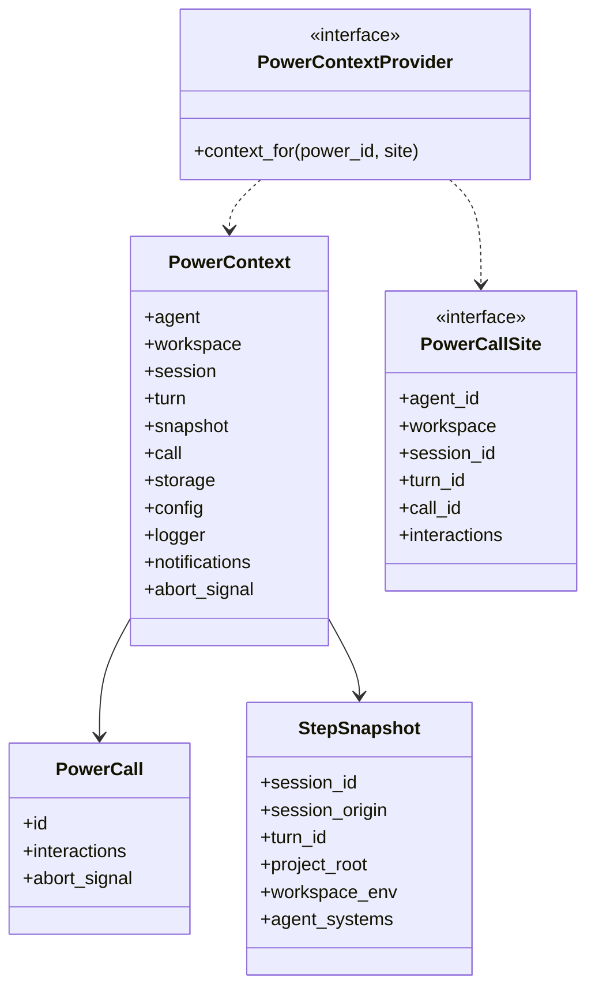

# Power 调用上下文重设计

> 状态：实施中
>
> 目标：把 Power 调用环境收敛成「一个端口 + 三个类」，删除工厂与伪造链。
>
> 更新时间：2026-09-21

## 1. 问题

### 1.1 工厂隐藏依赖

`PowerContextFactory` 是闭包：

```ts
type PowerContextFactory = (power_id: string, call_context: ToolCallContext) => PowerContext;
```

签名看不出它需要 `storage`、`host`、`registry`、`runtime_access`——这些全在闭包里。调用方无法从类型上知道造一个 context 要什么。

### 1.2 入口 3 走伪造链

`ToolCallContext` 是 Session 侧类型。模型工具与 hooks 拿得到它，HTTP/RPC 拿不到，于是：

```text
HTTP 请求
  → create_call_context 造假 ToolCallContext（session_id: ""、origin: {type:"chat"}）
  → merge_call_context 打补丁
  → context_factory 拆开重拼
  → PowerContext
```

造假只为满足签名。中间两层是浪费。

### 1.3 per-call 与 per-step 混在一起

`PowerExecutionContext` 里既有「本步冻结的事实」（`workspace_env`、`agent_systems`），也有 per-call 的 `call_id`。一个 Step 可以发起 N 次调用，但快照每 Step 只冻结一次——`call_id` 放错了容器。

### 1.4 重复字段

- `PowerContext.abort_signal` 与快照里的 `abort_signal` 同值
- `call.session` 与快照的 session 三字段重复
- `workspace.files`、`storage.files` 全仓 0 引用

## 2. 目标结构



字段按「Power 代码要回答的问题」组织：

| 问题 | 字段 |
|---|---|
| 为谁运行？ | `agent`（id、name、description、instructions、sessions） |
| 在哪个工作区？ | `workspace`（id、path、shell、env） |
| 属于哪次对话与轮次？ | `session`、`turn` |
| 模型当时看到什么？ | `snapshot`（agent_systems、workspace_env、project_root） |
| 我现在在做什么？ | `call`（id、interactions、abort_signal） |
| 我的私有资源在哪？ | `storage`、`config`、`logger`、`notifications` |
| 别的 power 怎么调？ | `city.powers` |

## 3. 关键决策

### 3.1 `agent.instructions` 保留

它与 `snapshot.agent_systems` 不重复：前者是 **Agent 身份**（`agent.get_instructions()` 实时读），后者是 **某一步模型被告知的内容**（Turn 开始时冻结）。task power 把 `agent_systems` 传给后台执行，要还原「当时模型看到的 system」，不是「agent 现在的 system」。

### 3.2 `workspace.env` 保留

同理：读当前值 vs 读 Step 提交值。两个问题不同。

### 3.3 `PowerCallSite` 是中立来源

它是 `ToolCallContext` 的结构子集。因此：

- Session 入口（模型工具、hooks）直接传 `ToolCallContext`，**不需要适配层**
- HTTP/RPC 入口直接构造字面量，**不再伪造 Session 对象**

一个类型同时消除伪造链和适配层。

### 3.4 `PowerContextProvider` 是端口不是工厂

由 `CityPowerRuntime` 实现，依赖是字段而非闭包。工具与 Hook 持有端口，调用点取环境。

## 4. 删除清单

| 项 | 原因 |
|---|---|
| `PowerContextFactory` | 闭包隐藏依赖，由 `PowerContextProvider` 取代 |
| `create_call_context` | 造假链的一环 |
| `merge_call_context` | 打补丁 |
| `create_power_context` | 由 `PowerContext` 构造函数取代 |
| `create_power_action_context` | 两次构造合一 |
| `PowerCallScope` | 溶解为 `call` + `snapshot` |
| `PowerExecutionContext` | 改名 `StepSnapshot` 并去掉 `call_id` |
| `PowerContext.abort_signal` | 归 `call.abort_signal`（保留 getter 兼容） |
| `call.session` | 与快照重复 |
| `workspace.files`、`storage.files` | 0 引用 |

## 5. 实施顺序

1. 类型层：`PowerCall`、`StepSnapshot`、`PowerCallSite`、`PowerContext` 类
2. City 侧：`CityPowerRuntime implements PowerContextProvider`，删除 context_factory
3. Registry / Tool / Hooks：改持 `PowerContextProvider`
4. 消费点：city 内置 2 个 + powers 5 个
5. 测试

## 6. 验收

- `PowerContextFactory`、`create_call_context`、`merge_call_context`、`PowerCallScope`、`PowerExecutionContext` 均为 0 处残留
- `PowerContext` 是类，有构造函数与字段注释
- HTTP/RPC 入口不构造 `ToolCallContext`
- 构建、typecheck、测试与改动前一致
