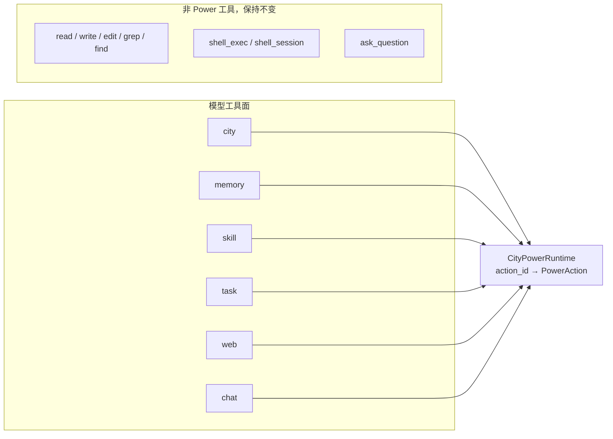
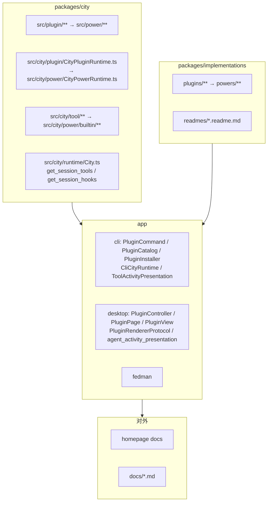

# Power 运行时重构 PRD

> 状态：待评审
>
> 范围：`packages/city`、`packages/implementations/plugins`、`app/cli`、`app/desktop`、`app/fedman`、`homepage`
>
> 目标：把 Plugin 收敛为 Power，取消 `plugin_call` / `plugin_read` 通用入口，让每个 Power 直接成为一个模型工具
>
> 更新时间：2026-09-16

## 1. 背景

当前 Agent 侧存在三套并行的能力入口：

| 入口 | 载荷 | 分派依据 |
| --- | --- | --- |
| `city` | `{ method, action, args }` | `CityMethod` 子类 → `CityAction` 子类 |
| `plugin_call` | `{ plugin, action, payload }` | `PluginRegistry` → `PluginDefinition.actions` |
| `plugin_read` | `{ plugin?, action? }` | 同上的只读视图 |

三者的分派契约实际同构：命名空间 + 动作 + 参数，省略字段返回索引，动作自描述。差异集中在实现细节：`city` 用手写 `CityToolArgSpec[]` 校验，Plugin 用 Zod；`city` 返回自定义信封，Plugin 返回 `PluginActionResult` 并支持 `messages`。

仓库已经承认这种同构：`CityTool` 产出的 system block 标记为 `source: "plugin"`，`City.get_session_hooks()` 把 Plugin hook 与 city method 说明合并为同一个 `SessionHooks`。

同时，Plugin 能力已经出现单边迁移的痕迹：`image`、`sound` 已迁入 city method，而 `packages/implementations/plugins/src/image`、`sound` 只剩空的 `config` 目录且未被 git 跟踪。迁移在发生，但没有终态约定。

`plugin_call` / `plugin_read` 带来两个具体成本：

1. 每次调用多一次发现往返。模型必须先用 `plugin_read` 拿到 action id 与 schema，才能 `plugin_call`。
2. 能力边界被藏在字符串里。`plugin` 与 `action` 都是自由字符串，装配错误只会在运行时以「unknown plugin」暴露。

## 2. 目标与非目标

### 2.1 目标

1. 用单一概念 `Power` 取代 Plugin 与 CityMethod 两套并行抽象，消除重复的声明、校验与信封实现。
2. 取消 `plugin_call` 与 `plugin_read`，每个 Power 直接注册为一个独立模型工具，工具名即 Power 名。
3. 动作寻址统一为点号 id，去掉模型侧的 `method` 层。
4. 动作声明统一为 Zod schema，校验与模型描述只有一份来源。
5. `access: "read" | "write"` 从模型侧提示升级为真实审批 gate。
6. 动作统一返回 `ActionResult`，使 Power 可以通过 `messages` 参与当前回复与下一 Step。

### 2.2 非目标

- 不改变 Power 的所有权模型：一个 City 中每个 Power ID 仍只有一个实例，一套 initialize/dispose 生命周期。
- 不引入 per-agent 的 Power 启停。按设计决定，Power 普遍启用，工具数量不被视为约束。
- 不改变 Workspace Tool、Shell Tool、`ask_question` 等非 Power 工具的现状。
- 不改变 HTTP / RPC transport 的对外协议形态。
- 不改变 Desktop 宿主动作（Mainview / Config）的能力集合，只做命名迁移。

## 3. 核心概念

> Power 回答「一个 Agent 在一次调用检查点上可以使用哪一类具名能力，以及每个能力动作的代价是多少」。

一个 Power 同时承担三种角色，但这三种角色有明确分离的声明面：

| 角色 | 声明面 | 可见者 |
| --- | --- | --- |
| 模型可调用的能力 | `actions` | 模型 |
| 宿主界面能力 | `host_actions` / `config_actions` | Desktop / CLI |
| 运行时扩展 | `system` / `hooks` / `resolves` / `http` | Session 与 transport |

三者不混用。`actions` 之外的内容不会进入模型工具清单。

## 4. 契约设计

### 4.1 PowerDefinition

```ts
/** 一个 Power 的静态定义；City 中每个 name 只存在一个实例。 */
export interface PowerDefinition {
  /** Power 稳定 ID，同时是模型工具名；必须匹配 ^[a-z][a-z0-9_]*$。 */
  readonly name: string;

  /** Power 用户可见标题，用于 Console 与宿主界面。 */
  readonly title: string;

  /** Power 用途说明；首行进入模型侧工具描述。 */
  readonly description: string;

  /** 模型可调用的动作集合；键为点号动作 id。 */
  readonly actions?: PowerActions;

  /** 只供宿主界面调用的动作集合；不进入模型工具清单。 */
  readonly host_actions?: PowerHostActions;

  /** 只供宿主配置界面调用的动作集合；不进入模型工具清单。 */
  readonly config_actions?: PowerConfigActions;

  /** 构建注入 session system 的说明文本。 */
  readonly system?: (
    context: PowerContext,
    execution_context?: PowerExecutionContext,
  ) => string | Promise<string>;

  /** 生命周期钩子；键为 hook 点名。 */
  readonly hooks?: PowerHooks;

  /** 具名解析点集合。 */
  readonly resolves?: PowerResolves;

  /** 检查当前动态上下文的可用性；返回不可用时拒绝该 Power 的全部动作。 */
  readonly availability?: (
    context: PowerContext,
  ) => PowerAvailability | Promise<PowerAvailability>;

  /** Power 加入 City 时初始化自身长期资源；每个 City 只执行一次。 */
  readonly initialize?: (context: PowerLifecycleContext) => void | Promise<void>;

  /** Power 离开 City 且已有调用收口后释放自身长期资源。 */
  readonly dispose?: (context: PowerLifecycleContext) => void | Promise<void>;

  /** 向 City HTTP transport 声明路由。 */
  readonly http?: PowerHttpDefinition;
}
```

与当前 `PluginDefinition` 的差异：`actions` 的键从裸名改为点号 id；新增 `access` 承载能力性质；新增 `returns`；`invoke` 退出模型面（见 4.5）。

### 4.2 PowerAction

```ts
/** 单个 Power 动作。 */
export interface PowerAction {
  /** 动作用途说明；进入模型侧动作索引。 */
  readonly description: string;

  /** 输入 schema；Zod 用于运行期校验，JSON Schema 用于模型侧描述。 */
  readonly input_schema?: PowerActionInputSchema;

  /** 返回结构说明；进入模型侧动作索引，让模型在调用前知道拿到什么。 */
  readonly returns: string;

  /** 读写性质；驱动审批 gate，同时进入模型侧动作索引。 */
  readonly access: "read" | "write";

  /** 调用示例；进入模型侧动作索引。 */
  readonly examples?: PowerActionExample[];

  /** 协作式超时上限，毫秒。 */
  readonly timeout_ms?: number;

  /** 执行动作；返回统一 ActionResult。 */
  readonly execute: (input: {
    /** 当前调用的一次性受限上下文。 */
    readonly context: PowerContext;
    /** 单次执行身份。 */
    readonly execution: PowerActionExecutionContext;
    /** 已校验的动作输入。 */
    readonly input: PowerJsonValue;
  }) => ActionResult<PowerJsonValue> | Promise<ActionResult<PowerJsonValue>>;

  /** 可选 CLI 适配；不进入模型面。 */
  readonly command?: PowerActionCommand;

  /** 可选 HTTP 适配；不进入模型面。 */
  readonly api?: PowerActionApi;
}

/** 动作集合；键为点号动作 id。 */
export type PowerActions = Record<string, PowerAction>;
```

三点说明。

`returns` 与 `access` 来自 `CityAction`。此前只有 city 动作声明它们，`plugin_call` 通过 `plugin_read` 间接暴露同类信息。统一后两者都进模型侧动作索引。

`execute` 统一返回 `ActionResult`。Agent 侧已经支持这条通道：`Executor` 用 `is_action_result()` 判断输出，把 `messages[].role === "agent"` 的内容追加进当前 canonical 回复，`role === "user"` 的内容作为下一 Step 输入，`effects` 交给 Turn 收集。city 动作此前只返回惰性 JSON，改造后 `image.create` 生成完直接把图片挂到回复上成为自然用法。

字段名用 `access` 而不是 `effect`。仓库中 `effect` 已被 `RuntimeToolEffect`、`ActionResult.effects`、`PluginEffectHook` 三处占用，再用它表达读写性质会让同一个词指两件事。

### 4.3 动作寻址

动作 id 为点号路径，只使用 `[a-z0-9_.]`。仓库已有此约定：宿主动作注册的就是 `skills.list`、`skills.read`、`skills.install`。

| 现状 | 之后 |
| --- | --- |
| `city({ method: "env", action: "get" })` | `city({ action: "env.get" })` |
| `plugin_call({ plugin: "memory", action: "search" })` | `memory({ action: "search" })` |
| `plugin_call({ plugin: "task", action: "create" })` | `task({ action: "create" })` |
| `plugin_call({ plugin: "web", action: "browser_act" })` | `web({ action: "browser_act" })` |

不带点的动作 id 直接作为顶层 id 使用。`city` 保留点号前缀是因为它内部确实存在 7 类能力，共 15 个动作。

`CityMethod` 抽象随之删除。文件目录可按前缀分组以便阅读，但运行期只存在 `action_id → PowerAction` 一张表。

### 4.4 PowerContext

```ts
/** 一次调用的动态上下文；City 按 Agent / Workspace / Power 即时投影，不缓存。 */
export interface PowerContext {
  /** 当前 City 的受限句柄。 */
  readonly city: PowerCityHandle;

  /** 当前 Agent 的受限句柄。 */
  readonly agent: PowerAgentHandle;

  /** 当前 Workspace 的受限句柄。 */
  readonly workspace: PowerWorkspaceHandle;

  /** 当前调用所属 Session；非 Session 调用时为空。 */
  readonly session?: PowerSessionHandle;

  /** 当前调用所属 Turn；非 Turn 调用时为空。 */
  readonly turn?: PowerTurnHandle;

  /** 当前 Power 在当前 Agent 范围内的私有存储。 */
  readonly storage: PowerStorage;

  /** City 为当前 Agent / Power 作用域解析出的只读业务配置。 */
  readonly config: PowerJsonObject;

  /** 当前执行范围的结构化日志器。 */
  readonly logger: PowerLogger;

  /** 当前 Power 的通知发布端口。 */
  readonly notifications?: PowerNotificationPublisher;

  /** 当前调用取消信号；非 Turn 调用由 City 创建。 */
  readonly abort_signal: AbortSignal;
}
```

这份上下文对所有 Power 完全一致，不设变体。它只暴露受限句柄，不暴露 City 内部索引。

### 4.5 权限注入

重新命名后需要回答：`city` Power 的动作依赖 `list_agents()`、`list_workspaces()`、`embassy` 这类 City 内部事实源，而外部 Power 不应拿到。是否需要为它引入特权的上下文变体或 `CityPower` 基类？

不需要。权限不进入上下文契约，而是以构造期注入落在组合根上：City 在内部构造 `city` Power 时把所需端口作为构造参数传入，这与今天 `new CityTool({ access, files_for, embassy })` 完全一致。

```ts
// packages/city/src/city/power/builtin/CityPower.ts
export class CityPower implements PowerDefinition {
  constructor(
    /** City 内部只读事实源；仅由 City 在本包内注入。 */
    private readonly options: {
      readonly access: Pick<CityRuntimeAccess, "list_agents" | "list_workspaces">;
      readonly embassy?: Embassy;
    },
  ) {}

  readonly name = "city";
  readonly actions = create_city_actions(this.options);
  // ...
}
```

由此得到三个结果：`PowerDefinition` 只有一个；`PowerContext` 只有一个；注册路径只有一条。外部 Power 看到的 `context.city` 仍是受限的 `PowerCityHandle`，City 的内部索引不被开放。

私有文件同样不需要特例。`context.storage.files` 本身就是按当前 Power 隔离的文件端口，所有 Power 一视同仁。

### 4.6 程序化调用

`CityMethod.invoke()` 是「能力归 City、触发归 Power」的通道，例如 chat 入站语音自动转写调用 `sound.asr`。统一后这条通道由 `context.city.powers.run_action()` 承担，`invoke()` 从契约中删除。

规则因此收敛为一条：**`actions` 里的动作同时可被模型调用和程序化调用；不需要被模型调用的能力必须放进 `host_actions` / `config_actions`。**

### 4.7 可用性

`availability` 的语义在重命名后保持并扩张：返回 `available: false` 时，该 Power 的全部动作被拒绝，原因进入工具结果。

```
{
  "success": false,
  "error": "power_unavailable",
  "message": "Power \"web\" is not available: no browser provider is configured.",
  "reasons": ["no browser provider is configured"]
}
```

## 5. 工具面

### 5.1 工具形态

每个 Power 注册为一个工具，输入 schema 一致：

```json
{
  "type": "object",
  "additionalProperties": false,
  "properties": {
    "action": {
      "type": "string",
      "description": "Action id inside this power, for example env.get. Omit to list the actions of this power."
    },
    "args": {
      "type": "object",
      "additionalProperties": true,
      "default": {},
      "description": "JSON arguments passed to the action."
    }
  }
}
```

省略 `action` 返回该 Power 的动作索引，包含每个动作的 id、摘要、参数、返回值与 `access`。



### 5.2 工具清单

| 工具名 | 动作数 | 动作 id |
| --- | --- | --- |
| `city` | 15 | `env.get`、`sandbox.get`、`sandbox.list_mounts`、`sandbox.explain_path`、`workspaces.list`、`workspaces.get`、`agent.list`、`agent.get`、`usage.get`、`image.models`、`image.create`、`image.result`、`sound.models`、`sound.asr`、`sound.tts` |
| `chat` | 5 | `context`、`list`、`history`、`send`、`react` |
| `memory` | 7 | `status`、`search`、`read`、`remember`、`digest`、`revise`、`forget` |
| `skill` | 4 | `find`、`install`、`list`、`lookup` |
| `task` | 11 | `list`、`history`、`run_detail`、`create`、`run`、`delete`、`update`、`status`、`enable`、`disable`、`reload` |
| `web` | 9 | `search`、`open`、`browser_create_session`、`browser_observe`、`browser_act`、`browser_semantic_act`、`browser_extract`、`browser_semantic_extract`、`browser_close_session` |

`plugin_call` 与 `plugin_read` 从工具面移除。

### 5.3 工具名不变量

Power 名进入扁平工具命名空间，需要两条校验。

Power 名必须匹配 `^[a-z][a-z0-9_]*$`。

Power 名不得与既有非 Power 工具冲突。保留名为 `read`、`write`、`edit`、`grep`、`find`、`shell_exec`、`shell_session`、`ask_question`。注册期即校验，失败直接抛出，不做静默覆盖。今天的 `merge_session_tools()` 只检测 Plugin 与 city 之间的冲突，检测范围需要扩展到全部会话工具。

### 5.4 描述预算

工具描述从按需拉取改为常驻。单个 Power 的描述为一行标题加每个动作一行摘要，全量约 55 行，相比今天 city 的约 15 行加两个通用工具，净增约 40 行。

参数 schema 不进常驻描述，只在省略 `action` 的索引响应中返回。这是控制预算的关键：动作越多，增量越平缓。

## 6. 审批 gate

`RuntimeTool` 已经支持 `needs_approval`，因此 gate 不需要新的运行时机制。

### 6.1 实施修正：`access` 不再直接触发审批

原设计把 `access: "write"` 直接映射为 `needs_approval`。实装时发现这会引入一个阻塞性缺陷：

`SessionInteractions.request()` 创建的等待 Promise 没有超时，只能由 `respond()` 兑现；而每个 Session（包括 power 自己创建的）都持有 interaction 端口。task power 的 `TaskRunnerRound` 以 `await turn.finished` 驱动 task-run Session，且无人监看该 Session 的待审批项。因此**任何一个被 gate 的动作出现在无人值守的 task run 里，都会让该次执行永久挂起**。

受影响的动作不是边缘角落：

- `task.*`：task run 管理自身任务定义是正常操作。
- `memory.*`：记忆捕获本来就是对话/任务过程中的自动行为。
- `chat.send` / `chat.react`：task 文档明确要求「需要通知外部渠道时，由 task Agent 直接调用 chat power」，这是被设计依赖的流程。

所以实施改为两个独立字段：

| 字段 | 含义 | 是否影响运行时 |
| --- | --- | --- |
| `access: "read" \| "write"` | 动作性质，准确描述代价 | 否，仅供模型侧索引 |
| `approval?: boolean` | 是否在执行前请求审批 | 是，驱动 `needs_approval` |

`approval` 默认关闭，当前只在四个消耗额度的 city 动作上开启：`image.create`、`image.result`、`sound.asr`、`sound.tts`。这与最初评审时确认的范围（「image/sound 这类消耗额度的动作」）一致，没有扩大。

剩余问题：即使只有这四个动作，task run 中调用 `image.create` 仍会挂起。这是预期行为：审批结果属于 Session 的职责（见 16），不应靠缩窄 gate 集合回避。

### 6.2 当前判定规则

```ts
needs_approval: (input) => resolve_action(input.action)?.approval === true
```


审批呈现由宿主决定。CLI 与 Desktop 已有的审批 UI 通道复用，不新增协议。

## 7. 宿主面

`host_actions` 与 `config_actions` 保持今天 `PluginSelf.action()` / `config_action()` 的语义，只做重命名。它们通过 `City.powers.invoke()` / `invoke_config()` 调用，不进入模型工具清单。

需要同步修正的一处不一致：skill Power 的宿主动作前缀今天是 `skills.`（`skills.list`、`skills.read`、`skills.install`、`skills.remove`），而 Power 名是 `skill`。统一为 `skill.`。

`ActionSchedule` 的持久化动作引用从 `{ plugin, action }` 改为 `{ power, action }`，并沿用点号动作 id。已有 `schedule.jsonl` 需要一次性迁移。

## 8. 命名迁移

### 8.1 类型与入口

| 现状 | 之后 |
| --- | --- |
| `@downcity/city/plugin` | `@downcity/city/power` |
| `@downcity/city/plugin/react` | `@downcity/city/power/react` |
| `Plugin`（基类） | `Power` |
| `PluginDefinition` | `PowerDefinition` |
| `PluginAction` | `PowerAction` |
| `PluginContext` | `PowerContext` |
| `PluginRegistry` | `PowerRegistry` |
| `CityPluginRuntime` | `CityPowerRuntime` |
| `CityPlugins` / `CityPluginInput` | `CityPowers` / `CityPowerInput` |
| `PluginLifecycleContext` | `PowerLifecycleContext` |
| `PluginActionResult` | 直接使用 `ActionResult` |
| `CityTools.methods` | `PowerCityHandle.powers` |
| `@downcity/plugins` | `@downcity/powers` |

### 8.2 函数

`create_action` 保留名字（Power 语境下仍准确）。`create_plugin_tools`、`create_plugin_call_tool`、`create_plugin_read_tool` 删除，替换为 `create_power_tools(power)`。`invoke_plugin_call_tool`、`invoke_plugin_read_tool` 删除，替换为 `invoke_power_action`。

### 8.3 删除项

`packages/city/src/city/tool/` 整个目录删除，由 `packages/city/src/city/power/builtin/` 取代，其中 `CityMethod.ts`、`CityAction.ts`、`CityTool.ts`、`CityToolResult.ts` 的职责分别并入 `PowerDefinition`、`PowerAction`、`CityPower`、`ActionResult`。

`packages/city/src/plugin/tool/PluginTools.ts`、`PluginToolRuntime.ts`、`PluginToolSchemas.ts`、`packages/city/src/plugin/types/PluginTool.ts` 删除。

`packages/city/src/city/types/CityTool.ts`、`CityToolMethods.ts` 中仍有效的契约类型迁入 `packages/city/src/city/power/types/`，`CityToolArgSpec` 与 `CityToolCapability` 删除。

### 8.4 文档

`docs/agent-plugin-runtime-redesign-prd.md`、`docs/plugin-call-payload-schema-prd.md`、`docs/cli-plugin-management-redesign-prd.md`、`docs/plugin-sdk-cli-unified-loading-redesign.md` 需要更新或标记为被本 PRD 取代。

`homepage` 侧的 `content/agent-sdk-docs/*/local-agent/tools-and-plugins.mdx`、`constructor-options.mdx`、`content/city-sdk-docs/en/packages/city/index.mdx` 需要按新 API 重写。按仓库约定，`homepage` 的 `docs` 属于必须同步的部分。

## 9. 落点清单



`app/cli` 需要处理的点包括：`city plugin action` 子命令改名为 `city power action`；`CliAgentContext.plugins` 类型改名；`ToolActivityPresentation` 中 `plugin_read` / `plugin_call` 的展示分支删除，改为按工具名归类的通用分支；`OverviewRoutes` 与 `http/plugins/plugins.ts` 的响应字段改名。

`app/desktop` 需要处理的点包括：`agent_activity_presentation.ts` 中 `normalized.startsWith("plugin_")` 的判断删除；Plugin 页面、渲染协议、控制器按新命名迁移。

`packages/implementations/plugins` 改名为 `packages/implementations/powers`，同步更新 `pnpm-workspace.yaml`、根 `package.json` 的 `build:plugins`、`dev:plugins`、`plugins:patch:build` 与 `scripts/build-packages.sh`、`scripts/help.mjs`、`scripts/package-graph.test.mjs`。

## 10. 迁移步骤

按一次改动落地，但按下列顺序推进，每步保持可编译可验证。

1. **建立 Power 契约。** 在 `packages/city/src/power/` 定义 `PowerDefinition`、`PowerAction`、`PowerContext`、`ActionResult` 复用与点号动作 id 校验。此步只新增，不动旧路径。
2. **实现 CityPowerRuntime。** 把 `CityPluginRuntime` 与 `PluginRegistry` 的分派逻辑合并为单一 registry，删除 `plugin_call` / `plugin_read` 工具构造，改为 `create_power_tools(power)`。
3. **实现内置 city power。** 把 7 个 method 的 15 个动作改写为点号 id 的 `PowerAction`，用 Zod 替换 `CityToolArgSpec`，构造期注入 `CityRuntimeAccess` 与 `embassy`。接入 `ActionResult` 与 `needs_approval`。
4. **切换 City 组合根。** `City` 改为持有 `CityPowerRuntime`，`get_session_tools()` 返回每 Power 一个工具并按保留名校验冲突，`get_session_hooks()` 合并 Power hook 与 Power system。
5. **迁移内建 Power。** `chat`、`memory`、`skill`、`task`、`web` 改为实现 `PowerDefinition`；`skill` 宿主动作前缀由 `skills.` 改为 `skill.`；动作补齐 `returns` 与 `access`。
6. **迁移宿主。** CLI、Desktop、fedman 按新命名调整，删除 `plugin_call` / `plugin_read` 相关分支。
7. **删除旧路径。** 移除 `src/plugin/`、`src/city/tool/` 与 `@downcity/city/plugin` 子路径导出。
8. **更新对外文档。** `homepage` docs 与 `docs/` 下的 Plugin 设计文档。
9. **验证。** 见第 11 节。

## 11. 验证

功能验证覆盖以下路径。

1. `city` 工具省略 `action` 返回 15 个动作索引，且索引含 `returns` 与 `access`。
2. `memory` 工具的 `search` 动作可直接调用，无需前置发现往返。
3. 每个内建 Power 至少一次成功调用，结果经 `ActionResult` 落在 canonical Tool Part 上。
4. `image.create` 产出的图片通过 `messages` 进入当前回复。
5. `access: "write"` 动作触发 `needs_approval`；`access: "read"` 动作不触发。
6. Power 名冲突与保留名冲突在注册期抛出。
7. `availability` 返回不可用时，该 Power 动作被拒绝且原因可读。
8. 宿主动作 `skill.list` 等仍可经 `City.powers.invoke()` 调用，且不出现在模型工具清单中。
9. `ActionSchedule` 在 `{ power, action }` 引用下正常触发。
10. HTTP / RPC transport 的 listen、close 与既有会话协议无回归。

`pnpm typecheck`、`pnpm -C packages/city test`、`pnpm -C packages/agent test`、`pnpm release:test` 需要全部通过。

## 12. 风险

**工具描述常驻带来的固定成本。** 51 个动作的索引会进入每次会话的工具描述。已按设计决定接受，若后续实测显示描述过长，退路是把低使用率 Power 的动作摘要压缩为仅 id 列表。

**一次性改名的审查噪声。** 改动覆盖约 6 个 package 与 3 个 app，重命名会与逻辑改动混在同一 diff 中。缓解方式是把第 7 步（删除旧路径）与第 8 步（文档）留在最后单独成 commit，使前 6 步 diff 中的语义变化可辨认。

**审批 gate 的默认行为变化。** 接入 `needs_approval` 后，此前静默执行的 `memory.remember`、`task.create` 等动作会新增一次审批交互。这是本次改动的预期行为，但会改变现有自动化任务（`task` 的定时执行）的交互路径，需要在第 5 步单独确认定时触发场景下审批如何呈现。

**`schedule.jsonl` 迁移。** `ActionSchedule` 引用格式变化需要一次性迁移逻辑，且要处理迁移前已存在的条目。

## 13. 已决事项

| 编号 | 决定 |
| --- | --- |
| 1 | 动作寻址使用点号 id，删除模型侧 `method` 层 |
| 2 | 不区分 Power 类型；权限通过组合根构造期注入，`PowerContext` 保持单一形态 |
| 3 | 不做 per-agent Power 启停；接受工具数量增长 |
| 4 | 改名与行为统一一次到位 |
| 5 | `access: "write"` 接入真实审批 |

## 14. 待确认

1. `access` 字段名是否采纳。备选是保留 `capability`。不采用 `effect` 是因为该词已被 `ActionResult.effects` 与 `PluginEffectHook` 占用。
2. `@downcity/plugins` 包名是否随 Power 改名。包名变更涉及 npm 发布与下游引用。
3. `city` Power 的 15 个动作是否需要在模型侧工具描述中全量列出，或只列能力类（`env`、`sandbox`、`image`、`sound` 等）并在索引响应中展开。

## 16. 审批的归属：power 声明，Session 决定

审批怎么发生属于 interaction / Session 的职责，不属于 power，也不属于内核。本设计的边界：

- **power 只声明。** 动作通过 `approval` 标记自己是否需要一次决策。
- **Session 决定结果。** 是否需要提示用户、是否直接允许、是否交由模型判定，都是 Session 的权限模式的事。
- **内核保持不变。** `needs_approval` + `SessionInteractions` 的现有机制不做修改；不加超时，无人值守时挂起就是挂起。

### 16.1 后续：Session 权限模式

后续给 Session 增加权限模式，在现有的 `ask`、`allow` 之外补一个 `auto`：

| 模式 | 审批行为 |
| --- | --- |
| `ask` | 请求用户确认（当前默认） |
| `allow` | 直接放行，不提示 |
| `auto` | 由模型判定是否放行 |

这意味着被 gate 的动作集合与审批结果彻底解耦：power 标记全部需要决策的动作，Session 模式决定这些决策怎么被回答。定时任务这类无人值守场景应当运行在 `allow` 或 `auto` 下，而不是靠缩小 gate 集合来回避。

目前 `approval` 只在四个消耗额度的 city 动作上开启。模式落地后，是否把其余 `access: "write"` 动作一并纳入 gate，就只是一个独立开关的事。

## 17. 实施记录（阶段）

### 17.1 阶段 A（命名迁移）已完成

改名与行为统一按一次改动落地，但内部按两个可验证阶段推进。阶段 A 只做命名迁移，行为保持不变；阶段 B 才改变行为。

阶段 A 已完成并验证：`packages/type`、`packages/agent`、`packages/city`、`packages/implementations/powers`、`app/cli`、`app/desktop`（node + web 两份 tsconfig）、`app/fedman` 全部 `tsc --noEmit` 零错误；`release:test` 20/20 通过。

迁移采用 `git mv` 加标识符替换，不保留兼容别名。`@downcity/plugins` 包与目录已改名为 `@downcity/powers`，构建 key 从 `plugins` 改为 `powers`。

### 17.2 阶段 A 中发现的范围外事项

以下三项不在原 PRD 的文件清单内，但由改名本身强制带出，已一并处理。

**`packages/agent` 与 `packages/type` 属于改名范围。** `SessionSystemBlockSource` 的取值 `"plugin"` 需要改为 `"power"`，而 `packages/agent/src/session/SessionSystem.ts` 有两处按该字面量分支，`packages/type` 的 `SessionHookContextBlock.source_plugin` 是同一条链路上的字段。因此 agent 与 type 的 session 层标识符一并迁移（`plugin_system_blocks` → `power_system_blocks`、`source_plugin` → `source_power` 等）。agent 与 type 的 `bin` 已重建。

**核心 system prompt 硬编码了旧工具。** `packages/agent/src/executor/composer/system/default/assets/core.prompt.ts.txt` 的 `# Plugin System` 一节直接指示模型使用 `plugin_read` / `plugin_call`。该文件是 prompt 源码，由 `packages/agent/scripts/agent-compiler.mjs` 生成同路径的 `core.prompt.ts`。阶段 A 做了机械改名，阶段 B 必须重写这一节以描述 per-power 工具模型，否则模型会被指示调用不存在的工具。

**`app/desktop` 存在同名但无关的 `plugin`。** `src/renderer/components/markdown/markdown_plugins.ts` 及其消费者（`Markdown.tsx`、`markdown_math.test.ts`、`markdown_mermaid.test.ts`）是 remark/rehype 插件；`electron.vite.config.ts` 与 `app/fedman/vite.config.ts` 是 vite 插件。这些已在迁移中显式排除，未改动。后续任何批量改名都必须保持这份排除清单。

### 17.3 用户数据目录（已决定并实现）

改名使 `get_local_powers_path()` 返回 `powers`，而历史上是 `plugins`。三个选项：

1. 保留磁盘目录名为 `plugins`，只改代码内部命名。无数据迁移，但函数名与路径语义不一致。
2. 磁盘目录改为 `powers`，并在 `packages/city/scripts/migrate-power-config-v2.mjs` 中增加从 `plugins` 目录迁移的逻辑。
3. 磁盘目录改为 `powers`，不做迁移。

**已选选项 2 并实现。** `packages/city/scripts/migrate-power-config-v2.mjs` 现在会先把 `plugins/` 改名为 `powers/`，再执行原有的配置升级；两个目录同时存在时明确失败，因为无法判断哪一份才是当前事实源。验证覆盖了三种情况：仅 `plugins/` 存在、两目录并存、以及 `powers/` 下的 v1 profiles 升级为 v2 config。

### 17.4 阶段 A 剩余

- `packages/city/test/`、`packages/implementations/powers/scripts/`、`packages/agent/scripts/` 下的 `.mjs` 测试仍在引用旧命名，其中 `plugin-tools.test.mjs`、`multi-agent-plugin-isolation.test.mjs` 直接测试 `plugin_call` / `plugin_read`，属阶段 B 的重写对象。
- `pnpm-lock.yaml` 仍含旧包名，需要一次 `pnpm install` 刷新。
- `homepage/` 的 `content/powers-docs/` 与 `content/agent-sdk-docs/` 中的 `@downcity/powers` 引用属阶段 B 的文档更新。

### 17.5 阶段 B 进度（部分完成）

已完成并通过验证：

1. **per-power 工具面。** `power_call` / `power_read` 两个通用工具已删除，改为每个 power 一个工具。工具名即 power 名，输入为 `{ action, args }`，省略 `action` 返回该 power 的动作索引。`PowerRegistry.tools()` 改为按活跃定义生成工具，无动作的 power 不产生空壳工具。
2. **反序列回落差。** `PowerToolSchemas.ts` 从两个 schema 收敛为单一 `power_tool_input_schema`；`PowerToolRuntime.ts` 重写为 `invoke_power_tool()`；`PowerTool.ts` 类型重写。
3. **`access` 与 `returns`。** `PowerAction` 新增可选 `returns` 与 `access`；`PowerActionReadView` 同步；工具通过 `needs_approval` 在动作声明 `access: "write"` 时请求审批。未声明等同 `read`，因此本次迁移不改变既有审批行为。
4. **prompt 重写。** agent 核心 prompt 的 Power System 一节已改写为 per-power 工具模型，并由 `agent-compiler.mjs` 重生成了 `core.prompt.ts`（再无 `power_call` / `power_read` 字样）。内建 power 的 `skill` / `chat` / `task` prompt 中 11 处 `power_call(...)` 示例已改为 `<power>({ action, args })`。

验证：`packages/type`、`packages/agent`、`packages/city`、`packages/implementations/powers`、`app/cli`、`app/fedman` 均 `tsc --noEmit` 零错误。per-power 工具面用脚本单独验证：工具名正确、无动作 power 不暴露、`access: "write"` 动作返回 `needs_approval: true`、描述列动作 id 与摘要。

未完成：

- **内建 power 动作未标注 `access` / `returns`。** 契约已支持，但除 city power 外的 36 个动作尚未逐个声明，因此审批 gate 目前对这些动作空转。city power 的四个写动作（`image.create`、`image.result`、`sound.asr`、`sound.tts`）已声明。
- **宿主展示分支未清理。** `app/cli/.../ToolActivityPresentation.ts` 与 `app/desktop/.../agent_activity_presentation.ts` 仍按 `power_call` / `power_` 前缀归类，需改为按工具名归类。
- **测试未迁移。** `packages/city/test/power-tools.test.mjs`、`multi-agent-power-isolation.test.mjs` 等仍调用已删除的工具。
- **`pnpm-lock.yaml` 未刷新。**
- **数据目录迁移未实现**（见 15.3）。

### 17.6 city power 化完成

city 已改为普通 `PowerDefinition`，与其它 power 走同一条注册与工具生成路径。工具面不再有两套形态。

完成项：

1. **契约层。** 删除 `CityTool` / `CityMethod` / `CityToolResult` / `CityToolContext` / `CityToolArgSpec`，代之以 `CityPower`＋`CityAction`＋`CityActionGroup`＋`CityPowerContext`。`city/types/CityTool.ts` 重写为 `CityPowerContext.ts`，`CityToolMethods.ts` 改名 `CityPowerData.ts`。
2. **动作 id。** 15 个动作全部改为点号 id：`env.get`、`sandbox.get`、`sandbox.list_mounts`、`sandbox.explain_path`、`workspaces.list`、`workspaces.get`、`agent.list`、`agent.get`、`usage.get`、`image.models`、`image.create`、`image.result`、`sound.models`、`sound.asr`、`sound.tts`。
3. **Zod 统一。** 手写的 `CityToolArgSpec` 与 `require_string` / `optional_enum` / `assert_known_args` 全部退场；9 个带参动作改用 Zod schema，作为参数说明与运行期校验的唯一来源。未声明 schema 的动作仍严格拒绝任何入参（不再静默忽略）。
4. **特权上下文。** `CityRuntimeAccess` 与 `embassy` 由 City 在构造 `create_city_power()` 时注入，不进入通用 `PowerContext`；`PowerContext.city.methods` 整个删除。
5. **`invoke` 退场。** `CityMethod.invoke()` 与 `sound.transcribe` 删除；chat 入站转写改为 `context.city.powers.run_action({ power: "sound", action: "asr" })`，验证了「动作同时可被模型与程序化调用」这条规则。
6. **组合根简化。** `City.get_session_tools()` 不再合并两套工具，`get_session_hooks()` 不再拼接 city 专属 system block：city power 与其他 power 一样经 `PowerRegistry` 进入 tools 与 system，`merge_session_tools` 与 `SessionHooks` 的手工拼装随之删除。
7. **私有文件分区。** 由 `agents/<id>/methods/<m>/` 改为 `agents/<id>/powers/<group>/`，不再与旧的 method 概念挂钩。

验证：`packages/type`、`packages/agent`、`packages/city`、`packages/implementations/powers`、`app/cli`、`app/fedman`、`app/desktop`（node + web）全部 `tsc --noEmit` 零错误。另以一个临时脚本对构建产物做了行为验证（已删除）：7 个组、15 个动作 id 全部为合法点号形式、`returns` 无缺失、9 个动作可转出 JSON Schema、四个写动作归为 `write`、未知参数被拒绝、无 shell 时 `sandbox.get` 返回 `available: false`、`usage.get` 返回 `not available` 且拒绝非法枚举值。

新增待确认项：

- `CITY_POWER_NAME` 与保留工具名的关系。power 名进入扁平工具命名空间，若外部注册名为 `city` 的 power，会在注册期冲突。当前行为是注册期报错，尚未补专门的保留名清单校验（见 5.3）。

### 17.7 内建 power 动作标注完成

51 个动作（city 15 + 内建 36）已全部声明 `returns` 与 `access`，不再有不带元数据的动作。

| Power | 动作数 | write 动作 |
| --- | --- | --- |
| city | 15 | image.create, image.result, sound.asr, sound.tts |
| chat | 5 | send, react |
| memory | 7 | remember, digest, revise, forget |
| skill | 4 | （无） |
| task | 11 | create, run, delete, update, status, enable, disable, reload |
| web | 9 | browser_create_session, browser_act, browser_semantic_act, browser_close_session |

`approval` 只在四个 city 动作上开启（见 6.1）。`access` 是准确的性质描述，不参与审批判定。

验证：七个包 + 两个 app 全部 `tsc --noEmit` 零错误；另以临时脚本确认 15 个 city 动作 `returns` 与 `access` 无缺失、`approval` 仅命中四个预期动作（已删除）。

### 17.8 测试迁移与宿主展示收口

1. **测试文件改名。** `packages/city/test`、`packages/agent/scripts`、`packages/implementations/powers/scripts` 下的 `.mjs` 文件名与内容完成命名迁移。
2. **重写引用已删 API 的测试。** `city-tool.test.mjs` → `city-power.test.mjs`（重写为点号动作 id 与 `{ action, args }` 形态）；`power-tools.test.mjs` 重写为 per-power 工具面；`image-method.test.mjs`、`sound-method.test.mjs` 改为调用 city power 的 `image.*` / `sound.*` 动作；`multi-agent-power-isolation.test.mjs` 改为直接调用 `skill` 工具；`city-power-runtime.test.mjs` 的 snapshot 断言改为按 power 名筛选，以容纳自动注册的 `city` power。
3. **宿主展示分支。** CLI 与 Desktop 不再按 `power_call` / `power_` 前缀归类，改按契约识别：输入带字符串 `action` 字段的工具就是 power 工具。这样第三方 power 也能自动获得正确展示，不需要枚举名字。

测试结果：`packages/city` 277 项中 264 通过、1 失败、12 跳过；`app/desktop` 的 `agent_activity_presentation` 19/19；`release:test` 20/20。

### 17.9 两个已知项

**未解决：`session-config-turn-boundary.test.mjs` 的第 7 项。** “running session approval mode changes stay queued until the next Session step” 失败：运行中的 Turn 尚未结束时，`effective_approval_mode` 已从 `ask` 变为 `always-allow`，而测试要求它排队到下一个 Step。该行为属于 agent 的 Session 配置与 approval-mode 边界，本次重构未修改该路径（`packages/agent/src` 相对 HEAD 仅为改名）。按“内核保持现状”的决定未做改动，留给 Session 权限模式那一阶段一并处理。

**契约简化：工具结果不再携带机器可读错误码。** 旧 `city` 工具有 `error.code`（`invalid_args` / `not_found` / `unsupported_action`）；统一到 `PowerActionResult` 后只剩 `success` / `error` / `message` / `data`，失败原因以文本表达。模型侧不受影响，但宿主若需要结构化错误码需后续补回。

## 18. Shell 转为 Power

`shell_exec` 与 `shell_session({ action })` 是 power 重构后唯一残留的旧形态：两个工具，
其中一个内部带动作开关。本阶段把 shell 收敛为一个 `shell` power。

### 18.1 动作集

| 动作 | 性质 | 对应旧形态 |
| --- | --- | --- |
| `exec` | write | `shell_exec` |
| `session_start` | write | `shell_session({action:"start"})` |
| `session_send` | write | `shell_session({action:"send"})` |
| `session_read` | read | `shell_session({action:"read"})` |
| `session_list` | read | `shell_session({action:"list"})` |
| `session_stop` | write | `shell_session({action:"stop"})` |

动作 id 是 power 内部命名空间，不带 power 名前缀，与 city 的 `env.get` 同一规则：
模型调 `shell({ action: "session_start", args: { cmd } })`。省略 `action` 返回动作索引。

### 18.2 所有权

Shell 仍属于 Workspace（`Shell.tools` 与 per-Workspace 输出游标不动），但不再并进
`WorkspaceTools`；模型面只经 City 注册的 `shell` power 暴露一次，避免同一能力两处出现。

**行为变更：** shell 现在要求存在 City。此前 `workspace.tools` 自带 shell 工具，
无 City 的裸 Agent 也有 shell；现在没有 City 就没有 `shell` 工具。仓库内的 CLI 与 Desktop
始终建 City，因此实际路径不变，但这是 `@downcity/agent` 独立使用时的能力缩减。

### 18.3 审批未改语义，但需要新增一条透传

host 目标仍走 Shell 自己的审批网关（`ShellApprovalGateway`），未与 power 的
`needs_approval` 合流——那条合并留给 `ask` / `allow` / `auto` 权限模式。

但 power 动作原本拿不到工具层的执行上下文，而审批网关正在其中。为此新增一条最小透传：

- `PowerExecutionContext.tool_context?: unknown`：Executor 注入的宿主工具上下文。
- 链路：Executor 注入 → `create_power_tool` 透传 → `invoke_power_tool` 合入快照 →
  `create_action_execution_context` 原样保留（此处曾漏掉，导致审批静默降级为拒绝）。
- 非工具入口（CLI、定时任务、程序化调用）为空。

### 18.4 验证

`session-shell-approval` 测试（host 审批保留 Turn 并等待用户决定）通过，证明审批链路在
power 路径下完整；该测试原本没建 City，本次补上以匹配新的所有权。city 277 项 264 通过，
唯一失败仍为既有的 `session-config-turn-boundary`。

七个包 + 两个 app 全部 `tsc --noEmit` 零错误；`release:test` 20/20。

**未做：** `ask_question` 保持原样。它属于 `packages/agent`，是 interaction 机制的产出端，
与审批同源；改成 City power 会让内核反向依赖上层，且它不使用 power 的任何特性。

## 19. 审批合并为一条服务

### 19.1 合并前的两条线

| | 工具审批 | Shell host 审批 |
| --- | --- | --- |
| 触发 | power 动作声明 `approval` | 动作内判 `target === host` |
| 创建 Interaction | CoreEngineRunner 内联 | `SessionShellApprovalAdapter` |
| 读 `approval_mode` | 否 | 是 |
| `always-allow` 效果 | 无效 | 自动放行 |
| 身份标记 | `source.type: "tool"` | `source.type: "shell"` |

两条线各自的抽象不同，且模式只挂在 Shell 一侧；用户把 Session 设为 `always-allow` 后
`image.create` 这类动作仍会每次询问，与「已允许全部」的承诺不一致。

### 19.2 合并后

`SessionShellApprovalAdapter` → `SessionApprovalRuntime`，成为 Session 内唯一的审批入口：

- `request()`：Shell host 审批（形状不变）。
- `request_tool()`：通用工具审批，供内核门使用。
- 两者共用 `decide()`：**模式只在这里生效**，创建 Interaction 也只在这里。
- Session 向 turn context 同时注入 `shell_approval_gateway` 与 `approval`，两者是**同一个实例**，
  因此模式只有一处事实源。

内核门（`resolve_tool_approval`）改为调用 `turn_context.approval.request_tool()`，
并看 `requires_user_decision`：`always-allow` 时运行时直接放行且不创建 Interaction。

**已决：模式统一覆盖**（用户选择）。`always-allow` 现在也会跳过 power 写动作审批；
这是行为变更，但它修的正是原先的不一致。

### 19.3 保留了两个触发点

合并的是**服务与模式**，不是触发点。Shell 仍自己判 host 并发起审批，理由：

1. `session_send` 是否需要审批取决于目标会话的**运行时** target，不在工具入参里，
   无法用 `needs_approval` 谓词判定。
2. 去掉 Shell 内部的审批会让**程序化入口**绕过审批。今天 `run_action({power: "shell", action: "exec",
   payload: { target: "host" }})` 因无审批网关而 fail closed（拒绝）；若改由工具层单点拦截，
   这类调用将直接执行 host，属安全回退。

实现过程中曾按「Shell 不再自判、声明 `approval` 谓词」写了一半，发现上述第 2 点后回退。
同时为审批主题引入的 `approval_subject` 契约字段也一并撤销——它不再有使用方，
按「避免不必要代码」原则不保留。

### 19.4 兼容保持

- Shell 审批 payload 字段不变（`operation` / `command` / `cwd` / `reason`），
  因为该路径未改；`session-shell-approval` 测试通过背书。
- 工具审批仍不带 `title` / `description`，`session-tool-approval` 测试原样通过。
- 未加超时，挂起行为保持现状。

### 19.5 验证

`packages/city` 277 项 264 通过（唯一失败仍为既有的 `session-config-turn-boundary`）；
`session-shell-approval` 1/1；`session-tool-approval` 2/2。另以临时脚本验证合并语义（已删除）：
ask 模式下工具审批进入队列并可由用户批准；`always-allow` 下工具审批与 shell 审批均直接放行
且不创建 Interaction；工具 payload 仍为 `operation` + `validated_input` 且无 `title`。

七个包 + 两个 app 全部 `tsc --noEmit` 零错误；`release:test` 20/20；desktop 活动展示 19/19。

**未做（属于后续 `ask` / `allow` / `auto`）：** 把模式决策点提升到可插 `auto`（模型判定）的位置；
以及修掉 `session-config-turn-boundary` 那个 Turn 边界排队缺陷。
