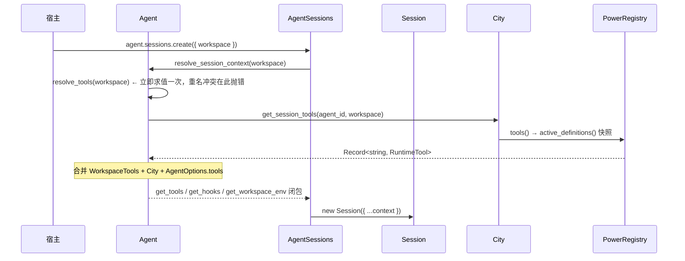
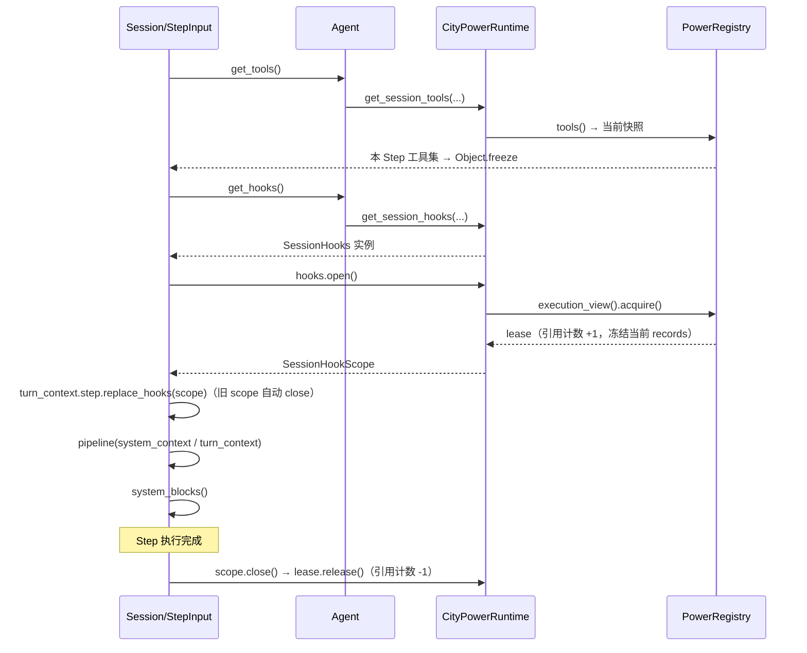
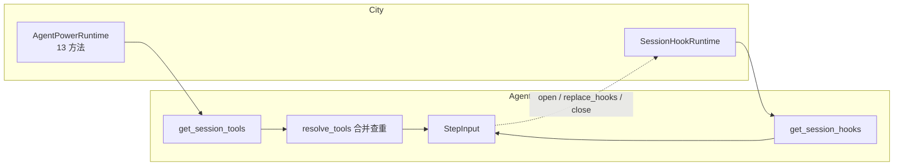

# Power 与 Session 投影现状

> 状态：现状记录
>
> 目的：在重新设计 Power → Session 投影边界之前，固定当前实现的真实行为。
> 本文只描述「现在是什么」，不提出方案。

## 1. 参与对象

| 对象 | 定义位置 | 职责 |
| --- | --- | --- |
| `PowerDefinition` | `packages/city/src/power/types/PowerRuntime.ts` | 插件本体：`actions` / `hooks` / `resolves` / `system` / `availability` / `initialize` / `dispose` / `http` |
| `PowerRegistry` | `packages/city/src/power/core/PowerRegistry.ts` | 唯一注册表：持有已就绪实例的执行投影，提供调用面与引用计数 |
| `CityPowerRuntime` | `packages/city/src/city/power/CityPowerRuntime.ts` | 生命周期与调用面编排：实例唯一性、initialize/dispose、Context 工厂、屏障 |
| `City` | `packages/city/src/city/runtime/City.ts` | 容器门面：暴露 `powers` / `agents` / `workspaces` / transport |
| `CityRuntime` | `packages/type/src/types/city/CityRuntime.ts` | Agent 能看到的 City 最小投影（6 个成员） |
| `Agent` | `packages/agent/src/agent/Agent.ts` | 主体：身份、模型、指令、自定义工具、Session |
| `AgentSessions` | `packages/agent/src/agent/AgentSessions.ts` | Session 工厂：把上下文闭包注入 Session 构造 |
| `Session` | `packages/agent/src/session/Session.ts` | 一次持续交互：持有 store、hooks getter、tools getter |
| `StepInput` | `packages/agent/src/session/input/StepInput.ts` | 每个 Step 组装模型输入 |
| `SessionTurnContext` | `packages/agent/src/session/loop/SessionTurnContext.ts` | 单 Turn 共享上下文：hook 作用域、env 快照、effects |
| `SessionHooks` / `SessionHookScope` | `packages/agent/src/session/input/SessionHooks.ts` | Hook 运行时与单 Step 作用域 |

## 2. 装配：Agent 与 City 如何连接

Agent 不认识 `City` 类，只依赖 `@downcity/type` 中的 `CityRuntime`。

```ts
// packages/type/src/types/city/CityRuntime.ts
interface CityRuntime {
  readonly storage: StorageProvider;
  readonly workspaces: { get(workspace_id: string): WorkspaceRuntime | null };
  ensure_ready(): Promise<void>;
  get_session_tools(agent_id: string, workspace: WorkspaceRuntime): Record<string, RuntimeTool>;
  get_session_hooks(agent_id: string, workspace: WorkspaceRuntime): SessionHookRuntime;
  release_agent(agent: { readonly id: string }): Promise<void>;
}
```

连接发生在 `city.agents.add(agent)` → `Agent.attach(city)`：

1. 存 `city` 引用。
2. 把 `storage_provider` 从 `AgentMemoryStorageProvider` 换成 `city.storage`。
3. 约束：一旦用内存存储创建过 Session，`attach` 抛错；`attach` 必须在任何 Session 创建之前。

解除方向相反：`Agent.dispose()` 调 `city.release_agent(this)`，City 执行 `detach` + 删除索引 + `http_transport.detach_agent`。

## 3. 一次 Session 的投影时序



之后每个模型 Step：



## 4. 工具通道：`get_session_tools`

**形状**：`Record<string, RuntimeTool>`，一个 Power 一个工具，工具名即 power 名。

**生成**：`PowerRegistry.tools()` → `create_power_tools({ definitions, powers })`。

- `definitions` 来自 `active_definitions()`：当前 `records` 中未 retired 的定义，按 name 排序。
- 没有任何 action 的 power 不产生工具。
- 所有 power 工具共用同一份输入 schema `{ action, args }`（`power_tool_input_schema`）。
- action 列表不进 schema；模型省略 `action` 时运行时返回动作索引。

**合并**：`Agent.resolve_tools(workspace)` 依次注册三个来源，重名立即抛错：

1. `workspace.tools`（Workspace 静态工具）
2. `city.get_session_tools(...)`（Power 工具）
3. `this.custom_tools`（`AgentOptions.tools`）

**求值时机**：`get_tools` 是闭包，每个 Step 调用一次。`StepInput` 把它 `Object.freeze({ ...get_tools() })` 成快照。

**执行**：`StepInput.bind_turn_context_to_tools` 为每个工具包一层 wrapper，注入 `SessionToolExecutionContext`（含 `session_turn_context`）。Power 工具用 `require_turn_context(options)` 取回该上下文。工具返回的 `ActionResult.effects` 与 `messages` 由 wrapper 分流：`agent` 消息进当前回复，`user` 消息进下一步输入。

**无租约**：工具没有引用计数，Step 结束后不做任何释放。Power 在运行中被移除时，正在执行的工具调用不会被等待。

## 5. 内容通道：`get_session_hooks`

**形状**：`SessionHookRuntime`，含 `system_blocks` / `pipeline` / `effect` / `open`。

**Agent 定义的检查点**（`SESSION_HOOK_POINTS`）：

| 点 | 调用位置 | 语义 |
| --- | --- | --- |
| `session.system_context` | `SessionSystem.resolve_session_power_system_blocks` | 变换 system blocks 列表 |
| `session.turn_context` | `StepInput.gather` | 变换 Turn 上下文块（低权限参考内容） |
| `session.turn_committed` | `SessionTurnCompletion` | 纯副作用 |

**system 内容的两条来源**，Agent 侧按固定顺序合并：

1. `hooks.system_blocks(context)` → 归一化为 `AgentSessionSystemBlock[]`，来源标记 `power`。
2. 把上面的结果作为 `value.blocks` 传给 `hooks.pipeline('session.system_context', value)`，取返回的 blocks。

对应的 Power 侧有两个入口：

- `PowerDefinition.system(context, execution_context)` → 字符串，由 `system_blocks_from_records` 收集。收集前会先调 `availability()`，不可用则跳过。单个 power 抛错被吞掉，不阻断其他 power。
- `PowerDefinition.hooks.pipeline['session.system_context']` → 变换 blocks 列表。

两者职责重叠，且 `availability` 只在第一条路径生效。MemoryPower 同时使用：静态说明走 `system()`，动态召回走 `pipeline`。

**求值时机**：

- `system_blocks` / `pipeline(system_context)`：只在首次组装时生效。`StepInput.apply_frozen_system` 把首次结果写入 `frozen_blocks`，之后每个 Step 直接套用快照；只有 `refresh_system = true`（`syncshot`）才重新采集。
- `pipeline(turn_context)`：每个 Step 求值一次，结果通过 `turn_context.step.resolve_power_context_blocks` 缓存到 Turn 级，同一 Turn 内复用。

**租约**：`hooks.open()` 由 City 实现为 `registry.execution_view().acquire()`，给当前全部未 retired 的 records 引用计数 +1。`close()` 时 -1 并 `try_finalize_retired_record`。这是 Power 能被安全 dispose 的前提。

**作用域生命周期**：`StepInput.refresh_step_runtime` 在每次 `gather` 前调 `open()`，交给 `turn_context.step.replace_hooks(scope)`；`replace_hooks` 会 close 上一个 scope。Turn 结束时 `SessionTurnContext.dispose` → `release_extensions` 再 close 一次。

**关键后果**：`open()` 内部先 `await this.lifecycle_stability`，而该屏障聚合了全部 Power 的生命周期操作。任一 Power 的 `initialize` 不返回，所有 Session 的 Step 都无法打开 hook 作用域。

## 6. 调用面：四份同形实现

同一个调用面被声明四次、实现四遍：

| 接口 | 位置 | 方法数 | 实现 |
| --- | --- | --- | --- |
| `AgentPowerRuntime` | `power/types/PowerExecutionRuntime.ts` | 13 | `PowerRegistry.contextual()` |
| 同上（加屏障） | — | 13 | `CityPowerRuntime.ready_contextual()` |
| `AgentPowerExecutionView` | 同上 | 8 | `PowerRegistry.execution_view()` |
| `AgentPowerExecutionRuntime` | 同上 | 8 + `acquire()` | 同上 |
| `AgentPowerExecutionLease` | 同上 | 8 + `release()` | `PowerRegistry.acquire_execution_view()` |

真正实现只有一份：`PowerRegistry` 的 `read_from_records` / `availability_from_records` / `run_action_from_records` / `system_blocks_from_records` / `pipeline_from_records` / `guard_from_records` / `effect_from_records` / `resolve_from_records`。外层都是转发。

`ready_contextual` 存在的唯一理由是给 13 个方法各插一句 `await this.lifecycle_stability`。

`AgentPowerExecutionLease extends AgentPowerExecutionView`：租约继承了整个调用面，于是 `release` 成为第 9 个方法。

## 7. 生命周期与失败语义

**激活**（`CityPowerRuntime.add_power`）：

1. 建 record，`state = "initializing"`，放入 `powers_by_id`。
2. `await power.initialize?.(lifecycle_context)`。
3. 成功后 `registry.register(power)`，`state = "ready"`。
4. 失败：从 `powers_by_id` 删除、`unregister_and_wait`、`dispose_power`，写入 `failed_power_snapshots`（`status: "error"`），并抛出。
5. 同一 power_id 的生命周期操作经 `enqueue_power_lifecycle` 串行。

**屏障**：`lifecycle_stability` 聚合全部 blocks_execution 的生命周期操作；`ensure_ready()` 等它；`run_action` / `system_blocks` / `pipeline` / `effect` / `guard` / `resolve` / `open` 全部先等它。

**卸载**：`registry.unregister_and_wait` 先退休 record，再等 `retirement_promise`（最后一个 lease 释放时完成），然后 `dispose_power`。

**发现与加载**（`LocalPowerLoader`）：

- `list_registrations()` 用 `Promise.all` 聚合内置注册与全部已安装 power 的 `load_installed_registration`。
- 单条加载会做：读 `power.json` → `verify_local_installed_power_integrity` → 解析入口路径并校验在 power 目录内 → `import` → 校验 `power.name === definition.id`。
- 任一条抛错会让整个 `list_registrations()` reject。

**宿主调用点**：

| 宿主 | 位置 | 方式 |
| --- | --- | --- |
| Desktop | `app/desktop/src/main/agent/AgentController.ts` | `new City({ embassy, storage, power_host })`，之后 `list_registrations()` + `initialize_desktop_powers()` 逐个 `powers.add` |
| CLI daemon | `app/cli/src/city/agent/CliCityRuntime.ts` | `new City({ ..., powers: await list_registrations() })` |
| CLI 单机 | `app/cli/src/city/agent/AgentChatRemote.ts` | 同上 |

`initialize_desktop_powers` 用 `Promise.allSettled` 并发 `powers.add`，逐条记录失败后继续。Desktop 的 `ready_promise` 覆盖它，`index.ts` 在 `await ready()` 之后才 `create_window()`；启动链抛错则 `app.quit()`。

## 8. 调用面与职责边界



Agent 拿到通用 Power 调用面后，自行把它翻译成 Agent 词汇（工具表 + hook 运行时）。翻译规则（哪些 power、什么顺序、租约如何计算）只在 City 侧。

## 9. 现状中的已知不一致

| 项 | 说明 |
| --- | --- |
| 工具无租约、hook 有租约 | 同一次 Step 内的可见集合，冻结语义不同 |
| system 注入两条路径 | `system()` 与 `pipeline[system_context]` 职责重叠，`availability` 只在前者生效 |
| `execution_context` 穿透 | City 的执行快照作为参数出现在 Agent 的 Step 模型里 |
| `open()` 等全局屏障 | 任一 Power 初始化挂起会阻塞全部 Step 的 hook |
| `ensure_ready()` 命名 | 语义是「Power 生命周期稳定」，但被 Agent 在创建 Session 前调用 |
| `list_registrations()` 不隔离 | 单条加载失败导致整批失败 |
| 四个同形接口 | 同一调用面四份实现 |
| `transport.mdx` 与实现不符 | 文档称 `close()` 只关 transport，实际会 dispose Agent 与 Group |
