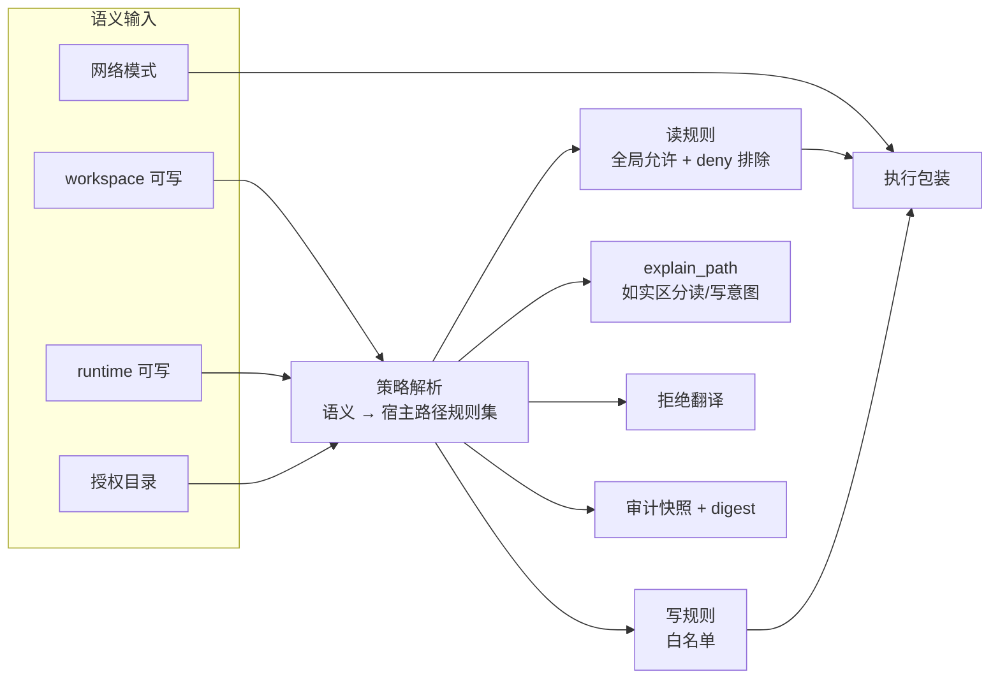

# 沙箱原生隔离重设计

> 状态：P0、P1、P2 已完成；P0 的实测结论改变了原设计中的读隔离模型。
> 验证环境：macOS 27.0.0（build 26A5416b）arm64，`/usr/bin/sandbox-exec` 在位。
> 验证脚本：`packages/implementations/sandboxes/native/scripts/native-canary.mjs`（真实围栏），
> 契约测试 `packages/implementations/sandboxes/native/scripts/native-provider.test.mjs`。

## 1. 为什么重设计

当前默认执行后端是 microsandbox microVM，每个 Workspace 一个 `node:22-bookworm` 微虚拟机，宿主项目以 `rw` 挂到 guest `/workspace`。实测暴露的可用性问题：

- DNS 不可用。guest 内 `registry.npmjs.org` 无法解析，只有裸 IP 可通，`pnpm install` / `git fetch` / `npx` 全部失效。
- 原生依赖平台错配。宿主是 macOS arm64，`node_modules` 里是 darwin 二进制，guest 是 Linux aarch64，构建直接失败。
- 工具链缺失。镜像内没有 `rg`、`jq`、`fd`，也没有宿主 Homebrew 工具链。
- 凭证不可用。guest 内没有 `~/.ssh`、`~/.gitconfig`、`~/.npmrc`，`git push` 没有通路。
- 启动成本高。需要 `npx microsandbox setup`、拉取 OCI 镜像，并为每个 Workspace 常驻 2 vCPU / 2 GiB。
- 环境与真实机器分叉。Agent 在沙箱内验证通过，用户本机可能跑不起来。

根因是这条路线让执行环境偏离了开发者真实机器。原生隔离改的是执行后端，不是环境：命令、工具链、`node_modules`、凭证、网络全部沿用真实机器，围栏只约束进程能写哪些宿主路径。

## 2. P0 验证结论

13 项验证全部通过。逐项结论与对设计的影响：

| 验证项 | 结论 | 对设计的影响 |
| --- | --- | --- |
| Workspace 内写入 | 允许 | 写入白名单成立 |
| HOME 根目录写入 | 拒绝 | 越界写围栏确实生效 |
| 工具链读取 | 允许 | node / pnpm / rg / git / jq 全部可用 |
| 敏感目录读取 | 拒绝 | 靠 deny 排除实现 |
| DNS 解析 | 可用 | 保留宿主网络栈即恢复 |
| HTTPS 出网 | 可用 | 同上 |
| git 读取仓库 | 可用 | 需 `/dev` 可写 |
| git 全局配置 | 可用 | 读全开下自然可见 |
| 包管理器缓存写入 | 允许 | `pnpm install` 前提成立 |
| 系统临时目录写入 | 允许 | 需用真实路径 `/private/var/folders` |
| ssh-agent socket | 可达 | `git push` 通路成立 |
| PTY | 可用 | 需 `(allow file-write* (subpath "/dev"))` |
| 对照组 · 无围栏写 HOME | 允许 | 确认拒绝来自围栏而非文件权限 |

启动开销实测 5 次空命令共 91ms，约 18ms/次，与 microVM 的镜像拉取和启动不在一个量级。

## 3. 关键发现：读隔离模型必须改变

这是 P0 最重要的结论，原设计需要修正。

`(allow file-read* (subpath "..."))` 会让 `sandbox-exec` 直接 SIGABRT（退出码 134），且不输出任何错误。逐条二分结果：

```text
(allow file-read*)                        exit=0    正常
(allow file-read* (subpath "/usr"))       exit=134  SIGABRT
(allow file-read-data (subpath "/usr"))   exit=134  SIGABRT
(allow file-read-metadata (subpath ...))  exit=134  SIGABRT
(allow file-read* (literal "/etc/hosts")) exit=0    正常（但被全局读覆盖）
(deny file-read* (subpath "..."))         exit=0    正常
```

Apple 自带 profile 使用的正是 `(allow file-read* (subpath "/Library"))` 这类写法，说明语法无误，是该 macOS 版本上 `sandbox-exec` 的系统侧回归。

**修正后的模型**：读用「全局可读 + 敏感目录 deny 排除」，写用白名单。

```text
读： (allow file-read*)  +  (deny file-read* (subpath 敏感目录))
写： (allow file-write* (subpath 白名单))
```

这带来一个必须正视的边界变化：**macOS 上围栏无法按 Workspace 强制读隔离**。读范围是「除 deny 列表外全部可读」，而不是「仅 Workspace 可读」。因此：

- 损害围栏定位依然成立：误删、误改、乱装依赖被挡住。
- 读方向的机密性只由 deny 列表承担，不是由 Workspace 边界承担。
- 文件工具的词法边界（仅 Workspace）成为 OS 边界的**真子集**，两者不再等价。`explain_path` 必须如实回答「读允许（除敏感目录），写仅限白名单」，不能沿用原来的「越界即拒绝」措辞。

## 4. 其他实测约束

`/tmp` 是指向 `/private/tmp` 的符号链接，`os.tmpdir()` 返回 `/private/var/folders/...`。写入规则必须使用真实路径，否则白名单形同虚设。

`/dev` 必须整棵子树可写。仅放行 `/dev/null`、`/dev/tty`、`/dev/ptmx` 等字面量时 PTY 无法分配（`OSError: out of pty devices`），git 也会因无法打开 `/dev/null` 而失败。

敏感目录 deny 列表必须精确。整棵 deny `~/.config` 会让 `git` 每次读取 `~/.config/git/ignore` 时报 `Operation not permitted` 警告；收窄到 `~/.config/gh` 后警告消失，敏感目录仍全部拒绝。实测 deny 列表：

```text
~/.ssh  ~/.aws  ~/.kube  ~/.gnupg  ~/.docker
~/.config/gh  ~/.netrc（literal）  ~/Library/Keychains
```

`~/.npmrc` 保持可读。实测拒绝它不会破坏 `pnpm config get`，但会让私有源和 registry 镜像配置失效，属于可用性损失；`~/.npmrc` 含 registry token，是否纳入 deny 需要确认。

## 5. 对框架的修正

原设计中的「策略解析」层职责不变，仍然是唯一展开点，但展开产物需要区分两个方向：



平台差异因此比原设计更大：macOS 的读规则是 deny 列表，Linux 的 bubblewrap 可以用 `--ro-bind` 做真正的 allow 白名单。两个后端的读语义不再一致，这一点必须写进协议文档，不能让调用方假设「两个平台围栏等价」。

Linux 侧的验证尚未进行。P0 只覆盖 macOS，`bwrap` 在目标发行版上的可用性、user namespace 限制、以及 `--ro-bind` 白名单行为都需要单独一轮 canary。

## 6. 已定的最简配置

读隔离在 macOS 上只能做到 deny 列表，这是系统回归导致的硬约束，不是实现选择。最简配置按最小可用集确定：

写白名单只留四条：Workspace、runtime 私有目录、系统临时目录、`/dev`。读只 deny 两条：`~/.ssh` 与 `~/Library/Keychains`。网络允许。

`/dev` 与临时目录不能省：少了 `/dev`，PTY 无法分配、git 无法打开 `/dev/null`；少了临时目录，多数工具链会失败。包管理器缓存（`~/.npm`、`~/Library/Caches`）暂不加入白名单，等 `pnpm install` 真的失败再补。`~/.npmrc` 保持可读，它含 registry token，但拒绝它会让私有源配置失效。

最简配置的代价是读方向机密性只由两条 deny 承担，其余文件对围栏内进程可见。这是「损害围栏」定位下的取舍。

## 7. P1 已完成

协议已按本设计加宽，microVM 行为保持不变。改动范围：

- `packages/type`：`WorkspaceSandboxBinding` 携带 `granted_mounts`、`network`、`launcher`；`WorkspaceSandbox` 新增 `describe()` 与可选 `explain_denial()`；`WorkspaceSandboxSnapshot` 增加 `network` 与 `policy_digest`；新增 `SandboxLaunchRequest`、`SandboxProcessLauncher`、`SandboxDenialExplanation`、`SandboxAccessMode`、`SandboxNetworkMode`。
- `packages/city`：新增 `sandbox/SandboxLauncher.ts`，由 Shell 在构造时创建并随 `bind` 注入；`Shell.describe_sandbox()` 改为委托 `sandbox.describe()`；host 后端改走同一启动器，消掉一份重复 spawn 逻辑；`sandbox.get` 返回 `network` 与 `policy_digest`。
- `packages/implementations/sandboxes/microsandbox`：实现 `describe()`，行为与挂载不变。

`mounts` 的语义在实现中收紧为「语义授权」（Workspace 与显式授权目录），不枚举后端派生的系统与工具链规则。原因是 `mounts` 同时被文件工具的路径翻译消费，若回报全部生效规则，沙箱内绝对路径的翻译结果会随后端变化。完整生效策略由 `policy_digest` 承担，需要按路径回答时用 `explain_path`。

验证：`packages/type`、`packages/city`、`packages/implementations/sandboxes/microsandbox`、`packages/agent`、`app/cli`、`app/desktop` 全部 typecheck 通过；`packages/city` 全部 46 个测试文件通过，唯一失败的 `session-config-turn-boundary`（审批模式投影）在改动前即已失败，与本次无关。

## 8. P2 已完成

新建 `@downcity/sandbox-native`（`packages/implementations/sandboxes/native`），实现原生 OS 围栏。模块划分：

- `policy/PlatformPaths.ts`：平台默认路径的唯一分支点。最简配置写白名单为临时目录与 `/dev`，读排除为 `~/.ssh` 与 `~/Library/Keychains`（Linux 为 `~/.ssh` 与 `~/.gnupg`）。
- `policy/SandboxPolicy.ts`：语义输入展开成宿主路径规则，按路径合并与排序，产出稳定 `digest`。
- `policy/SeatbeltProfile.ts`：macOS profile 生成，全局可读加 deny 排除。
- `policy/BubblewrapArgv.ts`：Linux argv 生成，默认保留宿主网络。
- `policy/Wrapper.ts`：平台包装器选择与调用包装。
- `policy/DenialExplainer.ts`：把失败输出翻译成被拒路径加可写根列表。
- `NativeWorkspaceSandbox.ts`：实现 `spawn` / `describe` / `stop` / `reset` / `explain_denial`。
- `NativeSandboxProvider.ts`：`check()` 实跑 canary，`create_workspace()` 展开策略。

`NativeWorkspaceSandbox.workspace_path` 等于宿主路径，因此 City 侧现有的 `resolve_sandbox_cwd` 自然退化为恒等映射，业务代码无需改动。

验证（macOS 27.0.0 arm64）：

- 契约测试 16 项全部通过（策略展开、摘要稳定性、授权模式、出网开关、profile 结构、bwrap 前缀、包装器解析、describe 语义、拒绝翻译、无 launcher 时明确报错）。
- 真实围栏 canary 10 项全部通过：`Provider.check()` 自检、workspace 内写入、HOME 根目录写入拒绝、工具链、DNS、HTTPS、git、ssh-agent、临时目录写入、拒绝翻译定位。
- 仓库级校验：`package-graph` 与 `resolve-publish-matrix` 测试已更新并通过，新包进入第 1 发布层；根 `typecheck` 脚本已包含新包。

实现过程中发现并修正一个真实缺陷：拒绝翻译最初用「输出中所有绝对路径」做候选，会把 shell 自身路径（如 `/bin/sh`）误判为被拒目标。改为只解析 `<程序>: <路径>: <原因>` 结构并取最后一个绝对路径段。

## 9. 默认后端已切换（P4）

CLI 与 Desktop 的 Provider 装配已从 microsandbox 换成 native：

- `app/cli/src/city/sandbox/PlatformSandbox.ts` 返回 `NativeSandboxProvider`。
- `app/desktop/src/main/agent/DesktopPlatformSandbox.ts` 返回 `NativeSandboxProvider`。
- 两个应用的 `package.json` 依赖从 `@downcity/sandbox-microsandbox` 换成 `@downcity/sandbox-native`。
- 两个应用源码中已无 `MicrosandboxProvider` 引用；两个包 typecheck 均 0 错误。

`@downcity/sandbox-microsandbox` 仍保留在仓库与发布图中，可通过 `Shell({ sandbox_provider })` 显式注入。

## 10. Sandbox doctor 已落地（P3 收尾）

新增 `sandbox doctor`：用一组探针回答「围栏是否成立」与「宿主工具链是否够用」，并把失败翻译成可执行解释。

- `src/doctor/SandboxProbes.ts`：探针定义。`fence` 类探针成对出现（证明允许的能写、越界的写不了），`environment` 类探针提示 git / node / 包管理器 / 出网。
- `src/doctor/SandboxDoctor.ts`：逐条在围栏内执行探针并聚合报告，失败时回填拒绝翻译。
- `src/types/SandboxDoctor.ts`：报告数据结构，区分 `fence` 与 `environment` 两种严重级别。

两个设计细节值得记录。

拒绝类探针不看进程退出码，而是看命令内部回显的 `exit=<code>`。原因是子进程被围栏拒绝时整体仍可能以 0 退出，只看退出码会把「越界操作成功」误判为通过。

doctor 自己负责清理探针残留，不依赖探针命令自清理。围栏泄漏时那条清理命令本身就执行不了，会把文件留在用户 HOME——这个问题是在真实 canary 里发现的（HOME 下出现了 `.downcity-doctor-<pid>`），不是靠单元测试发现的。

验证（macOS 27.0.0 arm64）：

- 契约测试 9 项全部通过（探针成对、期望判定、退出码回显、报告聚合、解释回填、自检失败如实反映）。
- 真实围栏 9 条探针全部符合期望；`fence_ok=true`、`env_warnings=0`。
- 负向对照通过：把 HOME 当作可写根后，doctor 正确报 `fence_ok=false`，证明它不是恒真断言。
- 探针残留已清零。

## 11. 尚未接入的部分

Linux 侧的 `bwrap` 行为仍未实测。

`sandbox.request_mount` 审批流尚未实现：目前 `granted_mounts` 只能由宿主在 `bind` 时传入，Agent 无法在执行中申请新目录。

`packages/city` 的迁移尚未完成，city 仍编译不过（详见第 12 节），因此 doctor 尚未接到 CLI 命令层；当前通过 `run_sandbox_doctor()` 程序化调用。

切换默认后尚未在真实项目上跑过完整会话（含审批、PTY 交互、长驻进程）。

## 12. 验证链路的一个外部阻塞

本阶段遇到一个不属于沙箱工作的阻塞：`packages/type` 正在做一次工具协议重构，`RuntimeTool` 与 `RuntimeToolExecutionOptions` 被换成 `AgentTool` 与 `ToolCallContext`，执行签名从 `(input, options)` 变为 `(input, context)`，并新增 `ToolHookSet` 与 `BoundAgentTool` 适配层。`packages/agent` 已迁完，`packages/city` 迁移中。

后果是 `packages/city` 在迁移完成前编译不过，因而 `packages/city` 的测试无法运行，本阶段的端到端验证无法进行。原生包自己的 16 项契约测试不受影响，因为它不依赖 city。

另外，`packages/type` 的 `bin/` 曾残留旧编译产物，使得 city 的 typecheck 一度通过而源码实际已不兼容。重建 type 包后冲突才暴露。这一点值得记入：跨包验证必须基于重建产物，不能依赖残留 `bin/`。
