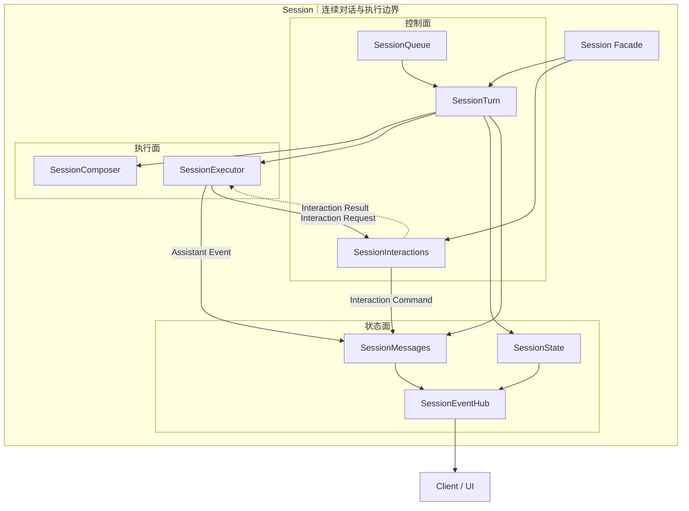
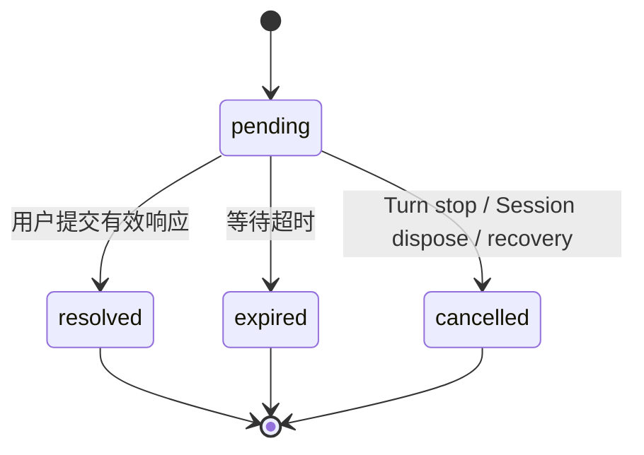

# Session 架构设计

> 状态：实施基线
>
> 设计依据：[Downcity 工程设计与代码演进规范](./engineering-design-standard.md)

## 1. 产品意图

Session 负责一段连续对话如何排队、执行、持久化、等待用户参与并在中断后恢复。

Session 内部使用三个逻辑面组织职责：

- 控制面决定什么时候开始、暂停、继续和结束。
- 执行面完成模型调用与工具执行。
- 状态面维护唯一事实并在提交成功后发布变化。

三个面只是职责分组，不创建 `ControlPlane`、`ExecutionPlane` 或 `StatePlane`
等无独立业务语义的公共对象。

## 2. 所有权



### 2.1 控制面

- `SessionTurn` 拥有 active Turn、检查点和停止语义。
- `SessionQueue` 保存尚未在检查点生效的 Prompt 与 Command。
- `SessionInteractions` 拥有 pending waiter、超时、取消和恢复执行。

### 2.2 执行面

- `SessionComposer` 根据只读 canonical snapshot 组装下一 Model Step。
- `SessionExecutor` 执行 Model/Tool Loop 和 Provider 错误恢复。
- AI SDK Adapter 是 Executor 的内部协议边界，不进入 Session 状态模型。

### 2.3 状态面

- `SessionState` 保存 Metadata、system snapshot 和生效配置。
- `SessionMessages` 是 Message、Part、Tool 与 Interaction 的唯一事实源。
- 一次连续 Assistant 回复只对应一个 Assistant Message；Tool Loop、Provider continuation 与恢复重试只追加 Part，不创建执行器内部 segment。
- 新 User steer 插入顶层消息序列后，才关闭之前的 Assistant Message，并为后续回复创建下一条 Message。
- `SessionEventHub` 只发布已经持久化成功的 Mutation。

## 3. 依赖规则

允许的协作方向：

```text
控制面 → 执行面：SessionExecutionPort
执行面 → 状态面：SessionAssistantOutput
执行面 → 控制面：SessionInteractionPort
```

禁止的依赖：

- `SessionMessages` 依赖 Executor 实现或 Executor Record。
- `SessionTurn` 解析 `UIMessageChunk` 或 AI SDK 最终消息。
- Executor 获取 `SessionMessages`、Writer 或 `SessionInteractions` 具体实例。
- canonical Session 类型引用 AI SDK 类型。
- Executor 返回另一份 Assistant Message 作为第二事实源。

## 4. 用户异步交互

一次 Interaction 表示当前 Turn 在执行过程中需要用户参与，并在收到响应后恢复原执行。

第一阶段只定义两种明确需求：

- `approval`：批准或拒绝一个高风险动作。
- `question`：回答文本、单选或多选问题。

Interaction 是 Assistant Message 内的 Part，不是新的 Turn 或顶层 Message。

```text
Assistant Message
├── Tool Part
├── Interaction Part
├── Tool Part 状态更新
└── Text Part
```

### 4.1 状态机



Interaction 到达终态后不能再次响应。

### 4.2 与 Tool 的原子状态转换

创建 Interaction 时，同一次 Assistant Message 提交必须完成：

```text
Tool: ready → waiting-user
Interaction: absent → pending
```

用户响应时，同一次提交必须完成：

```text
Approval approved: Interaction resolved + Tool running
Approval denied:   Interaction resolved + Tool failed
Question answered: Interaction resolved + Tool running
Expired/cancelled: Interaction terminal + Tool failed
```

状态提交成功并发布 Mutation 后，`SessionInteractions` 才能兑现等待 Promise。

## 5. 失败与恢复

- Interaction 创建写入失败：请求失败，不向用户发布 pending 状态。
- Response 写入失败：保持 pending，不恢复执行。
- Approval denied：正常业务响应，不是系统异常。
- Interaction expired：终态业务结果，关联 Tool 失败。
- Turn stop：取消当前 Turn 的全部 pending Interaction。
- 进程恢复：未完成 Assistant 收口为 stopped，pending Interaction 标记为 cancelled。
- Store 写入失败后禁止报告 Turn 或 Interaction 成功。

## 6. 公开 API

Session 统一通过 `respond()` 提交 Interaction 响应：

```ts
await session.respond({
  interaction_id,
  response,
});
```

`prompt()` 不会被隐式解释为 Interaction Response。远程 Session、HTTP、RPC 与 CLI
必须使用同一个 Interaction 协议，不保留 `resolve_approval()` 双轨入口。

## 7. 明确不做

- 不增加通用 Service Container。
- 不引入事件溯源。
- 不把 Interaction 做成任意 JSON Schema 框架。
- 不让状态面理解 AI SDK 空 Part 或临时 ID。
- 不保留 ApprovalBroker 与 SessionInteractions 两套生命周期。
- 不为了目录拆分创建只转发调用的 Manager 或 Repository。
