# Session Framework 完整说明

> 状态：当前实现基线
>
> 适用范围：`@downcity/agent` 本地 Session、RemoteSession、HTTP/RPC Session Transport
>
> 设计依据：[Downcity 工程设计与代码演进规范](./engineering-design-standard.md)

## 1. 结论

当前 Session 主框架已经成立，不需要再做一次整体重构。

它现在使用两条正交的概念轴：

- 执行轴：`Session → Turn → Step`
- 内容轴：`Session → Message → Part`

`Run` 不再作为 Session 层级概念存在。`SessionLoop` 表示调度循环，`Executor.execute()`
表示一次 Turn 的模型执行，`SessionTurnContext` 表示一个 Turn 存续期间共享的运行上下文。

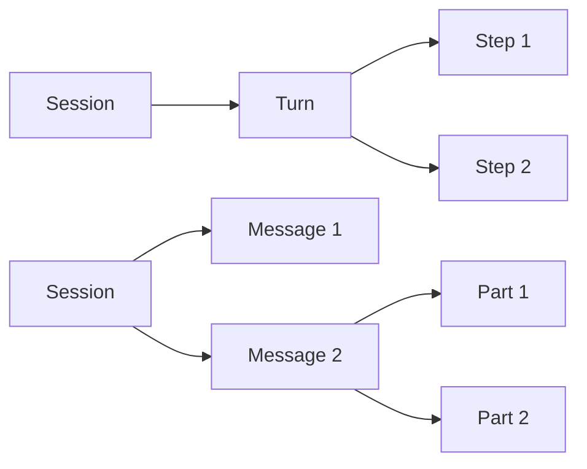

两条轴只在执行写入内容时相交：Turn 产生或更新 Message，Model Step 产生或更新
Assistant Message 内的 Part。Step 不是持久化内容层级，Part 也不是执行阶段。

## 2. 概念边界

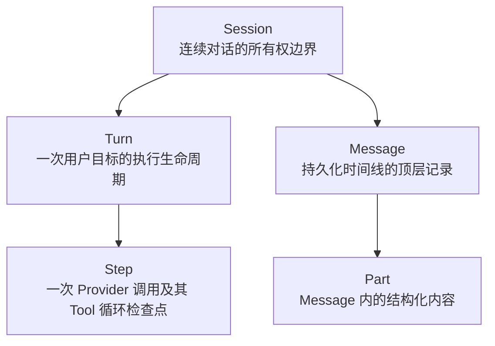

| 概念 | 回答的问题 | 生命周期 | 是否持久化 |
| --- | --- | --- | --- |
| Session | 一段连续对话由谁排队、执行、保存和恢复 | 跨多个 Turn | 是 |
| Turn | 当前用户目标什么时候开始、停止和结束 | 一次执行 | 生命周期 Mutation |
| Step | 下一次模型调用使用哪个快照，之后是否继续 | Turn 内部 | 不单独作为领域对象持久化 |
| Message | 对话时间线上发生了什么 | Session 长期历史 | 是 |
| Part | 一条 Message 具体包含什么 | 跟随 Message | 是 |

## 3. Session 的对象所有权

`Session` 是 Facade 和组合根。它拥有长期对象，但不亲自实现所有业务细节。

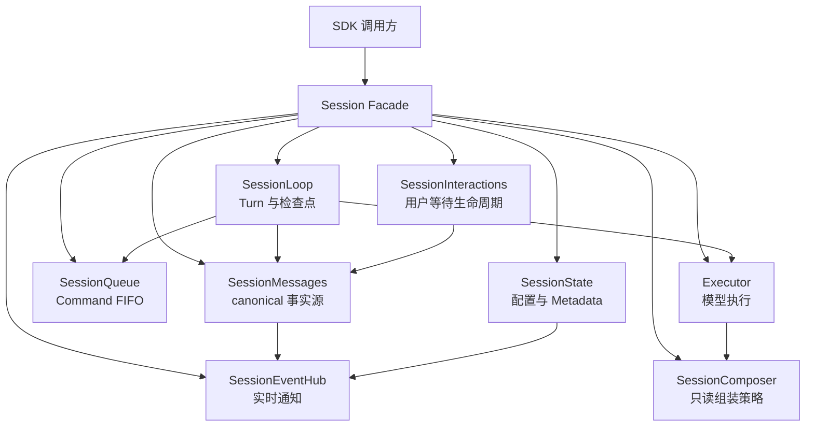

所有权规则：

- `Session` 拥有 Queue；`SessionLoop` 是 Queue 的唯一消费者。
- `SessionLoop` 拥有 active Turn 和 `SessionTurnContext` 生命周期。
- `SessionMessages` 是 Message、Part、Tool、Interaction 状态的唯一事实源。
- `SessionInteractions` 只拥有 pending waiter、timer 和完成 Promise。
- `Executor` 不拥有 Session、Queue、Message Store 或 Interaction 状态。
- `SessionComposer` 不拥有状态，只读取快照并返回模型输入或压缩计划。

## 4. 公开 API 与内部归属

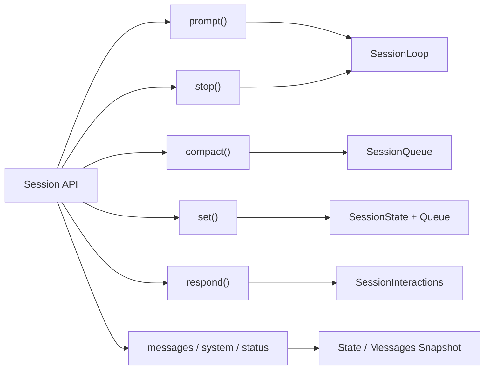

- `prompt()` 返回 Turn Handle。
- `compact()` 返回 Compact Handle。
- `stop()` 立即中断 active Turn，并取消仍在排队的 Prompt。
- `respond()` 立即提交 Interaction 响应，不等待 Step 检查点。
- 配置写入先更新 configured state，再通过 Command 切换 effective state。

## 5. Queue 与 Command

Queue 只保存一种对象：`SessionCommand`。它不维护不断扩张的 Prompt/Compact/Config
业务联合类型。

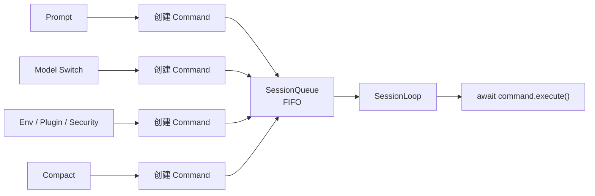

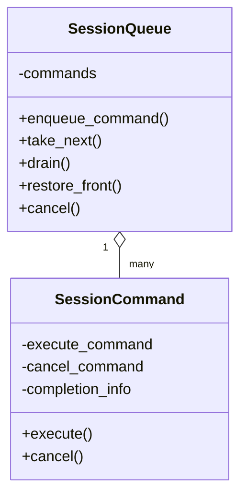

Command 的差异由创建时绑定的闭包表达：

- Prompt Command 可取消，并负责启动 Turn 或持久化 steer。
- 配置 Command 切换 effective snapshot，可附带 canonical Action completion。
- Compact Command 执行完整压缩，并兑现 Compact Handle。
- `stop()` 和 `respond()` 不是 Command，因为它们必须立即生效。

## 6. Prompt 与 Turn 生命周期

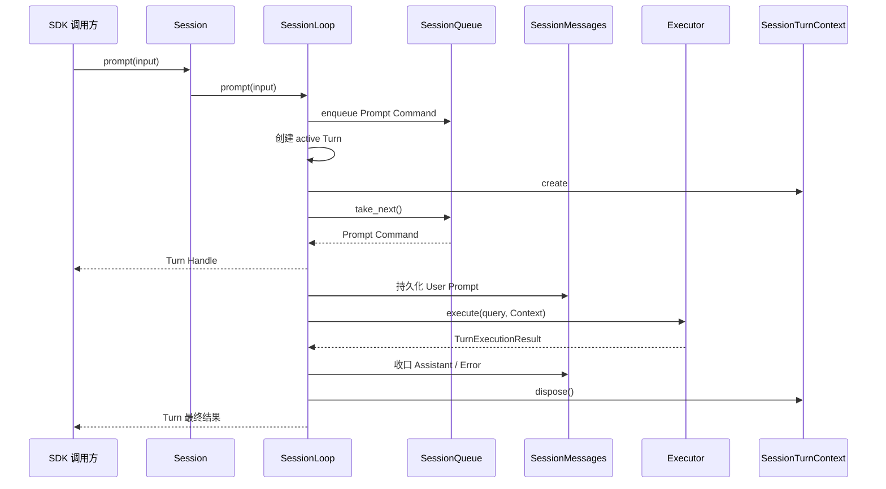

一个 Session 同时只有一个 active Turn。Turn Handle 表达两个时间点：

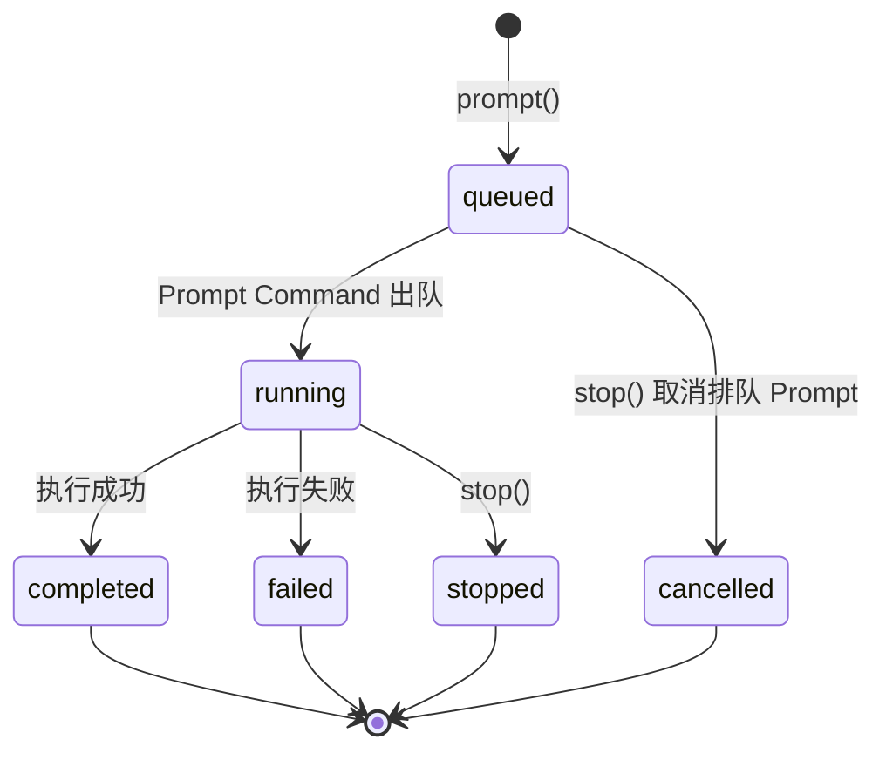

- `await session.prompt()`：排在它前面的 Command 已完成，Prompt Command 已出队并返回
  绑定当前 Turn 的 Handle。
- `await turn.finished`：Turn 的 Assistant、Error、Context 清理和最终 Mutation 已收口。

## 7. Turn 内的 Step 循环

Step 是 Provider 调用之间的检查点，不是另一个顶层调度器。

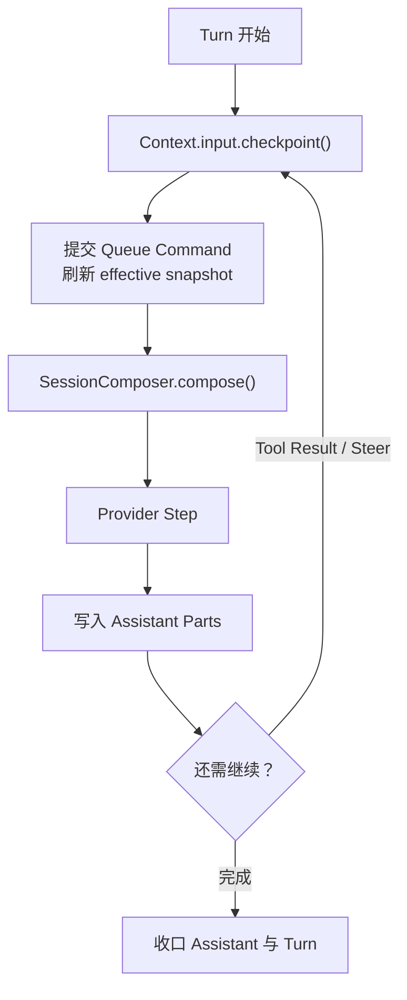

Step 边界负责：

- 消费排队的 steer、model、env、plugin、security 和 compact Command。
- 捕获本 Step 的 model、system、tools、env 和 Plugin lease。
- 必要时关闭当前 Assistant Message，再把新 User steer 放入顶层消息序列。
- Compact 后请求下一 Provider Step 重新读取 canonical history。

## 8. SessionTurnContext 上下文中台

`SessionTurnContext` 是一个 Turn 内部共享的上下文中台。它不是新的调度层，也不复制
Session 的长期事实；它把跨 Executor、Tool、Plugin、Shell 的运行期协作集中在一个根对象中。

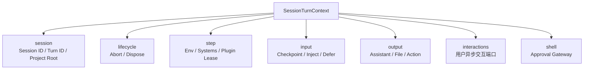

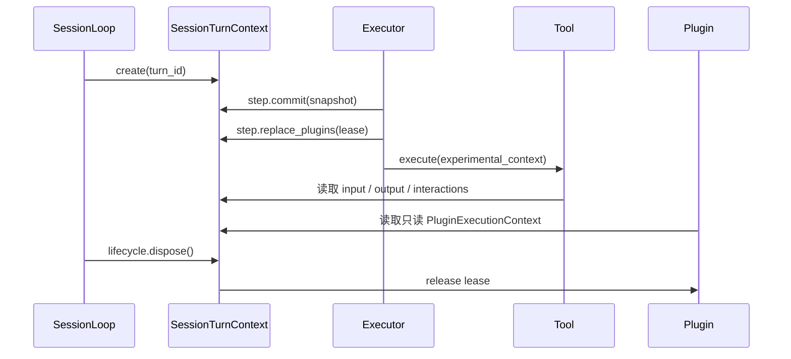

边界规则：

- Session 长期状态仍属于 `SessionState` 和 `SessionMessages`。
- Context 只保存当前 Turn/Step 必需的运行快照和资源句柄。
- Plugin 只获得 `PluginExecutionContext` 只读投影，不获得整个 Context 根对象。
- Shell 保留自己的 `ShellRunContext`，因为它表达命令运行领域，不是 Session 层级。

## 9. Composer 与 Executor

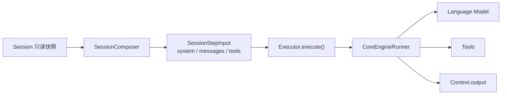

`SessionComposer` 负责策略：

- 组装 system、history 和 tools。
- 根据只读历史生成 `SessionCompactionPlan`。
- 判断 Provider 错误是否属于上下文超限。

`Executor` 负责执行：

- 执行一个 Turn 的模型与 Tool Loop。
- 在 Step 前刷新 Plugin lease 和 Compose 输入。
- 绑定 `SessionTurnContext` 到 Tool execution context。
- 调用恢复策略处理可压缩错误。

`Executor` 不写 Session 文件、不消费 Session Queue、不拥有 Message Store，也不提交
Segment。`SessionExecutor` 只有 `execute()` 一个能力，不存在第二套 Executor Port。

### 9.1 Tool 与 Plugin Action 结果

Agent 内置 Tool 与 Plugin Tool 统一使用 `ActionResult`：

```ts
interface ActionResult<TOutput> {
  output: TOutput;
  messages: Array<{
    role: "user" | "assistant";
    parts: UIMessage["parts"];
  }>;
}
```

`output` 是普通 Tool Result，Executor 解包后原样交给 AI SDK，并进入
canonical Tool Part。`messages` 是真实的 UIMessage Parts：User Parts 在下一个
Step 作为内部 User Message 注入，Assistant Parts 追加到当前 canonical
Assistant Message。Session 不判断文件类型，不下载、复制或改写 Part；Tool 或
Plugin Action 必须自己完成业务处理并返回最终消息格式。

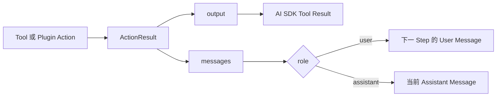

## 10. Message 与 Part

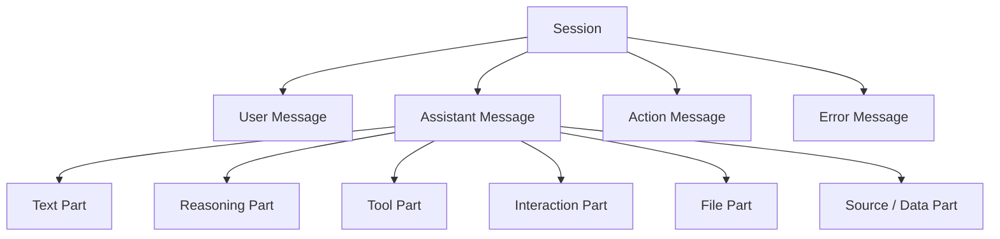

Message 是持久化时间线的顶层单位；Part 是 Assistant Message 内的有序内容。一个普通
Turn 使用同一个 Assistant Writer。Provider continuation、Tool Loop 和错误恢复只追加或
更新 Part，不创建所谓的 Run Message 或 Step Message。

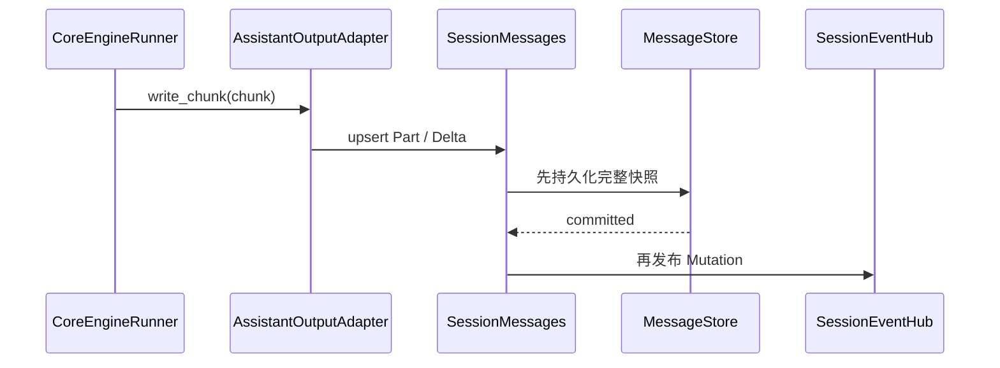

## 11. 持久化结构

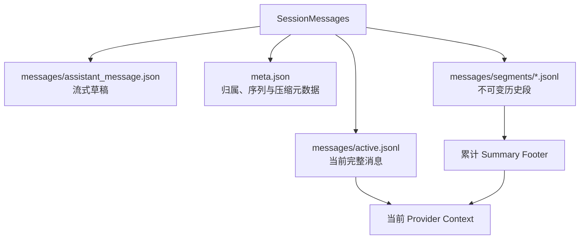

固定提交顺序：

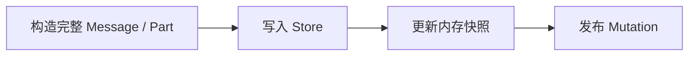

Mutation 是实时通知，不是事件溯源日志。断线后的权威恢复来源仍然是 canonical Store。

## 12. 模型与配置切换

配置具有 configured 与 effective 两个时间点，防止运行中的 Provider Step 看到半套新状态。

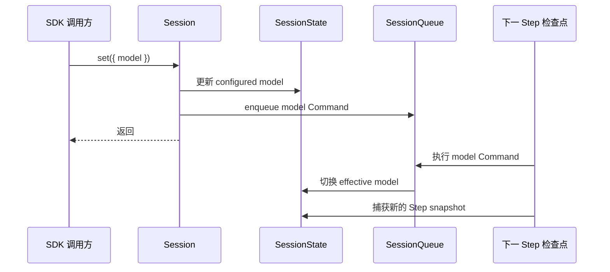

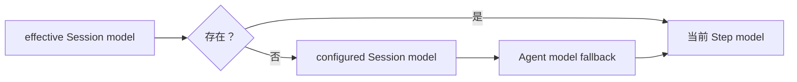

model、env、instruction、Plugin 和 security 共享 Queue 与 Step 检查点语义，但各自仍由
自己的领域状态负责。统一的是生效时机，不是强行统一成同一种结果对象。

## 13. 显式 Compact

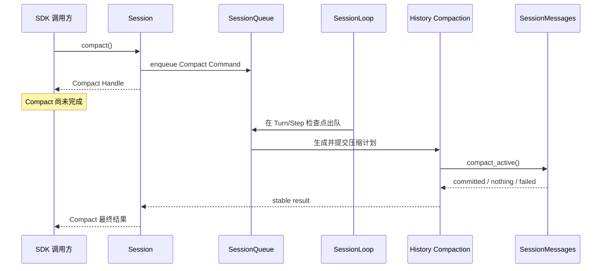

Compact Handle 的最终结果：

```mermaid
stateDiagram-v2
    [*] --> queued: session.compact()
    queued --> compacted: 已提交压缩计划
    queued --> nothing_to_compact: 无 Active 前缀可压缩
    queued --> compact_failed: Composer 或 Store 失败
    compacted --> [*]
    nothing_to_compact --> [*]
    compact_failed --> [*]
```

重要语义：

- `await session.compact()` 只等待校验和入队，并返回 Handle。
- `await handle.finished` 等待 Compact Command 真正完成。
- 空闲 Session 不为 Compact 单独创建 Turn；Command 会等到下一次 Prompt 启动的 Turn。
- 因为 Compact 在 Prompt 前排队，所以 `await session.prompt()` 返回 Turn Handle 前，前序
  Compact Command 已经完整执行。
- Compact 成功后会请求下一 Provider Step 重载 canonical history。
- Action 或日志观测失败不能悬空 Handle，也不能改写已经确定的压缩结果。

## 14. 自动 Compact 与错误恢复

三种触发最终复用同一个 Session 历史压缩事务，但进入事务的时机不同。

```mermaid
flowchart TB
    Explicit["显式 session.compact()"] --> Queue["Queue 检查点"]
    Usage["Provider usage 达到阈值"] --> TurnEnd["Assistant 收口后"]
    Error["Context Length Error"] --> Retry["恢复策略重试前"]

    Queue --> Shared["Session compact_history"]
    TurnEnd --> Shared
    Retry --> Shared

    Shared --> Composer["SessionComposer.compact()"]
    Composer --> Commit["Session 提交 Plan"]
    Commit --> Store["SessionMessages.compact_active()"]
```

### 14.1 Usage 阈值

```mermaid
flowchart LR
    Usage["真实 Provider usage"] --> Threshold{"达到 95%？"}
    Threshold -->|否| Finish["正常结束"]
    Threshold -->|是| Flag["compact_required = true"]
    Flag --> Close["先收口 Assistant Writer"]
    Close --> Compact["持久化 Compact"]
    Compact --> Finish
```

### 14.2 Context Error

```mermaid
flowchart LR
    Provider["Provider 调用"] --> Error{"上下文超限？"}
    Error -->|否| Failed["普通失败结果"]
    Error -->|是| Compact["统一持久化 Compact"]
    Compact --> Compose["重新 Compose canonical history"]
    Compose --> Retry["重试 Provider\n最多 3 次"]
```

阈值压缩必须等 Assistant 草稿收口后执行；context error 恢复发生在重试 Compose 前；显式
Compact 发生在 Queue 检查点。三者共享 Composer、Plan、Segment 提交和失败结果收口，
因此压缩内容和存储规则一致。

## 15. ask_question 与 Interaction

`ask_question` 是从 `@downcity/agent/tools` 按需导入并显式注册的 Tool，不是 Agent 默认能力，
也不是新的 Turn API。它把模型 Tool Call 映射为 Question Interaction，等待用户回答后把
答案作为 Tool Result 交回同一个 Turn。

```mermaid
sequenceDiagram
    participant LM as Language Model
    participant T as ask_question Tool
    participant C as SessionTurnContext
    participant I as SessionInteractions
    participant M as SessionMessages
    participant U as UI

    LM->>T: ask_question(input)
    T->>C: interactions.request()
    C->>I: 创建 pending waiter
    I->>M: 原子写 Tool waiting-user + Interaction pending
    M-->>U: Part Mutation
    U->>I: session.respond(answer)
    I->>M: 原子写 Interaction resolved + Tool running
    I-->>T: resolved result
    T-->>LM: Tool Result answers
    LM->>LM: 同一 Turn 继续下一 Step
```

```mermaid
stateDiagram-v2
    [*] --> pending
    pending --> resolved: respond()
    pending --> expired: expires_at
    pending --> cancelled: stop / dispose / recovery
    resolved --> [*]
    expired --> [*]
    cancelled --> [*]
```

Interaction 的持久化状态属于 `SessionMessages`；`SessionInteractions` 只有在 canonical
状态提交成功后才兑现等待 Promise。

## 16. stop 与取消

```mermaid
flowchart TB
    Stop["session.stop()"] --> Abort["Abort active Turn Context"]
    Stop --> CancelPrompt["取消 Queue 中可取消 Prompt"]
    Stop --> CancelInteraction["关闭 pending Interaction"]

    Abort --> TurnResult["Turn = stopped"]
    CancelPrompt --> PromptResult["排队 Prompt = cancelled"]
    CancelInteraction --> ToolResult["等待中的 Tool 失败"]

    Keep["Model / Env / Plugin / Compact Command"] --> Queue["保留在 Queue"]
```

stop 只取消明确声明可取消行为的 Command。维护和配置 Command 不会因为停止一次 Turn 而
丢失，会在后续 Turn 的检查点继续按 FIFO 执行。

## 17. Mutation 与订阅

```mermaid
flowchart TB
    Mutation["SessionMutation"] --> Message["message\n完整 Message 快照"]
    Mutation --> Part["part\n完整 Part 快照"]
    Mutation --> Delta["delta\nText / Reasoning 增量"]
    Mutation --> Turn["turn\nstart / finish"]
    Mutation --> Compact["compact\nstart / finish"]
    Mutation --> Session["session\ntitle"]
```

订阅是观察能力，不拥有领域状态：

- Message/Part 先持久化，后发布 Mutation。
- Turn 和 Compact Mutation 负责 Handle 的远程兑现。
- 单个订阅者抛错不会影响其他订阅者或领域操作。
- UI 断线后应通过 `messages()`、`status()` 和 `interactions()` 恢复权威快照。

## 18. RemoteSession

```mermaid
sequenceDiagram
    participant A as SDK 调用方
    participant R as RemoteSession
    participant T as HTTP / RPC Transport
    participant SV as Server
    participant LS as Local Session
    participant ES as Event Stream

    A->>R: prompt() / compact()
    R->>ES: 先确保事件泵 ready
    R->>T: 发送 Command 请求
    T->>SV: HTTP / RPC
    SV->>LS: 调用本地 Session API
    LS-->>SV: Handle ID
    SV-->>R: Handle ID
    LS-->>ES: Turn / Compact Mutation
    ES-->>R: finish Mutation
    R-->>A: 远程最终结果
```

```mermaid
flowchart LR
    Mutation["finish Mutation"] --> Cache["Lifecycle Map\n最多保留 200 个完成项"]
    Response["Transport 返回 Handle ID"] --> Cache
    Cache --> Handle["Remote Handle"]
```

事件可能早于 Transport 响应到达。RemoteSession 用有界 Lifecycle Map 合并两条链路，避免
提前到达的 finish Mutation 丢失。事件连接断开时，所有 pending Turn/Compact Handle 都以
失败结果收口，下一次操作会重新建立事件泵。

## 19. 失败边界

```mermaid
flowchart TB
    Failure["失败"] --> Domain{"是否影响 canonical 领域提交？"}
    Domain -->|是| Fail["操作失败\n返回稳定失败结果"]
    Domain -->|否| Observe["观测侧失败"]
    Observe --> Log["best-effort 日志"]
    Observe --> Event["忽略单订阅者异常"]
    Observe --> Action["Action 失败不回滚已生效配置"]
```

核心规则：

- Prompt、Assistant、Interaction 的 canonical 写入失败不能报告成功。
- Error Message 写入失败不能让 Turn Handle 永久悬空。
- Action completion 或日志失败不能回滚已经生效的配置 Command。
- Compact Mutation、Action 或日志失败不能改写 Compact 的领域结果。
- Context dispose 失败需要记录，但不能阻止 Turn Handle 收口。

## 20. 当前架构审计

```mermaid
flowchart LR
    Intent["产品意图"] --> Ownership["所有权清晰"]
    Ownership --> Dependency["依赖单向"]
    Dependency --> API["公开 API 最小"]
    API --> Lifecycle["生命周期闭合"]
    Lifecycle --> Verdict["当前无需整体重构"]
```

### 20.1 已经正确的部分

- 执行轴与内容轴已经分离，`Run` 不再形成第三套层级。
- Session 是上下文和领域中台；子模块共享它提供的稳定能力，但各自状态有唯一拥有者。
- Queue 统一输入顺序，Step 统一生效检查点。
- `SessionTurnContext` 是唯一 Turn Context，内部按职责分区，不再散落扁平数组和 callback。
- Composer 只产出策略结果，Session 提交 canonical 历史。
- Executor 只执行，不再持有 Session Store 或压缩持久化职责。
- 显式、阈值和错误恢复压缩共享同一领域实现。
- 本地与远程 Turn/Compact Handle 语义一致。
- ask_question 复用 Interaction 领域，没有引入第二套等待协议。

### 20.2 刻意保留的非对称

- `compact()` 有 Handle，因为调用方需要等待一项长耗时维护事务的最终结果。
- `set({ model })` 当前只表达配置已接受；其 effective 生效点由下一 Step snapshot 保证。
- 空闲 `compact()` 不主动创建 Turn，因为 Compact 本身不应触发 Provider 执行。
- `stop()` 和 `respond()` 绕过 Queue，因为中断和恢复等待必须立即发生。

### 20.3 后续重构触发条件

当前不应继续为了“看起来更抽象”而拆层。只有出现以下事实时再重构：

- `Session.ts` 新增大量公开 API，超过模块大小上限并形成稳定的 browse/config 子领域。
- 出现第二种真正独立的 Session 执行器，需要稳定替换边界。
- Queue 需要持久化、跨进程恢复或优先级调度，当前进程内 FIFO 不再满足产品意图。
- Remote Handle 需要跨客户端重连恢复，服务端必须提供按 ID 查询操作结果的协议。
- Mutation 需要可靠重放，此时应新增事件游标或同步协议，而不是把 EventHub 当事件存储。

在这些条件出现以前，当前结构已经处于“概念足够少、所有权明确、行为可解释”的状态。

## 21. 最终不变量

```mermaid
flowchart TB
    I1["Queue 只有一个消费者"]
    I2["一个 Session 只有一个 active Turn"]
    I3["一个 Turn 只有一个 SessionTurnContext"]
    I4["Message 只有一个 canonical 写入口"]
    I5["配置只在 Step 检查点切换 effective state"]
    I6["Compact 只在 Assistant 草稿安全后提交"]
    I7["Handle 必须最终收口"]

    I1 --> Stable["Session Runtime 可解释"]
    I2 --> Stable
    I3 --> Stable
    I4 --> Stable
    I5 --> Stable
    I6 --> Stable
    I7 --> Stable
```

1. `SessionLoop` 是 Session Queue 的唯一消费者。
2. 一个 Session 同时最多一个 active Turn。
3. `SessionLoop` 创建并释放每个 Turn 唯一的 `SessionTurnContext`。
4. `SessionMessages` 是 Message、Part、Tool 和 Interaction 的唯一事实源。
5. Composer 输入是只读快照，Composer 不执行持久化副作用。
6. Executor 不持有 Message Store，不提交 Segment。
7. 配置和运行视图只在明确 Step 检查点切换。
8. Assistant 草稿完成前不能提交持久化 Compact。
9. canonical 状态提交成功后才能发布对应 Message/Part Mutation。
10. Turn、Compact 和 Interaction 的等待句柄在成功、失败、停止或断线后都必须收口。
