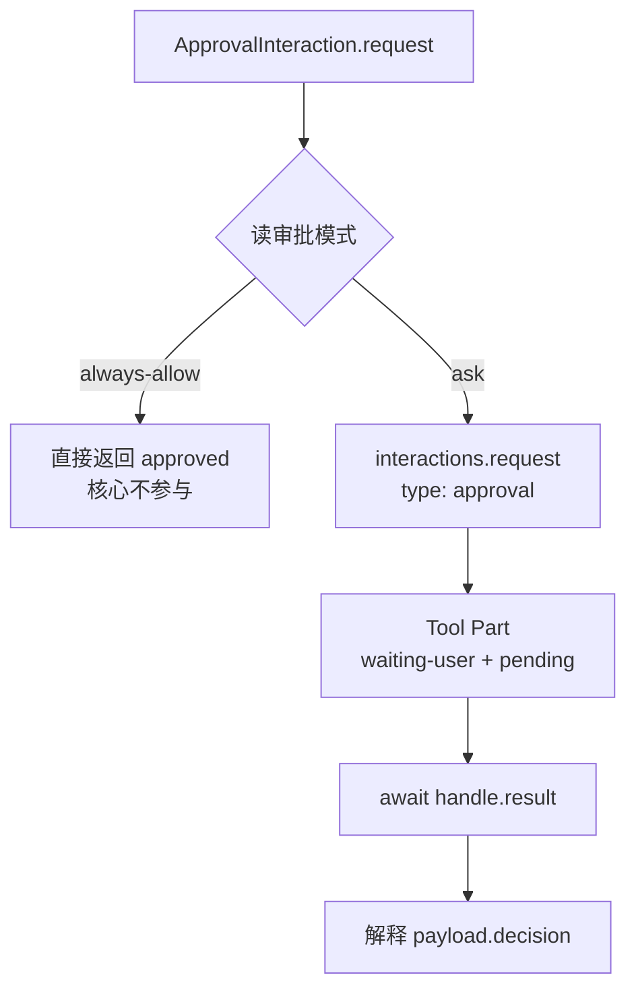

# Session Interaction 统一 PRD

> 状态：已落地（第 3、4 章全部实现并验证）
>
> 适用范围：`packages/type`、`packages/agent`、`packages/city`、`app/desktop`、`app/cli`
>
> 前置：本轮已落地的「审批端口下移到执行方」改动。本 PRD 是该改动的收敛，不是回退。

## 1. 问题

审批与提问是同一件事，但代码里有三套形状。

用户参与只有一种机制：执行方发起一次交互、等待用户响应、拿到结果继续。`SessionInteractionRequest.type` 从设计之初就是 `string` 而不是封闭联合体，这个类型选择本身就表达了「核心不认识业务类型」。`AskQuestionsTool` 已经按这个理解实现——它在 `execute` 里直接调 `interactions.request()`，等 `handle.result`，自己解释 payload。

审批却走了另一条路：类型知识被提升到核心（`SessionApprovalPort`、`SessionApprovalRuntime`），调用点被自由函数封装（`request_action_approval`、`request_host_approval`），模式判断（`always-allow`）落在一个只服务审批的运行时类里。结果是同一个逻辑原语有三个名字、两条路径、两个适配器。

`SessionApprovalRuntime` 住在 `session/messages/` 目录下，和 canonical Message 的写入、状态机、缓存并列。它不是消息领域的东西，是一段审批策略。

## 2. 现状（已核实）

### 2.1 核心原语

`SessionInteractions`（`packages/agent/src/session/messages/SessionInteractions.ts`）已经是正确的形状：

- 持有 `pending_by_id` 等待表，每 Session 一个实例。
- `request()` 校验信封、登记 waiter、交给 `SessionMessages` 原子持久化。
- `respond()` 兑现终态，先提交 canonical Message 再 resolve。
- `validate_request` 只检查 `interaction_id` / `turn_id` / `type` / `source`，**不读 payload**。
- 没有超时，终态只能是用户响应或随 Turn/Session 取消。

它不需要改。问题在它周围。

### 2.2 审批的两条路径

| 路径 | 调用点 | 适配器 | 落点 |
| --- | --- | --- | --- |
| power 动作 | `CityAction.execute` | `request_action_approval` | `SessionApprovalPort.request` |
| Shell host | `start_shell_session`、`write_shell_session` | `request_host_approval` | `SessionApprovalPort.request` |

两个适配器职责高度重叠（拼信封、调端口、收敛结果），差异只有三处：payload 形状、Shell 的审计日志、Shell 的 fail-closed 前置检查。

### 2.3 类型知识的分布

`SessionApprovalMode = "ask" | "always-allow"` 定义在 `packages/type/src/types/session/SessionInteraction.ts`，由 `SessionApprovalRuntime` 读取并生效。`always-allow` 是唯一一处「核心必须知道这是审批」的理由。

### 2.4 消费端是硬编码分派

没有注册机制。Desktop（`AgentInteraction.tsx:11`）、CLI（`AgentChatTuiCoordinator.ts:310`）、ui 包（`chat.tsx:74`）各自用 `if (type === "approval") / ("question") / 否则占位` 三分支。`docs/desktop-agent-message-rendering-redesign-prd.md` 第 331 行已明确拒绝引入动态 Renderer Registry，理由是当前没有真实插件需求。

### 2.5 调用点样板

每个调用点都要自己构造完整 `SessionInteractionRequest`：生成 `interaction_id`、填 `created_at`、拼 `source`、拼 `response_schema`。`AskQuestionsTool` 里有 15 行只做这件事。

## 3. 设计

### 3.1 唯一原语：`interactions.request()`

交互只有一种发起方式。`type` 是字符串参数，不是方法名、不是类名。

```ts
const handle = await session.interactions.request({
  type: "approval",
  turn_id,
  tool_call_id,
  payload: { operation: "tool", validated_input: input },
});
const result = await handle.result;   // 生产者自己解释
```

`question` 完全同形，只是 `type` 与 `payload` 不同：

```ts
const handle = await session.interactions.request({
  type: "question",
  turn_id,
  tool_call_id,
  payload: { questions },
});
```

**原语补齐调用点样板。** 调用方只提供语义字段，信封字段由原语生成：

```ts
/** 发起一次交互所需的语义输入；信封字段由原语补齐。 */
export interface SessionInteractionRequestInput {
  /** 业务类型；核心不解释，只用于分派渲染与校验响应一致性。 */
  type: string;
  /** 当前交互所属 Turn。 */
  turn_id: string;
  /** 当前交互归属的 Tool Call；交互必然属于一次具体调用。 */
  tool_call_id: string;
  /** 发起交互的工具名；仅用于展示。 */
  tool_name?: string;
  /** 来源类别，决定前端呈现；默认 tool。 */
  source_type?: "tool" | "shell";
  /** 前端可选展示标题。 */
  title?: string;
  /** 前端可选展示描述。 */
  description?: string;
  /** 业务数据；由 type 对应的生产者解释。 */
  payload: JsonValue;
  /** 响应数据的声明式校验结构；省略时按 type 取默认。 */
  response_schema?: JsonValue;
}
```

`interaction_id`、`created_at` 与 `source` 的组装从所有调用点移入 `request()`。这是删除样板的关键：调用点从 15 行降到 5 行。

### 3.2 审批封装：`ApprovalInteraction`

审批比提问多两件事：读审批模式，以及解释「批准 / 拒绝」。这两件事属于审批自己，不属于核心。因此审批有一个封装类，提问没有。

```ts
/** 审批交互：把一次高风险操作提交给用户裁定。 */
export class ApprovalInteraction {
  constructor(private readonly options: {
    /** 通用交互原语。 */
    readonly interactions: SessionInteractionPort;
    /** 读取当前审批模式。 */
    readonly read_mode: () => SessionApprovalMode;
  }) {}

  /**
   * 请求一次审批。
   *
   * 关键点（中文）
   * - `always-allow` 时直接返回批准，**不发起交互**：核心完全不参与该判断。
   * - 其余情况发起 `approval` 交互，并把终态收敛为决定。
   */
  async request(input: {
    turn_id: string;
    tool_call_id: string;
    tool_name?: string;
    title?: string;
    description?: string;
    payload: SessionApprovalPayload;
  }): Promise<ApprovalDecision>;
}

/** 一次审批的领域结果。 */
export interface ApprovalDecision {
  /** 是否放行。 */
  readonly approved: boolean;
  /** 是否为审批模式自动放行，而非用户决定。 */
  readonly auto_approved: boolean;
  /** 用户参与时对应的 Interaction 标识。 */
  readonly approval_id?: string;
}
```

**`always-allow` 的关键差别：它根本不发 request。** 核心不知道审批模式的存在，也不会在等待前插钩子。



`auto_approved` 是给 Shell 审计用的：它需要区分「用户批准」与「策略放行」，两者结果上都是放行。当前实现里这个区别由 `requires_user_decision` 承载，新方案里由这个字段承载。

**实例长生命周期。** `SessionInteractions` 在构造期建好这个实例并持有，每次调用只传身份参数：

```ts
session.interactions.approval.request({ turn_id, tool_call_id, payload })
session.interactions.request({ type: "question", turn_id, tool_call_id, payload })
```

审批走专用入口（它有模式与 payload 解释），提问直接走原语（它没有额外策略）。两者最终都进同一个 `request()`。

### 3.3 生产者解释 payload

原语返回的是通用 `SessionInteractionResult`，业务含义由生产者解释。这部分现在就是对的，只是要从适配器里搬出来：

| 生产者 | 解释逻辑 | 位置 |
| --- | --- | --- |
| `AskQuestionsTool` | `resolve_ask_question_answers`、`read_ask_question_note` | 已有，`AskQuestionAnswers.ts`，不变 |
| power 动作 | `ApprovalInteraction` 读 `payload.decision` | 封装类内 |
| Shell host | 同上，另写审计 | 封装类内 + Shell 调用点 |

### 3.4 工具侧拿到的形状

执行上下文提供 Session 身份与交互入口，不再是「一个专门的审批端口」：

```ts
const session = options.context.action_execution_context.session;
const decision = await session.interactions.approval.request({
  turn_id: session.turn_id,
  tool_call_id: options.tool_call_id,
  tool_name: "delete_file",
  payload: { operation: "tool", validated_input: input },
});
if (!decision.approved) {
  return { success: false, error: "denied" };
}
```

`ToolActionExecutionContext.session` 与 `PowerActionExecutionContext` 都删掉单独的 `approval` 字段，只保留 `interactions`。

## 4. 改动清单

### 4.1 删除

| 位置 | 内容 |
| --- | --- |
| `packages/type/.../SessionInteraction.ts` | `SessionApprovalPort`、`SessionApprovalRequest`、`SessionApprovalHandle` |
| `packages/agent/.../SessionApprovalRuntime.ts` | 整个文件 |
| `packages/city/.../PowerActionInteraction.ts` | `request_action_approval`、`create_denied_interaction_ports` 中的 approval 部分 |
| `packages/city/.../HostApprovalRuntime.ts` | `request_host_approval`（审计与校验函数保留） |
| `packages/agent/.../ToolActionExecutionContext.ts` | `ToolSessionExecutionScope.approval` |
| `packages/city/.../PowerRuntime.ts` | `PowerActionExecutionContext.approval`、`PowerActionInteractionPorts.approval` |
| `packages/agent/.../SessionTurnContext.ts` | `SessionTurnContextInit.approval`、`SessionTurnContext.approval` |

### 4.2 新增

| 位置 | 内容 |
| --- | --- |
| `packages/type/.../SessionInteraction.ts` | `SessionInteractionRequestInput`、`SessionApprovalPort`、`SessionApprovalRequestInput`、`SessionApprovalDecision` |
| `packages/agent/.../ApprovalInteraction.ts` | `ApprovalInteraction`（实现 `SessionApprovalPort`） |

### 4.3 修改

- `SessionInteractions.request()` 入参改为 `SessionInteractionRequestInput`，内部生成 `interaction_id` / `created_at` / `source`。
- `SessionInteractions` 在构造期建好 `approval: ApprovalInteraction` 并持有；它需要能读当前审批模式。
- `Session` 不再构造 `SessionApprovalRuntime`，改为把审批模式读取函数交给 `SessionInteractions`。
- `CityAction.execute` 与 Shell 两处调用点改为 `session.interactions.approval.request(...)`。
- `AskQuestionsTool` 改为传入语义输入，删掉信封样板。
- `SessionLoop` / `StepInput` 不再传递 `approval` 端口。

### 4.4 不动

- `SessionInteractions` 的 waiter、持久化顺序、终态语义、无超时。
- `SessionMessages` 的 Interaction 原子提交与 `waiting-user` 状态。
- Desktop / CLI 的硬编码类型分派（见 2.4，不引入注册表）。
- `SessionApprovalMode` 类型与 `status().security`、`session.set({ security })` 对外协议。
- Shell 的审计日志与 fail-closed 前置检查。

## 5. 行为变更

| 场景 | 现在 | 之后 |
| --- | --- | --- |
| `always-allow` 下审批 | 不创建 Interaction，直接放行 | 不创建 Interaction，直接放行（封装类直接返回） |
| 审计区分放行来源 | `requires_user_decision: false` | `ApprovalDecision.auto_approved: true` |
| 无 Session 入口调用被 gate 的动作 | 拒绝式端口抛错 | 拒绝式交互端口仍在 `request()` 阶段抛错 |
| 交互 `interaction_id` | 调用方生成 | 原语生成 |

第三项的判定依据是调用方提供的交互端口：power 动作在无 Session 入口拿到的是拒绝式 `interactions`，它在 `request()` 阶段抛错，而 `ApprovalInteraction` 在 `ask` 模式下会如实调用它。因此 `create_denied_interaction_ports` 保留，只删 `approval` 部分。

## 6. 验证

```bash
pnpm -C packages/type build && pnpm -C packages/agent build && pnpm -C packages/city build
pnpm -r --filter './packages/**' typecheck
pnpm -C packages/agent test      # 基线 87
pnpm -C packages/city test       # 基线 279，1 个既有失败（session-config-turn-boundary）
pnpm -C app/desktop test         # 基线 506
pnpm -C app/cli typecheck
pnpm release:test                # 20
```

新增断言：

1. `always-allow` 下审批不产生 pending Interaction，且 `auto_approved: true`。
2. `ask` 下同一请求产生 pending，`respond()` 后恢复执行。
3. 无 Session 入口调用被 gate 的动作返回明确失败，不挂起。
4. `AskQuestionsTool` 经新原语路径的问答闭环不变。

## 7. 待确认

**7.1 类型名保持 `approval` / `question`。** 曾考虑把 `approval` 改名为 `security`，但 `Session` 已有 `status().security = { approval_mode, effective_approval_mode }`，同名不同物会让代码难读。`approval` 语义窄而明确，`question` 与它同级，命名已齐。若仍要统一风格，建议 `security_approval` 而非 `security`。

**7.2 `ApprovalInteraction` 如何读审批模式。** 两个选择：一是构造期注入 `() => SessionApprovalMode`，读时取值，模式变更立即生效（当前 `always-allow` 是这种语义，改模式在下一个 Step 检查点生效）；二是每次调用传入模式。推荐第一种，与现有行为一致。

**7.3 客户端分派是否收敛到共享模块。** Desktop、CLI、ui 包三处各有一份 `approval` / `question` 分支。可以抽到 `packages/ui` 共享，但三处渲染差异大（Desktop 卡片、CLI 面板、ui 通用占位），强行统一会把差异外移。建议保持现状。

## 8. 实施记录

改动已落地，验证结果：

- `packages/type`、`packages/agent`、`packages/city` 构建通过；全部 workspace 包与两个 app typecheck 零错误。
- `packages/agent` 87/87；`packages/city` 266/279（唯一失败为既有基线 `session-config-turn-boundary`）；`app/desktop` 508/508；`release:test` 20/20。
- `app/cli` typecheck 通过；其测试因沙箱缺 esbuild 二进制无法运行，属环境问题。

实现过程中的四个判断：

**`ApprovalInteraction` 归属 `session/messages/`。** 它与 `SessionInteractions` 同层，由后者在构造期实例化并持有为 `approval` 属性，因此长生命周期、每次调用只传身份参数。

**审批入口类型放在 `packages/type`。** Shell 在 `packages/city`，不能依赖 `packages/agent`；`SessionApprovalPort` 与 `SessionInteractionPort.approval` 都是跨包协议，必须定义在 type 包。`ApprovalInteraction` 是 agent 侧的默认实现。

**`effective_approval_mode` 保留。** 原 `SessionApprovalRuntime` 承载的「configured 与 effective 分离」语义（改模式下个 Step 检查点生效）是公开协议，改为 `Session` 上的一个字段承载，`status().security` 输出不变。

**无 Session 入口的失败信息。** `create_denied_interaction_port` 不提供 `approval`，因此声明审批的动作会先在 `CityAction` 的判空处失败，报 `requires approval, but this call has no Session to ask`，而不是走到拒绝式 `request()`。两者都是明确失败，不挂起。
