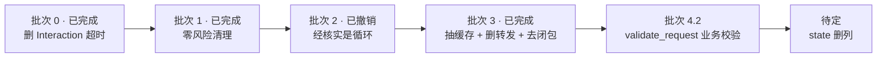

# Session 层代码收敛计划

> 状态：待执行
>
> 适用范围：`packages/agent/src/session`、`packages/agent/src/types/session`
>
> 前置：`session-message-unified-state-prd.md` 的改动已落地（工作区，未提交）。本计划不重复其内容。

## 1. 核心发现：30 个公开方法里有 8 个是纯转发

逐个体检查后的真实分布（见批次 3）：7 个是 Writer 机制透传、1 个已死、4 个是合法域 API、1 个含真实行为。

`SessionMessages` 有 30 个公开方法，其中 13 个只做一件事——把调用转发给 `agent_state`：

```ts
async commit_agent_step(message_id, parts) {
  await this.agent_state.commit_step(message_id, parts);        // 仅此
}
async checkpoint_agent_message(message_id) {
  await this.agent_state.checkpoint(message_id);                // 仅此
}
async complete_agent_message(message_id, status, error) {
  await this.agent_state.complete(message_id, status, error);   // 仅此
}
// …另有 10 个同形
```

调用方只有两个（已核实）：

| 调用方 | 用到的转发方法 |
| --- | --- |
| `SessionAgentMessageWriter`（持有 `recorder: SessionMessages`） | `project_agent_delta`、`project_agent_part`、`checkpoint_agent_message`、`commit_agent_parts`、`rollback_agent_projection`、`commit_agent_step`、`complete_agent_message`、`find_streaming_tool` |
| `SessionInteractions`（持有 `messages: SessionMessages`） | `request_interaction`、`resolve_interaction`、`close_interaction`、`list_pending_interactions` |

**这 13 个方法就是这轮开头被指出的「薄封装」。** 它们存在，只是为了让两个协作者穿过 `SessionMessages` 拿到 `agent_state`。结果是每次写操作都走两层，而两层的名字还不一样。

## 2. 批次 0：删除 Interaction 超时（已完成）

由用户决定：Question 与 Approval **都不应设置 `expires_at`**，`ShellApprovalRequest.timeout_ms` 一并删除。

### 2.1 为什么删

Interaction 的终止方式原本有三种：用户响应、等待超时、随 Turn/Session 结束。删掉超时后降到两种，且第二种不再是一个独立的领域路径。一条审批等两个小时再自动失败，对“高风险操作需人裁定”这个场景没有意义：要么等用户，要么随会话结束。

### 2.2 删除链（跨两个包）

| 位置 | 删除内容 |
| --- | --- |
| `SessionInteraction.ts` | `SessionInteractionRequest.expires_at`、`SessionInteractionStatus` 的 `expired`、`SessionExpiredInteractionResult`、`SessionExpireInteractionInput` |
| `SessionInteractions.ts` | `request()` 里的 `setTimeout` + `timer.unref`、`validate_request` 的 `expires_at` 前置校验、`expire()` 整个方法、`finish_pending` 的 `clearTimeout` |
| `SessionInteractions.ts`（types） | `SessionPendingInteractionRuntime.timer` |
| `SessionMessageInteractionWriter.ts` | `expired → "Interaction expired"` 分支 |
| `SessionStorageCodec.ts` | interaction status 枚举校验里的 `expired` |
| `SessionShellApprovalAdapter.ts` | `expires_at` 输出、`expired` 结果映射 |
| `AskQuestionsTool.ts` | `expired` 结果分支 |
| `ShellAction.ts` | `ShellApprovalStatus` 的 `expired`；`ShellSessionStatus` 的 `expired` |
| `ShellApproval.ts` | `ShellApprovalRequest.timeout_ms` |
| `ShellRuntimeOptions.ts` | `default_approval_timeout_ms` |
| `ShellActionRuntimeSupport.ts` | `DEFAULT_APPROVAL_TIMEOUT_MS`、`is_terminal_status` 的 `expired` |
| `HostApprovalRuntime.ts` | `timeout_ms` 参数与透传 |
| `ShellStartActions.ts` / `ShellWriteActions.ts` | 传递 `timeout_ms` |
| `ShellActionShared.ts` | `"Host execution approval expired."` 文案、`status: "expired"` 派生 |
| `ShellTools.ts` | 两处 `approval_status !== "expired"` |
| `AgentInteraction.tsx` + locales | `expired` 展示分支与文案 |
| `approvals.mdx`（中/英） | 生命周期里的 `expired` 说明 |

### 2.3 附带的设计收益

删到只剩下一种终态后，`SessionInteractionCloseInput` 不再需要 `status` 字段——它的唯一职责变成了携带 `reason`：

```ts
/** 关闭 pending Interaction 的输入；终态固定为 cancelled。 */
export interface SessionInteractionCloseInput {
  reason: "turn_stopped" | "session_disposed" | "runtime_interrupted";
}
```

同一原因：`ShellSessionStatus` 的 `expired` 变体也成了死枚举（`derive_exit_status` 只产出 `killed`/`completed`/`failed`），一并删除。`starting` 仍被多处读取，保留。

### 2.4 影响

- **行为变更**：等待审批不再自动超时。原先 2 小时的审批窗口消失，审批要么得到用户响应，要么在 Turn/Session 结束时被标记为 cancelled 并把所属 Tool 标为 failed。
- **协议变更**：`SessionInteractionStatus` 六态 → 五态；`ShellApprovalStatus` 三态 → 二态。属公开协议，需随包版本发布。
- **验证**：三个包重新构建通过，`packages/agent` 75/75，`packages/city` 250/264（两个基线失败），`app/cli` typecheck 通过。

## 3. 九项待改，按风险分四批

### 批次 1：零风险清理（已完成）

> 落地结果见「1.4 实施记录」。以下保留原始分析，其中一条已被实测推翻。

#### 1.1 命名与语义对齐

改了 `state` 语义后漏改的名字，现在会误导读者：

| 现在 | 改为 | 位置 |
| --- | --- | --- |
| `find_streaming_tool` | `find_tool_in_open_message` | `SessionAgentMessageState.ts:266`、`SessionMessages.ts:713`、`SessionMessageInteractionWriter.ts:32,268` |
| `require_streaming_assistant` | `require_open_message` | `SessionMessageInteractionWriter.ts:207` |
| `require_streaming_tool` | `require_open_message_tool` | `SessionMessageInteractionWriter.ts:267` |
| `SessionStreamingToolLocation` | `SessionOpenMessageToolLocation` | `types/session/SessionTool.ts:10` |

#### 1.2 删除失效的 part_id 规则

`normalize_session_user_parts` 生成 `user-text:${index + 1}`，随后 `append_user_message` 无条件覆盖为 `${message_id}:part:${sequence}`。第一条规则没有任何生效路径。

补充证据：`part_id` 在 `message_parts` 中是 `PRIMARY KEY`，所以第二条消息的 `user-text:1` 会直接撞主键。这条规则不只是无用，而且是错的。

#### 1.3 去掉多余读

**每次翻页算全表统计（成立，已改）**：`list_messages` 末尾为填 `total` 调用 `message_stats()`，而它会读 `session_state`、查最新一条消息（带 join）、再算一次 `file_size`。给 Store 加一个只做计数的窄方法。

```ts
// SessionMessages.list_messages：只取计数，不取最新消息与字节数
const total = await this.store.message_count();
```

**每次检查点重读消息（不成立，已保留）**：原判断是「调用方手上已有 `current` 快照，重读是冗余」。实测推翻了它，详见 1.4。

#### 1.4 实施记录

| 项 | 结果 |
| --- | --- |
| 1.1 改名 | 已完成。4 个标识符 + 5 处注释；`packages/agent/scripts/session-interaction-mutation.test.mjs` 直接构造 writer，同步改了 options 键名 |
| 1.2 删死规则 | 已完成，且比原计划更彻底：新增 `SessionUserPartContent`（分配式 `Omit<part_id \| sequence>`），`normalize_session_user_parts` 只返回内容，`normalize_canonical_session_user_parts` 整个函数删除（其职责被 `append_user_message` 吸收），identity 与顺序统一由 `append_user_message` 分配 |
| 1.3 `list_messages` 计数 | 已完成。`SessionStorage` 新增 `message_count()`，只查 `session_state` 一列 |
| 1.3 `persist_snapshot` 重读 | **已保留**。原判断错误，见下 |

**被实测推翻的判断**。我原本认为 `persist_snapshot` 开头那次 `read_message` 是冗余重读，改用调用方传入的 `current`。写探针实测后推翻：

```text
投影后已发布: message/agent, part/text, delta/text

原实现（diff 基线 = DB）：     checkpoint 额外发布（无）  落盘 parts: text:streaming:"部分文本"   ← 正确
探针版（diff 基线 = 内存快照）：checkpoint 额外发布（无）  落盘 parts: （空）                    ← 静默丢数据
```

原因是两个 diff 服务于不同目的，不能合并：

| diff | 基线 | 用途 |
| --- | --- | --- |
| `persist_snapshot` 的 `changed_parts` | **DB** | 告诉存储层要 upsert 哪些 part 行 |
| `accept_message` 的 `project_message_change` | **内存缓存** | 决定向订阅方发布什么 |

「发布什么」由第二个 diff 决定，与那次重读无关；而那次重读是**存储写入的必要输入**。换成内存基线后 `changed_parts` 算成空集，part 行不会被写，数据静默丢失且不报错。

教训：这两层的 diff 看起来重复，实际一个是「持久化」事实、一个是「订阅」事实。任何合并它们的尝试都会失掉一层语义。

### 批次 2：`Session.ts` 的 Action 字面量（已撤销）

原判断：删掉 `emit_action_event` 后，同一段七字段对象字面量出现四次，应把「构造并提交一条 Action」收成助手。

**核实后撤销。** 三个 fork 调用点共享的只有 `action_id`（一个变量）与 `action_type: "history-fork"`（一个字面量），差异是 `title` / `description` / `status`。

```ts
// Session.ts:492 / 515 / 524 —— 共享部分只有前两行
await this.session_messages.persist_action({
  action_id,                              // 同一个变量
  action_type: "history-fork",            // 同一个字面量
  title: "Forking session messages",      // ↓ 各自不同
  description: `Preparing ${...} messages for the new session.`,
  status: "running",
});
```

而那个拟议中的助手——入参五字段、出参同样五字段——**就是被删掉的 `emit_action_event`**。批次 1 删它有理由（合并类型后它变成纯透传），批次 2 再加回来是循环。

我把「共享字段名」误计成了「重复代码」。字段名一致是 API 形状，不是重复。

#### 2.1 顺便发现的一个真问题（独立于本计划）

`action_type` 不是精确协议。desktop 用子串匹配做展示分派：

```ts
// app/desktop/.../agent_activity_presentation.ts:128
function resolve_agent_action_visual_kind(action_type: string): AgentActionVisualKind {
  const normalized = action_type.toLowerCase();
  if (normalized.includes("fork")) return "fork";
  if (normalized.includes("compact")) return "compaction";
  if (normalized.includes("command")) return "command";
  return "generic";
}
```

所以把 `"history-fork"` 提成共享常量治不了任何东西；真正脆的是这个子串匹配本身（任何含 `fork` 的 action_type 都会得到 fork 视觉）。若希望 action_type 成为真正的契约，需要双方改成精确枚举——那是独立议题。

### 批次 3：消掉转发层与回指闭包（已完成）

原判断：`SessionMessages` 有 13 个纯转发方法，让协作者直接持有 `agent_state` 即可删除。

**探针结果：前提不对。** 逐个体检查后：

| 分类 | 数量 | 说明 |
| --- | --- | --- |
| Writer 机制透传 | **7** | `project_agent_*`、`checkpoint_agent_message`、`commit_agent_parts`、`rollback_agent_projection`、`commit_agent_step` |
| 域 API（不是 plumbing） | **4** | `list_pending_interactions`、`request/resolve/close_interaction`——方法名就是领域词汇，留在 Message 门面上是正确的 |
| 已死 | **1** | `find_tool_in_open_message`，无调用者 |
| 非透传 | **1** | `complete_agent_message`：先释放持有，再委派 |

且 Writer 还依赖两处不在清单里的东西：`get_message`（读缓存）与持有释放——两者都不属于 `agent_state`。所以只换依赖对象反而更绕，真正的耦合在**缓存与持有关系归谁**。

#### 3.1 实际做法：抽出 `SessionMessageCache`

新模块同时拥有三件事：Message 运行缓存、持有关系、Mutation 发布。三者本来就是同一件事的三面——Only 持有中的 Message 会被缓存，发布形状由新旧快照差异决定。

```ts
// packages/agent/src/session/messages/SessionMessageCache.ts
export class SessionMessageCache {
  get(message_id): SessionMessage | undefined;
  all(): Iterable<SessionMessage>;
  set_held(message_id): void;
  release_held(message_id): void;
  is_held(message_id): boolean;
  held_message_id(): string | undefined;
  accept(message, publish_mutation?): void;   // 落盘快照 → 缓存 + 按差异发布
  project(mutation, message): void;           // 实时投影 → 只缓存 + 发布给定 mutation
}
```

`SessionMessages` 与 `SessionAgentMessageState` 都只单向依赖它，**双向依赖消失**：

```ts
// 之前：两个类互相回指
new SessionAgentMessageState({
  session_id, store,
  list_messages: () => this.messages_by_id.values(),      // ← 指回 SessionMessages
  is_held_by_writer: (id) => this.is_held_by_writer(id),  // ←
  accept_message: (m, p) => this.accept_message(m, p),    // ←
  project_mutation: (mu, m) => this.accept_mutation(mu, m), // ←
});

// 之后：只传协作对象
new SessionAgentMessageState({ session_id, store, cache });
```

#### 3.2 结果

| | 之前 | 之后 |
| --- | --- | --- |
| `SessionMessages.ts` | 888 行 | **707 行** |
| `SessionMessageCache.ts` | — | 171 行（新增） |
| `SessionAgentMessageState.ts` | 388 行 | 390 行（options 从 4 个闭包降为 1 个对象） |
| Writer 依赖 | 整个 `SessionMessages`（11 处调用） | `(state, cache)` 两个窄接口 |
| 写入路径层数 | 2（Messages → State） | 1 |
| 回指闭包 | 4 个 | 0 |

Writer 的依赖从 3 个位置参数改为 options 对象（`{ message_id, state, cache }`）；`SessionMessages.complete_agent_message` 删除，持有释放并入 `SessionAgentMessageState.complete`——那里本来就是唯一知道「这次提交是终态」的地方。

#### 3.3 行为验证（不只跑测试）

按 1.4 的教训，重构后用真实链路确认数据确实落盘，而非只在内存投影里：

```text
流式文本 + Tool：
  落盘: {"state":"done","parts":["text:done:\"你好\"","tool:completed:{\"found\":true}"]}
  → text 与 tool 两个 part 行都存在；aggregate 与 part 行数一致

Interaction：
  pending: ["interaction-1"]
  恢复后 tool state: running
  收口: {"state":"done","parts":["tool:failed"],"interactions":["resolved"]}
  （tool 为 failed 是预期：该场景未调用 apply_tool_result，收口应把未完成的 Tool 标为失败）
```

### 批次 4：结构收敛

#### 4.1 构造函数里的回指闭包（已随批次 3 完成）

四个回指闭包与转发层已一并消除，见批次 3.1。

#### 4.2 `validate_request` 里的业务校验

`SessionInteractions.validate_request` 内含整段 `if (request.type === "question")` 的逐字段校验（`questions` / `options` / 唯一性）。通用交互运行时不该知道 Question 的 payload 形状。

方向：每个 Interaction 类型自带校验函数，运行时只校验通用信封（`interaction_id` / `turn_id` / `source` / 过期）。

```ts
/** 单个 Interaction 类型的请求校验。 */
interface SessionInteractionTypeValidator {
  /** 该类型名。 */
  type: string;
  /** 校验 payload；失败抛错。 */
  validate_request(request: SessionInteractionRequest): void;
  /** 校验响应 payload 与请求的一致性。 */
  validate_response(request: SessionInteractionRequest, response: SessionInteractionResponse): void;
}
```

这需要一张注册表。属于新概念，应先写进 PRD 再动手。
## 4. 需要先回答的问题

**4.1 `state` 是否删列。** 本计划不含此项。当前状态是「值由一处推导、但仍落库」，语义已统一、存储仍冗余。删列前需确认没有外部直接读 `messages` 表（目前已知 desktop / ui / cli 都经 SDK 读取，未直接查库）。

**4.2 Interaction 的终止语义（已解决）。** 见「批次 0」：两者都不再设置超时。

**4.3 两处冗余发布的归属。** `part/tool state=ready` 连发两次（`prepare_tool_input` 与 `tool_call_finish` 各自落盘），以及 `list_messages()` 会返回未提交的草稿。两者都可单独修，但不属于本计划。

## 5. 验证方式

批次 1–3 均为行为不变，验收方式统一：

```bash
pnpm -C packages/type build && pnpm -C packages/agent build && pnpm -C packages/city build
pnpm -C packages/agent typecheck && pnpm -C packages/agent test   # 75/75
pnpm -C packages/city typecheck
pnpm -C packages/city test                                        # 250/264，两个基线失败
```

批次 3 需要额外确认写路径无回归：`packages/city/test/session-messages.test.mjs`（覆盖流式、检查点、Tool gate、恢复）与 `session-interaction-*.test.mjs` 必须全绿。

**已知基线失败（与本计划无关，已核实）**：

- `ImagePlugin image_result stores remote images locally`
- `running session approval mode changes stay queued until the next Session step`
- 全仓库 `pnpm typecheck`：`templates/ui` 引用 `@downcity/ui` 未导出的 `ChatInputEditor`

## 6. 建议顺序



一个适用到后续所有批次的教训：本计划已有三项判断被核实推翻（1.3a 的重读、整个批次 2、批次 3 的「13 个透传」）。共同点都是**从代码形状推断职责**，而没看那层实际在做什么。因此任何「看起来重复/多余」的删除，动手前先用探针确认它的真实职责。

批次 1 与 2 可以立刻做，互不干扰，各自可单独回滚。批次 3 是收益最大的一项——它同时解决「薄封装」和「887 行神对象」两个问题，且行为不变。批次 4 涉及新概念，应先写设计。
