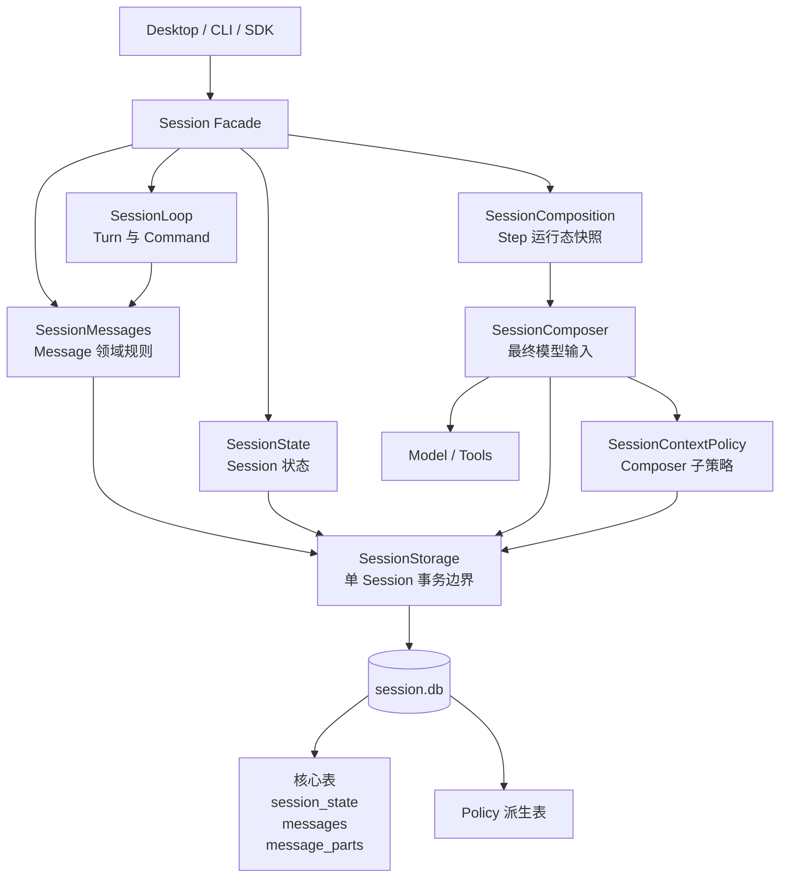
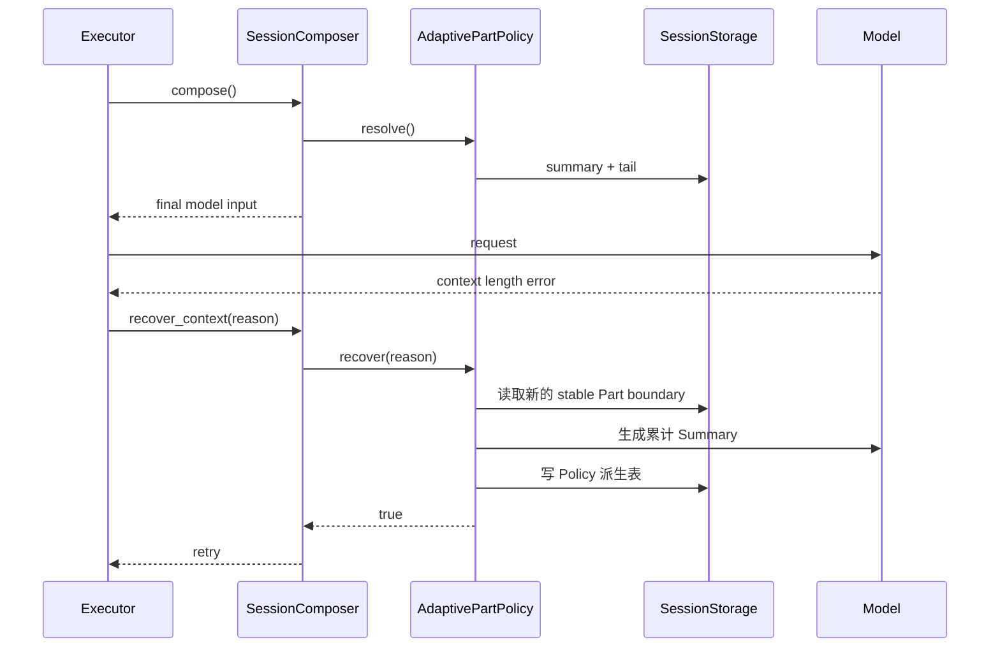

# Session SQLite Storage 与 Composer 重设计 PRD

> 状态：已实现（迁移脚本与运行时已完成）
>
> 适用范围：`@downcity/agent` Session Runtime、`@downcity/type` Session 协议、Desktop/UI Session 消费端
>
> 上位规范：[Downcity 工程设计与代码演进规范](./engineering-design-standard.md)

## 1. 文档目的

本文定义 Session 持久化、canonical Message、Composer 与上下文策略的完整重设计。

本次重设计不以“把 JSONL 换成 SQLite”为唯一目标，而是修正当前架构中领域事实、物理存储和模型上下文策略互相耦合的问题，使系统满足：

- 一个 Session 对应一个明确、可独立管理的 `session.db`；
- Session 状态、Message 和 Part 在同一数据库事务边界内提交；
- canonical Message 不依赖任何 Composer 或上下文压缩方案；
- Composer 是最终模型输入的唯一生成者；
- Composer 可以组合不同 Context Policy；
- 每种 Policy 可以在同一个 `session.db` 中维护自己的派生表；
- 多种 Policy 数据可以并存，切换方案不迁移或改写 canonical Message；
- 原始历史永久保留，摘要、索引和检索结果只是可重建派生数据。

## 2. 结论摘要

### 2.1 核心决策

1. 一个持久化 Session 对应一个目录和一个 SQLite 数据库：

   ```text
   <session>/
   ├── session.db
   └── attachments/
   ```

2. `session.db` 包含三张稳定核心表：

   ```text
   session_state
   messages
   message_parts
   ```

3. Message 领域结构继续保持：

   ```text
   Turn
   └── Message
       └── Part
   ```

4. `messages` 一行表示一条 User 或 Agent Message 的 envelope。

5. `message_parts` 一行表示一个 Part，使用 `type + content` 保存具体内容；`content` 是单个 Part 的 JSON 数据，不是数组。

6. 对外 `SessionMessage` 仍是聚合对象，读取时由 `messages + message_parts` 组装得到；数据库结构不直接泄漏给 UI、Executor 或 Model Provider。

7. `SessionStorage` 是单个 Session 的结构化持久化边界。不得命名为 `SessionMemory`，避免与 Agent Memory 产品概念混淆。

8. `SessionComposer` 负责生成最终送给模型的 `system + messages + tools`，并在内部组合一个 Context Policy。

9. 默认摘要方案实现为 `AdaptivePartContextPolicy`，以 Part 为上下文边界并使用自己的 checkpoint 派生表。

10. JSONL、Active、Segment、Assistant draft file、revision fold 和文件级崩溃补偿全部删除，不保留运行时双轨兼容。

### 2.2 目标心智模型



## 3. 背景与当前问题

### 3.1 当前物理模型

当前 Session 状态分布在多个文件中：

```text
meta.json
instruction.md
messages/active.jsonl
messages/agent_message.json
messages/segments/*.jsonl
attachments/*
```

这些文件共同表达一个 Session，但没有共享事务。代码必须额外维护：

- Active 与 Segment 的连续 sequence；
- Segment 与 Active 的非重叠边界；
- streaming Assistant draft 与 finalized Message 的排他关系；
- 同一 Message 多个 revision 的折叠；
- Compact 先写 Segment、后覆盖 Active 的崩溃恢复；
- 多文件写入期间的锁和补偿；
- Metadata 统计与真实 Message 的同步。

这等于在文件系统之上手工实现一个功能不完整的数据库。

### 3.2 Store contract 泄漏 JSONL 拓扑

当前 Message Store contract 包含：

```text
read_segment_before
read_latest_summary
compact_active
list_segment_ranges
active_before_sequence
read_agent_message
finalize_agent_message
```

这些方法不是稳定的 Message 领域能力，而是 `Active + Segment + draft` 物理实现的直接投影。

后果是：

- SQLite、数据库或其他持久化实现必须模拟 Segment；
- Composer 被迫围绕 Active 和 Summary 工作；
- 模型上下文策略无法独立变化；
- 存储介质可替换，但记忆拓扑不可替换；
- Store 成为 Composer 策略的一部分，依赖方向倒置。

### 3.3 `parts[]` 整体存储不适合事务更新

canonical Message 作为领域聚合拥有 `parts[]` 是合理的，但把整个数组作为一个数据库字段会产生问题：

- 更新一个 Tool Part 必须覆盖整个 Message 内容；
- Interaction 与 Tool 的关联状态无法以行级事务明确提交；
- SQLite 无法直接定位 pending Interaction 或 running Action；
- Part 新增、更新与删除的约束只能在应用层维护；
- 大型 Agent Message 的任意小更新都需要重写全部 Parts。

领域聚合结构和物理关系结构不应强制相同。

### 3.4 把 Part 直接当 Message 同样错误

如果 `messages` 表的一行直接表示一个 Part，会丢失稳定 Message 边界：

- 一次 User 输入中的文本和附件需要靠 `turn_id` 猜测分组；
- 一次 Agent 表达中的 reasoning、tool、text 需要靠 Step 或相邻 role 猜测分组；
- Message 的 streaming、completed、stopped、failed 状态失去所有者；
- Timeline 气泡和 Mutation 必须重新进行启发式聚合；
- Composer 无法确定一次完整主体表达的边界。

因此必须同时保留 Message 聚合和 Part 原子记录。

### 3.5 Compact 混合了两种职责

当前 Compact 同时执行：

```text
生成模型上下文摘要
+
移动和重写原始历史文件
```

但二者的生命周期不同：

- 原始 Message 是永久 canonical facts；
- Summary 是某种 Composer Policy 的派生上下文；
- 更换 Policy 不应该移动或重写 Message；
- Summary 失败不应该改变历史存储；
- Retrieval、全文历史或未来其他策略不一定存在 Compact 概念。

## 4. 产品意图

Session 回答：

> 一段连续对话如何排队、执行、持久化、恢复，并在每个模型 Step 形成确定的输入。

Session Storage 回答：

> 单个 Session 的业务状态和 canonical 对话事实如何在同一个事务边界中保存、查询和恢复。

Session Composer 回答：

> 当前 Session 的状态、运行时环境和 canonical 历史如何生成一次最终模型输入。

Context Policy 回答：

> Composer 应从 canonical 历史中选择、压缩或检索哪些内容，并维护哪些可重建派生状态。

这四个意图必须保持独立，不能再由一个 Store contract 或 Compact 流程混合表达。

## 5. 目标

### 5.1 数据目标

- Session 结构化事实统一进入 `session.db`；
- Message 和 Part 具有清晰关系与数据库约束；
- 同一 Message 的多 Part 更新可以原子提交；
- 所有 canonical Message 均可完整分页、Fork 和恢复；
- Summary 或索引不替代原始 Message；
- 数据库提交成功后才更新内存投影并发布 Mutation；
- 崩溃恢复只处理业务状态，不处理手写文件协议的半提交状态。

### 5.2 架构目标

- 删除 JSONL 物理概念对 Session 领域的渗透；
- `SessionStorage` 不理解 Model、Composer、Prompt 或 UI；
- `SessionComposer` 不拥有 canonical Message；
- Context Policy 是 Composer 子能力，不成为 Session 平级服务；
- Policy 可以定义独立派生表并与其他 Policy 数据并存；
- 默认实现保持低概念数量，避免建立万能 Memory Framework。

### 5.3 使用目标

- 默认用户不需要理解数据库或 Policy；
- 自定义上下文方案只替换 Composer 或其 Context Policy；
- 切换 Context Policy 不迁移 Message；
- Session 目录可以整体备份、移动、归档和诊断；
- Desktop/UI 继续消费稳定的聚合 Message，而不是 SQL row。

## 6. 非目标

本次不实现：

- Agent 跨 Session 长期 Memory；
- Embedding 或向量数据库；
- 跨 Session 共享上下文；
- 云端多主数据库；
- 多进程并发执行同一个 Session；
- 将附件二进制写入 SQLite；
- 将所有 Policy 统一成一个万能 schema；
- 为未来假设提前实现通用 RAG Framework；
- 保留 JSONL 与 SQLite 两套运行时；
- Desktop 内运行旧数据迁移；
- 对旧公开 Store API 提供 deprecated alias。

## 7. 核心术语

| 术语 | 定义 |
|---|---|
| Session | 一段连续对话和执行的领域边界 |
| Turn | 由一个 Prompt 开始、可吸收 Steer 的连续执行生命周期 |
| Step | Turn 中的一次模型请求及其关联 Tool 执行阶段 |
| Message | User 或 Agent 的一次完整主体表达，是 Part 的聚合根 |
| Part | Message 内一个有类型、有顺序、可独立更新的内容单元 |
| canonical facts | `session_state`、`messages`、`message_parts` 中不可由派生数据替代的业务事实 |
| SessionStorage | 单个 Session 的 SQLite 连接、核心 Repository、事务与恢复边界 |
| SessionComposer | 生成最终模型输入的策略边界 |
| Context Policy | Composer 内部负责历史选择、摘要或检索的子策略 |
| Policy table | 某一 Context Policy 在 `session.db` 内维护的可重建派生表 |

禁止把本 PRD 中的上下文选择能力命名为 `SessionMemory`，因为 Downcity 已存在独立的 Agent Memory 产品领域。

## 8. 领域模型

### 8.1 稳定层级

```text
Session
└── Turn
    ├── User Message
    │   ├── Text Part
    │   └── File Part
    └── Agent Message
        ├── Step A
        │   ├── Reasoning Part
        │   └── Tool Part
        └── Step B
            └── Text Part
```

各层含义：

- Turn 拥有执行生命周期，不是 UI Message；
- Message 拥有主体、可见性、revision，以及 Agent 聚合是否仍可写；
- Part 拥有具体内容类型和类型专属状态；
- Step 只是 Agent Part 的来源关联，不替代 Message。

### 8.2 Message 边界

一条 User Message 表示一次完整输入，可以包含多个 Part。是否创建新 Turn 或并入当前 Turn 是 SessionLoop 的调度结果，由 `turn_id` 表达，不在 Message 中重复保存 prompt/steer 类别。

一条 Agent Message 表示一次连续 Agent 表达：

- 可以跨越多个模型 Step；
- 可以包含 reasoning、tool、interaction、text 等 Part；
- Steer 被吸收时，当前 Agent Message 收口，后续输出进入新的 Agent Message；
- 独立 Session Action 或 Error 可以使用只包含一个对应 Part 的 Agent Message 表达。

### 8.3 新的公开 Message 判别字段

顶层 Message 使用 `role` 判别主体，不再使用 `type` 表示 User/Agent：

```ts
type SessionMessage =
  | SessionUserMessage
  | SessionAgentMessage;

interface SessionMessageBase {
  /** 当前 Message 的稳定唯一标识。 */
  message_id: string;
  /** 当前 Message 所属 Session。 */
  session_id: string;
  /** 当前 Message 所属 Turn；独立 Session Action 可以为空。 */
  turn_id?: string;
  /** Message 在 Session 中的不可变线性顺序。 */
  sequence: number;
  /** Message 聚合版本；任一 Part 或 envelope 改变后递增。 */
  revision: number;
  /** 当前 Message 的表达主体。 */
  role: "user" | "agent";
  /** 当前 Message 的默认展示范围。 */
  visibility: "visible" | "internal";
  /** Message 首次创建时间戳。 */
  created_at: number;
  /** Message 最近提交时间戳。 */
  updated_at: number;
  /** Fork 导入时保留的来源身份。 */
  origin?: SessionMessageOrigin;
}
```

User Message：

```ts
interface SessionUserMessage extends SessionMessageBase {
  /** User Message 主体固定为 user。 */
  role: "user";
  /** User Message 内按 sequence 排序的内容。 */
  parts: SessionUserMessagePart[];
}
```

Agent Message：

```ts
interface SessionAgentMessage extends SessionMessageBase {
  /** Agent Message 主体固定为 agent。 */
  role: "agent";
  /** Agent Message 是否仍可追加 Part。 */
  state: "streaming" | "done";
  /** Agent Message 内按 sequence 排序的内容。 */
  parts: SessionAgentMessagePart[];
}
```

Agent Message 不持久化 Turn 的成功、停止、失败四态。`state` 只表示聚合写入生命周期；停止和失败的持久化原因由 Error Part 表达，Turn 结果仍保留自己的终态。

以下旧概念删除：

- 顶层 `message.type = user | agent`；
- `SessionAgentMessage.kind = summary`；
- `summary_through_message_id`；
- 把 Summary 伪装成 Agent Message。

Summary 属于具体 Context Policy 的派生表，不属于 canonical Message。

### 8.4 Part 协议

Part 继续使用 `type` 作为内容类型判别字段：

```text
User Part:
  text | context | file | data

Agent Part:
  text | reasoning | tool | interaction | file | data | action | error
```

每个 Part 至少包含：

```ts
interface SessionPartBase {
  /** Part 的稳定唯一标识。 */
  part_id: string;
  /** Part 在所属 Message 中的不可变顺序。 */
  sequence: number;
  /** 产生当前 Part 的模型 Step；非模型 Part 可以为空。 */
  step_id?: string;
  /** Part 的具体内容类型。 */
  type: string;
}
```

`step_id` 放在 Part 而不是 Message：一条 Agent Message 可以跨多个模型 Step，而每个模型产生的 Part 只属于一个 Step。

Part 类型专属字段继续保留在领域类型中，例如 Tool Part 仍直接拥有 `tool_call_id`、`tool_name`、`state`、`input` 和 `output`。`content` 只是数据库 codec 使用的物理字段，不额外引入到公开 Part 对象中。

## 9. 物理存储结构

### 9.1 Session 目录

```text
agents/<agent_id>/
└── sessions/<encoded_origin_type>/<encoded_session_id>/
    ├── session.db
    └── attachments/
        └── <attachment_id>
```

归档结构保持同样内容，只移动到归档分区：

```text
agents/<agent_id>/
└── archived-sessions/<encoded_origin_type>/<encoded_session_id>/
    ├── session.db
    └── attachments/
```

### 9.2 数据库运行参数

持久 SQLite 默认启用：

```sql
PRAGMA foreign_keys = ON;
PRAGMA journal_mode = WAL;
PRAGMA synchronous = NORMAL;
PRAGMA busy_timeout = 5000;
```

约束：

- 一个活跃 Session Runtime 持有一个稳定数据库连接；
- `SessionStorage.dispose()` 负责关闭连接；
- 归档、删除或移动 Session 前必须先释放连接；
- 文件和目录权限继续保持 `0700/0600`；
- `session.db-wal` 与 `session.db-shm` 是 SQLite 正常运行文件，不构成额外领域事实源；
- 归档或备份前必须 checkpoint WAL 或使用 SQLite backup 能力，不能只复制主文件。

### 9.3 内存模式

无宿主 Agent 和 MemoryStorageProvider 使用独立的 SQLite `:memory:` 连接：

```text
一个内存 Session
=
一个独立 SQLite :memory: database
```

内存模式仍使用完全相同的 schema、事务、codec 和恢复规则，不维护另一套 Map Store 行为。

`StorageScope` 必须提供明确的数据库位置能力，不能让 Session 通过路径字符串猜测当前 Provider 是否持久化。建议中立协议为：

```ts
type StorageDatabaseLocation =
  | {
      /** 使用真实本地 SQLite 文件。 */
      type: "file";
      /** 数据库文件绝对路径。 */
      path: string;
    }
  | {
      /** 使用当前 Scope 生命周期内的内存数据库。 */
      type: "memory";
      /** Scope 内稳定数据库键。 */
      key: string;
    };
```

Provider 只声明存储位置，不理解 Agent、Session 或表结构。`SessionStorage` 负责打开 SQLite。

## 10. 核心数据库模型

### 10.1 核心表范围

所有 Composer 必须共享且只能依赖以下 canonical 表：

```text
session_state
messages
message_parts
```

SQLite schema 版本使用 `PRAGMA user_version` 管理，不额外建立通用 migrations 业务表。

### 10.2 `session_state`

`session_state` 是单行业务状态表，保留明确字段，不使用通用 `content` JSON 代替稳定业务结构。

```sql
CREATE TABLE session_state (
  singleton_id INTEGER PRIMARY KEY CHECK (singleton_id = 1),
  session_id TEXT NOT NULL UNIQUE,
  agent_id TEXT NOT NULL,
  workspace_id TEXT,
  origin TEXT NOT NULL CHECK (json_valid(origin)),
  timezone TEXT NOT NULL,
  title TEXT,
  model_label TEXT,
  approval_mode TEXT CHECK (
    approval_mode IS NULL OR
    approval_mode IN ('ask', 'always-allow')
  ),
  system_snapshot TEXT,
  message_count INTEGER NOT NULL DEFAULT 0 CHECK (message_count >= 0),
  preview_text TEXT,
  revision INTEGER NOT NULL DEFAULT 1 CHECK (revision >= 1),
  created_at INTEGER NOT NULL,
  updated_at INTEGER NOT NULL
);
```

说明：

- `origin` 本质是可扩展结构，使用 JSON 保存；
- `system_snapshot` 取代 `instruction.md`；
- `message_count` 与 `preview_text` 是 Session 列表读取需要的物化投影；
- 两个投影必须与 Message 变更在同一事务中更新，因此不是独立事实源；
- `historyBytes` 删除，SQLite 文件字节数不能表示有效历史边界；
- effective model、effective approval 等执行期状态不写入数据库，只持久化 configured state；
- `revision` 用于防止多个异步状态更新互相覆盖。

### 10.3 `messages`

`messages` 保存 Message 聚合 envelope，不保存 Part 类型和 Part 内容：

```sql
CREATE TABLE messages (
  message_id TEXT PRIMARY KEY,
  turn_id TEXT,
  sequence INTEGER NOT NULL UNIQUE CHECK (sequence >= 1),
  revision INTEGER NOT NULL DEFAULT 1 CHECK (revision >= 1),
  role TEXT NOT NULL CHECK (role IN ('user', 'agent')),
  state TEXT CHECK (
    state IS NULL OR state IN ('streaming', 'done')
  ),
  visibility TEXT NOT NULL CHECK (
    visibility IN ('visible', 'internal')
  ),
  origin_session_id TEXT,
  origin_message_id TEXT,
  origin_turn_id TEXT,
  created_at INTEGER NOT NULL,
  updated_at INTEGER NOT NULL,
  CHECK (
    (role = 'user' AND state IS NULL) OR
    (role = 'agent' AND state IS NOT NULL)
  )
);

CREATE INDEX messages_turn_sequence_index
ON messages(turn_id, sequence);

CREATE INDEX messages_visibility_sequence_index
ON messages(visibility, sequence);
```

不在 `messages` 中保存：

- `parts[]` JSON；
- `type = text | tool | ...`；
- Tool、Interaction、Action 或 Error 字段；
- Summary 或 Context Policy 状态；
- Step ID。

Message 的 `revision` 是聚合 revision。任何 envelope 或所属 Part 的可观察变化都会递增它。

### 10.4 `message_parts`

`message_parts` 一行保存一个 Part：

```sql
CREATE TABLE message_parts (
  part_id TEXT PRIMARY KEY,
  message_id TEXT NOT NULL REFERENCES messages(message_id) ON DELETE CASCADE,
  sequence INTEGER NOT NULL CHECK (sequence >= 1),
  step_id TEXT,
  type TEXT NOT NULL CHECK (
    type IN (
      'text',
      'context',
      'reasoning',
      'tool',
      'interaction',
      'file',
      'data',
      'action',
      'error'
    )
  ),
  content TEXT NOT NULL CHECK (json_valid(content)),
  created_at INTEGER NOT NULL,
  updated_at INTEGER NOT NULL,
  UNIQUE(message_id, sequence)
);

CREATE INDEX message_parts_message_sequence_index
ON message_parts(message_id, sequence);

CREATE INDEX message_parts_step_index
ON message_parts(step_id, message_id, sequence);

CREATE INDEX message_parts_type_index
ON message_parts(type, message_id);
```

其中：

- `type` 是 Part discriminant；
- `content` 只保存当前单个 Part 的类型专属内容；
- `content` 不是数组；
- `content` 不重复保存 `part_id`、`message_id`、`sequence`、`step_id` 和 `type`；
- Part 不维护独立 revision，所属 Message revision 是对外一致性版本；
- `created_at/updated_at` 用于诊断 Part 生命周期，不参与 Message 排序；
- Part 的真实显示顺序只由 `(message_id, sequence)` 决定。

示例 Tool Part row：

```text
part_id    = part-tool-1
message_id = message-agent-1
sequence   = 2
step_id    = step-1
type       = tool
content    = {
  "tool_call_id": "call-1",
  "tool_name": "read_file",
  "state": "completed",
  "input": { "path": "src/index.ts" },
  "output": { "text": "..." }
}
```

### 10.5 role/type 合法组合

数据库初始化时增加 Trigger，禁止错误主体使用不合法 Part：

```text
role=user
  → text | context | file | data

role=agent
  → text | reasoning | tool | interaction | file | data | action | error
```

Trigger 的约束语义如下，INSERT 与 UPDATE 必须各自建立同等约束：

```sql
CREATE TRIGGER message_parts_validate_role_insert
BEFORE INSERT ON message_parts
WHEN NOT (
  (
    (SELECT role FROM messages WHERE message_id = NEW.message_id) = 'user'
    AND NEW.type IN ('text', 'context', 'file', 'data')
  ) OR
  (
    (SELECT role FROM messages WHERE message_id = NEW.message_id) = 'agent'
    AND NEW.type IN (
      'text', 'reasoning', 'tool', 'interaction',
      'file', 'data', 'action', 'error'
    )
  )
)
BEGIN
  SELECT RAISE(ABORT, 'message part type is incompatible with message role');
END;
```

Message 创建后 `role` 不允许更新。User/Agent 身份变化必须创建新 Message，不能原地改写已有历史。

这一约束必须同时由：

- TypeScript discriminated union；
- Session Message codec；
- SQLite Trigger；

三层守护。数据库 Trigger 是持久化下限，不能只依赖调用方类型检查。

## 11. SessionStorage 设计

### 11.1 职责

`SessionStorage` 是单个 Session 的结构化存储拥有者，负责：

- 创建和关闭 SQLite 连接；
- 初始化全新核心 schema，并拒绝运行时打开旧版本；
- 提供 State 和 Message Repository；
- 执行单 Session 数据库事务；
- 恢复中断的业务状态；
- 为 Composer Policy 提供派生表访问范围；
- 清空、Fork、统计与一致性检查。

它不负责：

- Queue 或 Turn 生命周期；
- 模型调用；
- 选择上下文；
- 生成 Summary；
- UI Mutation；
- 读取 Workspace 项目文件。

### 11.2 内部结构

```text
SessionStorage
├── SessionStateRepository
├── SessionMessageRepository
├── SessionComposerStorage
├── SessionStorageRecovery
└── SQLite connection
```

这些对象是内部职责拆分，不作为 package 根入口的公共 Service Container。

### 11.3 SessionStorage contract

```ts
interface SessionStorage {
  /** 初始化 schema、身份和恢复事务。 */
  initialize(input: SessionStorageIdentity): Promise<void>;

  /** 读取单行 Session 状态。 */
  read_state(): Promise<SessionStateRecord>;

  /** 使用 expected revision 原子更新 Session 状态。 */
  update_state(input: SessionStateUpdate): Promise<SessionStateRecord>;

  /** 创建新的完整 Message 聚合。 */
  create_message(input: CreateSessionMessageInput): Promise<SessionMessage>;

  /** 在一个事务中提交 Message envelope 与 Parts 变化。 */
  update_message(input: UpdateSessionMessageInput): Promise<SessionMessage>;

  /** 按 Message ID 读取完整聚合。 */
  read_message(message_id: string): Promise<SessionMessage | null>;

  /** 按 Message 边界分页读取完整聚合。 */
  list_messages(input: SessionMessageQuery): Promise<SessionMessagePage>;

  /** 读取 Composer 所需的一致性历史快照。 */
  read_history(input?: SessionHistoryQuery): Promise<SessionMessage[]>;

  /** 为当前 Composer 创建受限派生存储视图。 */
  composer_storage(namespace: string): SessionComposerStorage;

  /** 清空 Message 与关联派生数据，保留 Session State。 */
  clear_messages(): Promise<void>;

  /** 释放数据库连接和相关资源。 */
  dispose(): Promise<void>;
}
```

`SessionStorage` 是 Agent package 内部稳定能力，不再公开导出 JSONL 实现类或 Message Store factory。

### 11.4 读取聚合规则

Message 分页必须使用两次批量查询，禁止 N+1：

```text
1. SELECT messages ... ORDER BY sequence LIMIT ?
2. SELECT message_parts WHERE message_id IN (...) ORDER BY message_id, sequence
3. Codec 按 message_id 组装 SessionMessage.parts[]
```

分页边界属于 Message：

```ts
interface ListSessionMessagesInput {
  /** 读取该 Message sequence 之前的历史。 */
  before_sequence?: number;
  /** 单页最大 Message 数。 */
  limit?: number;
  /** 是否包含 internal Message。 */
  include_internal?: boolean;
}
```

返回结构删除：

```text
source: active | segment
```

统一返回普通 cursor page：

```ts
interface SessionMessagePage {
  /** 当前页完整 Message 聚合。 */
  items: SessionMessage[];
  /** 当前 Session Message 总数。 */
  total: number;
  /** 下一页的 before_sequence；没有更早数据时为空。 */
  next_before_sequence?: number;
  /** 是否仍有更早 Message。 */
  has_more: boolean;
}
```

## 12. Message 事务

### 12.1 创建 User Message

```mermaid
sequenceDiagram
    participant Loop as SessionLoop
    participant Messages as SessionMessages
    participant Storage as SessionStorage
    participant DB as session.db
    participant Events as SessionEventHub

    Loop->>Messages: append_user_message(parts)
    Messages->>Storage: create_message()
    Storage->>DB: BEGIN IMMEDIATE
    DB->>DB: 分配 next message sequence
    DB->>DB: INSERT messages
    DB->>DB: INSERT message_parts
    DB->>DB: UPDATE session_state projection
    DB->>DB: COMMIT
    DB-->>Messages: 完整 SessionUserMessage
    Messages->>Events: publish message mutation
```

只有 COMMIT 成功后 Prompt 才被视为已接受。

### 12.2 创建 Agent Message

创建空的 streaming Agent Message，并与 Session 列表投影在同一事务中提交：

```text
INSERT messages(state = streaming, revision = 1)
+
UPDATE session_state
```

不再创建 `agent_message.json`。

### 12.3 模型 Step 投影与提交

模型流事件不逐 chunk 写数据库：

```text
ModelStreamEvent
→ 更新 Agent Message 内存投影
→ 发布 part / delta Mutation
→ Step 完成并校验 Part identity
→ 一次事务提交完整 Step 快照
→ 发布提交后的完整 message Mutation
```

Tool 执行前后、Interaction 状态、Action/Error 和 Message 收口是不可丢失的语义检查点，可以在 Step 内独立提交。也就是说：事件负责实时展示，内存负责流式组装，数据库只保存稳定语义检查点。

### 12.4 更新一个稳定检查点

```text
BEGIN IMMEDIATE
  校验 messages.revision = expected_revision
  INSERT 或 UPDATE message_parts
  UPDATE messages
    SET revision = revision + 1,
        updated_at = ?
  UPDATE session_state.updated_at
COMMIT
```

`UPDATE messages` 受影响行数必须为 `1`，否则抛出稳定 revision conflict，不能覆盖较新状态。

### 12.5 原子更新多个 Part

Interaction 响应的典型事务：

```text
BEGIN IMMEDIATE
  interaction: pending → resolved/cancelled
  tool: waiting-user → running/failed
  message.revision += 1
  session_state.updated_at = now
COMMIT
```

调用方只收到一个提交后的完整 Message snapshot。不得先发布 Interaction、再尝试更新 Tool。

### 12.6 完成 Agent Message

```text
BEGIN IMMEDIATE
  校验 Agent Message 仍为 streaming
  text/reasoning streaming → done
  未完成 tool → failed
  pending interaction → cancelled
  按需追加停止或失败 Error Part
  messages.state → done
  messages.revision += 1
  更新 session_state projection
COMMIT
```

### 12.7 发布顺序

所有稳定检查点写入必须保持：

```text
数据库事务 COMMIT
→ 更新 SessionMessages 内存投影
→ 发布 Mutation
```

禁止：

- 把未提交的流式投影伪装成稳定 Message snapshot；
- COMMIT 前发布检查点成功事件；
- Store 失败后仍完成 TurnHandle；
- Mutation 成为数据库事实源。

## 13. 恢复与一致性

### 13.1 初始化恢复事务

`SessionStorage.initialize()` 只初始化 schema 与身份；`SessionMessages.initialize()` 查询非终态 Message 后提交领域恢复结果：

```text
BEGIN IMMEDIATE
  校验 session_state 身份
  校验 schema version
  查询 state = streaming 的 Agent Message
  收口为 done 并追加 runtime_interrupted Error Part
  收口其中未完成 Tool
  取消 pending Interaction
  将 running Action 标记为 failed
  递增受影响 Message revision
  更新 Session State projection
COMMIT
```

SQLite 自己负责未提交事务回滚。Session 不再实现：

- 草稿文件与 Active 去重；
- Segment/Active 重叠修复；
- JSONL 尾行修复；
- revision 行扫描折叠；
- 文件锁残留恢复。

### 13.2 身份不变量

数据库首次创建时写入：

```text
session_id
agent_id
origin
workspace_id
```

再次打开时：

- `session_id`、`agent_id`、完整 `origin` 必须一致；
- `origin.type` 决定物理分区；
- `workspace_id` 只能通过现有显式重绑流程修改；
- 身份不一致必须拒绝打开，不能回退为新 Session。

### 13.3 数据库损坏

SQLite integrity check 失败时：

- Session 初始化失败；
- 不创建空数据库覆盖原文件；
- 不静默忽略损坏 row；
- 错误包含 Session ID 与数据库位置，但不输出消息正文；
- 恢复工具属于外部诊断脚本，不进入 Desktop 自动流程。

## 14. SessionComposer 设计

### 14.1 定位

`SessionComposer` 是最终模型输入的唯一生成者：

```text
Session runtime snapshot
+
canonical Session history
+
Context Policy 结果
→
system + model messages + tools
```

它负责：

- 组装 system blocks；
- 注入 Plugin 动态上下文；
- 调用内部 Context Policy；
- 把 Policy 结果与当前输入转换成 ModelMessage；
- 返回一次模型 Step 的最终输入；
- 在上下文超限时询问 Policy 是否可以调整并重试。

它不负责：

- 创建或更新 canonical Message；
- 修改 Session State；
- 拥有 Turn；
- 发布 Mutation；
- 直接管理 SQLite 连接生命周期。

### 14.2 Composer contract

```ts
interface SessionComposer {
  /** Composer 稳定身份，用于日志和派生存储 namespace。 */
  readonly name: string;

  /** 初始化 Composer 及内部 Policy 的派生 schema。 */
  initialize(input: SessionComposerInitializeInput): Promise<void>;

  /** 生成一次模型 Step 使用的最终 system、messages 与 tools。 */
  compose(input: SessionComposeInput): Promise<SessionStepInput>;

  /** 尝试调整上下文派生状态；返回 true 时 Executor 可以重试。 */
  recover_context(input: SessionContextRecoveryInput): Promise<boolean>;
}
```

`recover_context()` 取代旧的：

```text
should_compact()
compact()
Session.compact_history()
```

Provider 错误是否属于上下文超限只在 Executor 边界识别一次；Composer 与 Policy 只接收 `provider_context_limit` 或 `usage_pressure` 领域原因，并判断是否可以生成新派生上下文。

### 14.3 SessionComposition 与 Composer

`SessionComposition` 继续负责捕获当前 Step 的不可变运行态：

- Agent instruction；
- system snapshot；
- Workspace env；
- tools；
- Plugin system blocks；
- Plugin context lease；
- model 与 context window；
- Turn/Step identity。

它不再读取 `SessionMessages.context_snapshot()`。Composer 通过只读 canonical history port 获取所需历史，并通过自己的 Policy storage 写派生数据。

## 15. Context Policy 设计

### 15.1 定位

Context Policy 是 Composer 的内部组合策略，不是 Session 平级服务，也不命名为 Memory Policy。

```ts
interface SessionContextPolicy {
  /** Policy 稳定名称。 */
  readonly name: string;

  /** 初始化当前 Policy 的专属派生表。 */
  initialize(input: SessionContextPolicyInitializeInput): Promise<void>;

  /** 从 canonical history 与派生状态生成模型历史。 */
  resolve(input: SessionContextPolicyInput): Promise<SessionResolvedContext>;

  /** 在上下文错误后尝试更新派生状态。 */
  recover(input: SessionContextPolicyRecoveryInput): Promise<boolean>;
}
```

`DefaultSessionComposer` 默认组合：

```ts
new DefaultSessionComposer({
  context_policy: new AdaptivePartContextPolicy(),
});
```

Policy 是否公开由真实用户扩展需求决定。第一阶段至少公开内置 Policy 构造入口和稳定类型；数据库 helper 不进入 package 根入口。

### 15.2 Policy 输出

Context Policy 返回已经按模型历史语义组织的内容：

```ts
interface SessionResolvedContext {
  /** 送入模型的历史消息，顺序已经确定。 */
  messages: ModelMessage[];
  /** Policy 生成的显式 system 上下文，不伪装成普通历史。 */
  system_blocks?: SessionSystemBlock[];
  /** 可观察但不进入 canonical Message 的策略诊断。 */
  diagnostics: {
    /** 当前 Policy 名称。 */
    policy_name: string;
    /** 本次上下文覆盖到的最新 canonical Message sequence。 */
    through_sequence?: number;
    /** 是否使用派生摘要或检索数据。 */
    derived: boolean;
  };
}
```

Composer 再把这些历史与 system、当前 Plugin context 和 tools 组合成最终 `SessionStepInput`。

### 15.3 Policy 派生表原则

每个 Policy 可以建立自己的表，但必须满足：

- 表名使用稳定 namespace，例如 `composer_adaptive_part_*`；
- 只能把核心 Message/Part 当来源，不能修改它们；
- 派生 row 应通过外键引用来源 Message 或 Part；
- 来源删除时使用 `ON DELETE CASCADE` 或明确失效机制；
- 派生表可以全部删除后从 canonical facts 重建；
- 派生写入失败不得修改 canonical facts；
- 不同 Policy 的表可以同时存在；
- 切换 Policy 不自动删除其他 Policy 表；
- schema 不兼容时由对应 Policy 自己迁移或重建；
- Policy 表不能被 Session Timeline、Fork 或 Message API 当成历史来源。

### 15.4 Composer storage

`SessionStorage` 向 Composer 提供两个能力：

```text
只读 canonical history
+
带 namespace 的 Policy 派生存储
```

```ts
interface SessionComposerStorage {
  /** 按 Message 边界读取 canonical history。 */
  list_messages(input: SessionHistoryQuery): Promise<SessionMessage[]>;

  /** 读取指定 Message sequence 是否存在且已经关闭。 */
  read_boundary(sequence: number): Promise<SessionHistoryBoundary | null>;

  /** 在 Policy 专属 namespace 中执行派生事务。 */
  transaction<T>(operation: SessionComposerStorageTransaction<T>): Promise<T>;
}

interface SessionComposerStorageTransaction {
  /** 执行一条不返回 row 的 Policy SQL。 */
  execute(sql: string, parameters?: readonly JsonValue[]): Promise<void>;

  /** 读取第一条 Policy row；没有结果时返回空。 */
  get<TRow>(sql: string, parameters?: readonly JsonValue[]): Promise<TRow | null>;

  /** 读取全部匹配的 Policy rows。 */
  all<TRow>(sql: string, parameters?: readonly JsonValue[]): Promise<TRow[]>;
}
```

这组 SQL 能力只在 Agent package 内部交给 Policy Repository，不从 package 根入口导出，也不提供数据库 close、attach 或 pragma 权限。Policy 属于受信任的本地代码；核心表只读是架构 contract，并由内置 Policy 测试和 SQL 静态扫描守护，不能宣称它是第三方恶意代码的安全沙箱。

## 16. 默认 Adaptive Part Policy

### 16.1 专属表

默认策略只使用一个独立派生表：

```sql
CREATE TABLE composer_adaptive_part_checkpoints (
  checkpoint_id TEXT PRIMARY KEY,
  through_message_id TEXT NOT NULL REFERENCES messages(message_id) ON DELETE CASCADE,
  through_message_sequence INTEGER NOT NULL,
  through_part_sequence INTEGER NOT NULL,
  summary TEXT NOT NULL,
  policy_version INTEGER NOT NULL,
  created_at INTEGER NOT NULL,
  UNIQUE(through_message_sequence, through_part_sequence, policy_version)
);

```

该表只对 `AdaptivePartContextPolicy` 有意义，canonical Part 永远不被派生内容覆盖。当前没有独立 Part reduction 行为，因此不预留未被消费的表结构。

### 16.2 正常读取

```text
读取最新 Part checkpoint
→ 查询 checkpoint 位置之后的 canonical Parts
→ Summary 转为显式 <session-context-summary> system block
→ Tail Parts 按 Message/Step 语义转为 ModelMessage
→ 返回给 Composer
```

### 16.3 生成新 Summary

默认策略按序列化体积选择足以释放约 50% 原始上下文的较旧稳定 Part，并满足：

- Message 是持久化聚合边界，Part 是上下文处理边界，Turn 是运行生命周期边界；
- 已经稳定的 Part 可以成为边界，即使所属 Agent Message 仍包含其他内容；
- streaming Text/Reasoning Part 不进入摘要；
- Reasoning、Action、Interaction 默认丢弃，不占据摘要；
- Tool call/result 保持一个 Part 的原子性，不能产生孤立调用或结果；
- 上下文压力按 Part 序列化字符体积近似估算，不使用 Part 数量代替体积；
- 只有一个稳定 Part 时仍可以建立 checkpoint，避免单个大 Part 无法恢复；
- 输入为“上一个累计 Summary + 新选中的稳定 Parts”；
- 模型返回空 Summary 时不写派生表；
- Summary 成功后只 INSERT 新 row，不修改或移动 Message；
- 并发提交时通过 `through_sequence UNIQUE` 保证幂等；
- Policy version 变化时不能错误复用不兼容 Summary。

### 16.4 上下文超限恢复



重试次数仍由 Executor Recovery Policy 限制；Composer 不拥有执行循环。

## 17. 其他可并存 Policy

### 17.1 Full History Policy

```text
FullHistoryContextPolicy
├── 不建立派生表
└── 全量读取 canonical Messages
```

适合上下文较短、模型窗口足够或测试场景。

### 17.2 Retrieval Policy

可能拥有：

```text
composer_retrieval_documents
composer_retrieval_embeddings
composer_retrieval_queries
```

这些表引用 `message_parts.part_id`，但不改变 `message_parts.content`。

### 17.3 Observational Policy

可能拥有：

```text
composer_observations
composer_observation_sources
```

Observation 是模型上下文派生物，不成为 Session Message，也不进入 Timeline。

### 17.4 并存示例

```text
session.db
├── session_state                         canonical
├── messages                              canonical
├── message_parts                         canonical
├── composer_sequence_summaries           derived
├── composer_retrieval_documents          derived
├── composer_retrieval_embeddings         derived
└── composer_observations                 derived
```

运行时只激活一个 Composer/Context Policy。未激活 Policy 的表可以保留，不能影响当前上下文。

## 18. ModelMessage 转换规则

canonical Session Message 不是 Provider ModelMessage。二者继续通过唯一 codec 转换。

### 18.1 User Message

一个 User Message 的 Parts 组合为一个 `role=user` ModelMessage：

```text
text     → text content
context  → 带边界标签的 text content
file     → model file content
data     → 默认不进入模型，除非 Composer/Policy 明确支持
```

### 18.2 Agent Message

Agent Part 必须按 `step_id + part.sequence` 重建模型历史：

- reasoning/text/tool call 属于 assistant ModelMessage；
- completed/failed Tool Part 产生对应 tool result ModelMessage；
- Interaction、Action、Error 默认不直接进入模型历史；
- 多个 Step 不能被无条件折叠成一个 assistant + 一个 tool result；
- 没有 `step_id` 的历史 Part 按稳定 fallback 规则归入 Message 默认 Step，仅用于外部追加或非模型内容。

这修正当前转换器可能把多 Step Tool 历史重新排序的问题。

## 19. Mutation 与 UI

### 19.1 持久化事实与传输优化分开

数据库事实：

```text
messages
message_parts
```

实时传输可以继续存在：

```text
message snapshot mutation
part snapshot mutation
delta mutation
```

但 Mutation 只是订阅后的变化通知，不是第二份历史。

### 19.2 revision 规则

- Message 创建后 `revision = 1`；
- 每个稳定检查点提交后，Message revision 加一；
- 多个 Part 在同一事务中变化，只增加一次 revision；
- 未提交的 Part/Delta Mutation 使用当前稳定 revision，不代表数据库版本增加；
- UI 丢弃低于本地稳定 revision 的旧 Mutation；
- UI 断线或 revision 跳跃时重新读取完整 Message snapshot；
- Delta 可以减少渲染成本，但不能用于数据库恢复。

### 19.3 Desktop Timeline

Desktop 仍消费：

```ts
SessionMessage {
  role,
  parts,
}
```

不直接消费 `message_parts` row，也不在前端按 `turn_id` 猜测 Message 边界。

## 20. Prompt、Steer 与 Turn 流程

```mermaid
sequenceDiagram
    participant App
    participant Session
    participant Loop as SessionLoop
    participant Messages as SessionMessages
    participant Storage as SessionStorage
    participant Composition as SessionComposition
    participant Composer as SessionComposer
    participant Policy as ContextPolicy
    participant Executor

    App->>Session: prompt(input)
    Session->>Loop: enqueue Prompt Command
    Loop->>Messages: create User Message
    Messages->>Storage: transaction(messages + parts)
    Storage-->>Messages: committed aggregate
    Loop-->>App: TurnHandle

    Loop->>Executor: execute Turn
    Executor->>Composition: capture Step runtime
    Composition->>Composer: compose(runtime snapshot)
    Composer->>Policy: resolve canonical context
    Policy->>Storage: read messages / derived tables
    Policy-->>Composer: resolved ModelMessage history
    Composer-->>Executor: final StepInput
    Executor->>Messages: stream Agent Parts to memory projection
    Messages-->>App: part / delta Mutation
    Executor->>Messages: commit completed Step
    Messages->>Storage: one transactional Step snapshot

    opt queued Prompt at checkpoint
      Loop->>Messages: create steer User Message
      Loop->>Messages: close current Agent Message
      Loop->>Messages: open next Agent Message
    end
```

Queue、Turn 和 Steer 行为不因数据库改造而改变。

## 21. Stop 与 Interaction

`session.stop()` 仍负责：

- Abort 当前 TurnContext；
- 取消运行时 Interaction waiter；
- 取消可取消 Prompt Command；
- 保留 maintenance Command；
- 收口当前 Agent Message。

数据库变化：

- pending Interaction、关联 Tool 和 Agent Message 在一个事务中收口；
- 不再依赖恢复时扫描 `agent_message.json`；
- `respond()` 先提交 Interaction/Tool 状态事务，再恢复 waiter；
- 数据库提交失败时 waiter 不得收到伪成功结果。

## 22. Fork

Fork 使用源数据库一致性读取：

```text
BEGIN read transaction
  读取 session_state
  读取目标边界前的 messages
  批量读取 message_parts
COMMIT
→ 搬迁附件
→ 创建目标 session.db
→ 在目标事务中重新分配 session/message/turn/part identity
```

规则：

- Fork 边界仍使用顶层 `message_id`；
- 不允许截断单个 Message 的 Parts；
- 不复制任何 Composer Policy 派生表；
- 子 Session 第一次 compose 时由当前 Policy 自行构建派生数据；
- 来源 identity 保存在 Message envelope；
- 目标数据库写入失败时不登记子 Session。

不复制 Policy 表可以避免：

- 引用旧 Message/Part ID；
- 把来源模型或 Policy 配置误带入子 Session；
- 派生数据成为不可解释事实。

## 23. Session 列表、归档与清理

### 23.1 列表

一个 Session 一个数据库意味着 Agent Session 列表需要扫描 Session 目录并读取每个 `session_state` 单行。

第一阶段接受这一行为，并通过以下规则控制成本：

- 只读取 `session_state`，不扫描 Message；
- `message_count` 与 `preview_text` 事务性物化；
- 列表分页时只打开当前候选数据库；
- 读取后立即关闭非活跃 Session 的临时只读连接；
- 活跃 Session 复用已有连接。

本次不增加 Agent 全局 Session 索引数据库。只有实际性能数据证明目录扫描成为瓶颈时，才单独设计可重建索引。

### 23.2 归档

```text
停止 Session
→ dispose SessionStorage
→ SQLite WAL checkpoint
→ 原子移动整个 Session 目录
→ 清理 AgentSessions 实例缓存
```

### 23.3 清空消息

```text
BEGIN IMMEDIATE
  DELETE FROM messages
  -- message_parts 和引用正确的 Policy 数据通过 FK cascade 删除
  UPDATE session_state
    SET message_count = 0,
        preview_text = NULL,
        revision = revision + 1,
        updated_at = ?
COMMIT
```

自定义 Policy 表必须正确引用 canonical row，或在下一次 initialize 时发现来源不存在并重建。

## 24. 公开 API 变化

### 24.1 保留

```text
Session
SessionOptions.composer
DefaultSessionComposer
SessionComposer
SessionMessage
SessionUserMessage
SessionAgentMessage
Session Message Part types
SessionMutation
```

### 24.2 修改

- `SessionMessage.type` 改为 `SessionMessage.role`；
- 删除 User Message 的 `input_type`；
- Agent Message 顶层状态收敛为 `state: streaming | done`；
- Part 的 `type` 保持不变；
- Agent Part 增加可选 `step_id`；
- Message page 删除 `source: active | segment`；
- `before_sequence` 改为普通 Message cursor 语义；
- `SessionComposer` 改为 `initialize/compose/recover_context`；
- `DefaultSessionComposer` 接收 `context_policy`；
- `SessionDataStore` 收敛或替换为 `SessionStorage`；
- Session system snapshot 与 metadata API 改为数据库 State Repository。

### 24.3 删除

从 package 根入口删除：

```text
SessionMessageStore
SessionDataStore（旧 contract）
CompactActiveMessagesInput
CompactActiveMessagesResult
SessionMessageCommitState
create_session_message_store
SessionSegmentRange
SessionSegmentSnapshot
SessionSegmentSummary
```

### 24.4 `session.compact()`

删除公开 `session.compact()`。

原因：

- Compact 不是所有 Composer 的共同产品能力；
- Full History Policy 不需要 Compact；
- Retrieval Policy 可能维护索引而非摘要；
- 用户不应依赖具体 Policy 的内部维护动作。

上下文维护由 Composer 在 Step checkpoint 自动执行。若未来存在真实用户需求，再设计中立的诊断或 refresh API，不能保留带 Segment 语义的旧名称。

## 25. 模块迁移

### 25.1 目标目录

```text
packages/agent/src/session/
├── Session.ts
├── SessionLoop.ts
├── SessionQueue.ts
├── SessionMessages.ts
├── SessionState.ts
├── SessionComposition.ts
├── DefaultSessionComposer.ts
│
├── storage/
│   ├── SqliteSessionStorage.ts
│   ├── SessionStorageSchema.ts
│   ├── SessionStorageCodec.ts
│   ├── SessionStorageRecovery.ts
│   ├── SessionStateRepository.ts
│   ├── SessionMessageRepository.ts
│   ├── LocalSessionStore.ts
│   └── LocalSessionAttachmentStore.ts
│
├── composer/
│   ├── SessionMessageModelCodec.ts
│   └── policies/
│       ├── FullHistoryContextPolicy.ts
│       ├── AdaptivePartContextPolicy.ts
│       └── SessionSummaryPrompts.ts
│
├── messages/
│   ├── SessionAgentMessageState.ts
│   ├── SessionAgentMessageWriter.ts
│   ├── SessionMessageInteractionWriter.ts
│   └── ...
└── runtime/
    └── ...
```

类型统一位于：

```text
packages/agent/src/types/session/
├── SessionStorage.ts
├── SessionComposer.ts
├── SessionContextPolicy.ts
├── SessionMessages.ts
└── ...
```

公开 canonical Message 类型继续位于 `@downcity/type` 的 session 类型目录。

### 25.2 删除模块

```text
JsonlSessionMessageStore.ts
SessionMessageStoreFactory.ts
SessionMessageCompaction.ts
JsonlSessionCompactionPrompts.ts（迁移并重命名）
SessionSegment.ts
所有 Active/Segment path helpers
JSONL browse/fold helpers
```

### 25.3 需要同步迁移的消费端

- Agent Session Runtime；
- AgentSessions browse/archive/clear；
- Executor recovery；
- Session title projection；
- RuntimeSessionPort；
- Desktop Timeline 和 Session list projection；
- `packages/ui` chat runtime；
- CLI/Plugin 中读取 Session Message 的调用方；
- Homepage Session API 文档；
- `docs/session-runtime-architecture.md`。

## 26. 迁移策略

### 26.1 运行时策略

新运行时只识别：

```text
session.db
```

发现旧格式但不存在 `session.db` 时返回明确错误，提示运行外部迁移脚本。Desktop 和 Session Runtime 不执行自动转换。

### 26.2 一次性外部脚本

新增：

```text
scripts/migrate-session-storage-to-sqlite.mjs
```

脚本职责：

1. 扫描指定 Agent Storage；
2. 读取旧 `meta.json`、`instruction.md`、Segments、Active 与 Agent draft；
3. 按最高 revision 折叠旧 Message；
4. 将旧 Message envelope 写入 `messages`；
5. 将每个 Part 写入 `message_parts`；
6. 把旧最新累计 Summary 写入 `composer_sequence_summaries`；
7. 在目标 SQLite 事务中校验 identity、sequence、revision 和 Part 顺序；
8. 运行一致性验证；
9. 成功后保留旧文件，由操作者确认后再删除或归档。

脚本必须：

- 支持 dry-run；
- 支持单 Session 和 Agent 全量范围；
- 重复执行时幂等；
- 任何 Session 失败不覆盖其旧数据；
- 输出数量与错误摘要，不输出消息正文；
- 不被 Desktop 打包或调用。

### 26.3 不保留兼容层

完成仓库内迁移后直接删除旧读取和写入路径，不保留：

- 运行时格式探测后自动迁移；
- SQLite 写入失败回退 JSONL；
- 双写；
- 旧字段 alias；
- 永久 migration adapter。

## 27. 失败语义

| 场景 | 结果 |
|---|---|
| 创建 User Message 失败 | Prompt 不被接受，Turn 不开始 |
| Agent Part 更新失败 | 不更新内存、不发布成功 Mutation，Turn 进入明确失败收口 |
| revision conflict | 抛出领域冲突，禁止覆盖最新状态 |
| Policy Summary 模型失败 | canonical Message 不变；Composer 按恢复策略失败或保留旧上下文 |
| Policy 派生表写入失败 | canonical Message 不变；当前 compose/recovery 明确失败 |
| SQLite busy 超时 | 返回存储不可用错误，不静默丢写 |
| schema 版本过新 | 拒绝打开，不降级读取 |
| identity 不一致 | 拒绝打开，不创建新 State |
| 数据库损坏 | 初始化失败并保留原文件 |
| Mutation 发布失败 | 数据库事实保留，记录事件投影失败；不得回滚已提交事务 |

## 28. 并发与生命周期

### 28.1 单 Session

- SessionLoop 继续保证一个 Active Turn；
- SQLite 写事务使用同一 SessionStorage 协调；
- 同一 Message Writer 保留进程内串行链，数据库 revision 是最终并发下限；
- 不允许两个 Session 实例同时执行同一个 `(origin.type, session_id)`；
- AgentSessions 缓存仍是运行时实例唯一所有者。

### 28.2 多 Session

- 不同 Session 使用不同数据库文件和连接；
- 一个 Session 的长事务不得阻塞其他 Session；
- Composer Policy 表只存在于所属 Session DB；
- Agent dispose 聚合关闭所有活跃 SessionStorage，单项失败不能阻止其他连接释放。

### 28.3 事务内禁止外部调用

数据库事务中禁止：

- 调用模型；
- 执行 Tool；
- 读取网络；
- 等待用户 Interaction；
- 发布 UI Event。

先在事务外生成候选结果，再用短事务校验边界并提交。

## 29. 安全与隐私

- `session.db` 权限为 `0600`；
- Session 目录与 attachments 为 `0700/0600`；
- SQL 使用绑定参数，不拼接 Message 内容；
- Policy namespace 和表名必须经过固定标识符校验；
- 日志不得输出 `message_parts.content`；
- 错误只记录 ID、sequence、revision 和类型；
- 附件路径仍由 SessionAttachmentStore 约束，Message Part 只保存稳定引用；
- 自定义 Composer 不获得 Workspace 私有 FileSystem 之外的任意宿主路径能力；
- 自定义 Policy 对核心表只读，不能借由派生 API 修改 canonical facts。

## 30. 性能要求

第一阶段目标不是极限吞吐，而是消除随历史线性增长的无谓工作。

必须满足：

- 打开 Session 不扫描全部历史；
- 读取当前页不扫描全部 Parts；
- 更新一个 Part 不重写其他 Part；
- 更新 Message 不追加历史 revision row；
- Timeline 分页复杂度由索引和页大小决定；
- Composer 的 Tail 查询从最新派生边界开始；
- Fork 使用批量读取和批量事务写入；
- 任何查询不得形成每条 Message 一次 Part 查询的 N+1；
- streaming delta 可以合并后批量持久化，但每个对外 revision 必须对应稳定数据库快照。

建议默认分页：

```text
50 Messages / page
```

具体数值可以在实现基准后调整，不进入领域协议常量。

## 31. 测试矩阵

### 31.1 Schema 与 Codec

- 创建空 `session.db`；
- 重复 initialize 幂等；
- `session_state` 单行约束；
- role/type 合法组合；
- 非法 JSON content 被拒绝；
- Part sequence 唯一且连续；
- Message sequence 唯一且连续；
- 所有 User/Agent Part 往返编码无损；
- Fork origin 往返编码无损；
- 不支持的 schema version 被拒绝。

### 31.2 Message 事务

- 创建多 Part User Message 原子成功；
- 任一 Part 插入失败时整个 Message 回滚；
- streaming Agent Message 更新 Part；
- 同一 Message revision 单调递增；
- expected revision 冲突不覆盖；
- Interaction 与 Tool 联动原子提交；
- close Agent Message 收口全部未完成 Part；
- Store 失败后不发布 Mutation；
- COMMIT 成功后 Mutation snapshot 与数据库一致。

### 31.3 恢复

- streaming Agent Message 恢复为 done，并追加 `runtime_interrupted` Error Part；
- running Action 恢复为 failed；
- pending Interaction 被取消；
- waiting Tool 被收口；
- 初始化失败 Promise 可重试；
- SQLite 未提交事务由数据库回滚；
- identity 不一致拒绝打开；
- 数据库损坏不覆盖原文件。

### 31.4 Composer 与 Policy

- Full History Policy 不创建派生表；
- Sequence Summary 首次生成；
- Sequence Summary 累计更新；
- Summary 边界只落在 closed Message；
- Summary 失败不改变 canonical Message；
- Policy A 与 Policy B 表并存；
- 切换 Policy 不迁移 Message；
- 切回旧 Policy 可验证并复用有效数据；
- 来源 Message 删除后派生数据失效；
- Context overflow 触发 recover 并有限重试；
- 多 Step Agent Parts 保持正确 ModelMessage 顺序。

### 31.5 Session 行为

- Prompt 先持久化后返回 TurnHandle；
- Steer 在 checkpoint 写入新 User Message；
- Steer 关闭当前 Agent Message并开启下一条；
- Stop 保留已提交内容并收口状态；
- maintenance FIFO 行为不变；
- Fork 按 Message 边界截断；
- Fork 不复制 Policy 表；
- Clear 保留 State、清空 Message 与派生引用；
- Archive 关闭连接后移动目录；
- Dispose 聚合释放全部连接。

### 31.6 消费端

- Desktop 正确渲染 `role + parts`；
- Timeline 不依赖 Active/Segment；
- 分页 cursor 正确；
- Part Mutation 与 Message revision 正确合并；
- revision 跳跃后重新拉取 snapshot；
- `packages/ui` 公共类型与 Agent 一致；
- Homepage 示例不包含旧 `type=user|agent` 和 `compact()`。

### 31.7 迁移脚本

- 空 Session；
- 只有 Active；
- 多 Segment + Active；
- 遗留 streaming draft；
- 同 Message 多 revision；
- Action/Error Part；
- Attachment 引用；
- 重复运行幂等；
- 中途失败不产生半迁移数据库；
- dry-run 不写文件；
- 迁移前后 Message 聚合深度一致。

## 32. 验证顺序

```text
@downcity/type typecheck
→ @downcity/agent 定向 storage/codec tests
→ Session prompt/runtime integration tests
→ Composer/Policy tests
→ Desktop/UI projection tests
→ Agent + City + Desktop typecheck
→ Homepage build
→ 外部迁移脚本 fixture tests
→ git diff --check
→ pnpm patch:build -- --agent --type --city（按最终实际公开影响确认）
```

公开 Message 协议变化会影响 `@downcity/type` 与 `@downcity/agent`；只 bump 实际对外能力发生变化的 package，消费 package 只参与构建验证时不得自动 bump。

## 33. 实施阶段

### 阶段一：协议与 Storage 基础

- 定义新 `SessionMessage role` 协议；
- 定义 Part `step_id`；
- 实现 SQLite schema 和 codec；
- 实现 State/Message Repository；
- 实现 `:memory:` 与文件数据库位置；
- 完成数据库单元测试。

### 阶段二：SessionMessages 迁移

- 将创建、Part 更新、Interaction、Action、Error、完成流程迁移到事务 Repository；
- 删除 Assistant draft 文件逻辑；
- 保持先 COMMIT 后 Mutation；
- 完成恢复测试。

### 阶段三：Composer 与 Policy 迁移

- 收窄 SessionComposer 定位；
- 引入 Context Policy 子策略；
- 实现 Full History Policy；
- 实现 Sequence Summary Policy 及专属表；
- 删除 Active/Segment Compact 流程；
- 修正多 Step ModelMessage 重建。

### 阶段四：SessionStore 与消费端

- 迁移 browse/list/archive/clear/fork；
- 迁移 Desktop 和 UI；
- 删除 `source=active|segment`；
- 删除公开 `session.compact()`；
- 更新 Runtime Port 和文档。

### 阶段五：旧实现删除与迁移工具

- 新增外部一次性迁移脚本；
- 删除 JSONL Store、path helper、Segment types 和测试；
- 清理根导出；
- 全仓扫描旧术语和旧 API；
- 更新 Session Runtime 架构文档。

每个阶段可以独立提交，但主分支最终状态不能保留双运行路径。

## 34. 验收标准

### 34.1 架构验收

- 一个持久 Session 只有一个 `session.db` 和附件目录；
- `SessionStorage` 是数据库连接和事务唯一拥有者；
- canonical Message 只来自 `messages + message_parts`；
- Message 是 Part 聚合根，Part 不冒充 Message；
- Composer 不修改 canonical 表；
- Context Policy 是 Composer 子能力；
- 不同 Policy 派生表可以并存；
- 删除所有 Active、Segment 和 draft runtime 概念；
- Agent Memory 与 Session Context 命名不混淆。

### 34.2 数据验收

- `session_state` 保持明确业务字段；
- `messages` 只保存 Message envelope；
- `message_parts` 一行只保存一个 `type + content` Part；
- `content` 不是 Parts 数组；
- Message 与 Parts 在同一事务中写入；
- Message revision 单调递增；
- 原始历史不会因上下文策略改变而移动、覆盖或删除；
- Summary、索引等派生数据可以完全重建。

### 34.3 行为验收

- Prompt、Steer、Stop、Interaction、Fork 和 Archive 行为符合现有产品语义；
- Store 写入失败不会产生伪成功；
- 崩溃恢复不需要扫描或折叠 JSONL；
- Composer 可以使用 Full History 或 Sequence Summary Policy；
- 切换 Policy 后历史和 Timeline 不变；
- 多 Step Tool 历史送入模型时顺序正确；
- Desktop 不执行任何旧格式转换。

### 34.4 工程验收

- 所有新增模块包含文件级中文注释；
- 所有新增类型字段包含详细注释；
- Downcity 自有变量和函数使用 snake_case；
- 单模块不超过约 800–1000 行；
- 无动态导入；
- 定向测试、消费端 typecheck、Homepage build 和 patch build 通过；
- 删除旧 API、旧测试和旧文档残留；
- 提交不混入用户当前 Desktop/UI 的无关修改。

## 35. 消融分析

### 35.1 如果不使用 `message_parts`

把 `parts[]` 整体放入 `messages.content`：

- 少一张表；
- 但任一 Part 更新都重写完整数组；
- Interaction/Tool 原子关联只能靠 JSON 应用层处理；
- 大 Message 更新成本随 Parts 增长；
- Policy 对 Part 建索引需要重复解析全部 Message。

结论：删除 `message_parts` 会重新引入已知复杂度，不接受。

### 35.2 如果删除 Message envelope

把每个 Part 直接当 Message：

- 表结构看起来更少；
- 但主体表达、状态、Timeline 气泡和 Composer 分组都需要推断；
- Turn/Step 无法稳定替代 Message；
- UI 与模型转换复杂度显著增加。

结论：Message 是必要聚合根，不接受删除。

### 35.3 如果单独建立 SessionMemory

- 会与 Agent Memory 混淆；
- Context Policy 实际只服务 Composer；
- 增加一个没有独立产品意图的 Session 平级对象。

结论：上下文策略归 Composer，不建立 SessionMemory。

### 35.4 如果所有 Policy 共用一张万能表

- Schema 必须容纳 Summary、Embedding、Observation 和 Retrieval 等不同行为；
- nullable 字段和类型分支不断增加；
- Policy 生命周期互相影响；
- 无法独立删除或重建。

结论：基础事实共表，派生策略分表。

### 35.5 如果保留 JSONL 双轨

- 所有写入继续需要双事务补偿；
- 恢复逻辑翻倍；
- 测试矩阵翻倍；
- 新架构无法删除旧概念。

结论：只提供外部一次性迁移，不保留双轨。

## 36. 最终设计判断

目标架构最终收敛为：

```text
Session
├── SessionLoop
├── SessionMessages
├── SessionState
├── SessionComposition
├── SessionComposer
│   └── SessionContextPolicy
└── SessionStorage
    ├── session_state
    ├── messages
    ├── message_parts
    └── composer_<policy>_* derived tables
```

核心原则是：

> `session_state + messages + message_parts` 保存 Session 发生过的事实；SessionComposer 决定这些事实如何成为模型输入；Context Policy 只维护自己的可重建派生数据；SQLite 负责事务，不再由 JSONL 文件协议手工模拟数据库。
