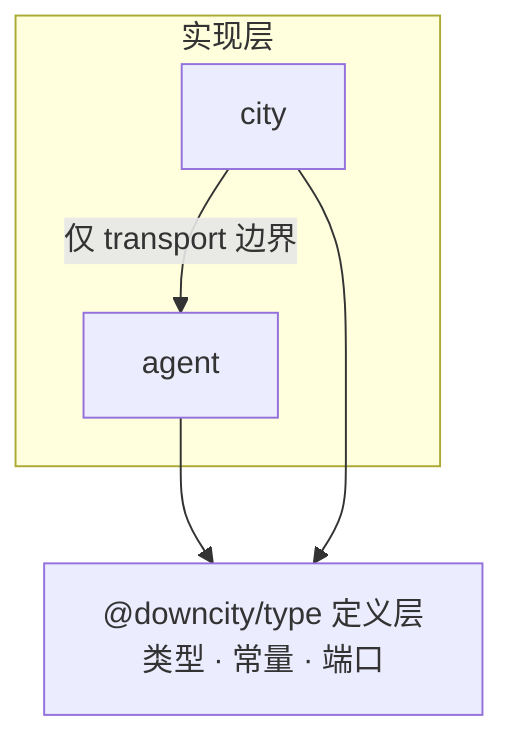
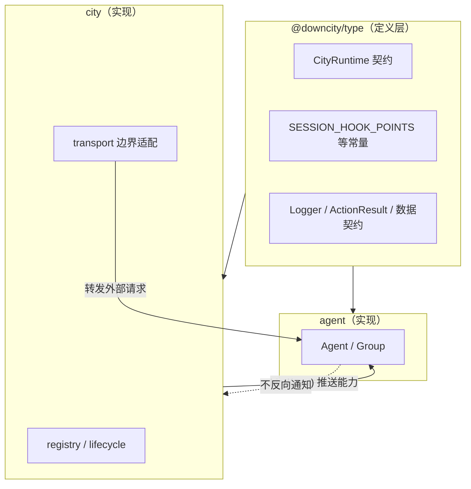

# 主体与容器：层间边界与依赖方向设计

> 状态：三阶段均已实施
>
> 目标：明确 Agent / Group（主体）与 City（容器）的关系，修正层间依赖，收敛生命周期归属。
>
> 约束：不新增没有独立语义的公共概念。本方案以删除和归位为主。
>
> 更新时间：2026-09-21

## 1. 问题

`packages/city` 依赖 `packages/agent`，共 84 处 import。

同时，主体的绑定与释放存在两套不同写法，且生命周期互相回调。Agent 与 Group 对同一件事给出不同答案。

这两类问题的性质不同，必须分开处理：

- **依赖层次问题**：谁引用了谁的定义。
- **所有权问题**：谁负责释放谁。

前者可以靠归位和 grep 验收，后者要靠不变量。本文档对两者分别给出方案，并明确它们互不解决对方。

## 2. 分层与依赖规则

### 2.1 组合顺序不等于依赖方向

```text
[[sandbox - shell - workspace] - power] - city - [agent | group] - session - composer
```

这条链描述的是**组合顺序**：谁装在谁里面，谁提供谁的运行环境。它不是依赖方向。

依赖方向只有一条规则：**实现层依赖定义层，不依赖另一个实现层。**



`power` 引用了 `SESSION_HOOK_POINTS`，问题不在于"下层引用了上层"，而在于这个定义被放进了 `agent` 这个**实现包**。它本该住在定义层。

### 2.2 判断一个符号该不该进定义层

三条同时成立才进，否则定义层会退化成"所有实现都依赖它、因而互相依赖"的万能包：

1. 有独立且长期稳定的语义，不是某个实现的细节。
2. 自身没有实现，只有类型、常量或端口。
3. 至少两个实现包需要就它达成一致。

第 3 条是关键。只有一方使用的东西，放在自己包里就好。

## 3. 偏离清单

### 3.1 Power 层引用了 Agent 实现包里的定义

| 文件 | 引用内容 | 按 §2.2 判定 |
|---|---|---|
| [CompilePowerHooks.ts](/Users/wangenius/Documents/github/downcity/open-source-sdk/packages/city/src/power/core/CompilePowerHooks.ts:21) | `SESSION_HOOK_POINTS` | 归位：协议常量 |
| [PowerContext.ts](/Users/wangenius/Documents/github/downcity/open-source-sdk/packages/city/src/power/core/PowerContext.ts:20) | `AgentSessionCollection`、`Logger` | 归位：`Logger` 是端口；`AgentSessionCollection` 需收窄 |
| [PowerActionExecution.ts](/Users/wangenius/Documents/github/downcity/open-source-sdk/packages/city/src/power/core/PowerActionExecution.ts:15) | `JsonValue`、`generate_id` | `JsonValue` 归位；`generate_id` 是实现，不搬 |
| [PowerToolRuntime.ts](/Users/wangenius/Documents/github/downcity/open-source-sdk/packages/city/src/power/tool/PowerToolRuntime.ts:12) | `JsonObject`、`JsonValue`、`ActionResult` | 归位：已有定义 + 跨侧数据契约 |
| [ActionScheduleRuntime.ts](/Users/wangenius/Documents/github/downcity/open-source-sdk/packages/city/src/power/schedule/ActionScheduleRuntime.ts:10) | `AgentStorage`、`Logger` | 已随 §6.4 整簇删除 |

`SESSION_HOOK_POINTS` 最典型：它是 Session 的检查点常量，power 只需要知道检查点名字，却要向上取。

`JsonValue`、`JsonObject` 属于纯冗余：`@downcity/type` 里已有同定义（[Json.ts](/Users/wangenius/Documents/github/downcity/open-source-sdk/packages/type/src/types/json/Json.ts:23)），power 绕路从 agent 取。

`generate_id` 值得单独说明。它不满足 §2.2 的第 2、3 条——一个随机串生成器没有需要两侧达成一致的语义，谁生成的 ID 都是合法的不透明串。[shell/utils/Id.ts](/Users/wangenius/Documents/github/downcity/open-source-sdk/packages/city/src/shell/utils/Id.ts:1) 的注释已经说明它当初就是靠复制绕开这个问题的。正确处理是**保留本包实现、删掉上向引用**，而不是统一。哪天真成了跨包契约（比如 ID 需要能被解析出结构），它才够格进定义层。

这条区分很重要：否则"统一"会把实现也拖进定义层，方向问题换个形式回来。

### 3.2 生命周期双向回调（所有权问题）

Agent 释放时回调容器，容器释放时回调主体：

```text
Agent.dispose()          → city.release_agent(this)   [Agent.ts:300]
City.remove_agent(id)    → agent.dispose()            [City.ts:374]
```

City 的索引删除实际上不是自己完成的，而是等主体在 dispose 里回调进来才执行 `agents_by_id.delete()`。这个循环靠 `removing_agent_ids`（[City.ts:66](/Users/wangenius/Documents/github/downcity/open-source-sdk/packages/city/src/city/runtime/City.ts:66)）掩盖时序。

`Agent.dispose_promise` 会记忆 rejection（[Agent.ts:292](/Users/wangenius/Documents/github/downcity/open-source-sdk/packages/agent/src/agent/Agent.ts:292)），一次失败的 dispose 会让 Agent 永久留在 City 索引里，没有重试路径。

**这是所有权问题，不是依赖层次问题。** 定义层即使完全归位，这个环依然存在。它由 §5.3 单独处理。

### 3.3 主体绑定不对称

| | Agent | Group |
|---|---|---|
| 绑定签名 | `attach(city: CityRuntime)` [Agent.ts:200](/Users/wangenius/Documents/github/downcity/open-source-sdk/packages/agent/src/agent/Agent.ts:200) | `attach(owner: object, storage_provider)` [Group.ts:51](/Users/wangenius/Documents/github/downcity/open-source-sdk/packages/agent/src/group/Group.ts:51) |
| 宿主类型 | 强类型协议 | 裸 `object`，不可检查 |
| 存储来源 | 从 city 内部读 | 由调用方额外传参 |
| 解绑 | `detach(city)`，只清 `city` | `detach(owner)`，把 storage 重置为新内存 provider |

同一个"解绑"，Agent 解绑后仍写旧容器存储，Group 解绑后换成内存存储，语义相反。

### 3.4 执行期回查容器

[Agent.assert_workspace](/Users/wangenius/Documents/github/downcity/open-source-sdk/packages/agent/src/agent/Agent.ts:332) 在每次 Session 创建或恢复时执行 `city.workspaces.get(id) !== workspace`。

这与 `apply_powers` 确立的"编译成闭包、执行时不回查"原则直接矛盾。同一个 Agent 内部，能力走值推送，Workspace 走回查，两套规则并存。

### 3.5 Power 层内部范式分裂

`@downcity/city/power` 提供了 `abstract class Power`（[runtime.ts:64](/Users/wangenius/Documents/github/downcity/open-source-sdk/packages/city/src/power/runtime.ts:64)），外部 power 全部继承：`MemoryPower`、`WebPower`、`ChatPower`、`TaskPower`、`SkillPower`。

但 city 自有的两个 power 走工厂函数返回对象字面量：[create_city_power](/Users/wangenius/Documents/github/downcity/open-source-sdk/packages/city/src/city/power/builtin/CityPower.ts:49)、[create_shell_power](/Users/wangenius/Documents/github/downcity/open-source-sdk/packages/city/src/city/power/builtin/shell/ShellPower.ts:280)。

同一层里两套写法。返回值本身就是 power（有 `name`、`actions`、`system()`），应当继承基类。

## 4. 目标关系

**容器单向推送，主体不持有容器。生命周期由容器单方拥有。**



主体需要的容器能力只有两类：私有存储、Workspace 解析。两者都通过绑定一次性注入。

容器需要的反向信息为零。索引删除由容器自己完成，不需要主体通知。

## 5. 具体改动

### 5.1 收窄 CityRuntime

保留 `CityRuntime` 作为唯一端口，不新增抽象。删除其中的生命周期回调：

```ts
/** 容器在绑定时注入主体的运行环境。 */
export interface CityRuntime {
  /** 容器为当前主体提供的底层存储。 */
  readonly storage: StorageProvider;

  /** 容器持有的 Workspace 查询入口。 */
  readonly workspaces: {
    /** 按稳定 ID 读取 Workspace；不存在或正在移除时返回 null。 */
    get(workspace_id: string): WorkspaceRuntime | null;
  };
}
```

`release_agent` 删除。容器不再需要被主体通知。

### 5.2 统一主体绑定

Agent 与 Group 收敛到同一签名：

```ts
/** 绑定容器运行环境；必须在使用 Session 前完成。 */
bind(host: CityRuntime): void;

/** 解除绑定，主体回到独立运行状态。 */
unbind(): void;
```

Group 的 `owner: object` 参数删除，宿主身份不再靠传参传递。

删除 Agent 的 `memory_session_started` 与 Group 的 `storage_owner`、`memory_session_started`，三处隐式判据统一为"是否已 bind"。

### 5.3 容器单方拥有移除

```ts
private async remove_agent(agent_id: string): Promise<Agent | null> {
  const agent = this.agents_by_id.get(agent_id) ?? null;
  if (!agent) return null;
  this.agents_by_id.delete(agent_id);   // 容器先放下引用
  agent.unbind();                        // 再断开绑定
  await this.http_transport.detach_agent(agent_id);
  await agent.dispose();                 // 最后让主体释放自身
  return agent;
}
```

`Agent.dispose()` 在已绑定时抛出明确错误，提示改用 `city.agents.remove(id)`。这把"已注册主体不能自行释放"变成可检查的不变量。

删除 `removing_agent_ids`、`removal_promises`、`workspace_removal_promises` 这套时序掩盖。Group 同理，`release_group`（[City.ts:525](/Users/wangenius/Documents/github/downcity/open-source-sdk/packages/city/src/city/runtime/City.ts:525)）不再依赖 `group.detach()` 的回调。

### 5.4 删除执行期回查

`Agent.assert_workspace` 删除。Workspace 归属由容器的边界负责：transport 在解析 Workspace 时校验，直接调用 SDK 的调用方为自己的输入负责。

如需保留保险，正确做法是让容器只通过 `city.workspaces.get(id)` 发放 Workspace——"拿不到不属于你的东西"，而不是在主体的每次调用里回查。

### 5.5 定义归位

按 §2.2 判定，把该进定义层的东西移入 `@downcity/type`：

| 内容 | 处理 | 判据 |
|---|---|---|
| `JsonValue`、`JsonObject` | 改指向 `@downcity/type` | 定义已存在 |
| `SESSION_HOOK_POINTS` | 移入 | 协议常量 |
| `ActionResult`、`ActionResultMessage` | 移入 | 跨侧数据契约 |
| `SessionSystemMessage` | 移入 | 跨侧数据契约 |
| `Logger` | 移入 | 端口，两侧都要 |
| `AgentSessionCollection` | 收窄为最小 Session 端口后移入 | 原接口过宽，暴露 agent 公开实现面 |
| `AgentStorage` | 不移入，改用 `StorageProvider` | agent 实现细节 |
| `generate_id` | 不移入，保留各包实现 | 无共享语义，见 §3.1 |
| `resolve_runtime_timezone` | 待决策，见 §7 | 实现而非定义 |
| `format_date_in_timezone` | 待决策，见 §7 | 格式约定需两侧一致，但含实现 |

改完后 `packages/city/src/power/**` 不再出现 `from "@downcity/agent"`。

### 5.6 Power 层范式统一

city 自有 power 改为继承 `Power`：

```ts
/** City 自有 power：把动作组装配为一个模型可见工具。 */
export class CityPower extends Power {
  /** 模型侧工具名，固定为 city。 */
  readonly name = "city";

  /** 动作组集合，构造期一次性展开为点号动作 id。 */
  private readonly groups: readonly CityActionGroup[];

  constructor(private readonly options: CityPowerOptions) {
    super();
    this.groups = create_city_action_groups();
  }

  /** 全部动作，键为点号 action id。 */
  get actions(): PowerActions { /* 展开动作组 */ }

  /** 合并各组说明为 system 文本。 */
  system(): string { /* ... */ }
}
```

`ShellPower` 同理。区分清楚：`create_action()`、`create_power_tools()` 返回纯值或字典，属于值构造器，保留；`create_city_power()`、`create_shell_power()` 返回的是 power 本体，改为类。

## 6. 分期

**第一阶段：定义归位。已完成。** 只做 §5.5，纯搬运，不改行为。power 层不再引用 agent 实现包。

**第二阶段：所有权收口。已完成。** §5.1 至 §5.4，同时改 `packages/type`、`packages/agent`、`packages/city`。这是本方案的主体。注意它与第一阶段解决的问题不同：定义归位不解决生命周期环。

**第三阶段：Power 范式统一。已完成。** §5.6。

### 6.1 第一阶段实施记录

已归位到 `@downcity/type`：

- `SESSION_HOOK_POINTS`：新建 [SessionHookPoints.ts](/Users/wangenius/Documents/github/downcity/open-source-sdk/packages/type/src/types/session/SessionHookPoints.ts)。
- `ActionResult`、`ActionResultMessage`、`is_action_result`、`SessionSystemMessage`：新建 [SessionActionContract.ts](/Users/wangenius/Documents/github/downcity/open-source-sdk/packages/type/src/types/session/SessionActionContract.ts)。
- `JsonValue`、`JsonObject`、`SessionAgentContent`：定义已存在，改指向定义层。

删除的重复定义：`agent/src/session/input/SessionHookPoints.ts`、`agent/src/types/action/ActionResult.ts`、`agent/src/types/session/SessionPrompts.ts`、`city/src/shell/utils/Id.ts`。

实施中的两个判定修正：

- **`Logger` 不迁移。** 原计划移入定义层，实际发现 power 层已有 `PowerLogger` 窄端口（[PowerContext.ts](/Users/wangenius/Documents/github/downcity/open-source-sdk/packages/city/src/power/types/PowerContext.ts:28)）。两处直接引用 agent `Logger` 类的地方改为使用已有端口即可。`Logger` 是 379 行含 ANSI 与 JSONL 落盘的实现，本就不满足判据第 2 条。
- **`AgentSessionCollection` 不迁移。** 它是 agent 的公开实现面，迁入定义层会污染定义层。改为把适配逻辑移到容器边界：[PowerSessionBridge.ts](/Users/wangenius/Documents/github/downcity/open-source-sdk/packages/city/src/city/power/PowerSessionBridge.ts) 负责把 Agent Session 集合投影为 power 已有的 `PowerSessionCollection` 端口。`create_power_context` 的入参从 `get_sessions` 延迟读取改为 `sessions` 直接传入。

验收结果：

- `packages/city/src/power/**` 对 `@downcity/agent` 的引用为 0。
- `@downcity/type` 不依赖任何实现包。
- `packages/type`、`packages/agent`、`packages/city` typecheck 通过。
- `packages/implementations/powers` 的 memory power 测试 6/6 通过，覆盖 `SESSION_HOOK_POINTS` 归位后的 hook 注册。
- city 与 power 相关测试 37 项中 36 项通过。

### 6.2 第二阶段实施记录

契约与主体侧：

- [CityRuntime](/Users/wangenius/Documents/github/downcity/open-source-sdk/packages/type/src/types/city/CityRuntime.ts) 收窄为只含 `storage`。删除 `release_agent`（反向回调）与 `workspaces`（`assert_workspace` 删除后已无消费者）。
- Agent 与 Group 统一为 `bind(host: CityRuntime)` / `unbind()`，删除 `attach`/`detach` 与裸 `object` 宿主参数。
- 删除 `Agent.assert_workspace` 与 `Agent.resolve_system_messages` 中的回查调用。
- `Agent.dispose()` / `Group.dispose()` 在已绑定时抛出明确错误，提示改用容器入口。
- 删除 `memory_session_started`、`storage_owner`、`mark_session_started`、`on_session_routed`；判据统一为「是否已 bind」或「Store 是否已创建」。

容器侧：

- `remove_agent` / `remove_group` / `remove_workspace` 改为单向流程：先放下引用，再解绑，最后让主体释放自身。
- `add_agent` / `add_group` 改为原子语义：失败时回滚索引与绑定，调用方不再需要 `registered` 标志判断。
- 删除 `removing_agent_ids`、`removal_promises`、`removing_workspace_ids`、`workspace_removal_promises` 四个时序字段。
- 删除 `City.release_agent`。`City.close()` 改为通过 `remove_agent` 释放主体。

时间工具归位（第一阶段残留）：

- 新建 [Time.ts](/Users/wangenius/Documents/github/downcity/open-source-sdk/packages/type/src/types/time/Time.ts)，含 `resolve_runtime_timezone`、`format_date_in_timezone`、`format_date_time_in_timezone`、`format_year_in_timezone`。
- `agent/src/utils/Time.ts` 改为重导出定义层函数，只保留 Agent 侧独有的 `get_timestamp`。
- city power 与 powers 实现的引用改指向定义层。

应用侧调用点同步修正（回滚路径统一走容器入口）：`app/cli` 的 `CliCityRuntime`、`AgentChatRemote`；`app/desktop` 的 `AgentController`。

验收结果：

- `release_agent`、`attach`/`detach`、四个时序字段、`memory_session_started`/`storage_owner`/`mark_session_started`/`on_session_routed` 全部为 0 处残留。
- `packages/city/src/power/**` 对 `@downcity/agent` 引用为 0；时间函数不再从 agent 取用；`@downcity/type` 不依赖实现包。
- `type`、`agent`、`city`、`implementations/powers` 构建通过；`app/cli` 与 `app/desktop` 主进程 typecheck 通过。
- `packages/agent` 87 项中 86 项通过（唯一失败为基线已有的 `replace_hooks` 问题）。
- `implementations/powers` 的 memory 与 task 测试 20/20 通过。
- `packages/city` 279 项中 264 项通过，失败均为沙箱环境限制（`EPERM`、`grantpt`、`/private/tmp` 符号链接），与本改动无关；与新增不变量相关的失败为 0。

### 6.3 第三阶段实施记录

- [CityPower](/Users/wangenius/Documents/github/downcity/open-source-sdk/packages/city/src/city/power/builtin/CityPower.ts) 改为 `extends Power`，删除 `create_city_power` 工厂。动作 id 仍在构造期一次性展开。
- [ShellPower](/Users/wangenius/Documents/github/downcity/open-source-sdk/packages/city/src/city/power/builtin/shell/ShellPower.ts) 改为 `extends Power`，删除 `create_shell_power` 工厂。
- [SkillPower](/Users/wangenius/Documents/github/downcity/open-source-sdk/packages/implementations/powers/src/skill/Power.ts) 删除 `Object.assign(this, createSkillPowerDefinition(...))` 混合写法，改为正统的类字段：`name`/`title`/`description` 声明为字段，`actions` 在构造函数中装配，`system()` 覆写为方法。`createSkillPowerDefinition` 工厂删除，拆出 `createSkillPowerActions` 作为纯值构造器保留。
- 调用点更新：`City` 构造函数改用 `new CityPower(...)` 与 `new ShellPower()`。

区分保留：`create_action()`、`create_power_tools()`、`createSkillPowerActions()` 返回纯值或字典，属于值构造器，保留；只有返回 power 本体的工厂被改为类。

验收结果：

- 仓库内 7 个 power 全部 `extends Power`：`CityPower`、`ShellPower`、`MemoryPower`、`WebPower`、`ChatPower`、`TaskPower`、`SkillPower`。
- `create_city_power`、`create_shell_power`、`Object.assign(this` 均为 0 处残留。
- `packages/city`、`packages/implementations/powers` typecheck 与构建通过；`app/cli`、`app/desktop` 主进程 typecheck 通过。
- `implementations/powers` 的 memory / task / skill 测试 24/24 通过。
- `packages/city` 失败清单与第二阶段一致，无新增失败。

### 6.4 死代码清理

删除 `packages/city/src/power/schedule/` 整簇（813 行）及对应测试：

- 删除文件：`ActionSchedule.ts`、`ActionScheduleStore.ts`、`ActionScheduleExecutor.ts`、`ActionScheduleRuntime.ts`、`ActionSchedulePath.ts`、`ActionScheduleTime.ts`、`test/action-schedule-store.test.mjs`。
- 删除 `power/index.ts` 中四个 schedule 导出。
- 删除 core prompt 中的悬空引用：`ActionSchedule` is an internal Agent capability for delayed power actions. 源文件 `core.prompt.ts.txt` 与生成产物 `core.prompt.ts` 同步更新。

判定依据：`start_action_schedule_runtime` 无任何调用方；`create_job` 只在测试中被调用；生产代码中不存在创建 schedule 任务的入口。属于实现完整但从未接线的能力。删除前已与作者确认。

保留：历史 PRD 文档中的 ActionSchedule 记录（`power-redesign-prd.md`、`downcity-mastra-prime-optimization-plan.md`）作为历史决策记录不动。

验收结果：

- `ActionSchedule`、`action_schedule`、`power/schedule` 在 `packages` 与 `app` 中 0 处残留。
- 全链路构建与 typecheck 通过；`packages/city` 测试从 279 降至 275，失败数仍为 15 且全为环境签名。

## 7. 待决策

**Group 是否需要容器能力。** 当前 Group 只用到 storage。若日后需要调度审计等能力，走与 Agent 相同的能力推送通道，不自行持有 City。

**`new Agent()` 后注册的顺序。** 彻底的做法是容器造主体（`city.create_agent()`），作用域直接进构造函数，连 `bind` 都不需要。代价是要同时保留独立运行路径，等于两套创建入口。取决于独立运行是主要场景还是兜底场景。

**`RemoteAgent` 的归属。** 它是 agent 的客户端，却住在 city。按"边界适配属于容器"的结论，远程访问与本地转发是同一类职责，留在 city 是自洽的。需要确认这个判断。

## 8. 明确不做的事

- 不新增 `ContainerEnv`、`Subject`、`CapabilitySurface` 等端口概念。`CityRuntime` 已经承担这个角色，收窄即可。
- 不把 `AgentHTTP` 迁到 agent 包。接收和转发外来请求是容器的边界职责。
- 不把实现搬进定义层。见 §3.1 的 `generate_id`。
- 不为 `Workspace`、`Sandbox` 额外抽抽象类。当前无第二个实现，等到有 `cfworkers_workspace` 这类真实需求时再抽。
- 不保留兼容层。绑定签名、释放路径一次性切换，不做双写。

## 9. 验收

依赖层次：

- `packages/city/src/power/**` 不再出现 `from "@downcity/agent"`。
- `packages/city/src` 对 `@downcity/agent` 的引用只出现在 transport 与 RemoteAgent 边界。
- `@downcity/type` 内不出现对任何实现包的依赖。

所有权：

- 生命周期无反向回调：搜索 `release_agent` 无结果。
- 容器移除主体为单向流程，不依赖 `removing_agent_ids`。
- Agent 与 Group 的绑定、解绑签名一致。
- 已绑定的主体调用 `dispose()` 抛出明确错误。

范式：

- power 层只有一种写法：`extends Power`。
