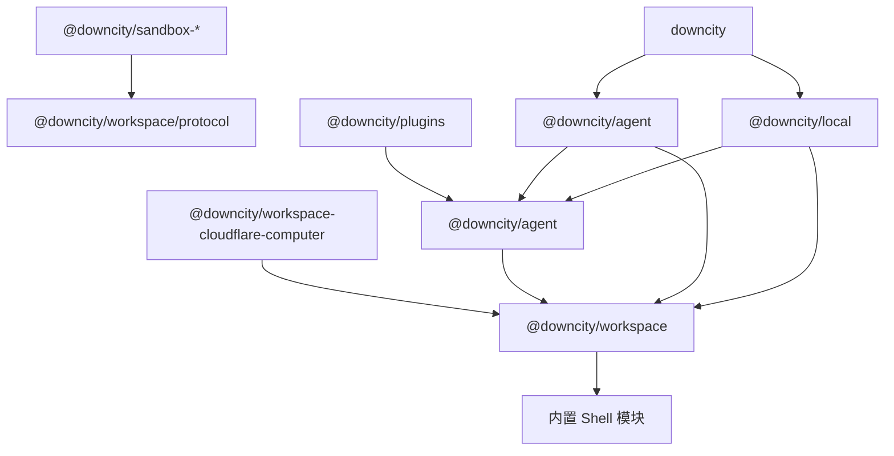

# Workspace 独立 Package 设计

> 状态：Draft
>
> 适用范围：`@downcity/workspace`、`@downcity/agent`、`@downcity/agent`、`@downcity/local`、CLI、Desktop 与 Workspace Adapter
>
> 核心决策：Workspace 从 `@downcity/agent` 独立为 `@downcity/workspace`；Shell 作为 Workspace 的内置可选执行能力，由 `@downcity/workspace` 统一导出并保留可替换协议

## 1. 背景

当前 `Workspace`、`WorkspaceBase`、FileSystem、文件与搜索 Tool、Workspace Env，以及本地 AgentWorkspace Store 都位于 `@downcity/agent`。

这与已经确认的领域模型不一致：

- Agent 是身份、模型、指令和 Plugin 的拥有者。
- Workspace 是项目资源与安全边界。
- Agent 不绑定单一 Workspace，而是在执行时进入 Workspace。
- 同一个 Workspace 协议需要支持本地目录、Cloudflare Computer 和后续远程执行环境。

当前目录结构让外部 Workspace Adapter 必须依赖整个 `@downcity/agent` 才能获得 Workspace 协议。更严重的是，`WorkspaceBase` 当前直接暴露 `create_agent_workspace_storage(agent_id)`，并由 Workspace 创建 `LocalSessionStore`。这让 Workspace 知道 Agent ID、AgentWorkspace 和 Session 持久化语义，破坏了依赖方向。

本次调整不是简单地移动文件，而是重新建立 Workspace、Shell 与 Agent 的职责边界。

## 2. 产品结论

1. 新增公开 Package `@downcity/workspace`。
2. Workspace 是独立资源容器，不属于 Agent 的内部子模块。
3. `@downcity/agent` 依赖 `@downcity/workspace`，不能反向依赖。
4. Shell 是 Workspace 提供的可选命令与进程能力，由 Workspace 绑定项目目录、同步环境变量并参与释放。
5. Shell 的默认实现、协议、审批、Session、Sandbox 接口和工具统一位于 `@downcity/workspace`，不再发布独立的 `@downcity/workspace` Package。
6. Workspace 只提供通用私有存储后端，不创建 SessionStore，也不理解 Agent 数据结构。
7. AgentWorkspace 继续属于 `@downcity/agent`，负责组合 Agent 与 Workspace，并创建 Session、Plugin Context、日志和调度状态。
8. 本地 Workspace 默认使用 `DC_PLATFORM_ROOT` 或 `~/.downcity` 作为私有存储根，不重新公开 `data_root_path` 构造参数。
9. 不保留 `@downcity/agent` 对 Workspace 的兼容导出；Workspace 只有一个公开事实源。

## 3. 产品意图

### 3.1 Workspace 回答什么

Workspace 回答：

> 当前执行可以访问哪些项目资源，以及这些资源如何被隔离、观察和释放？

Workspace 拥有：

- 稳定 Workspace ID。
- 项目或虚拟环境的逻辑根路径。
- Rooted FileSystem。
- 文件与搜索能力。
- Workspace Env 及其变更订阅。
- 可选的命令执行能力。
- Workspace Tool 集合。
- 通用私有存储后端。
- Workspace 资源生命周期。

Workspace 不拥有：

- Agent 身份、模型和指令。
- Plugin 注册表。
- Session、Turn、Message 和 Compact。
- AgentWorkspace 数据结构。
- City registry 或 transport。
- CLI 与 Desktop 配置读取。

### 3.2 Shell 回答什么

Shell 回答：

> 如何在一个已经确定的资源边界中安全执行命令和长期进程？

Shell 拥有：

- 单次命令执行。
- 长期 Shell Session 与 PTY。
- Shell Tool。
- 审批协议。
- Sandbox Policy 与 Adapter 协作。
- 子进程生命周期。

Shell 不拥有：

- Workspace 身份。
- 项目文件 API。
- Workspace 搜索能力。
- Agent、Session 或 Plugin。
- 用户级配置与存储布局。

因此 Shell 在运行时由 Workspace 持有，发布上也属于 Workspace Package，但内部仍保持独立模块边界。macOS、Linux 和 Windows Sandbox Adapter 只依赖 `@downcity/workspace/protocol`，不能依赖 Agent。

### 3.3 AgentWorkspace 回答什么

AgentWorkspace 回答：

> 一个指定 Agent 进入一个指定 Workspace 后，形成了什么执行作用域？

AgentWorkspace 拥有：

- Agent 与 Workspace 的组合关系。
- Agent 在该 Workspace 中的 Session 集合。
- Workspace Tool、Agent Tool 与 Plugin Tool 的组合。
- 当前 Workspace 的 PluginContext。
- AgentWorkspace 私有数据命名空间。
- SessionStore、日志、Schedule 和 Plugin Workspace 状态。
- 进入与离开生命周期。

AgentWorkspace 继续位于 `@downcity/agent`，不能迁入 `@downcity/workspace`。

## 4. 设计目标

1. Workspace 协议拥有独立、最小且稳定的公开入口。
2. 本地与远程 Workspace 使用同一资源协议。
3. Workspace Package 不依赖 Agent、Session、Plugin 或 City。
4. Agent Package 不再实现通用文件、搜索和 Workspace Env。
5. Workspace 不创建或返回 SessionStore。
6. Shell 仍可作为 Workspace 的可选能力独立构造，并保持平台 Sandbox Adapter 的低层依赖方向。
7. Cloudflare Computer Adapter 不再依赖 `@downcity/agent`。
8. 本地项目目录不创建 `<project>/.downcity`。
9. 本地 AgentWorkspace 数据布局保持为 `~/.downcity/agents/<agent_id>/workspaces/<workspace_id>/`。
10. Workspace 和 Agent 的释放顺序明确、幂等，并且不存在重复释放。

## 5. 非目标

本次不做：

- 将 Shell 拆成第二个公开 Package。
- 重写 Shell、Sandbox 或 PTY 实现。
- 改变 Agent、Plugin 或 Session 的产品语义。
- 引入通用 Host、SystemHandler 或 Runtime Container。
- 创建 Workspace Plugin 分类。
- 改变 `~/.downcity` 下的 Agent 与 Plugin 定义协议。
- 把 AgentWorkspace 运行数据重新写回项目目录。
- 保留旧 Workspace 导入路径的兼容层。
- 同时重构 Federation、Services 或数据库 Adapter。

## 6. 目标 Package 架构



允许的依赖方向：

```text
sandbox-* -> workspace/protocol
workspace-cloudflare-computer -> workspace
agent -> workspace + type
plugins -> agent
city -> agent + workspace
local -> agent + workspace
cli / desktop -> local + city + agent + workspace + platform sandbox
```

禁止的依赖方向：

```text
workspace -X-> agent
workspace -X-> city
workspace -X-> local
sandbox-* -X-> agent
sandbox-* -X-> workspace 本地实现
```

## 7. `@downcity/workspace` 职责

### 7.1 包含内容

目标源码结构：

```text
packages/workspace/
├── src/
│   ├── index.ts
│   ├── Workspace.ts
│   ├── WorkspaceBase.ts
│   ├── LocalFileSystem.ts
│   ├── WorkspaceEnv.ts
│   ├── file/
│   ├── search/
│   ├── storage/
│   ├── tool/
│   └── types/
├── package.json
├── README.md
└── tsconfig.json
```

从 `@downcity/agent` 迁入：

- `Workspace` 与 Workspace 基础协议。
- `LocalFileSystem` 与 FileSystem 类型。
- Workspace Env。
- File Tool 与 Search Tool 的 Schema 和 Runtime。
- Workspace Tool 组合逻辑。
- 通用 Workspace 私有存储 Provider。

### 7.2 不包含内容

以下内容继续属于 `@downcity/agent`，并从当前 `agent/src/workspace/store/` 移到 Agent 自己的存储模块：

- `AgentWorkspaceStorage`。
- `SessionStore`。
- `LocalSessionStore`。
- `SessionDataStore`。
- `SessionMessageStore`。
- `SessionAttachmentStore`。
- AgentWorkspace 日志与 Schedule；Plugin 运行时状态由 Agent/Plugin 目录管理。
- `agents/<agent_id>/workspaces/<workspace_id>` 命名规则。

这些对象表达的是 Agent 执行与恢复语义，不是通用 Workspace 资源。

## 8. Workspace 存储边界

### 8.1 当前问题

当前 Workspace API 逻辑上等价于：

```ts
create_agent_workspace_storage(agent_id: string): AgentWorkspaceStorage;
```

返回结果包含 `SessionStore`。这意味着 Workspace 必须依赖 Agent Session 类型，也让 Cloudflare Workspace Adapter 被迫实现 Agent Store。

### 8.2 目标模型

Workspace 只提供通用、受根目录限制的私有存储作用域。概念协议如下：

```ts
/** Workspace 私有存储中的一个受控作用域。 */
export interface WorkspaceStorageScope {
  /** 当前作用域稳定且不可越界的逻辑根路径。 */
  readonly root_path: string;

  /** 只允许访问当前作用域的文件能力。 */
  readonly files: FileSystem;
}

/** Workspace 私有数据后端。 */
export interface WorkspaceStorageProvider {
  /** 按稳定路径片段打开一个受控私有存储作用域。 */
  open_scope(segments: readonly string[]): WorkspaceStorageScope;
}
```

Provider 必须把每个输入值作为独立逻辑片段处理，统一编码动态 ID，并拒绝空片段、`.`、`..`、路径分隔符和任何根目录逃逸。调用方不能预先拼接完整路径，也不能把物理绝对路径作为 scope 输入。

AgentWorkspace 决定自己的领域命名空间：

```text
agents/<agent_id>/workspaces/<workspace_id>/
```

并在得到的 `WorkspaceStorageScope` 上创建 SessionStore、Logger 和 Schedule Store。Workspace 不知道这些文件的业务含义。

### 8.3 本地与远程实现

本地 Workspace：

```text
storage provider root
  = DC_PLATFORM_ROOT
  = 或 ~/.downcity
```

Cloudflare Computer Workspace：

```text
storage provider root
  = Cloudflare Computer 持久化虚拟文件系统中的内部目录
```

两种实现向 Agent 暴露同一个 `WorkspaceStorageProvider`，但不要求使用相同的物理文件系统或进程模型。

## 9. Shell 与 Workspace 生命周期

Workspace 构造时接收可选 Shell：

```ts
const workspace = new Workspace({
  id: "project",
  path: process.cwd(),
  shell: new Shell({ sandbox }),
});
```

职责分配：

| 行为 | 所有者 |
|---|---|
| 规范化项目根路径 | Workspace |
| 读取和更新 Workspace Env | Workspace |
| 将 Env 同步给 Shell | Workspace |
| 创建 AgentWorkspace 私有数据作用域 | AgentWorkspace + Workspace Storage Provider |
| 将项目路径与私有数据路径绑定给 Shell | AgentWorkspace 进入流程 |
| 执行命令与管理进程 | Shell |
| 释放 SessionStore | AgentWorkspace |
| 释放 Shell 与 Workspace 后端资源 | Workspace |
| 释放 Agent 进入的全部 Workspace | Agent |

一个 Workspace 实例仍然只能被一个 AgentWorkspace 占用，避免共享 Shell、环境订阅和远程 Stub。多个 Agent 可以进入同一个物理目录，但必须分别创建 Workspace 实例。

## 10. 公开 API

### 10.1 本地 Workspace

```ts
import { Agent } from "@downcity/agent";
import { Workspace } from "@downcity/workspace";
import { MacOsSeatbeltSandbox } from "@downcity/sandbox-macos";
import { Shell } from "@downcity/workspace";

const workspace = new Workspace({
  id: "project",
  path: process.cwd(),
  shell: new Shell({
    sandbox: new MacOsSeatbeltSandbox(),
  }),
});

const agent = new Agent({
  id: "lucas",
  model,
  plugins,
});

const agent_workspace = agent.enter(workspace);
```

`WorkspaceOptions` 只包含：

- `id`。
- `path`。
- 可选 `shell`。
- 可选 `env`。

不公开 `data_root_path`、Agent ID、SessionStore 或平台控制面配置。

### 10.2 Cloudflare Computer Workspace

```ts
import { Agent } from "@downcity/agent";
import {
  CloudflareComputerWorkspace,
} from "@downcity/workspace-cloudflare-computer";

const workspace = new CloudflareComputerWorkspace({
  id: "research",
  computer,
});

const agent = new Agent({ id: "research-agent", model, plugins });
const agent_workspace = agent.enter(workspace);
```

Cloudflare Adapter 通过 `@downcity/workspace/protocol` 使用 Workspace 协议，不依赖 `@downcity/agent` 或 Workspace 的本地 Shell 实现。

### 10.3 City

```ts
import type { WorkspaceBase } from "@downcity/workspace";

const city = new City(agents, {
  resolve_workspace: async (
    agent,
    workspace_id,
  ): Promise<WorkspaceBase> => resolve_workspace(agent.id, workspace_id),
});
```

City 继续只索引 Agent 并按需请求 Workspace，不创建通用 Workspace 实现，也不拥有 Workspace 配置。

## 11. 导出规则

`@downcity/workspace` 根入口公开：

- `Workspace`。
- `WorkspaceBase`。
- `LocalFileSystem`。
- `FileSystem` 与 Workspace 资源协议类型。
- Workspace Env 类型。
- Workspace Storage Provider 类型。

`@downcity/workspace/protocol` 是无 Node.js 副作用的 Adapter 入口，只公开：

- `WorkspaceBase`。
- FileSystem、Env、Tool 与 Storage Provider 协议类型。
- Adapter 实现 Workspace 协议所需的纯运行时辅助能力。

该入口不能导出或静态加载 `LocalFileSystem`、本地 `Workspace`、`node:fs`、`node:path` 或 `node:os`。Cloudflare Computer 等 Edge Adapter 必须从该子入口导入协议；本地 Node.js 用户继续从包根使用 `new Workspace(...)`。

`@downcity/agent` 根入口不再公开：

- `Workspace`。
- `WorkspaceBase`。
- `FileSystem`。
- Workspace File/Search Tool 类型。
- `LocalFileSystemOptions`。
- Workspace Env 类型。
- `WorkspaceTools`。

Agent 只公开 Agent、AgentWorkspace、Session、Plugin 和执行协议。PluginContext 可以引用 `@downcity/workspace` 的 FileSystem 类型，但不能要求 Plugin 作者从 Agent 包重复导入 Workspace 类型。

## 12. 对现有 Package 的影响

### 12.1 `@downcity/agent`

- 新增对 `@downcity/workspace` 的依赖。
- 删除通用 Workspace 实现与重复导出。
- 将 Session Store 从 `src/workspace/store/` 移到 Agent 存储领域。
- AgentWorkspace 使用 Workspace Storage Provider 创建自己的数据作用域。

### 12.2 `@downcity/workspace-cloudflare-computer`

- 改为依赖 `@downcity/workspace`。
- 删除对 `@downcity/agent` 的 Workspace 与 Session Store 依赖。
- 不再创建 Agent SessionStore。
- 保持自己的远程 FileSystem、Tool 与 Stub 生命周期。

### 12.3 `@downcity/agent`

- `resolve_workspace` 和相关类型从 `@downcity/workspace` 导入。
- City 的 Agent、AgentWorkspace 与 Session transport 仍从 `@downcity/agent` 导入。

### 12.4 `@downcity/local`

- Workspace 配置类型和项目 Env 能力改从 `@downcity/workspace` 导入。
- AgentRepository、Plugin Loader 和 Agent 定义继续依赖 `@downcity/agent`。
- Local Package 仍不创建 Agent、Workspace 或 City。

### 12.5 `@downcity/plugins`

- Plugin 协议继续来自 `@downcity/agent`。
- Workspace 文件能力通过 PluginContext 使用。
- 当前源码没有直接导入 Shell，应删除旧的独立 Shell Package 依赖。

### 12.6 CLI 与 Desktop

- 显式从 `@downcity/workspace` 创建 Workspace。
- 继续负责选择当前平台的 Sandbox Adapter。
- 继续通过 `@downcity/local` 读取 Workspace 索引和 Agent 定义。
- 不向 Workspace 传入用户级数据根目录。

## 13. 迁移方案

### Phase 1：建立 Package 与公开协议

1. 创建 `packages/workspace`。
2. 定义 Workspace、FileSystem、Env、Tool 与 Storage Provider 公开入口。
3. 配置构建、类型检查、测试与 workspace dependency。

### Phase 2：迁移通用资源能力

1. 迁移本地 Workspace 与 LocalFileSystem。
2. 迁移 File/Search Runtime 与 Tool。
3. 迁移 Workspace Env。
4. 保证本地文件越界、符号链接、编码和原子写测试保持通过。

### Phase 3：反转存储依赖

1. Workspace 改为只提供 Storage Provider。
2. AgentWorkspace 负责打开 Agent 数据作用域。
3. SessionStore、MessageStore、AttachmentStore 与 AgentWorkspace 路径迁回 Agent 存储领域。
4. 保证本地物理路径不发生变化。

### Phase 4：迁移 Adapter 与宿主

1. Cloudflare Computer Adapter 改为依赖 Workspace Package。
2. City、Local、CLI、Desktop 和模板更新导入。
3. 删除 Agent 的 Workspace 导出与无效依赖。

### Phase 5：文档与发布

1. 更新 Agent SDK、City SDK、Plugin 和架构文档。
2. 更新所有示例为 `@downcity/workspace` 导入。
3. 按实际公开能力变化分别升级 Workspace、Agent、City、Local、CLI 和受影响 Adapter。
4. 不保留旧导入路径兼容说明。

## 14. 测试要求

### 14.1 Workspace Contract

- 本地 Workspace 路径规范化。
- 文件与搜索根目录隔离。
- 符号链接逃逸防护。
- Env 初始化、替换、Patch 和订阅。
- Shell Env 同步。
- Storage Scope 路径隔离。
- 重复释放幂等。

### 14.2 Agent 集成

- 一个 Agent 进入多个 Workspace。
- 多个 Agent 使用同一物理目录的不同 Workspace 实例。
- 同一个 Workspace 实例拒绝重复占用。
- Session、日志和 Schedule 仍写入 `agents/<agent_id>/workspaces/<workspace_id>`；Plugin 运行时状态写入 `agents/<agent_id>/plugins/<plugin_id>`。
- Agent dispose 按顺序释放 AgentWorkspace、SessionStore 与 Workspace。
- Shell 审批和 Tool Loop 行为不变。

### 14.3 Adapter

- Cloudflare Computer Workspace 不导入 Agent runtime。
- 远程 FileSystem 与 Tool 正常工作。
- 远程 Workspace 数据可恢复。
- Stub 只释放一次。

### 14.4 架构守卫

增加自动测试或静态扫描，拒绝：

- `packages/workspace` 导入 `@downcity/agent`。
- `packages/sandbox-*` 导入 Workspace 或 Agent。
- `packages/sandbox-*` 导入 Workspace 的本地实现，而不是 `@downcity/workspace/protocol`。
- `@downcity/agent` 重新导出 Workspace。
- Workspace Store 返回 SessionStore。

## 15. 风险与控制

### 15.1 循环依赖

风险：Workspace 为复用 SessionStore 再次依赖 Agent。

控制：Workspace Storage 只能返回路径与 FileSystem；所有 Session 类型留在 Agent。

### 15.2 Node.js 依赖进入 Edge Bundle

风险：Cloudflare Adapter 通过 Workspace 根入口意外打包本地 `node:fs` 实现。

控制：为 Adapter 提供不加载本地实现的稳定协议子入口，构建中增加 Cloudflare bundle 验证。根入口仍服务于本地 `new Workspace(...)` 的简单用法。

### 15.3 数据路径变化

风险：存储职责迁移后产生新的目录层级或重复编码。

控制：对完整路径和目录权限增加 contract test，保持：

```text
~/.downcity/agents/<agent_id>/workspaces/<workspace_id>/
```

### 15.4 生命周期重复释放

风险：AgentWorkspace 与 Workspace 同时关闭 SessionStore 或 Shell。

控制：SessionStore 只由 AgentWorkspace 释放；Shell 与 Workspace 后端只由 Workspace 释放；所有 dispose 保持幂等。

## 16. 验收标准

1. `@downcity/workspace` 成为 Workspace 唯一公开来源。
2. 用户从 `@downcity/workspace` 导入 `Workspace`，并通过 `agent.enter(workspace)` 执行。
3. `@downcity/agent` 不再包含或导出通用 Workspace 实现。
4. `@downcity/workspace` 不依赖 Agent、Session、Plugin、City 或 Local。
5. Shell 默认实现和协议位于 `@downcity/workspace`，Workspace 作为可选能力持有并支持自定义实现。
6. Cloudflare Computer Adapter 不依赖 Agent runtime。
7. Workspace 不创建 SessionStore，不接收 Agent ID 作为领域构造参数。
8. 本地数据布局与权限不变，项目目录不出现 `.downcity`。
9. CLI、Desktop、模板和文档全部使用新的导入路径。
10. Agent、Workspace、Shell、City、CLI、Desktop 与 Cloudflare Adapter 的相关测试全部通过。

## 17. 最终判断

最终依赖模型必须是：

```text
Agent 进入 Workspace
Workspace 持有可选 Shell
Shell 使用平台 Sandbox
AgentWorkspace 拥有 Session 与 Plugin 执行状态
```

目录和 Package 结构必须反映该领域关系，而不是让 Workspace 继续因为历史实现位置成为 Agent 的内部概念。
