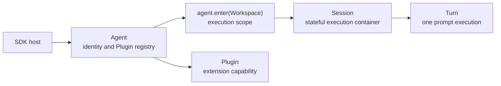

# Agent SDK

`@downcity/agent` provides a local `Agent` and a remote `RemoteAgent`. Both are session-first: Agent composes capabilities, while Session owns a continuous conversation and its execution state.

## One-minute mental model



| Object | Owns | Does not own |
| --- | --- | --- |
| `Workspace` | Project files, env, Tools, Shell, and Sandbox | Agent identity, plugins, and Session persistence |
| `Agent` | Model, instructions, PluginRegistry, and entry into multiple Workspaces | HTTP/RPC transports |
| `AgentWorkspace` | Sessions, private Storage, and PluginContext for one Workspace entry | State in other Workspaces |
| `Session` | Conversation state, message history, execution order, and approvals | Project resource ownership |
| `PluginContext` | Stable Agent capabilities projected to a Plugin | A second Agent facade |
| `SessionTurnContext` | Execution context and lifecycle for one Turn | Long-lived Agent state |
| `RemoteAgent` | Access to a server-side Agent and its Sessions | Server-side model configuration |

## Choose local or remote

| Scenario | Use |
| --- | --- |
| Agent and application run in the same Node.js process | `Agent` |
| The application injects models, Tools, plugins, and Shell directly | `Agent` |
| Another process already exposes the Agent over HTTP/RPC | `RemoteAgent` |
| The client only creates Sessions, sends prompts, and subscribes | `RemoteAgent` |

Network serving does not belong to Agent. Use `AgentHTTP` or `AgentRPC` from `@downcity/city` to expose a local Agent.

## Recommended local composition

Shell is the standard entry for project commands and processes. The SDK does not select a platform Sandbox automatically; install and inject the Adapter for the current operating system. This example uses macOS:

```ts
import { Agent } from "@downcity/agent";
import { Workspace } from "@downcity/workspace";
import { MacOsSeatbeltSandbox } from "@downcity/sandbox-macos";
import { Shell } from "@downcity/workspace";

const shell = new Shell({
  sandbox: new MacOsSeatbeltSandbox(),
});

const workspace = new Workspace({
  id: "project",
  path: process.cwd(),
  shell,
});

const agent = new Agent({
  id: "repo-helper",
  model,
});
const agent_workspace = agent.enter(workspace);

try {
  const session = await agent_workspace.sessions.create();
  const turn = await session.prompt({ query: "Summarize this repository" });
  const result = await turn.finished;
  console.log(result.text);
} finally {
  await agent.dispose();
}
```

Remember this primary path:

```text
Agent + Workspace + Shell → agent.enter(workspace) → Session → prompt() → turn.finished → dispose()
```

`agent.dispose()` releases every AgentWorkspace it entered, including plugin lifecycle, ActionSchedule, Shell processes, PTYs, and Sandbox resources. The project directory never receives `.downcity`.

## Model ownership

In pure SDK embedding, the host owns model instances:

- Set the default with `new Agent({ model })`.
- Or override it for one local Session with `await session.set({ model })`.

In a Downcity project, the CLI host resolves the model from project configuration and the City AIService catalog. Remote Sessions do not expose client-side model configuration; the server host always owns the model.

## Recommended reading order

1. [Local Agent quickstart](/en/agent-sdk-docs/local-agent/quickstart)
2. [Sessions overview](/en/agent-sdk-docs/sessions/overview)
3. [Shell and Sandbox](/en/agent-sdk-docs/local-agent/shell-reference)
4. [Tools and plugins](/en/agent-sdk-docs/local-agent/tools-and-plugins)
5. [Remote Agent](/en/agent-sdk-docs/remote-agent/quickstart)
6. [SDK Surface](/en/agent-sdk-docs/api-reference/sdk-surface)
7. [Agent SDK architecture](/en/docs/agent/sdk-architecture)
