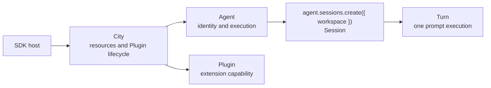

# Agent SDK

`@downcity/agent` provides the local `Agent` execution runtime. `@downcity/city` provides the
composition root, Workspace/Plugin resources, transports, and `RemoteAgent`. Both client shapes are
session-first: Agent composes execution capability, while Session owns a continuous conversation.

## One-minute mental model



| Object | Owns | Does not own |
| --- | --- | --- |
| `Workspace` | Project files, env, Tools, and optional Shell | Agent identity, plugins, Session persistence, and Sandbox implementation |
| `Shell` | Sandbox Provider, persistent Workspace Sandbox, and Shell Sessions | Chat Session identity and City lifecycle |
| `Agent` | Model, instructions, custom Tools, and Sessions | Plugin instances, Workspace resources, HTTP/RPC transports |
| `AgentSessions` | All Sessions owned by one Agent; each Session may receive a Workspace | Agent identity and Plugin definitions |
| `Session` | Conversation state, message history, execution order, and approvals | Project resource ownership |
| `City` | Workspace and Plugin resources, lifecycle, Storage, and transports | Session execution semantics |
| `SessionTurnContext` | Execution context and lifecycle for one Turn | Long-lived Agent state |
| `RemoteAgent` | Access to a server-side Agent and its Sessions | Server-side model configuration |

## Choose local or remote

| Scenario | Use |
| --- | --- |
| Agent and application run in the same Node.js process | `Agent` |
| The application injects models, Tools, plugins, and Shell directly | `Agent` |
| Another process already exposes the Agent over HTTP/RPC | `RemoteAgent` |
| The client only creates Sessions, sends prompts, and subscribes | `RemoteAgent` |

Network serving does not belong to Agent. Create a `City`, add the Agent with `city.agents.add(agent)`,
then use `city.http()` or `city.rpc()` to expose the City.

## Recommended local composition

Shell is the standard entry for project commands and processes. This embedded example injects a microsandbox Provider directly into Shell:

```ts
import { Agent } from "@downcity/agent";
import { Workspace } from "@downcity/city";
import { MicrosandboxProvider } from "@downcity/sandbox-microsandbox";
import { Shell } from "@downcity/city";

const shell = new Shell({
  sandbox_provider: new MicrosandboxProvider(),
});

const workspace = new Workspace({
  id: "project",
  path: process.cwd(),
  shell,
  runtime_path: "/path/to/downcity-runtime/project",
});

const agent = new Agent({
  id: "repo-helper",
  model,
});
// Session 在创建时选择 Workspace。

try {
  const session = await agent.sessions.create({ workspace });
  const turn = await session.prompt({ query: "Summarize this repository" });
  const result = await turn.finished;
  console.log(result.text);
} finally {
  await agent.dispose();
}
```

Remember this primary path:

```text
Agent + Workspace + Shell → agent.sessions.create({ workspace }) → Session → prompt() → turn.finished → dispose()
```

`agent.dispose()` releases Session resources and the current City binding. City closes shared Plugin instances, lifecycle, and ActionSchedule resources. The project directory never receives `.downcity`.

## Model ownership

In pure SDK embedding, the host owns model instances:

- Set the default with `new Agent({ model })`.
- Or override it for one local Session with `await session.set({ model })`.

In a Downcity project, the CLI host resolves the model from project configuration and the City AIService catalog. Remote Sessions do not expose client-side model configuration; the server host always owns the model.

## Recommended reading order

1. [Local Agent quickstart](/en/agent-sdk-docs/local-agent/quickstart)
2. [Sessions overview](/en/agent-sdk-docs/sessions/overview)
3. [Shell and Sandbox](/en/agent-sdk-docs/local-agent/shell-reference)
4. [Tools and plugins](/en/agent-sdk-docs/local-agent/tools-and-plugins)
5. [Remote Agent](/en/agent-sdk-docs/remote-agent/quickstart)
6. [SDK Surface](/en/agent-sdk-docs/api-reference/sdk-surface)
7. [Agent SDK architecture](/en/docs/agent/sdk-architecture)
