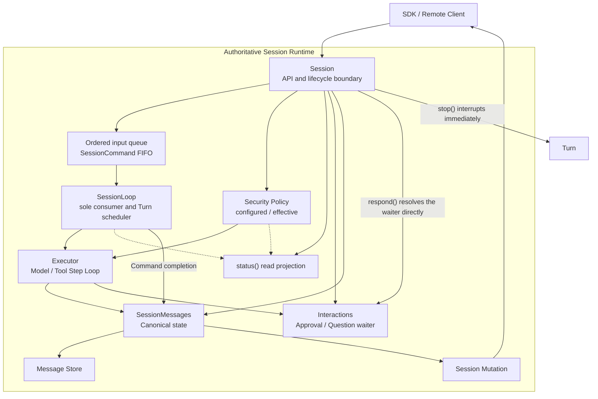

# Session Overview

`Agent` assembles tools, plugins, configuration, and storage. The host injects the model before execution. A `Session` owns one continuous conversation, its history, streaming output, and tool approvals.

A Session is one persisted, linearly ordered Message sequence. It can be reopened with `get()` after a process restart, and local `Agent` and `RemoteAgent` share nearly the same calling model.

## The essential flow

```text
create / get
-> load an initial messages() snapshot
-> subscribe() to live changes
-> prompt() returns a turn handle
-> handle delta, part, and approval
-> await turn.finished
-> stop(), fork(), or archive when needed
```

Subscribe before calling `prompt()`. A subscription only receives future Mutations; it never replays output that happened before it was established.

## A complete local example

```ts
const session = await agent.sessions.create({
  session_id: "repo-analysis",
});

await session.set({ model });

const initial_page = await session.messages();
render_messages(initial_page.items);

const unsubscribe = session.subscribe((mutation) => {
  apply_mutation_to_ui(mutation);

  if (
    mutation.variant === "part" &&
    mutation.type === "interaction" &&
    mutation.part.status === "pending"
  ) {
    render_interaction(mutation.part);
  }
});

const turn = await session.prompt({ query: "Analyze this repository's Session design" });
const result = await turn.finished;
set_turn_status(turn.id, result.success ? "completed" : "failed");

unsubscribe();
```

`apply_mutation_to_ui()` should merge snapshots by `message_id + revision` and append each `delta` only to its matching text or Tool input. See [Live subscriptions](/en/agent-sdk-docs/sessions/subscribe) and [Reconnect and sync](/en/agent-sdk-docs/sessions/reconnect-and-sync).

On failure, the canonical `error` Message carries the user-visible error. Use `turn.finished.error` for control flow, logging, or interfaces that do not render Messages; a chat UI that already renders Session Messages must not append it as a second error.

## The objects inside a Session

| Object | Purpose | When to use it |
| --- | --- | --- |
| `SessionMessage` | The only persisted history model | Initial load, reconnect, history browsing |
| `SessionMutation` | Live protocol for changes after subscription | Streaming UI, tool state, title updates |
| `TurnHandle` | Execution handle for an accepted input | Waiting for the final result, checking a stopped turn |
| `SessionPendingInteraction` | A request waiting for user input | Approval, questions, background processing |

Do not treat Messages and Mutations as interchangeable. Messages are recoverable state snapshots; Mutations deliver state changes to a live client.

## Session runtime model

A Session is the ordering and persistence boundary for its inputs. Prompts, model changes,
environment updates, plugin updates, approval-mode changes, and compaction enter one
server-side FIFO. They execute in submission order before a Turn starts or at a Model Step
checkpoint. Remote clients call Session APIs and do not duplicate this scheduling logic.



Only operations that require FIFO ordering and Step checkpoints enter the queue. `respond()`
must resume the current Interaction immediately, while `stop()` must interrupt the active Turn,
so neither operation is queued.

A Command may declare an Action completion to persist after successful execution. The Session
applies the domain change first and then persists the canonical Action Message. Its Mutation is
published only after that Message commits. A completion-persistence failure does not roll back an
already applied configuration and does not publish a success event that has no persisted state.

## Local versus remote

Both expose `prompt()`, `stop()`, `compact()`, `subscribe()`, `messages()`, `interactions()`,
`respond()`, `status()`, `set({ security })`, and `fork()`. Local Sessions additionally provide
`set({ model })`, `syncshot()`, and `snapshot()`; remote model and system policy belongs to the server host.

| Context | Configure a model |
| --- | --- |
| Local `AgentSession` | `session.set({ model })`; accepts an `AgentModel` instance |
| `RemoteAgentSession` | `session.set({ security })`; does not accept model instances |
| Downcity Agent project | CLI resolves `execution.modelId` and passes an `AgentModel` instance to the Agent |

Remote clients do not participate in model selection. IDs, defaults, and recovery belong to the server host.

## API map

- Manage local Sessions: `agent.sessions.create/get/list/archive/archived/clean_archive/remove/clear_messages()`
- Input and completion: `session.prompt()` and `turn.finished`
- Read and stream: `session.messages()`, `session.get_info()`, and `session.subscribe()`
- Control execution: `session.stop()`, `session.set()`, [`session.compact()`](/en/agent-sdk-docs/sessions/compact), and `session.fork()`
- Refresh and persist system: [`session.syncshot()`](/en/agent-sdk-docs/sessions/syncshot), [`session.snapshot()`](/en/agent-sdk-docs/sessions/snapshot)
- Tool approval: `session.interactions()`, `session.respond()`, `session.set({ security })`, and `session.status()`
- Inspect context: `session.system()` and [metadata and storage](/en/agent-sdk-docs/sessions/metadata-and-storage)

## Next

Start with [Managing Sessions](/en/agent-sdk-docs/sessions/session-management), then read [Prompts and Turns](/en/agent-sdk-docs/sessions/prompt-and-turns) and [Messages](/en/agent-sdk-docs/sessions/messages).
