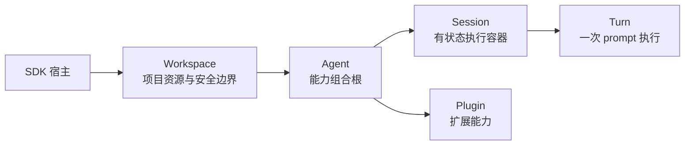

# Agent SDK

`@downcity/agent` 提供本地 `Agent` 与远程 `RemoteAgent`。两种模式都以 Session 为主要工作对象：Agent 负责组合能力，Session 负责承载一段持续对话及其执行状态。

## 一分钟心智模型



| 对象 | 负责 | 不负责 |
| --- | --- | --- |
| `Workspace` | 项目文件、Env、Store、Tools、Shell 与 Sandbox | 模型、Plugin、Session 编排 |
| `Agent` | 模型、指令、最终 Tools、Plugins、Sessions | HTTP/RPC transport |
| `Session` | 对话状态、消息历史、执行顺序与审批 | 项目资源所有权 |
| `PluginContext` | Agent 投影给 Plugin 的稳定能力 | 充当第二个 Agent |
| `SessionTurnContext` | 一个 Turn 的执行上下文与生命周期 | 保存长期 Agent 状态 |
| `RemoteAgent` | 访问服务端 Agent 与 Session | 配置服务端模型 |

## 选择本地还是远程

| 场景 | 使用 |
| --- | --- |
| Agent 与应用运行在同一个 Node.js 进程 | `Agent` |
| 应用需要直接注入模型、Tool、Plugin 和 Shell | `Agent` |
| Agent 已由另一个进程通过 HTTP/RPC 暴露 | `RemoteAgent` |
| 客户端只需要创建 Session、发送 prompt 和订阅结果 | `RemoteAgent` |

网络服务不属于 Agent。需要暴露本地 Agent 时，使用 `@downcity/city` 提供的 `AgentHTTP` 或 `AgentRPC`。

## 推荐的本地组合

Shell 是本地 Agent 使用项目命令和进程的标准入口。SDK 不会自动选择平台 Sandbox；应用只安装并注入当前操作系统对应的 Adapter。以下示例使用 macOS：

```ts
import { Agent, Workspace } from "@downcity/agent";
import { MacOsSeatbeltSandbox } from "@downcity/sandbox-macos";
import { Shell } from "@downcity/shell";

const shell = new Shell({
  sandbox: new MacOsSeatbeltSandbox(),
});

const workspace = new Workspace({
  path: process.cwd(),
  shell,
});

const agent = new Agent({
  id: "repo-helper",
  workspace,
  model,
});

try {
  const session = await agent.sessions.create();
  const turn = await session.prompt({ query: "总结当前仓库" });
  const result = await turn.finished;
  console.log(result.text);
} finally {
  await agent.dispose();
}
```

只需要记住这条主链路：

```text
Workspace + Shell → Agent → Session → prompt() → turn.finished → dispose()
```

`agent.dispose()` 会释放 Agent 及其独占 Workspace，包括 Plugin lifecycle、ActionSchedule、Shell 进程、PTY 和 Sandbox。不要在正常流程中再次单独释放同一个 Workspace。

## 模型归属

纯 SDK 嵌入模式由宿主持有模型实例：

- 在 `new Agent({ model })` 中设置默认模型。
- 或对一个本地 Session 调用 `await session.set({ model })` 覆盖默认模型。

Downcity 项目模式由 CLI 宿主根据项目配置和 City AIService 模型目录解析模型。远程 Session 不提供客户端模型配置 API，模型始终由服务端宿主持有。

## 推荐阅读顺序

1. [本地 Agent 快速开始](/zh/agent-sdk-docs/local-agent/quickstart)
2. [Session 总览](/zh/agent-sdk-docs/sessions/overview)
3. [Shell 与沙箱](/zh/agent-sdk-docs/local-agent/shell-reference)
4. [Tools 与 Plugins](/zh/agent-sdk-docs/local-agent/tools-and-plugins)
5. [远程 Agent](/zh/agent-sdk-docs/remote-agent/quickstart)
6. [SDK Surface](/zh/agent-sdk-docs/api-reference/sdk-surface)
7. [Agent SDK 架构](/zh/docs/agent/sdk-architecture)
