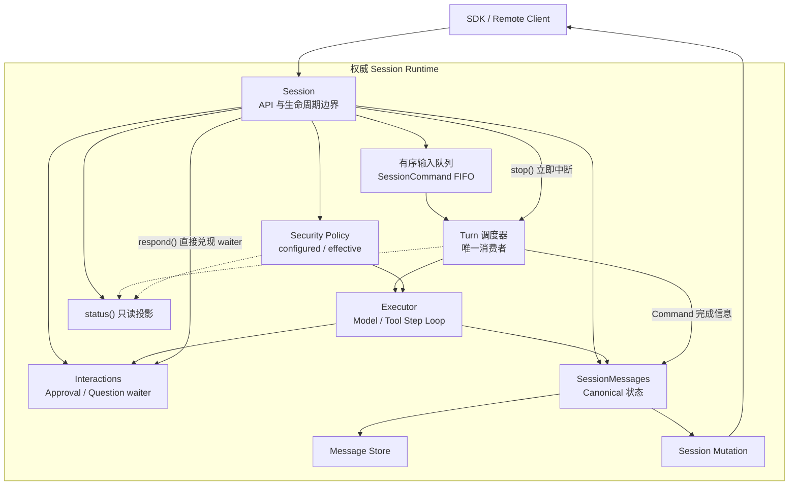

# Session 总览

`Agent` 负责组装工具、plugin、配置和存储位置。模型由宿主在执行前注入；真正承载一次连续对话、历史、流式输出与工具审批的是 `Session`。

一个 Session 是一条持久化的、线性有序的 Message 序列。你可以离开进程后重新 `get()` 它，也可以在本地 `Agent` 与 `RemoteAgent` 之间复用几乎相同的调用方式。

## 先记住这条主线

```text
create / get
-> 读取 messages() 初始快照
-> subscribe() 实时变化
-> prompt() 返回 turn handle
-> 处理 delta、part、approval
-> await turn.finished
-> 需要时 stop()、fork() 或 archive()
```

订阅要在 `prompt()` 前建立。它只发送建立订阅之后的 Mutation，不会补发已经发生的流式输出。

## 一个完整的本地例子

```ts
const session = await agent.sessions.create({
  session_id: "repo-analysis",
});

await session.set({ model });

const initial_page = await session.messages();
render_messages(initial_page.items);

const unsubscribe = session.subscribe((mutation) => {
  apply_mutation_to_ui(mutation);

  if (
    mutation.variant === "part" &&
    mutation.type === "interaction" &&
    mutation.part.status === "pending"
  ) {
    render_interaction(mutation.part);
  }
});

const turn = await session.prompt({ query: "分析这个仓库的 Session 设计" });
const result = await turn.finished;
set_turn_status(turn.id, result.success ? "completed" : "failed");

unsubscribe();
```

`apply_mutation_to_ui()` 应按 `message_id + revision` 合并完整快照；对 `delta` 只追加增量文本。完整做法见 [实时订阅](/zh/agent-sdk-docs/sessions/subscribe) 和 [重连与同步](/zh/agent-sdk-docs/sessions/reconnect-and-sync)。

失败时，用户可见错误由 canonical `error` Message 提供。`turn.finished.error` 用于控制流、日志或非 Message 界面；已经渲染 Session Message 的聊天界面不要再把它追加成第二条错误。

## Session 里有哪些对象

| 对象 | 作用 | 什么时候使用 |
| --- | --- | --- |
| `SessionMessage` | 持久化历史的唯一模型 | 首次加载、重连、历史浏览 |
| `SessionMutation` | 订阅后的实时变化协议 | 流式渲染、工具状态、标题更新 |
| `TurnHandle` | 一次输入归属的执行句柄 | 等待最终结果、停止后检查结果 |
| `SessionPendingInteraction` | 当前 Session 等待用户响应的请求 | 审批、问答、后台处理 |

Message 和 Mutation 不要混用：Message 是可恢复的状态快照；Mutation 是把状态变化及时送到客户端的协议。

## Session 运行模型

Session 是输入排序和持久化的一致性边界。Prompt、模型修改、环境更新、Plugin 更新、
审批模式修改和 Compact 都在服务端进入同一个 FIFO，在 Turn 开始前或 Model Step
检查点按提交顺序执行。远程客户端只调用 Session API，不在客户端复制调度逻辑。



只有需要 FIFO 顺序和 Step 检查点的操作才进入队列。`respond()` 必须立即恢复当前
Interaction，`stop()` 必须立即中断当前 Turn，因此两者不会排队。

Command 可以声明成功后的 Action 完成信息。Session 先执行领域修改，再持久化
canonical Action Message；Message 提交成功后才发布对应 Mutation。完成信息落盘失败
不会回滚已经生效的配置，也不会发布并不存在的成功事件。

## 本地与远程的差异

两者都有 `prompt()`、`stop()`、`compact()`、`subscribe()`、`messages()`、`interactions()`、`respond()`、`status()`、`set({ security })` 和 `fork()`。本地 Session 还提供 `set({ model })`、`syncshot()` 与 `snapshot()`；远程 Session 的模型和 system 策略由服务端宿主管理。

| 场景 | 配置模型 |
| --- | --- |
| 本地 `AgentSession` | `session.set({ model })`，接收 `AgentModel` 实例 |
| `RemoteAgentSession` | `session.set({ security })`；不接受模型实例 |
| Downcity Agent 项目 | CLI 解析 `execution.modelId`，在构造 Agent 时传入 `AgentModel` 实例 |

远程客户端不参与模型选择；模型 ID、默认值和恢复策略都属于服务端宿主。

## API 地图

- 管理本地会话：`agent.sessions.create/get/list/archive/archived/clean_archive/remove/clear_messages()`
- 输入与完成：`session.prompt()`、`turn.finished`
- 读取与实时：`session.messages()`、`session.get_info()`、`session.subscribe()`
- 运行控制：`session.stop()`、`session.set()`、[`session.compact()`](/zh/agent-sdk-docs/sessions/compact)、`session.fork()`
- system 刷新与持久化：[`session.syncshot()`](/zh/agent-sdk-docs/sessions/syncshot)、[`session.snapshot()`](/zh/agent-sdk-docs/sessions/snapshot)
- 工具审批：`session.interactions()`、`session.respond()`、`session.set({ security })`、`session.status()`
- 调试上下文：`session.system()`、[元数据与落盘](/zh/agent-sdk-docs/sessions/metadata-and-storage)

## 下一步

先从 [管理 Session](/zh/agent-sdk-docs/sessions/session-management) 建立会话，再阅读 [输入与 Turn](/zh/agent-sdk-docs/sessions/prompt-and-turns) 和 [Message](/zh/agent-sdk-docs/sessions/messages)。
