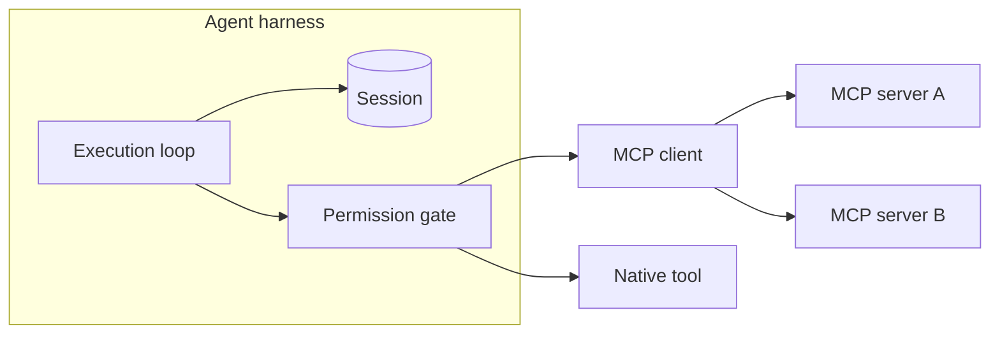

The comparison comes up constantly, usually phrased as a choice: should I use MCP, or do I need a harness?

It is the wrong question. MCP and a harness operate at different layers and do different jobs. Asking which one to use is like asking whether you need HTTP or a server. The answer is that they exist for different reasons and you will likely have both.

A harness owns the agent: its loop, its session, its permissions. MCP sits at the edge, describing how the agent reaches a tool. The boundary is where the two meet.

## What MCP actually defines

MCP (Model Context Protocol) is a connection standard. It specifies how an agent discovers and calls external capabilities: tools, resources, and prompts.

What it standardizes is genuinely useful. Before MCP, every integration looked different, and every agent framework had its own conventions. MCP replaced a pile of bespoke connectors with one contract, which is why it spread quickly.

What it deliberately does not cover is just as important. MCP does not define:

- how long an agent runs, or what happens across restarts
- what an agent is allowed to do, and who approves the exceptions
- which session made a call, and with whose credentials
- how much the call cost, and who pays for it
- where the agent's workspace lives

Those questions are all outside the protocol, because they belong to the runtime.

## What a harness owns

The harness is the runtime that executes the agent. It runs the loop, holds session state, gives the agent a workspace, mounts its tools, enforces permissions, and records usage.

The part worth pausing on is that a tool is a tool. Whether a capability arrives over MCP or is compiled into the process, the harness still has to decide whether to mount it, whether to allow it, and what to record. MCP changes how a tool connects, not what the runtime must do about it.

## Why they get confused

Three reasons, and all of them are reasonable at first glance.

**They both talk about tools.** MCP standardizes tool access. A harness also concerns itself with tools. Same noun, different verb: MCP describes the connection, the harness governs the call.

**They arrived around the same time.** Teams adopting agents in the same period met both terms together, often in the same README, and assumed they were alternatives.

**Some agent frameworks bundle a bit of both.** A library that offers tool calling and also has an MCP client can look like a runtime. It becomes clear that it is not one the first time a task needs to survive a restart.

## Side by side

| Question | MCP | Agent harness |
| --- | --- | --- |
| What layer? | Protocol at the agent's edge | Runtime around the agent |
| Primary job | Describe how to reach a tool | Execute and govern the agent |
| Owns sessions? | No | Yes |
| Owns permissions? | No | Yes |
| Owns cost accounting? | No | Yes |
| Standardized? | Yes, one shared contract | No, each implementation differs |
| Choose one? | No | No |

That last row is the point of this article.

## How they compose in practice

A concrete chain, in order, for one tool call that arrives over MCP:

1. **The harness assembles context** for the turn, including the schemas of the tools this agent may use.
2. **The model emits a tool call** naming one of those tools.
3. **The harness's permission gate evaluates it.** Allow, deny, or hold for approval. MCP has no opinion here; this is policy.
4. **The harness's MCP client performs the call** against the configured server.
5. **The server does the work** and returns a result.
6. **The harness records the event and the cost**, and appends the result to the session.
7. **The loop continues** with the updated context.

MCP contributes step 4 and part of step 5. The harness owns everything else. Read the list again and notice how much of it is governance rather than connectivity, which is exactly the split the comparison misses.

## Where the boundary shows up

Two situations make the division obvious.

**Auditing.** Someone asks which tools an agent could reach last quarter, and who approved them. MCP cannot answer, because it has no concept of an agent's configuration over time. The harness can, because mounting is a decision it made and recorded.

**Multi-tenancy.** Two customers connect to the same MCP server with different credentials and different budgets. Nothing in the protocol distinguishes them. Sessions, identity, and usage attribution are runtime concerns.

## Do you need MCP?

Not necessarily. If an agent only needs a handful of stable capabilities, native tools are simpler: no server to run, no network hop, no schema negotiation at the edge.

MCP earns its place when you want a capability to be reachable by more than one agent, or when third parties publish tools you would rather not reimplement. The protocol's value scales with the number of consumers, which is why it matters more as your setup grows.

## Do you need a harness?

If the agent runs once and exits, in a single process, for you alone, then a loop with a model call may genuinely be enough.

The moment any of those conditions breaks, you need the runtime. That means durable sessions when a task outlives a process, a permission model once other people's work is at stake, and cost attribution once someone else pays the bill. None of these are provided by a protocol.

## How Downcity handles MCP

Downcity's position follows from the boundary: MCP is treated as one source of tools, not as the runtime.

Concretely, MCP servers are mounted like any other capability. The harness owns the loop, session, permission gate, and usage ledger; an MCP server supplies a tool at the edge. That means an MCP-backed tool passes the same permission gate and lands in the same audit trail as a native one, which is what you want and what a protocol alone cannot give you.

- [Agent Plugins](/en/plugins-docs/) covers mounting tools and plugins.
- [Permissions](/en/docs/security/permissions/) covers the gate every tool call passes through.
- [Agent overview](/en/docs/agent/overview/) covers the loop and session model.

## Common questions

**Is MCP a replacement for an agent framework?**
No. A framework helps you describe agent behavior; MCP describes tool connectivity. They are different kinds of thing, and most projects use both.

**Can I use MCP without a harness?**
For a short-lived, single-process, single-user agent, yes. You lose session durability, permissions, and cost attribution, which may be fine and may become urgent later.

**Does a harness have to use MCP?**
No. Native tools avoid the extra hop and are simpler to debug. MCP is worth the overhead when the capability needs to be shared or comes from a third party.

**Which one should I adopt first?**
Start with the layer that hurts first. If tools are the problem, adopt MCP. If sessions, permissions, or costs are the problem, you need a harness, and MCP can come later.

**Are MCP servers secure?**
A server is code you are choosing to run, so it deserves the same scrutiny as any dependency. The harness's sandbox and permission gate limit what a call can reach, which is the point of keeping those in the runtime.

**Does MCP replace APIs?**
Not exactly. It standardizes how agents reach capabilities that may themselves be backed by APIs. It is a contract for agent access, not a replacement for the systems behind it.

## Where to go next

If you want to see the boundary in working code, [start an agent](/start/) and mount a tool, then look at the permission record it produces. The [whitepaper](/whitepaper/) argues the case for keeping governance in the runtime rather than in a protocol.

If you are still forming the mental model, [what an agent harness is](/en/blog/what-is-an-agent-harness/) covers the definition, and [the anatomy](/en/blog/the-anatomy-of-an-agent-harness/) walks through each subsystem the runtime owns.
