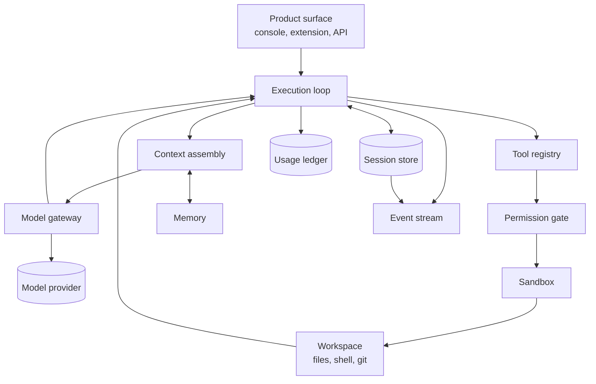

[What an agent harness is](/en/blog/what-is-an-agent-harness/) is one question. Where each responsibility physically lives is another. This piece answers the second one.

The useful way to study a harness is not a feature list but a request. Follow a single task from the moment a user submits it to the moment the agent stops, and every subsystem it touches becomes visible, along with the order it touches them.

## The whole shape first

The loop sits in the middle because everything else is either feeding it or recording what it did. Read the diagram as three rings: the loop is the control flow, the gateway and registry are what it reaches outward through, and the session store, memory, ledger and event stream are what remembers.

## One request, end to end

Here is the same shape as a sequence, which is usually easier to reason about than a diagram.

1. **A task arrives** from a product surface: a console, a browser extension, an API call, a scheduled job.
2. **The harness opens or resumes a session.** If this is a continuation, it loads prior state instead of starting fresh.
3. **Context is assembled.** The harness decides what actually goes into the prompt: system instructions, recent turns, retrieved memories, tool schemas, workspace state. This is a budget decision, not a concatenation.
4. **The model is called** through the gateway, which handles provider selection, streaming, and retries.
5. **The response comes back.** Either it is a final answer, or it contains one or more tool calls.
6. **Tool calls pass the permission gate.** Allowed, denied, or held for human approval.
7. **Approved calls execute inside the sandbox**, against the workspace.
8. **Results are appended to the session** and folded back into context. The loop returns to step 3.
9. **Throughout, events are emitted and usage is recorded**, so the run can be observed, replayed, and billed.

Steps 3 through 8 repeat until the task finishes or a limit is reached. Everything below is what one of those steps actually requires.

## The subsystems, one at a time

### 1. The execution loop

The loop is the only part that is strictly mandatory. It calls the model, dispatches tool calls, appends results, and decides when to stop.

The interesting engineering is in the stopping conditions. A loop needs a turn ceiling, a wall-clock budget, a token budget, and a way to detect that it is repeating itself. Without those, a confused agent runs until someone notices the bill.

### 2. The model gateway

A thin provider abstraction, but only if you build it deliberately. The gateway owns model selection, credential handling, streaming, and retry behavior.

The failure mode it prevents: provider specifics leaking into the loop. Once `if provider == "x"` appears in your control flow, swapping models becomes a refactor instead of a config change. It also becomes the natural place to normalize token accounting, because providers report usage differently.

### 3. The session store

A session is the durable record of a conversation and its working state. In a demo it is an array in memory. In production it is a persisted object with an identity.

What separates a real session store from a chat log is what it supports: **resume** after a process restart, **fork** to explore an alternative without losing the original, and **replay** to reconstruct what happened. All three require that the session, not the process, be the source of truth.

This is the subsystem most often underestimated. Teams usually discover they need it after a deploy kills a long-running task.

### 4. Context assembly

Context assembly decides what the model sees on each turn. It has the largest effect on output quality and is the easiest subsystem to get wrong.

Three jobs live here. **Selection**: which instructions, memories, and tool schemas are relevant right now. **Budgeting**: how to fit them into a finite context window. **Compaction**: what to summarize or drop when the history outgrows the window.

Dumping the full transcript into every call works until it does not, and when it stops working, the symptom is not an error. It is a gradual quality decline that is hard to attribute.

### 5. The workspace

The workspace is what the agent can actually touch: a directory tree, a shell, and usually version control. It is the difference between an agent that talks about work and one that does it.

Its design question is where the boundary sits. A workspace scoped to one repository is safer and simpler. A workspace that can reach the host filesystem is more capable and much harder to reason about.

### 6. The tool registry

The registry is the inventory of what the agent can call. The design choice that matters is **explicit mounting** versus automatic discovery.

Automatic assembly feels convenient and undermines everything downstream. If tools appear without a deliberate decision, then permissions cannot be audited, because there is no point in the code where someone decided what this agent may do. Explicit mounting gives you that decision point, and gives the permission gate something stable to validate against.

Each tool also needs a schema the model can read and the harness can validate. A tool that returns malformed output is worse than a missing tool, because the model will try to use it.

### 7. The permission gate and the sandbox

These are two different mechanisms and are often conflated.

The **permission gate** is policy: this tool is allowed, this one requires approval, this one is denied in this context. It operates before execution and produces a decision plus an audit record.

The **sandbox** is enforcement: the process boundary that makes the policy real. If the gate says an agent may not write outside its workspace, the sandbox is what makes that true when the agent tries anyway.

A gate without a sandbox is a suggestion. A sandbox without a gate is a fence with no rules about who climbs it. You want both, and you want the human-in-the-loop approval path to run through the gate rather than beside it.

### 8. Memory

Memory is what survives a session. It is distinct from session state, which survives a process but belongs to one conversation.

The hard parts are not storage. They are deciding what is worth persisting, when to retrieve it, and how to avoid retrieving something that was true last month and is misleading now. Memory that is written but never correctly retrieved is pure cost.

### 9. The usage ledger

Every model call has a cost, and the ledger is where it is attributed: to a session, a user, a product, a tenant.

This subsystem tends to be added late and then suddenly become urgent, usually when someone asks why last month's infrastructure bill tripled. Retrofitting attribution is painful because the information has to be captured at call time, at the gateway, where the token counts actually exist.

### 10. The event stream

The event stream is the record of what happened: tool calls, approvals, errors, artifacts, state transitions. It is what makes a run **explainable** rather than merely repeatable.

Two consumers depend on it. Humans debugging a surprising outcome, and the usage ledger reconciling cost against activity. If events are emitted ad hoc from scattered call sites, both consumers get an incomplete picture.

## What breaks when a subsystem is missing

This is the practical payoff. Production symptoms map fairly reliably onto missing organs.

| Symptom you observe | Likely missing subsystem |
| --- | --- |
| Agent cannot resume after a deploy | Session store is in-memory, not durable |
| Output quality degrades over long sessions | Context assembly has no compaction strategy |
| Nobody can explain a bad outcome | Event stream is incomplete or unstructured |
| Costs are unaccounted for per customer | Usage ledger is absent or retrofitted |
| Tool access cannot be audited | Tools are auto-discovered, no explicit mounting |
| An agent acted outside its intended scope | Permission gate exists but the sandbox does not enforce it |
| Retrying a call duplicates side effects | Loop has no idempotency handling around tool execution |
| A run never terminates | No turn, time, or token ceiling on the loop |
| The same context is retrieved repeatedly and ignored | Memory is written without a retrieval strategy |
| Swapping models requires a code change | Provider logic leaked out of the gateway |

Read the table backwards when you are designing. Each symptom is a requirement you are choosing to satisfy now or to discover later.

## Building it yourself versus adopting one

The honest framing is that a harness is not hard to start and hard to finish. The first version, a loop with a model call and a few tools, is a weekend. The subsystems above are where the following months go.

The build-versus-adopt decision usually comes down to which of these you consider core to your product. Session durability, sandboxing, permission policy, and cost attribution are infrastructure. They are rarely what your users are paying you for, and they are all things you can get wrong in ways that are expensive after real users arrive.

## How Downcity's anatomy maps to this list

Downcity was designed against this decomposition, so the mapping is close to one to one.

| Subsystem | Downcity component |
| --- | --- |
| Execution loop, session, workspace | [Agent Harness](/en/docs/agent/overview/) |
| Session lifecycle and resumption | [Agent lifecycle](/en/docs/agent/lifecycle/) |
| Model selection and provider access | [Federation](/en/docs/federation/overview/) and the [City host](/en/city-sdk-docs/) |
| Tool registry, members, and plugins | [Agent Plugins](/en/plugins-docs/) |
| Memory as a mounted capability | [memory plugin](/en/docs/plugin/overview/) |
| Permission gate and approval flow | [Permissions](/en/docs/security/permissions/) |
| Sandbox and data boundaries | [Security overview](/en/docs/security/overview/) |
| Usage, credits, and payment | [Accounts and Payments](/en/payments/) |
| Local CLI operation and debugging | [CLI](/en/docs/cli/overview/) |
| Embedding the runtime in your product | [Agent SDK](/en/agent-sdk-docs/) |

Three choices in that table are worth flagging, because they are where Downcity takes a position.

**Tools are mounted explicitly**, so the permission gate always has a deliberate decision to validate against. **The permission gate and the sandbox are separate mechanisms**, so policy and enforcement can be reasoned about independently. And **usage accounting lives at the model boundary**, which is the only place where the token counts needed for attribution actually exist.

## Common questions

**Is the execution loop the same as an agent framework?**
No. Frameworks help you describe agent behavior. The loop is the runtime that executes it. You can write the loop using a framework, or without one.

**How many sessions should a harness support per agent?**
As many as your product needs, which is why sessions must be addressable objects rather than process globals. Multi-tenant products typically need one session store with per-tenant isolation.

**Does context assembly mean retrieval-augmented generation?**
RAG is one input to context assembly. Assembly also covers system instructions, tool schemas, workspace state, and deciding what to drop when the budget runs out.

**Why separate the permission gate from the sandbox?**
Because they answer different questions. The gate answers "should this be allowed," producing a policy decision and an audit trail. The sandbox answers "can this physically happen," producing enforcement. Merging them makes both harder to test.

**Where should usage accounting be recorded?**
At the model gateway, when the call happens. That is the point where provider-reported token counts exist. Reconstructing them later from logs is approximate at best.

**Can I add these subsystems incrementally?**
Yes, and most teams do. The practical ordering is session durability first, then permissions and sandboxing, then usage attribution. Those three are the ones that are painful to retrofit.

## Where to go next

If the anatomy makes sense and you want to see it running, [start your first agent](/start/) and watch a real session, workspace, and tool boundary in action. The [CLI documentation](/en/docs/cli/overview/) covers the commands you will use to inspect state.

If you are evaluating this against your own architecture, the [whitepaper](/whitepaper/) covers the design rationale for where these boundaries belong, and the [features page](/features/) lists what each subsystem covers in practice.
