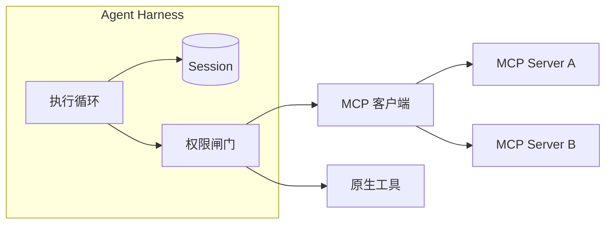

这个比较经常出现，而且通常被说成一道选择题：该用 MCP，还是需要一个 Harness？

这个提法本身有问题。MCP 和 Harness 在不同的层、做不同的事。问「该用哪个」，就像问「该用 HTTP 还是该用服务器」——它们存在的原因不同，而且你大概率两个都会有。

Harness 持有 Agent 本身：它的循环、Session、权限。MCP 处在边缘，描述 Agent 如何触达一个工具。两者的交界就在这条边界上。

## MCP 到底定义了什么

MCP（Model Context Protocol）是一个连接标准。它规定 Agent 如何发现并调用外部能力：工具、资源与提示。

它标准化的事情确实很有价值。在 MCP 之前，每个集成的样子都不一样，每个 Agent 框架也有自己的一套约定。MCP 用一份契约替掉了成堆的定制连接器，这也是它普及得快的原因。

但它**有意不去覆盖**的部分同样重要。MCP 不定义：

- Agent 能跑多久，以及跨重启之后怎么办
- Agent 被允许做什么，例外由谁审批
- 是哪个 Session 发起了调用，用的谁的凭证
- 这次调用花了多少成本，由谁买单
- Agent 的 Workspace 放在哪里

这些问题都在协议之外，因为它们属于运行时。

## Harness 负责什么

Harness 是执行 Agent 的运行时。它跑循环、持有 Session 状态、给 Agent 一块 Workspace、装配工具、执行权限、记录用量。

这里值得停一下的是：工具就是工具。一项能力无论是通过 MCP 接入，还是直接编译进进程，Harness 都仍然要决定要不要挂载它、要不要放行它、要记录什么。MCP 改变的是工具的**连接方式**，不是运行时**必须做的治理**。

## 为什么会被混淆

三个原因，而且乍看都说得通。

**两者都在谈工具。** MCP 标准化工具访问，Harness 也关心工具。名词相同，动作不同：MCP 描述连接，Harness 治理调用。

**它们差不多同时出现。** 同一时期开始做 Agent 的团队会一起遇到这两个概念，常常就在同一个 README 里，于是以为是二选一。

**有些 Agent 框架同时带了两者的一部分。** 一个既提供工具调用、又内置 MCP 客户端的库，看上去像个运行时。等到某项任务需要在重启后继续时，才会看清它不是。

## 并排对比

| 问题 | MCP | Agent Harness |
| --- | --- | --- |
| 处在哪一层 | Agent 边缘的协议 | 包裹 Agent 的运行时 |
| 主要职责 | 描述如何触达工具 | 执行并治理 Agent |
| 管理 Session | 不 | 是 |
| 管理权限 | 不 | 是 |
| 管理成本核算 | 不 | 是 |
| 是否标准化 | 是，一份共享契约 | 否，各家实现不同 |
| 是否要二选一 | 不 | 不 |

最后一行就是本文的重点。

## 实际工程中如何组合

以一次经 MCP 传入的工具调用为例，按顺序展开：

1. **Harness 组装这一轮的上下文**，其中包含这个 Agent 可以使用的工具 schema。
2. **模型产出工具调用**，指名其中一个工具。
3. **Harness 的权限闸门评估这次调用**：放行、拒绝，或挂起等待审批。MCP 在这里没有意见，因为这是策略问题。
4. **Harness 的 MCP 客户端发起调用**，打到已配置的 server。
5. **Server 执行并返回结果。**
6. **Harness 记录事件与成本**，并把结果追加进 Session。
7. **循环带着更新后的上下文继续。**

MCP 贡献的是第 4 步和第 5 步的一部分，其余全归 Harness。再读一遍这份清单，注意其中有很大比例是**治理**而不是**连通性**——这正是「二选一」这个提法会漏掉的东西。

## 边界在什么时候会显形

两种场景会让分工变得非常清楚。

**审计。** 有人问：上个季度这个 Agent 能够触达哪些工具，谁批准的。MCP 答不了，因为它没有「Agent 配置随时间变化」的概念。Harness 答得了，因为挂载是它做过的决策，也是它记录下来的东西。

**多租户。** 两个客户用不同凭证、不同预算连到同一个 MCP server。协议里没有任何东西能区分他们。Session、身份与用量归因都是运行时的事。

## 你需要 MCP 吗

不一定。如果 Agent 只需要少数几项稳定能力，原生工具更简单：不用额外跑 server、没有网络跳转、也不必在边缘做 schema 协商。

MCP 的价值在于**当一项能力需要被多个 Agent 复用**，或者**第三方已经发布了工具、你不想重新实现**。协议的价值随消费方数量增长，所以你的规模越大，它越有意义。

## 你需要 Harness 吗

如果 Agent 只跑一次就退出、在单个进程里、只有你自己用，那么一个带模型调用的循环可能真的够用。

一旦上述任一条件被打破，你就需要运行时。这意味着：任务活得比进程久时需要持久化 Session；别人的工作牵涉进来时需要权限模型；别人付账单时需要成本归因。这些都不是协议能提供的东西。

## Downcity 怎么处理 MCP

Downcity 的立场直接来自这条边界：**把 MCP 当作工具的来源之一，而不是运行时。**

具体来说，MCP server 和其他能力一样被挂载。Harness 持有循环、Session、权限闸门和用量账本；MCP server 在边缘提供一个工具。这意味着经 MCP 接入的工具与原生工具**通过同一个权限闸门、落入同一条审计线索**——这正是你想要的，也正是单靠一份协议拿不到的。

- [Agent Plugins](/zh/plugins-docs/) 讲工具的挂载方式。
- [权限模型](/zh/docs/security/permissions/) 讲每次工具调用都要经过的闸门。
- [Agent 总览](/zh/docs/agent/overview/) 讲循环与 Session 模型。

## 常见问题

**MCP 是 Agent 框架的替代品吗？**
不是。框架帮你描述 Agent 行为，MCP 描述工具连通性。它们不是同一类东西，多数项目两者都用。

**可以只用 MCP、不用 Harness 吗？**
对短时、单进程、单用户的 Agent 可以。代价是你放弃了 Session 持久化、权限和成本归因——现在可能无所谓，以后可能很急。

**Harness 一定要用 MCP 吗？**
不一定。原生工具少一跳，排查也更简单。当能力需要被共享、或来自第三方时，MCP 才值这份开销。

**应该先上哪一个？**
先上先出问题的那一层。如果是工具本身的问题，上 MCP；如果是 Session、权限或成本的问题，你需要的是 Harness，MCP 可以晚点再说。

**MCP server 安全吗？**
Server 就是一段你选择运行的代码，值得用对待任何依赖的标准去审。Harness 的沙箱与权限闸门会限制一次调用能够触达的范围，这正是把治理留在运行时的意义。

**MCP 会取代 API 吗？**
不完全是。它标准化的是 Agent 触达能力的方式，而这些能力背后可能仍然是 API。它是给 Agent 访问用的契约，不是它背后那些系统的替代品。

## 下一步

想在能跑的代码里看到这条边界，可以[启动一个 Agent](/zh/start/)，挂载一个工具，再看它产生的权限记录。[白皮书](/zh/whitepaper/)论证了为什么应该把治理放在运行时而不是协议里。

如果还在建立概念，可以先读 [Agent Harness 是什么](/zh/blog/what-is-an-agent-harness/)，再看[内部构造](/zh/blog/the-anatomy-of-an-agent-harness/)，它逐个走完了运行时持有的子系统。
