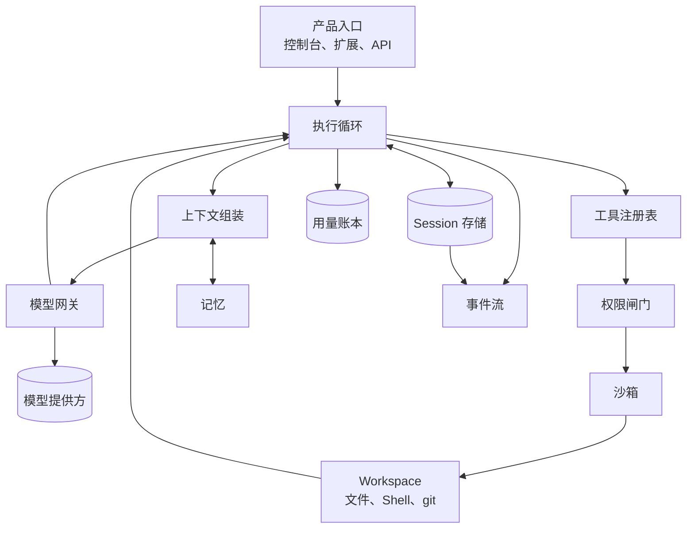

[Agent Harness 是什么](/zh/blog/what-is-an-agent-harness/)回答的是定义。这些职责在代码里具体落在哪里，是另一个问题。这篇回答第二个。

研究 Harness 最有效的方式不是看功能列表，而是跟一条请求。从用户提交任务开始，到 Agent 停下为止，中间碰过的每个子系统都会显形，连同它们被碰到的顺序。

## 先看整体形状

循环在中间，是因为其他部分要么在给它喂输入，要么在记录它做了什么。这张图可以按三个环来读：执行循环是控制流；网关和工具注册表是它向外伸手的通道；Session 存储、记忆、账本和事件流是负责记住的东西。

## 一条请求的完整链路

用顺序描述同一个形状，通常比看框图更容易推理。

1. **任务到达。** 来自某个产品入口：控制台、浏览器扩展、API 调用或定时任务。
2. **Harness 打开或恢复一个 Session。** 如果是接续之前的对话，加载已有状态，而不是从零开始。
3. **组装上下文。** Harness 决定这一次调用真正要放进提示词的内容：系统指令、近期对话、检索出的记忆、工具 schema、Workspace 状态。这是一个预算分配决策，不是字符串拼接。
4. **通过网关调用模型。** 网关负责模型选择、流式输出和重试。
5. **模型返回。** 要么是最终答案，要么包含一个或多个工具调用。
6. **工具调用经过权限闸门。** 允许、拒绝，或挂起等待人工审批。
7. **获批的调用在沙箱内执行**，作用于 Workspace。
8. **结果写入 Session**，并折回上下文。循环回到第 3 步。
9. **全程发出事件并记录用量**，让这次运行可观测、可重放、可计费。

第 3 到第 8 步会反复执行，直到任务完成或触到上限。下面逐个说清每一步实际需要什么。

## 十个子系统

### 1. 执行循环

循环是唯一严格必需的部分。它调用模型、派发工具调用、追加结果，并决定何时停止。

真正需要工程判断的是停止条件。一个循环需要轮次上限、墙钟时间预算、token 预算，以及检测「在原地打转」的能力。缺了这些，一个迷糊的 Agent 会一直跑到有人发现账单为止。

### 2. 模型网关

一层很薄的提供方抽象，前提是你有意去建它。网关负责模型选择、凭证处理、流式输出与重试。

它防止的失败模式是：提供方的差异渗进循环。一旦 `if provider == "x"` 出现在控制流里，换模型就从改配置变成了重构。网关同时也是归一化 token 统计的天然位置，因为各家提供方的用量上报口径并不一致。

### 3. Session 存储

Session 是一段对话及其工作状态的持久记录。在 demo 里它是内存中的一个数组，在生产里它必须是一个有身份、被持久化的对象。

真正的 Session 存储和一份聊天记录的区别，在于它支持什么：进程重启后的**恢复**、在不破坏原分支的前提下做**分叉**、以及重建当时过程的**重放**。这三件事都要求以 Session 而不是进程作为事实来源。

这是最容易被低估的子系统。团队通常在一次部署中断了长任务之后，才发现自己需要它。

### 4. 上下文组装

上下文组装决定模型每一轮看到什么。它是影响输出质量杠杆最大的子系统，也最容易做错。

这里有三件事：**选择**，即当下哪些指令、记忆和工具 schema 是相关的；**预算**，即如何塞进有限的上下文窗口；**压缩**，即历史超出窗口时该摘要或丢弃什么。

把完整对话记录无脑塞进每次调用，一开始能用，直到不能用。而它不能用的表现不是一个报错，而是输出质量缓慢下滑，且很难归因。

### 5. Workspace

Workspace 是 Agent 真正能碰的东西：一个目录树、一个 Shell，通常还有版本控制。它决定了一个 Agent 是在「聊工作」还是在「做工作」。

它的设计问题是边界画在哪里。限定在单个仓库内的 Workspace 更安全也更简单；能触达宿主机文件系统的 Workspace 能力更强，但也更难推理其行为。

### 6. 工具注册表

注册表是「Agent 能调用什么」的清单。这里真正重要的设计选择是**显式装配**与自动发现的取舍。

自动装配看起来很省事，但它会侵蚀下游的一切。如果工具是在没有明确决策的情况下出现的，权限就无法审计，因为代码里根本不存在「某人决定过这个 Agent 可以做什么」的那个点。显式装配提供了那个决策点，也让权限闸门有一个稳定的校验对象。

每个工具还需要一份模型能读懂、Harness 能校验的 schema。一个返回非法结果的工具，比一个缺掉的工具更糟，因为模型会一直试图用它。

### 7. 权限闸门与沙箱

这是两套不同机制，经常被混为一谈。

**权限闸门**是策略：这个工具允许，那个需要审批，这个在这个上下文里禁止。它在执行之前运行，产出一个决策和一条审计记录。

**沙箱**是强制手段：让策略变成现实的进程边界。如果闸门规定 Agent 不能写出 Workspace，那么当 Agent 仍然尝试时，是沙箱让这条规定成立。

只有闸门没有沙箱，是一份建议书。只有沙箱没有闸门，是一道没人管谁翻的围栏。两者都要，而且人工审批链路应该走在闸门里面，而不是旁边。

### 8. 记忆

记忆是跨 Session 存活的东西，与「能跨进程存活但只属于一段对话」的 Session 状态不同。

难点不在存储，而在于：什么值得持久化、什么时候检索出来、以及如何避免检索到「上个月是对的、现在已经误导人」的内容。写进去却从未被正确检索出来的记忆，是纯粹的浪费。

### 9. 用量账本

每次模型调用都有成本，账本负责把成本归因到某个 Session、用户、产品或租户。

这个子系统常常是后期才补，然后突然变得紧急，通常是因为有人问上个月的基础设施账单为什么翻了三倍。归因能力很难事后补救，因为信息必须在调用发生时就采集，也就是在网关那里，token 数量真实存在的地方。

### 10. 事件流

事件流是「发生了什么」的记录：工具调用、审批、错误、产物、状态迁移。它让一次运行变得**可解释**，而不只是可重复。

它有两个消费者：排查意外结果的人，以及拿成本与活动对账的用量账本。如果事件是从散落各处的调用点随手发出的，这两边看到的都是残缺画面。

## 缺了哪个器官，会出现什么症状

这是最有实用价值的部分。生产环境的症状，往往能相当准确地对应到缺失的子系统。

| 你观察到的症状 | 大概率缺失的子系统 |
| --- | --- |
| 部署之后 Agent 无法接着跑 | Session 存储只在内存里，没有持久化 |
| 长对话后输出质量下滑 | 上下文组装没有压缩策略 |
| 没人能解释一次糟糕的结果 | 事件流不完整或没有结构 |
| 无法按客户核算成本 | 用量账本缺失，或事后才补 |
| 工具访问无法审计 | 工具靠自动发现，没有显式装配 |
| Agent 做出了超出预期的动作 | 有权限闸门，但沙箱没有真正强制 |
| 重试调用产生了重复副作用 | 循环在工具执行处没有幂等处理 |
| 一次运行永远不结束 | 循环缺少轮次、时间或 token 上限 |
| 同样的上下文被反复检索又反复被忽略 | 有记忆写入，没有检索策略 |
| 换模型需要改代码 | 提供方逻辑从网关里泄漏了出来 |

设计的时候把这张表倒过来读：每一个症状，都是一条你现在选择满足、还是选择以后才发现的要求。

## 自研 Harness，还是采用现成的

诚实的说法是：Harness 起步不难，难在收尾。第一个版本，一个循环加上模型调用和几个工具，一个周末就能有；上面这些子系统，会吃掉之后的几个月。

自研还是采用的判断，通常归结为你认为哪些部分属于你的产品核心。Session 持久化、沙箱、权限策略、成本归因都是基础设施。它们很少是用户付钱给你的原因，而且它们都有可能在真实用户到来之后才以昂贵的方式暴露问题。

## Downcity 的构造如何对应这份清单

Downcity 就是按这套拆解设计的，所以映射关系基本一一对应。

| 子系统 | Downcity 组件 |
| --- | --- |
| 执行循环、Session、Workspace | [Agent Harness](/zh/docs/agent/overview/) |
| Session 生命周期与恢复 | [Agent 生命周期](/zh/docs/agent/lifecycle/) |
| 模型选择与提供方访问 | [Federation](/zh/docs/federation/overview/) 与 [City 宿主](/zh/city-sdk-docs/) |
| 工具注册、成员与 Plugin | [Agent Plugins](/zh/plugins-docs/) |
| 记忆作为可挂载能力 | [memory plugin](/zh/docs/plugin/overview/) |
| 权限闸门与审批链路 | [权限模型](/zh/docs/security/permissions/) |
| 沙箱与数据边界 | [安全总览](/zh/docs/security/overview/) |
| 用量、Credits 与支付 | [账号与支付](/zh/payments/) |
| 本地 CLI 操作与排查 | [CLI](/zh/docs/cli/overview/) |
| 把运行时嵌进你的产品 | [Agent SDK](/zh/agent-sdk-docs/) |

这张表里有三个选择值得单独指出，因为它们是 Downcity 明确站边的地方。

**工具是显式装配的**，所以权限闸门永远有一个明确的决策可供校验。**权限闸门与沙箱是两套机制**，所以策略与强制可以分别推理。**用量核算放在模型边界上**，因为那是 token 数量真实存在、能支撑归因的唯一位置。

## 常见问题

**执行循环就是 Agent 框架吗？**
不是。框架帮你描述 Agent 行为，循环是执行它的运行时。你可以用框架来写这个循环，也可以不用。

**一个 Harness 里一个 Agent 该支持多少 Session？**
取决于产品需要多少，这正是 Session 必须是可寻址对象、而不能是进程全局变量的原因。多租户产品通常需要一个带租户隔离的 Session 存储。

**上下文组装就是 RAG 吗？**
RAG 只是上下文组装的一个输入。组装还包括系统指令、工具 schema、Workspace 状态，以及在预算用尽时决定丢弃什么。

**为什么要把权限闸门和沙箱分开？**
因为它们回答不同问题。闸门回答「这件事该不该被允许」，产出策略决策与审计线索；沙箱回答「这件事物理上能不能发生」，产出强制力。把两者合并，会让两边都更难测试。

**用量应该记在哪里？**
在模型网关上，随调用一起记录。那是提供方上报的 token 数量真实存在的唯一位置。事后从日志里反推，最多只能是近似。

**这些子系统能逐步加上去吗？**
可以，多数团队也是这么做的。比较实际的顺序是：先做 Session 持久化，再做权限与沙箱，然后是用量归因。这三件事事后补的代价最高。

## 下一步

如果这套构造讲得通，想先看它跑起来，可以[启动第一个 Agent](/zh/start/)，观察一个真实的 Session、Workspace 和工具边界。[CLI 文档](/zh/docs/cli/overview/)说明了你用来检查状态的命令。

如果你正在拿它对照自己的架构，[白皮书](/zh/whitepaper/)讲了这些边界为什么该这样画，[功能页](/zh/features/)则列出了每个子系统在实际产品里覆盖的范围。
