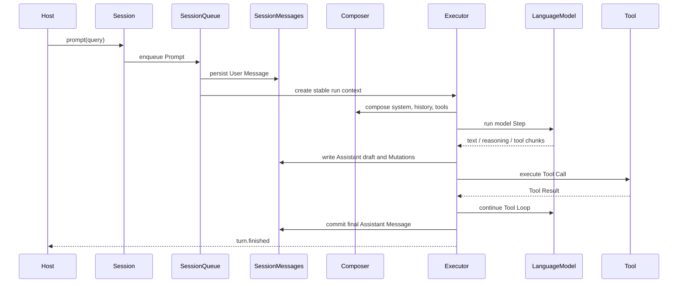
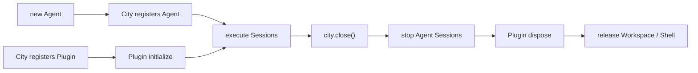

# Agent Runtime Architecture

The runtime is designed to execute every input in a deterministic order, expose intermediate model and Tool state, and recover Sessions after process interruption.

## Session is the execution boundary

Each Session owns independent:

- ID, metadata, and model override.
- Message history and System Snapshot.
- Prompt/Command queue.
- Tool approval state.
- Composer and Executor.
- Live Mutation stream.

```ts
// Session 在创建时选择 Workspace。
const session = await agent.sessions.create({ workspace });
const turn = await session.prompt({ query: "Inspect and fix the project" });
const result = await turn.finished;
```

`prompt()` returns a Turn Handle instead of direct text. `finished` resolves for both success and failure; inspect `result.success` and `result.error` for the outcome.

## How one Prompt runs



The runtime guarantees:

1. The User Message is persisted before the model call.
2. Streaming Assistant output is first written as a recoverable draft.
3. Text, Reasoning, Tool Calls, and Tool Results preserve canonical model-stream order.
4. The Assistant Message enters Active history only after completion.
5. An interrupted run can recover from the draft and Action state.

## State checkpoints

Only one execution loop is active per Session. Every input that can affect the next Step enters one ordered queue:

- User Prompts.
- Workspace environment updates.
- Plugin registry updates.
- Session model updates.
- Explicit compaction.

Changes are committed at Step boundaries, never halfway through a model call or Tool execution. An active Step uses the stable execution view created for it.

Model resolution order is:

```text
Session model > Agent model
```

Agent and Session hold model instances supplied by the host. The SDK does not select or restore model services from a string model ID.

## Composer and Executor

`SessionComposer` owns model-context policy: combining system blocks, translating history, supplying Tools, creating compaction plans, and identifying context-limit errors.

`Executor` owns one run: preventing concurrent execution within a Session, creating the run context, calling Composer, driving the model and Tool Loop, and handling aborts, retries, and context-limit recovery.

Neither object knows the physical Session storage path, the Agent list, or HTTP/RPC transports.

## System Snapshot

A Session supports three System semantics:

- Default: use the current Agent instruction, Plugin system, and Session context at execution time.
- `snapshot()`: persist the current complete system for this Session.
- `syncshot()`: regenerate from current Agent state and replace an existing snapshot.

`system()` returns the effective structured System Snapshot. Updating the Agent instruction does not unconditionally overwrite a Session that has already been snapshotted.

## Messages and persistence

Local state lives under the Agent-specific Workspace scope in the user-level Downcity directory:

```text
~/.downcity/agents/<agent-id>/
├─ sessions/<session-id>/
│  ├─ instruction.md
│  ├─ meta.json
│  └─ messages/
│     ├─ active.jsonl
│     ├─ agent_message.json
│     └─ segments/*.jsonl
├─ archived-sessions/
├─ logs/
├─ schedule.jsonl
└─ sandbox/
```

- `active.jsonl` stores history since the last compaction.
- `agent_message.json` stores the latest complete streaming Assistant draft.
- `segments` stores immutable compacted history prefixes.
- `instruction.md` stores an explicitly persisted System Snapshot.

Messages use monotonically increasing `sequence` values; streaming updates to the same Message use increasing `revision` values. JSON files are atomically replaced with a temporary file, `fsync`, and `rename`; cross-process writes are serialized through Workspace locks.

Hosts should read structured state through `session.messages()`, `get_info()`, and `system()` instead of depending on these physical file names.

## Live observation

`subscribe()` emits Mutations that occur after subscription:

```ts
const unsubscribe = session.subscribe((mutation) => {
  if (mutation.variant === "delta" && mutation.type === "text") {
    process.stdout.write(mutation.delta);
  }
});
```

Mutations cover complete Messages, Assistant Parts, text/reasoning deltas, Turn state, and Session state. After a disconnect, reload the canonical snapshot with `messages()` before establishing a new subscription.

## Plugin runtime

Plugins belong to City, not Agent or Workspace. City owns one instance per Plugin ID and projects its Actions, System text, Hooks, Resolve Points, and HTTP routes into every Agent/Workspace execution entry.

PluginRegistry projection changes take effect at Session checkpoints. A Plugin initialization failure isolates that Plugin without blocking others. Agent disposal stops Sessions and ActionSchedule; City closes the Plugin `initialize/dispose` lifecycle.

ActionSchedule is a local delayed Plugin Action scheduler owned by the Agent. Events are stored in the Agent's storage scope; after restart, abandoned running entries recover to pending. It is not a distributed scheduler and provides no cross-machine leader election.

## Security model

Security is enforced at distinct capability boundaries:

| Capability | Enforced boundary | Permission semantics |
| --- | --- | --- |
| File/Search Tools | Rooted LocalFileSystem | May actively access only the Workspace |
| Sandbox Shell | Workspace Sandbox | Commands run in the Workspace's isolated, persistent environment |
| Host Shell | Approval gateway | The user explicitly authorizes one host command with a recorded reason |
| Plugin | Plugin business authorization | Workspace does not own all Plugin resource access |
| Custom Tool | Registering host | Agent Core does not infer business permissions |

Explicit attachments may use an absolute path selected by the host because they are declared Prompt inputs. This does not expand where model-driven File/Search Tools may browse.

## Cross-platform strategy

Node.js already normalizes files, paths, networking, JSON, timers, AbortController, and basic child processes. Agent, Session, Store, and Workspace therefore contain no operating-system branches.

Isolation differences are contained by the neutral Sandbox Provider protocol. Each Shell receives its Provider explicitly and owns the isolated, persistent Sandbox created when it binds a Workspace. City only manages Workspace resources and does not know whether their Shell uses a local container, microVM, remote host, or another backend. The default implementation uses microsandbox microVMs.

## Lifecycle



Sessions wait for the Agent's City execution binding before execution. `agent.dispose()` does not stop City Plugin instances. `city.close()` closes Transports, Agents, Plugins, Workspaces, and Shells after active Hook/Action leases finish.

Continue with [Agent Lifecycle](/en/docs/agent/lifecycle).
