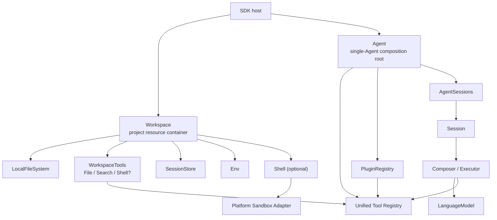

# Agent SDK Architecture

`@downcity/agent` is a single-Agent SDK that runs inside a Node.js process. It combines a model, instructions, tools, plugins, Session history, and local project resources into a runtime that can run continuously, recover, and be observed.

The minimum composition has two core objects:

```ts
const workspace = new Workspace({ path, shell });
const agent = new Agent({ id, workspace, model, instruction, plugins });
```

- `Workspace` defines the project resources available to the Agent.
- `Agent` composes the model, tools, plugins, and Sessions.
- `Session` manages the state and execution order of one continuous conversation.
- `Executor` calls the model and completes the Tool Loop for a Step.
- `Shell` runs commands and processes on the current operating system.

## Overall structure



Dependencies always flow from composition toward lower-level capabilities. FileSystem does not know about Agents or Sessions, Shell does not know about history or models, and a Sandbox Adapter only starts restricted processes.

## Workspace: the project resource container

Workspace binds resources under one canonical project root:

```ts
const workspace = new Workspace({
  path: process.cwd(),
  env: {
    NODE_ENV: "development",
  },
  shell,
});
```

It provides:

- `path`: the canonical project root.
- `files`: atomic file capabilities rooted in the Workspace.
- `tools`: File, Search, and optional Shell Tools.
- `get_env()`, `set_env()`, and `patch_env()`: the Workspace execution environment.
- `SessionStore`: structured storage for the Session collection and individual Session data.
- `dispose()`: release Store, Shell, process, and Sandbox resources.

Workspace is not a `Host`, `SystemHandler`, or general-purpose service container. Models, the Plugin registry, Session lifecycle, and network transports do not belong to it.

### One Workspace instance per Agent

A Workspace instance has exactly one lifecycle owner:

```text
one Workspace instance → one Agent → one dispose
```

Multiple Agents may use the same physical directory, but each needs a separate Workspace instance. Store data is partitioned by `agent_id`, so their Sessions do not mix.

### Lifecycle ownership

The caller constructs Workspace, but Agent owns its disposal after binding:

```text
caller creates Workspace → Agent binds Workspace → agent.dispose() releases both
```

`agent.dispose()` shuts down long-lived Agent state and releases the Store, Shell, processes, and Sandbox held by Workspace. Do not call `workspace.dispose()` again in the normal flow. The caller disposes Workspace directly only when initialization fails before Agent binds it.

## Three Workspace capabilities

### LocalFileSystem

LocalFileSystem is a rooted Node.js file capability. It handles safe path resolution, file operations, atomic replacement, cross-process locks, and bounded search. It is the primitive used by both WorkspaceTools and SessionStore.

### WorkspaceTools

WorkspaceTools are model-callable tools returned by Workspace and registered by Agent:

- Structured File Tools.
- Project Search Tools.
- Command and Shell Session Tools when Shell is present.

Plugin tools and host-defined custom tools do not belong to WorkspaceTools. File/Search always remain rooted in the Workspace and do not expose an unrestricted mode.

### SessionStore

SessionStore is not a second permission system. It is a domain-specific branch over the same
FileSystem. The collection-level `SessionStore` manages Session listing and archives, while each
`SessionDataStore` manages messages, metadata, instructions, and attachments. Neither stores Agent
configuration nor participates in Agent instance assembly.

Workspace file tools may still read and edit `.downcity`. Store adds structured semantics and consistency; it does not hide history or instructions.

## Agent: the Tool composition root

Agent owns the final tool set:

```text
Agent.tools
  = WorkspaceTools
  + PluginRegistry Tools
  + AgentOptions.tools
```

- Workspace contributes project file, search, and optional Shell operations.
- PluginRegistry contributes `plugin_read` and `plugin_call` when actions exist.
- The host registers business-specific tools through `AgentOptions.tools`.

A duplicate name from any source fails construction instead of silently overriding a Tool. `plugin_read` and `plugin_call` are reserved by PluginRegistry.

```ts
const agent = new Agent({
  id: "repo-helper",
  workspace,
  model,
  plugins: [task_plugin],
  tools: {
    company_search: company_search_tool,
  },
});
```

## Env belongs to Workspace

Environment variables describe the project execution environment, so Workspace owns them rather than Agent:

```text
<workspace>/.env < WorkspaceOptions.env
```

The SDK does not mutate `process.env` or write runtime changes back to `.env`. `set_env()` and `patch_env()` update the configured environment in memory and synchronize it with Shell. Existing Sessions commit the new environment at the next Step checkpoint, preventing context from changing in the middle of a model call.

## Shell and platform Sandboxes

### Cloudflare Computer Workspace

`@downcity/workspace-cloudflare-computer` connects a Cloudflare Durable Object
`@cloudflare/computer` Workspace to the same Agent Workspace base contract. It
provides the remote virtual filesystem to SessionStore and owns the Workspace
lifecycle; the adapter calls Cloudflare's `createAITools()` for file, directory, and publish tools, and wraps the
Computer Shell as `exec`. The Agent still owns the model, Sessions, Plugins, and Tool Loop.

```ts
const computer_workspace = await getWorkspace(agent_stub);
const workspace = new CloudflareComputerWorkspace({
  computer: computer_workspace,
});
```

In a Cloudflare deployment, one Durable Object instance normally owns one Agent
and one Workspace. The Worker handles ingress and connections; Worker Shell or
a Cloudflare Container performs command execution.

The Agent core package does not bundle native Sandboxes for every operating system. The host installs only the package for the current platform and injects it at the application composition root:

```ts
import { Shell } from "@downcity/shell";
import { MacOsSeatbeltSandbox } from "@downcity/sandbox-macos";

const shell = new Shell({
  sandbox: new MacOsSeatbeltSandbox(),
});

const workspace = new Workspace({
  path: process.cwd(),
  shell,
});
```

macOS, Linux, and Windows share the same Workspace, Agent, Session, and Store. Only the Shell Sandbox Adapter changes:

| Platform | Adapter package | Native boundary |
| --- | --- | --- |
| macOS | `@downcity/sandbox-macos` | Seatbelt |
| Linux | `@downcity/sandbox-linux` | Bubblewrap |
| Windows | `@downcity/sandbox-windows-mxc` or `@downcity/sandbox-windows-srt` | MXC or SRT |

`unrestricted` is a Shell-only privilege elevation that requires approval. File/Search, plugins, and custom tools do not share a generic unrestricted switch. Plugins use their own business authorization, while the host that registers a custom Tool owns its permissions.

## Package boundaries

| Package | Responsible for | Not responsible for |
| --- | --- | --- |
| `@downcity/agent` | Agent, Workspace, Session, Store, model Tool Loop, Plugin runtime | Native Sandbox implementations, multi-Agent control plane |
| `@downcity/shell` | Commands, long-lived Shell Sessions, output, approvals, Sandbox protocol | Session history, Agent configuration, model calls |
| Sandbox packages | Mapping unified policy to OS process isolation | Agent, Session, or Store behavior |
| `@downcity/city` | HTTP/RPC server and transports | Local Agent domain state |

The CLI/City host owns user-level `~/.downcity`, global databases, and key files. A Plugin that needs global accounts receives a minimal Store interface through its own constructor. It does not depend back on the CLI or place global resources in Workspace.

## Recommended composition

```ts
import { Agent, Workspace } from "@downcity/agent";
import { MacOsSeatbeltSandbox } from "@downcity/sandbox-macos";
import { Shell } from "@downcity/shell";

const shell = new Shell({
  sandbox: new MacOsSeatbeltSandbox(),
});

const workspace = new Workspace({
  path: process.cwd(),
  shell,
});

const agent = new Agent({
  id: "demo",
  workspace,
  model,
  instruction: "Maintain the current project.",
  plugins: [task_plugin],
  tools: { company_search: company_search_tool },
});

try {
  const session = await agent.sessions.create();
  const turn = await session.prompt({ query: "Understand and inspect this project" });
  console.log(await turn.finished);
} finally {
  await agent.dispose();
}
```

Continue with [Runtime architecture](/en/docs/agent/runtime-architecture).
