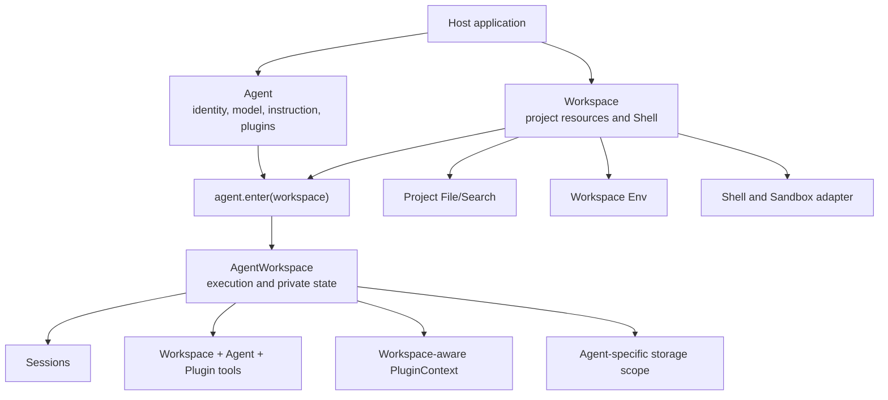
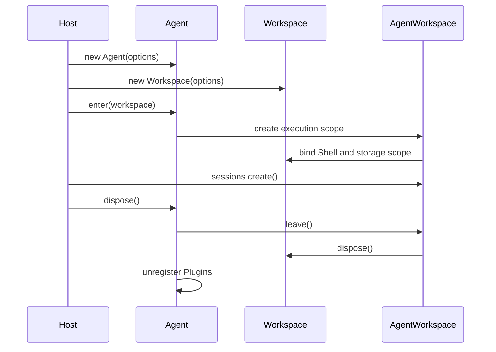

# Agent SDK Architecture

Downcity separates the Agent subject from the project in which it works. `Agent` owns identity,
instruction, model, custom tools, and Plugin registration. `Workspace` owns project resources and
Shell. Calling `agent.enter(workspace)` creates the `AgentWorkspace` execution boundary.

```ts
import { Agent } from "@downcity/agent";
import { Shell, Workspace } from "@downcity/workspace";

const agent = new Agent({ id, model, instruction, plugins });
const workspace = new Workspace({ id: "project", path, shell });
const agent_workspace = agent.enter(workspace);
const session = await agent_workspace.sessions.create();
```

## Responsibility model



The dependency direction stays explicit:

- `@downcity/workspace` does not depend on Agent or Session.
- `@downcity/agent` depends on the Workspace protocol and creates Agent domain state.
- Hosts choose a platform Sandbox and compose Agent with Workspace.
- Edge adapters use `@downcity/workspace/protocol` without loading Node.js local implementations.

## Agent is the subject

An Agent is reusable across projects. It is never configured with one permanent Workspace.

```ts
const agent = new Agent({
  id: "repo-helper",
  model,
  instruction: "Maintain the current project.",
  plugins: [task_plugin],
  tools: { company_search: company_search_tool },
});

const frontend = agent.enter(frontend_workspace);
const backend = agent.enter(backend_workspace);
```

Plugins are registered once on Agent. There is no separate Workspace Plugin category. Every Plugin
Action receives the current execution context; the Plugin decides whether it needs
`workspace_path`, `data_path`, files, Shell, or no Workspace capability at all. Optional
`enter_workspace` and `leave_workspace` hooks express lifecycle needs without creating a new Plugin
type.

## Workspace is the resource boundary

`Workspace` owns:

- A stable Workspace ID and normalized project path.
- Rooted project file access and File/Search tools.
- Workspace environment variables.
- An optional Shell and its Sandbox adapter.
- A domain-neutral `WorkspaceStorageProvider`.

Workspace does not create SessionStore, understand Agent IDs, register Plugins, or call models.
The local implementation resolves its user-level storage root internally; the constructor has no
`data_root_path` option.

Shell belongs to Workspace because command execution operates on Workspace resources. The public
entry is:

```ts
import { Shell, Workspace } from "@downcity/workspace";
```

There is no separate `@downcity/shell` package. Platform Sandbox packages remain independently
installable and are injected into Shell.

## AgentWorkspace is the execution boundary

`agent.enter(workspace)` combines the two subjects without merging their ownership. AgentWorkspace
creates:

- The final Tool set from Workspace tools, Agent custom tools, and Plugin bridge tools.
- `AgentSessions` and the Agent domain `LocalSessionStore`.
- Workspace-aware Plugin context and lifecycle.
- Logs, scheduled Plugin Actions, and Shell binding.

Tool name conflicts fail during composition; no source silently overwrites another. The same Agent
can hold multiple AgentWorkspaces. A Workspace instance itself can be entered only once because its
Shell and private storage are bound to one execution lifecycle.

## Private storage

Local runtime state is centralized outside the project:

```text
~/.downcity/
└── agents/
    └── <agent_id>/
        └── workspaces/
            └── <workspace_id>/
                ├── sessions/
                ├── archived-sessions/
                ├── logs/
                ├── schedule.jsonl
                └── sandbox/
```

Workspace only supplies a safe storage primitive. AgentWorkspace opens the stable
`agents/<agent_id>/workspaces/<workspace_id>` scope and constructs Agent domain stores inside it.
Project File/Search tools use a different rooted FileSystem, so they cannot inspect or change
Session history, Plugin state, or Sandbox data.

## Environment and checkpoints

Environment variables describe the project execution environment and therefore belong to
Workspace:

```text
<workspace>/.env < WorkspaceOptions.env
```

`set_env()` and `patch_env()` update the Workspace snapshot and synchronize Shell. Existing
Sessions commit the new environment at the next Step checkpoint, avoiding context changes halfway
through a model call.

Plugin registry changes, Session model changes, and compaction follow the same checkpoint rule.

## Lifecycle



`agent.dispose()` leaves every entered AgentWorkspace, flushes Session and log state, closes Shell
processes and Sandbox resources, then stops Agent-level Plugins. HTTP/RPC transports created by
`@downcity/agent` remain owned by the host and must be closed separately.

## Package boundaries

| Package | Owns | Does not own |
| --- | --- | --- |
| `@downcity/workspace` | Workspace protocol, local project resources, File/Search tools, Env, Shell | Agent identity, Plugin registry, Session semantics, model calls |
| `@downcity/agent` | Agent, AgentWorkspace, Session, Store, Plugin runtime, model Tool Loop | Project resource implementation, platform Sandbox, multi-Agent control plane |
| Sandbox packages | Native process isolation for one platform | Workspace, Agent, Session, or Plugin business behavior |
| `@downcity/agent` | Agent index and HTTP/RPC transports | Local configuration repository and Agent execution state |

Continue with [Runtime architecture](/en/docs/agent/runtime-architecture).
