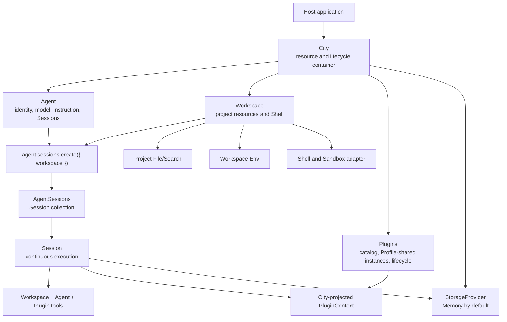
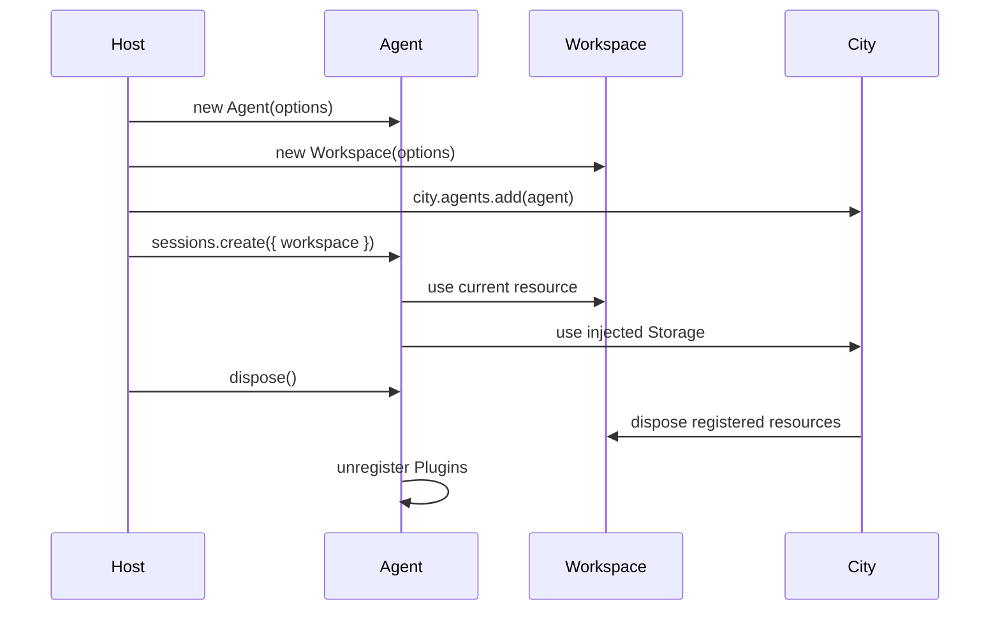

# Agent SDK Architecture

Downcity separates the execution subject, project resources, and extension runtime. `Agent` owns identity, instruction, model, custom Tools, and Sessions. `Workspace` owns project resources and Shell. `City` owns the Plugin catalog, shared instances, lifecycle, and Agent bindings.

```ts
import { Agent } from "@downcity/agent";
import { City } from "@downcity/city";
import { create_builtin_plugin_registrations } from "@downcity/plugins";
import { Shell, Workspace } from "@downcity/city";

const agent = new Agent({ id, model, instruction });
const workspace = new Workspace({ id: "project", path, shell });
const city = new City({
  workspaces: [workspace],
  plugins: create_builtin_plugin_registrations(),
});
city.agents.add(agent, { plugins: [{ plugin_id: "memory" }] });
// Session 在创建时选择 Workspace。
const session = await agent.sessions.create({ workspace });
```

## Responsibility model



The dependency direction stays explicit:

- `@downcity/agent` depends only on neutral Workspace, Shell, and Session Extension protocols from `@downcity/type`.
- `@downcity/city` depends on Agent and projects neutral host extensions into it; Agent does not depend back on City.
- Hosts choose a platform Sandbox and compose Agent with Workspace.
- Edge adapters use `@downcity/type/workspace` without loading Node.js local implementations.

## Agent is the subject

An Agent is reusable across projects. It is never configured with one permanent Workspace.

```ts
const agent = new Agent({
  id: "repo-helper",
  model,
  instruction: "Maintain the current project.",
  tools: { company_search: company_search_tool },
});

city.agents.add(agent, { plugins: [{ plugin_id: "task" }] });

const frontend = await agent.sessions.create({ workspace: frontend_workspace });
const backend = await agent.sessions.create({ workspace: backend_workspace });
```

Agent does not own Plugins. City owns one shared instance per `(plugin_id, profile_id)` and projects bound capabilities into an Agent/Workspace execution entry. Every Plugin Action receives the current `PluginContext` with directly callable restricted Agent, Workspace, Session, and Turn handles. Shared instances use `start/stop`; Agent/Workspace scopes use `bind/unbind`.

## Workspace is the resource boundary

`Workspace` owns:

- A stable Workspace ID and normalized project path.
- Rooted project file access and File/Search tools.
- Workspace environment variables.
- An optional Shell and its Sandbox adapter.
  - It never owns Agent or Session runtime storage. City provides the domain-neutral `StorageProvider`.

Workspace does not create SessionStore, understand Agent IDs, register Plugins, call models, or
create Storage. The constructor has no runtime data-root option.

Shell belongs to Workspace because command execution operates on Workspace resources. The public
entry is:

```ts
import { Shell, Workspace } from "@downcity/city";
```

There is no separate `@downcity/shell` package. Platform Sandbox packages remain independently
installable and are injected into Shell.

## Session is the execution boundary

`agent.sessions.create({ workspace })` combines Agent and Workspace for one Session without merging ownership. Agent, Session, and the City execution projection provide:

- The final Tool set from Workspace tools, Agent custom tools, and Plugin bridge tools.
- `AgentSessions` and the Agent domain `LocalSessionStore`.
- Agent/Workspace/Session/Turn-aware PluginContext and an execution lease.
- Logs, scheduled Plugin Actions, and Shell binding.

Tool name conflicts fail during composition; no source silently overwrites another. The same Agent
can hold multiple Sessions with different Workspace resources. Workspace resources may be registered
in City or managed by the host outside City.

## Private storage

When City receives a local persistent Storage Provider, runtime state is centralized outside the project:

```text
~/.downcity/
└── agents/
    └── <agent_id>/
        ├── sessions/
        ├── plugins/
        ├── logs/
        └── schedule.jsonl
```

City Storage is a bottom-level file/database capability. Agent code interprets the
`agents/<agent_id>/` business scope and creates Session and Plugin stores inside it. Project
File/Search tools use a different rooted FileSystem, so they cannot inspect or change Session
history, Plugin state, or runtime data.

## Environment and checkpoints

Environment variables describe the project execution environment and therefore belong to
Workspace:

```text
<workspace>/.env < WorkspaceOptions.env
```

`set_env()` and `patch_env()` update the Workspace snapshot and synchronize Shell. Existing
Sessions commit the new environment at the next Step checkpoint, avoiding context changes halfway
through a model call.

Plugin registry changes, Session model changes, and compaction follow the same checkpoint rule.

## Lifecycle



`city.close()` stops registered Agents and Sessions, disposes registered Workspace resources,
closes the City Storage Provider, and then closes HTTP/RPC transports. A Workspace managed outside
City remains owned by its host.

## Package boundaries

| Package | Owns | Does not own |
| --- | --- | --- |
| `@downcity/type` | Neutral Workspace, Shell, and Session Extension protocols | Concrete resources and lifecycle implementations |
| `@downcity/agent` | Agent, AgentSessions, Session, Store, host extension ports, model Tool Loop | City composition, Plugin lifecycle, project resource implementation, platform Sandbox |
| `@downcity/city` | City, Workspace/Shell implementations, Plugin SDK/runtime, Hook scheduling, RemoteAgent, HTTP/RPC transports, local host data | Agent execution internals, concrete built-in Plugins |
| Sandbox packages | Native process isolation for one platform | Workspace, Agent, Session, or Plugin business behavior |

Continue with [Runtime architecture](/en/docs/agent/runtime-architecture).
