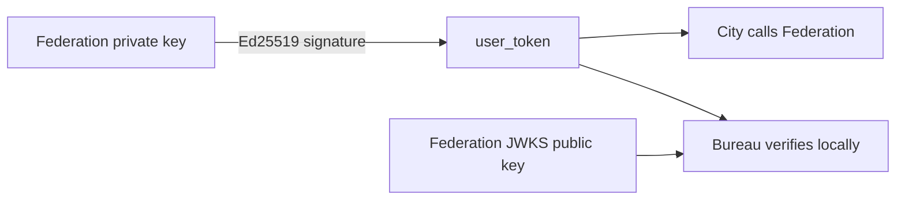
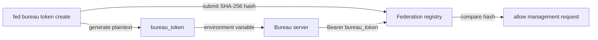

# City User Identity

Federation owns user identity and account data, and the City client connects to Federation directly. A product only deploys a Bureau when it needs its own backend capabilities. One Federation can serve multiple products, isolated by `bureau_id`.

## Identity boundaries

- **Federation** — stores the Ed25519 private key and issues `user_token` values
- **City** — stores `federation_url + user_token` and makes user requests
- **Bureau** — the product backend; it proves machine identity with a `bureau_token` bound to
  `bureau_id` and verifies users for independent services with Federation's public key

## Authentication flow

1. The user selects a product `bureau_id` during login
2. Federation signs a `user_token` bound to that `bureau_id`
3. The user calls Federation through `new City({ federation_url, user_token })`
4. The user sends the same Bearer Token to the product backend
5. City sends `user_token` directly to Federation for Profile, balance, and standard Services
6. If the product has its own backend, City uses `city.get()` / `city.post()` to call Bureau services
7. Bureau verifies `user_token` locally with Federation's public key and only calls Federation when it needs current data

```ts
const city = new City({
  federation_url: "https://fed.example.com",
  user_token,
});

const profile = await city.user().profile();
```

Optional product backend:

Create the Bureau with a required `server_url` in the Federation control plane, then register its machine token:

```bash
fed bureau token
```

This opens the interactive manager. Choose Create and enter a purpose; the CLI displays the
plaintext `DOWNCITY_BUREAU_TOKEN` once. You can also run `fed bureau token create <bureau_id>` directly.
Federation stores the purpose and hash, so Federation and Bureau can run on different servers.

```ts
const bureau = new Bureau({
  federation_url: "https://fed.example.com",
  bureau_token: process.env.DOWNCITY_BUREAU_TOKEN!,
});

const identity = await bureau.identify(request);
const profile = await (await bureau.user(request)).profile();
```

`Bureau` is an optional product backend. Its token is already bound to a stable `bureau_id`, so the
constructor does not repeat that value. It represents only that
Bureau's machine identity and has no Federation Root privileges. `identify()` rejects User Tokens
whose audience belongs to another Bureau. `identify()` only reads discovery and JWKS;
Bureau requests Federation only when it needs current Profile, balance, or other shared data.

City resolves the current Bureau `server_url` from Federation, so callers only provide a relative path:

```ts
const result = await city.post(
  "/reports/summary",
  { range: "today" },
);
```

## User Token and Bureau Token

Both tokens use the Bearer header, but they represent different principals and use different verification mechanisms:

| Property | `user_token` | `bureau_token` |
| --- | --- | --- |
| Principal | Federation user | Federation management and Bureau server |
| Format | `ub_<JWT>` | `fb_<token_id>.<secret>` |
| Implementation | Ed25519 asymmetric signature | Random opaque credential and SHA-256 hash |
| Verification | Verify with Federation's JWKS public key | Federation hashes the token and queries its registry |
| Identity data | Contains `user_id`, `bureau_id`, `iss`, `aud`, `exp`, and `jti` | Contains no user identity; maps to a Federation registry record |
| Local verification | Bureau verifies with Federation JWKS | Federation checks the registry for management requests |
| Revocation | Primarily bounded by expiry and current Federation state | Federation marks the registration as `revoked` |

### User Token

Federation signs the user JWT with its private key and publishes only public verification keys
through JWKS. Bureau can verify the signature, issuer, audience, expiry, and `bureau_id`, but a
public key cannot sign or modify user tokens.



Anyone who obtains a valid `user_token` can act as that user until the token expires. User
tokens must therefore have a finite lifetime and only travel over HTTPS.

### Bureau Token

`bureau_token` is not a JWT and has no public/private key pair. `fed bureau token create`
requires a purpose, generates the plaintext and hash locally, then registers only
`token_id + purpose + token_hash` with Federation.



At runtime, Bureau sends the plaintext token to its Federation machine-identity endpoint over HTTPS. Federation extracts
`token_id`, computes SHA-256, and compares it with the database record. The database never
stores the plaintext token.

A leaked `bureau_token` lets an attacker impersonate that Bureau to call Federation management
APIs, but cannot create or forge a `user_token`. Revoke a leaked credential with
`fed bureau token revoke <token_id>`, or select it in the `fed bureau token` manager. Revocation does not retroactively revoke issued `user_token`
values; user tokens remain controlled by expiry and Federation key policy.

Federation still publishes Ed25519 public keys for its own token validation and other protocols:

```text
/.well-known/downcity.json
/.well-known/jwks.json
```

The Federation Root control plane belongs to `FederationAdmin`. `Bureau` only reads its bound machine
identity and validates targeted User Tokens locally. `fed bureau token create <bureau_id>` generates
plaintext locally and stores ownership, purpose, and hash in the Federation registry.

## Plugin Resources

Complete Chat Resource Items are encrypted in `~/.downcity/downcity.db` and referenced by stable ID from the Chat Plugin Binding:

```json
{
  "resource_ids": ["telegram-a1b2c3"]
}
```

Continue with:

- [Model Pool](/en/docs/city/model-pool)
- [Usage & Billing](/en/docs/city/usage-billing)
