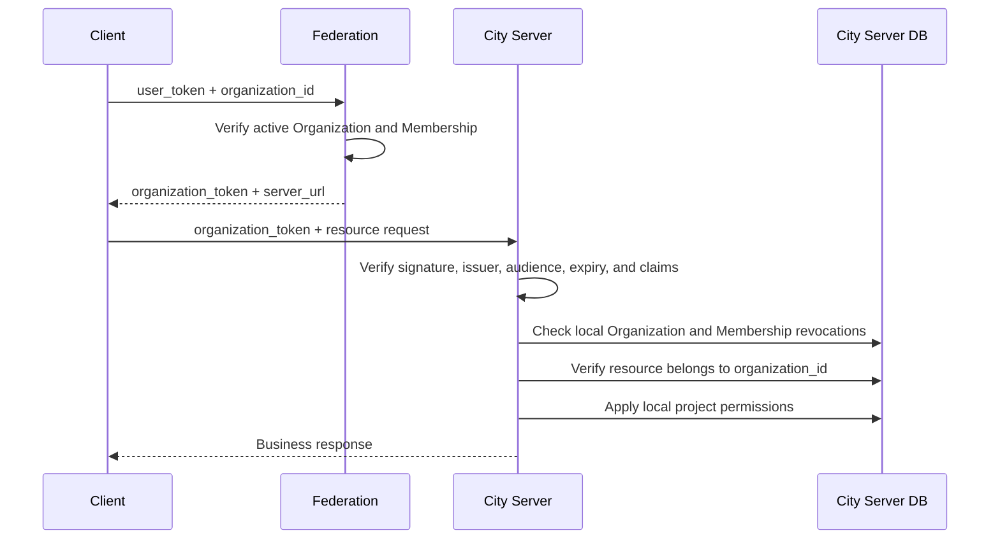

# Integrate Organizations into a City Server

This guide is for City Server implementers. Organizations Service is an external identity and
membership authority, not a project-resource service. It answers one question:

> Does this Federation user have an active Membership in this Organization?

Spaces, documents, Git repositories, project roles, and action permissions remain owned by the
City Server. An Organization Token is only the first layer of the server's authorization flow.

## The four identifiers

| Claim | City Server responsibility |
| --- | --- |
| `user_id` | Federation user identity; never sufficient by itself for project access |
| `city_id` | City that owns the Organization; must match server configuration |
| `organization_id` | Stable Organization identity; links tokens to locally owned resources |
| `membership_id` | Identity of this exact membership lifetime; the smallest revocation unit |

Rejoining creates a new `membership_id`, so revocation must be keyed by Membership rather than
only by user. Organization Tokens intentionally contain no owner/admin/member role. Federation
governance roles are not City Server editor, viewer, or push permissions.

## Request flow



Normal resource requests do not call Federation. A temporary Federation outage does not stop a
City Server from validating existing tokens with cached JWKS and local revocation state.

## Establish trust

Explicitly configure every trusted Federation URL. Never fetch an arbitrary JWKS URL derived from
an unverified token issuer.

```http
GET https://federation.example.com/.well-known/downcity.json
GET https://federation.example.com/.well-known/jwks.json
```

Discovery returns the stable `issuer` and `jwks_uri`. Cache both documents and refresh JWKS once
when a known issuer presents an unknown `kid`. Retired keys may still validate unexpired tokens.

## Verify an Organization Token

Clients send:

```http
Authorization: Bearer ot_<JWT>
```

Remove the `ot_` type prefix before JOSE verification. The JWT uses `alg: EdDSA` and contains
`iss`, `aud`, `sub`, `user_id`, `city_id`, `organization_id`, `membership_id`, `iat`, `exp`, and
`jti`. The default TTL is 7 days and the maximum is 30 days.

Every request must validate:

1. `alg` is exactly `EdDSA` and `kid` exists in a trusted Federation JWKS;
2. signature and configured issuer;
3. audience exactly equals the configured public City Server origin;
4. expiry, issued-at time, and a small clock-skew allowance;
5. `sub === user_id` and every domain ID is a non-empty string;
6. `city_id` matches this City Server;
7. the requested resource belongs to `organization_id`;
8. neither `organization_id` nor `membership_id` is locally revoked;
9. the City Server's own project permissions allow the requested action.

```ts
import { createRemoteJWKSet, jwtVerify } from "jose";

const federation_issuer = "urn:downcity:federation:fed_...";
const server_origin = "https://city.example.com";
const city_id = "city_...";
const jwks = createRemoteJWKSet(
  new URL("https://federation.example.com/.well-known/jwks.json"),
);

export async function verify_organization_token(authorization: string) {
  const token = authorization.replace(/^Bearer\s+/iu, "");
  if (!token.startsWith("ot_")) throw new Error("ORGANIZATION_TOKEN_REQUIRED");

  const { payload } = await jwtVerify(token.slice(3), jwks, {
    algorithms: ["EdDSA"],
    issuer: federation_issuer,
    audience: server_origin,
  });

  if (payload.sub !== payload.user_id || payload.city_id !== city_id) {
    throw new Error("ORGANIZATION_TOKEN_INVALID");
  }
  if (typeof payload.organization_id !== "string"
    || typeof payload.membership_id !== "string") {
    throw new Error("ORGANIZATION_TOKEN_INVALID");
  }
  return payload;
}
```

This example only covers cryptographic and basic claim validation. Production middleware must
also check local revocations and resource authorization.

## Persist security state

The server does not need a full Membership replica. Persist only facts that change local access:

```sql
CREATE TABLE downcity_organization_events (
  federation_issuer TEXT NOT NULL,
  event_id TEXT NOT NULL,
  received_at TEXT NOT NULL,
  PRIMARY KEY (federation_issuer, event_id)
);

CREATE TABLE downcity_revoked_memberships (
  federation_issuer TEXT NOT NULL,
  membership_id TEXT NOT NULL,
  organization_id TEXT NOT NULL,
  revoked_at TEXT NOT NULL,
  PRIMARY KEY (federation_issuer, membership_id)
);

CREATE TABLE downcity_revoked_organizations (
  federation_issuer TEXT NOT NULL,
  organization_id TEXT NOT NULL,
  reason TEXT NOT NULL,
  revoked_at TEXT NOT NULL,
  PRIMARY KEY (federation_issuer, organization_id)
);
```

This is durable security state, not an expiring cache. Local resource tables should persist
`organization_id`; derive resource ownership from the stored resource, never from an additional
client-supplied Organization ID.

## Implement the revocation endpoint

Expose exactly:

```http
POST /v1/downcity/organization-events
Content-Type: application/json

{ "event_token": "oe_<JWT>" }
```

Remove `oe_`, then verify EdDSA signature, configured issuer, this server's audience, and token
timestamps. The signed claims include `event_id`, `event_type`, `city_id`, `organization_id`,
`membership_id`, `user_id`, and `created_at`.

| Event | Durable action |
| --- | --- |
| `organization.membership.removed` | Revoke that `membership_id` permanently |
| `organization.archived` | Revoke every token for the Organization permanently |
| `organization.server_url.changed` | Revoke the Organization on the old Server permanently |

The endpoint must validate `city_id`, require `event_id === sub`, and use `event_id` as its
idempotency key. Insert the event receipt and revocation record in one database transaction.
Return `2xx` only after commit; return `204` for a duplicate event, `401` for failed verification,
`400` for invalid claims, and `5xx` for persistence failure. Do not call Federation while handling
an event—the signed event is already the authoritative mutation.

## Authorization boundary

Keep two explicit layers:

```text
Organization baseline authentication
  ├─ JWT verification
  ├─ City, audience, and resource Organization matching
  └─ local Organization and Membership revocation checks

City Server resource authorization
  ├─ local project roles
  ├─ Space, Document, or Repository ACL
  └─ read, write, push, and other actions
```

Passing the first layer only means the caller is an active Organization member. It grants no
automatic access to every resource.

## URL migration and failures

After `server_url` changes, Federation stops issuing tokens for the old origin and sends
`organization.server_url.changed` to the old server. New tokens only target the new origin, whose
audience check already rejects old tokens. Compare `aud` against explicit deployment configuration,
not untrusted `Host` or `X-Forwarded-Host` headers.

- Federation offline: existing tokens remain locally verifiable; token exchange is unavailable.
- JWKS refresh failure: cached known keys can continue; reject unknown keys.
- Revocation delivery failure: Federation retries from its Outbox; TTL limits exposure to 7 days.
- Event persistence failure: return `5xx` so Federation retries.
- Invalid or expired token: return `401`.
- Revoked Membership or Organization: return `403` and retain the revocation record.

Never log complete tokens. Logging issuer, `jti`, Organization, Membership, and rejection reason is
sufficient. Add request-size limits, timeouts, and rate limits to the event endpoint without
breaking idempotent retries.

## Completion checklist

- [ ] Trust only configured Federation issuers and JWKS URLs
- [ ] Support EdDSA, `kid` refresh, and JWKS caching
- [ ] Strip and validate the `ot_` and `oe_` prefixes
- [ ] Validate issuer, audience, City, Organization, timestamps, and required claims
- [ ] Persist `organization_id` on resources and enforce token/resource matching
- [ ] Persist Membership and Organization revocations durably
- [ ] Make the fixed event endpoint transactional and idempotent by `event_id`
- [ ] Run Organization baseline authentication before local resource authorization
- [ ] Never send or store the original Federation `user_token`
- [ ] Never treat Federation governance roles as project-resource roles
