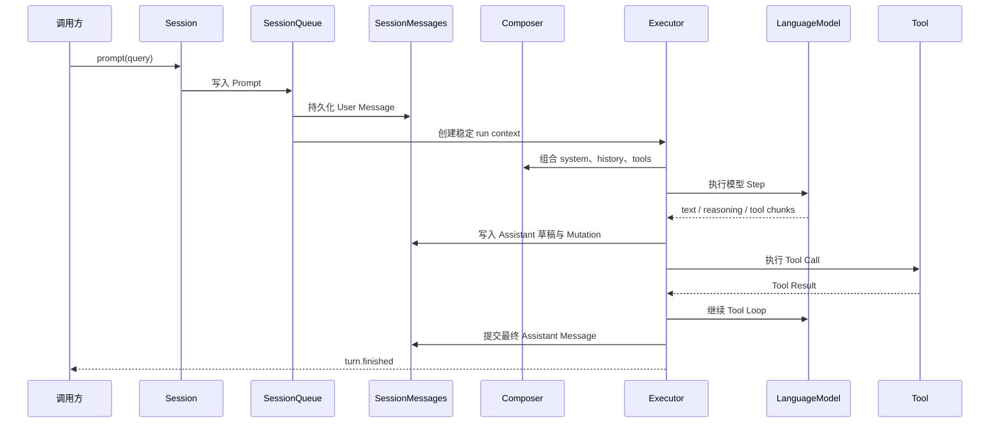
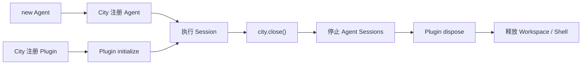

# Agent 运行时架构

Agent runtime 的核心目标是：让每次输入都按确定顺序执行，让模型和 Tool 的中间状态可以观察，让进程中断后的 Session 可以恢复。

## Session 是执行边界

每个 Session 拥有独立的：

- ID、Metadata 和模型覆盖配置。
- Message 历史与 System Snapshot。
- Prompt/Command 队列。
- Tool 审批状态。
- Composer 与 Executor。
- 实时 Mutation 流。

```ts
// Session 在创建时选择 Workspace。
const session = await agent.sessions.create({ workspace });
const turn = await session.prompt({ query: "检查并修复项目" });
const result = await turn.finished;
```

`prompt()` 返回 Turn Handle，而不是直接返回文本。`finished` 在成功和失败时都会 resolve，调用方通过 `result.success` 和 `result.error` 判断结果。

## 一次 Prompt 如何执行



运行时保证：

1. User Message 在模型调用前持久化。
2. 流式 Assistant 先写可恢复草稿。
3. Text、Reasoning、Tool Call 和 Tool Result 保持模型流中的 canonical 顺序。
4. Assistant 完成后才提交到 Active 历史。
5. 中断后可以根据草稿和 Action 状态恢复。

## 状态检查点

同一 Session 只运行一个活跃执行循环。所有可能影响下一 Step 的输入进入同一有序队列：

- User Prompt。
- Workspace env 更新。
- Plugin registry 更新。
- Session model 更新。
- 显式 compact。

这些变化只在 Step 边界提交，不会在模型调用或 Tool 执行中途隐式改变当前上下文。正在执行的 Step 使用创建时的稳定 execution view。

模型解析优先级为：

```text
Session model > Agent model
```

Agent 和 Session 都持有宿主传入的模型实例，SDK 不根据字符串 model ID 选择或恢复模型服务。

## Composer 与 Executor

`SessionComposer` 负责模型上下文策略：组合 system blocks、转换历史、提供 Tool、生成压缩计划，并判断上下文超限错误。

`Executor` 负责一次运行：防止同一 Session 并发执行、创建 run context、调用 Composer、驱动模型与 Tool Loop，并处理 abort、重试和上下文超限恢复。

这两个对象都不关心 Session 的物理存储路径、Agent 列表或 HTTP/RPC transport。

## System Snapshot

Session 提供三种 System 语义：

- 默认：执行时使用 Agent 当前 instruction、Plugin system 和 Session context。
- `snapshot()`：把当前完整 system 固化到 Session。
- `syncshot()`：根据 Agent 当前状态重新生成并覆盖已有快照。

`system()` 返回当前实际生效的结构化 System Snapshot。Agent instruction 更新不会无条件覆盖已经固化的 Session。

## Message 与持久化

默认本地状态位于用户级 Downcity 目录中当前 Agent 的 Workspace 作用域：

```text
~/.downcity/agents/<agent-id>/
├─ sessions/<session-id>/
│  ├─ instruction.md
│  ├─ meta.json
│  └─ messages/
│     ├─ active.jsonl
│     ├─ agent_message.json
│     └─ segments/*.jsonl
├─ archived-sessions/
├─ logs/
├─ schedule.jsonl
└─ sandbox/
```

- `active.jsonl` 保存上次压缩后的活动历史。
- `agent_message.json` 保存当前 Assistant 的完整流式草稿。
- `segments` 保存压缩后的不可变历史前缀。
- `instruction.md` 保存显式固化的 System Snapshot。

所有 Message 使用单调递增的 `sequence`，同一 Message 的流式更新使用递增 `revision`。JSON 文件通过临时文件、`fsync` 和 `rename` 原子覆盖；跨进程写入使用 Workspace lock 串行化。

调用方应通过 `session.messages()`、`get_info()` 和 `system()` 读取结构化状态，而不是依赖这些物理文件名。

## 实时观察

`subscribe()` 只发送订阅后发生的 Mutation：

```ts
const unsubscribe = session.subscribe((mutation) => {
  if (mutation.variant === "delta" && mutation.type === "text") {
    process.stdout.write(mutation.delta);
  }
});
```

Mutation 包括完整 Message、Assistant Part、文本/推理增量、Turn 状态和 Session 状态。断线后应先用 `messages()` 重新加载 canonical 快照，再建立新订阅。

## Plugin runtime

Plugin 属于 City，不属于 Agent 或 Workspace。City 按 Plugin ID 持有唯一实例，并向每个 Agent/Workspace 执行入口投影 Action、System、Hook、Resolve Point 与 HTTP 路由。

PluginRegistry 的投影变化在 Session 检查点生效。单个 Plugin 初始化失败只隔离自身，不阻断其他 Plugin。Agent 关闭时停止 Session 与 ActionSchedule；Plugin 的 `initialize/dispose` 生命周期由 City 收口。

ActionSchedule 是 Agent 持有的本地延迟 Plugin Action 调度器。事件存放在 Agent 的存储作用域中，Agent 重启时会把遗留的 running 状态恢复为 pending。它不是分布式调度系统，也不提供跨机器选主。

## City Tool

每个 Agent 都会获得一个只读的 `city` Tool：它是「harness 自己知道、模型无法从文件或命令读到」那类运行时事实的统一出口。

```jsonc
{ "namespace": "sandbox", "action": "explain_path", "args": { "path": "~/.downcity/plugins/chat" } }
```

| Namespace | 回答什么 |
| --- | --- |
| `env` | 本轮跑在哪个 Agent、Session、Workspace、模型、时区与本地日期下 |
| `sandbox` | 这个 Session 跑在哪个沙箱后端与实例里、挂了哪些宿主目录、某个路径为什么被拦 |
| `workspaces` | 当前 City 中登记的全部 Workspace |
| `agent` | 当前 City 中登记的全部 Agent |
| `usage` | user 级 token 用量；bureau 尚未提供接口前返回 `unsupported_action` |

不带参数调用 `city` 会列出当前 Agent 可用的 namespace；省略 `action` 会列出该 namespace 的动作、参数与返回结构。这个 Tool 不执行任何写操作，也不会返回凭据的值。

可用性与 Plugin 同一口径：City 注册了什么，每个 Agent 就都能用，没有 per-agent 门控，也没有配置文件。

## 安全模型

安全边界分为两层：

| 能力 | 强制边界 | 权限语义 |
| --- | --- | --- |
| File/Search Tools | Rooted LocalFileSystem | 只能主动访问 Workspace |
| Sandbox Shell | Workspace Sandbox | 命令在当前 Workspace 独享、持久的隔离环境中执行 |
| Host Shell | 审批网关 | 用户基于已记录的原因显式授权一次宿主命令 |
| Plugin | Plugin 自身业务授权 | Workspace 不替 Plugin 负责全部资源访问 |
| City Tool | 结构上只读 | 只回答运行时事实；不写、不返回凭据值 |
| Custom Tool | 注册它的宿主 | Agent Core 不猜测业务权限 |

显式附件可以使用宿主选择的绝对路径，因为附件已经是本次 Prompt 的明确输入。这不会扩大模型 File/Search Tools 主动遍历文件系统的范围。

## 跨平台策略

Node.js 已经统一文件、路径、网络、JSON、Timer、AbortController 和普通子进程能力，所以 Agent、Session、Store 与 Workspace 不写操作系统分支。

隔离实现差异统一收敛在中立的 Sandbox Provider 协议内。每个 Shell 显式接收 Provider，并持有绑定 Workspace 时创建的独立、持久 Sandbox。City 只管理 Workspace 资源，不理解其 Shell 使用本地容器、microVM、远程主机还是其他后端。默认实现使用 microsandbox microVM。

## 生命周期



Session 执行前会等待 Agent 的 City 执行绑定就绪。`agent.dispose()` 不停止 City Plugin 实例；`city.close()` 统一关闭 Transport、Agent、Plugin、Workspace 与 Shell，并保证活跃 Hook/Action lease 先收口。

继续阅读：[Agent 生命周期](/zh/docs/agent/lifecycle)。
