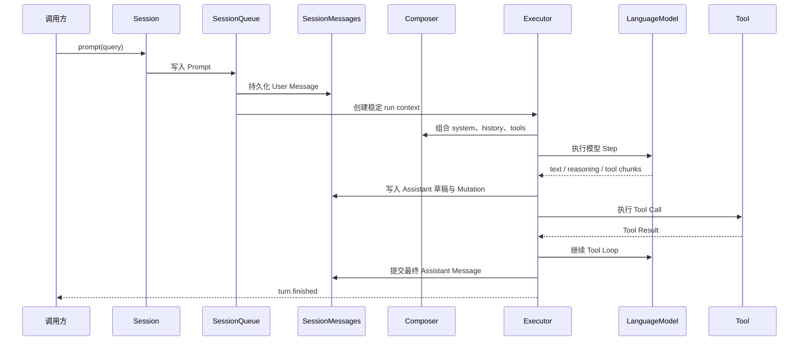

# Agent 运行时架构

Agent runtime 的核心目标是：让每次输入都按确定顺序执行，让模型和 Tool 的中间状态可以观察，让进程中断后的 Session 可以恢复。

## Session 是执行边界

每个 Session 拥有独立的：

- ID、Metadata 和模型覆盖配置。
- Message 历史与 System Snapshot。
- Prompt/Command 队列。
- Tool 审批状态。
- Composer 与 Executor。
- 实时 Mutation 流。

```ts
const session = await agent.sessions.create();
const turn = await session.prompt({ query: "检查并修复项目" });
const result = await turn.finished;
```

`prompt()` 返回 Turn Handle，而不是直接返回文本。`finished` 在成功和失败时都会 resolve，调用方通过 `result.success` 和 `result.error` 判断结果。

## 一次 Prompt 如何执行



运行时保证：

1. User Message 在模型调用前持久化。
2. 流式 Assistant 先写可恢复草稿。
3. Text、Reasoning、Tool Call 和 Tool Result 保持模型流中的 canonical 顺序。
4. Assistant 完成后才提交到 Active 历史。
5. 中断后可以根据草稿和 Action 状态恢复。

## 状态检查点

同一 Session 只运行一个活跃执行循环。所有可能影响下一 Step 的输入进入同一有序队列：

- User Prompt。
- Workspace env 更新。
- Plugin registry 更新。
- Session model 更新。
- 显式 compact。

这些变化只在 Step 边界提交，不会在模型调用或 Tool 执行中途隐式改变当前上下文。正在执行的 Step 使用创建时的稳定 execution view。

模型解析优先级为：

```text
Session model > Agent model
```

Agent 和 Session 都持有宿主传入的模型实例，SDK 不根据字符串 model ID 选择或恢复模型服务。

## Composer 与 Executor

`SessionComposer` 负责模型上下文策略：组合 system blocks、转换历史、提供 Tool、生成压缩计划，并判断上下文超限错误。

`Executor` 负责一次运行：防止同一 Session 并发执行、创建 run context、调用 Composer、驱动模型与 Tool Loop，并处理 abort、重试和上下文超限恢复。

这两个对象都不关心 Session 的物理存储路径、Agent 列表或 HTTP/RPC transport。

## System Snapshot

Session 提供三种 System 语义：

- 默认：执行时使用 Agent 当前 instruction、Plugin system 和 Session context。
- `snapshot()`：把当前完整 system 固化到 Session。
- `syncshot()`：根据 Agent 当前状态重新生成并覆盖已有快照。

`system()` 返回当前实际生效的结构化 System Snapshot。Agent instruction 更新不会无条件覆盖已经固化的 Session。

## Message 与持久化

默认本地状态位于 Workspace 的 `.downcity`：

```text
<workspace>/.downcity/
├─ agents/<agent-id>/
│  ├─ sessions/<session-id>/
│  │  ├─ instruction.md
│  │  └─ messages/
│  │     ├─ meta.json
│  │     ├─ active.jsonl
│  │     ├─ assistant_message.json
│  │     └─ segments/*.jsonl
│  └─ archived-sessions/
├─ resources/
├─ logs/
├─ schedule.jsonl
└─ sandbox/
```

- `active.jsonl` 保存上次压缩后的活动历史。
- `assistant_message.json` 保存当前 Assistant 的完整流式草稿。
- `segments` 保存压缩后的不可变历史前缀。
- `instruction.md` 保存显式固化的 System Snapshot。

所有 Message 使用单调递增的 `sequence`，同一 Message 的流式更新使用递增 `revision`。JSON 文件通过临时文件、`fsync` 和 `rename` 原子覆盖；跨进程写入使用 Workspace lock 串行化。

调用方应通过 `session.messages()`、`get_info()` 和 `system()` 读取结构化状态，而不是依赖这些物理文件名。

## 实时观察

`subscribe()` 只发送订阅后发生的 Mutation：

```ts
const unsubscribe = session.subscribe((mutation) => {
  if (mutation.variant === "delta" && mutation.type === "text") {
    process.stdout.write(mutation.delta);
  }
});
```

Mutation 包括完整 Message、Assistant Part、文本/推理增量、Turn 状态和 Session 状态。断线后应先用 `messages()` 重新加载 canonical 快照，再建立新订阅。

## Plugin runtime

Plugin 属于 Agent，不属于 Workspace。它可以提供 Action、System、Hook、Resolve Point、Lifecycle 和 HTTP 注入定义。

PluginRegistry 的变化同样在 Session 检查点生效。单个 Plugin 启动失败只隔离自身，不阻断其他 Plugin；Agent 关闭时停止 ActionSchedule 并卸载 Plugin。

ActionSchedule 是本地延迟 Plugin Action 调度器。事件存放在 `.downcity/schedule.jsonl`，Agent 重启时会把遗留的 running 状态恢复为 pending。它不是分布式调度系统，也不提供跨机器选主。

## 安全模型

安全边界分为两层：

| 能力 | 强制边界 | 权限语义 |
| --- | --- | --- |
| File/Search Tools | Rooted LocalFileSystem | 只能主动访问 Workspace |
| Safe Shell | OS Sandbox Adapter | Workspace 可读写，额外目录由宿主声明只读 |
| Unrestricted Shell | 审批网关 | 由用户对单次命令显式授权 |
| Plugin | Plugin 自身业务授权 | Workspace 不替 Plugin 负责全部资源访问 |
| Custom Tool | 注册它的宿主 | Agent Core 不猜测业务权限 |

显式附件可以使用宿主选择的绝对路径，因为附件已经是本次 Prompt 的明确输入。这不会扩大模型 File/Search Tools 主动遍历文件系统的范围。

## 跨平台策略

Node.js 已经统一文件、路径、网络、JSON、Timer、AbortController 和普通子进程能力，所以 Agent、Session、Store 与 Workspace 不写操作系统分支。

只有原生安全和进程语义进入平台 Adapter：

- macOS Seatbelt。
- Linux Bubblewrap / namespace。
- Windows MXC 或 SRT。
- Unix PTY 与 Windows ConPTY。
- Signal、进程组与 Windows Job Object。

因此在 macOS 安装 Downcity 时，核心包会包含跨平台 TypeScript/JavaScript 逻辑，但不会自动安装 Windows Sandbox 原生包。Windows 也只需要替换应用注入的 Sandbox Adapter。

## 生命周期


`ready()` 是可选的显式就绪屏障；Session 首次执行前也会等待 Agent ready。`dispose()` 会释放 Agent、Plugin、Schedule、Workspace 和 Shell 资源，但不会关闭由 `@downcity/server` 创建的 HTTP/RPC transport。

继续阅读：[Agent 生命周期](/zh/docs/agent/lifecycle)。
