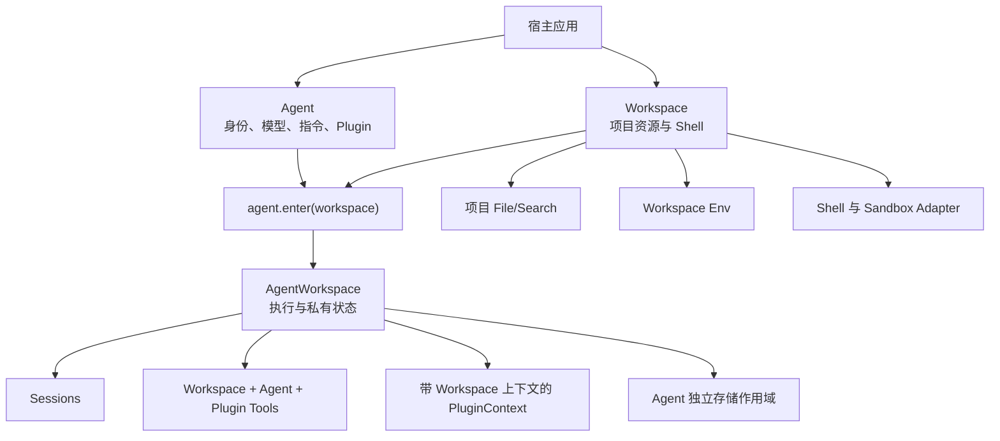
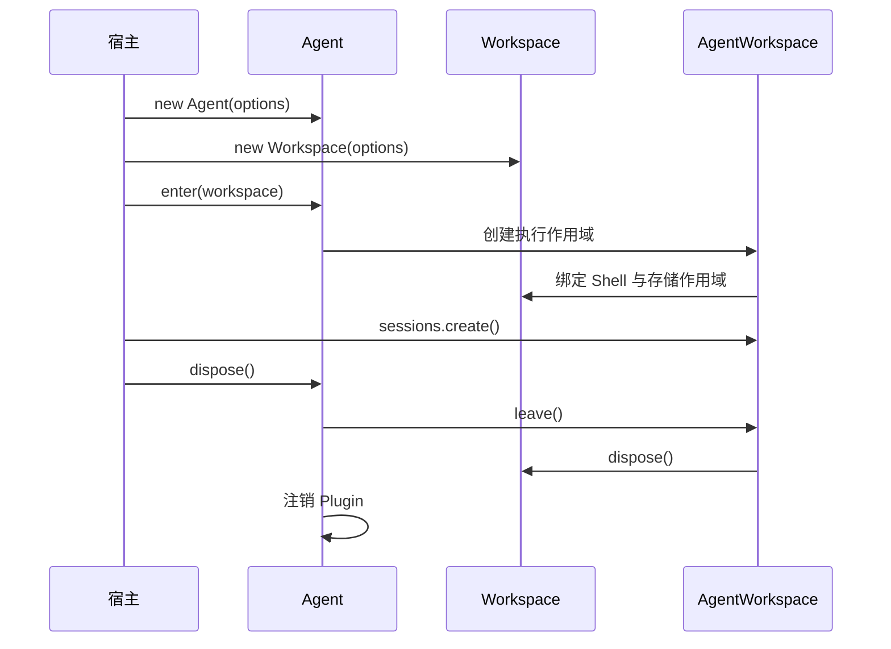

# Agent SDK 架构

Downcity 将 Agent 主体与它执行任务的项目分开。`Agent` 拥有身份、指令、模型、自定义 Tool
和 Plugin 注册；`Workspace` 拥有项目资源与 Shell；调用 `agent.enter(workspace)` 后才创建
`AgentWorkspace` 执行边界。

```ts
import { Agent } from "@downcity/agent";
import { Shell, Workspace } from "@downcity/workspace";

const agent = new Agent({ id, model, instruction, plugins });
const workspace = new Workspace({ id: "project", path, shell });
const agent_workspace = agent.enter(workspace);
const session = await agent_workspace.sessions.create();
```

## 职责模型



依赖方向保持明确：

- `@downcity/workspace` 不依赖 Agent 或 Session。
- `@downcity/agent` 依赖 Workspace 协议，并负责创建 Agent 领域状态。
- 宿主选择平台 Sandbox，并组合 Agent 与 Workspace。
- Edge Adapter 使用 `@downcity/workspace/protocol`，不会加载 Node.js 本地实现。

## Agent 是主体

一个 Agent 可以跨项目复用，不能在配置中永久绑定单一 Workspace。

```ts
const agent = new Agent({
  id: "repo-helper",
  model,
  instruction: "维护当前项目。",
  plugins: [task_plugin],
  tools: { company_search: company_search_tool },
});

const frontend = agent.enter(frontend_workspace);
const backend = agent.enter(backend_workspace);
```

Plugin 只在 Agent 注册一次，不再划分单独的 Workspace Plugin。每次 Plugin Action 都会获得当前
执行上下文；是否使用 `workspace_path`、`data_path`、文件、Shell，完全由 Plugin 自己决定。
可选的 `enter_workspace` 与 `leave_workspace` 钩子只表达生命周期需要，不形成新的 Plugin 类型。

## Workspace 是资源边界

`Workspace` 拥有：

- 稳定的 Workspace ID 与规范化项目路径。
- Rooted 项目文件能力和 File/Search 工具。
- Workspace 环境变量。
- 可选 Shell 及其 Sandbox Adapter。
- 不理解领域语义的 `WorkspaceStorageProvider`。

Workspace 不创建 SessionStore，不理解 Agent ID，不注册 Plugin，也不调用模型。本地实现会在内部
解析用户级存储根，构造参数中没有 `data_root_path`。

Shell 属于 Workspace，因为命令执行作用于 Workspace 资源。公开入口是：

```ts
import { Shell, Workspace } from "@downcity/workspace";
```

不再存在独立的 `@downcity/shell` 包。各平台 Sandbox 仍是独立安装的 package，由宿主注入 Shell。

## AgentWorkspace 是执行边界

`agent.enter(workspace)` 组合两个主体，但不混合它们的所有权。AgentWorkspace 负责创建：

- Workspace Tool、Agent 自定义 Tool 与 Plugin 桥接 Tool 组成的最终工具集合。
- `AgentSessions` 与 Agent 领域的 `LocalSessionStore`。
- 带当前 Workspace 的 Plugin Context 与生命周期。
- 日志、Plugin 调度任务和 Shell 绑定。

不同来源的 Tool 同名时直接失败，不会静默覆盖。同一个 Agent 可以持有多个 AgentWorkspace；同一个
Workspace 实例只能进入一次，因为其中的 Shell 与私有存储会绑定到一个执行生命周期。

## 私有存储

本地运行状态集中保存在项目目录之外：

```text
~/.downcity/
└── agents/
    └── <agent_id>/
        └── workspaces/
            └── <workspace_id>/
                ├── sessions/
                ├── archived-sessions/
                ├── logs/
                ├── schedule.jsonl
                └── sandbox/
```

Workspace 只提供安全的存储原语。AgentWorkspace 打开稳定的
`agents/<agent_id>/workspaces/<workspace_id>` 作用域，并在其中创建 Agent 领域 Store。项目
File/Search 工具使用另一套 rooted FileSystem，无法读取或修改 Session 历史、Plugin 状态与
Sandbox 数据。

## 环境变量与检查点

环境变量描述项目执行环境，因此属于 Workspace：

```text
<workspace>/.env < WorkspaceOptions.env
```

`set_env()` 与 `patch_env()` 更新 Workspace 快照并同步 Shell。已有 Session 会在下一个 Step
检查点提交新环境，避免模型调用执行到一半时上下文发生变化。

Plugin registry 更新、Session model 更新和 compact 也遵循相同的检查点规则。

## 生命周期



`agent.dispose()` 会离开所有 AgentWorkspace，刷写 Session 与日志状态，关闭 Shell 进程和
Sandbox 资源，最后停止 Agent 级 Plugin。`@downcity/agent` 创建的 HTTP/RPC transport 仍由宿主
拥有，需要单独关闭。

## Package 边界

| Package | 拥有 | 不拥有 |
| --- | --- | --- |
| `@downcity/workspace` | Workspace 协议、本地项目资源、File/Search、Env、Shell | Agent 身份、Plugin registry、Session 语义、模型调用 |
| `@downcity/agent` | Agent、AgentWorkspace、Session、Store、Plugin runtime、模型 Tool Loop | 项目资源实现、平台 Sandbox、多 Agent 控制面 |
| Sandbox packages | 单个平台的原生进程隔离 | Workspace、Agent、Session 或 Plugin 业务 |
| `@downcity/agent` | Agent 索引与 HTTP/RPC transport | 本地配置 Repository 与 Agent 执行状态 |

继续阅读：[运行时架构](/zh/docs/agent/runtime-architecture)。
