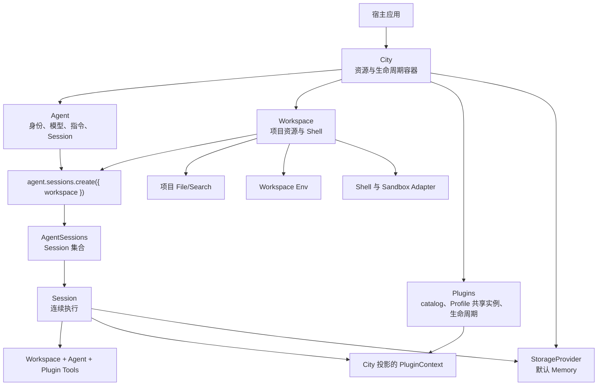
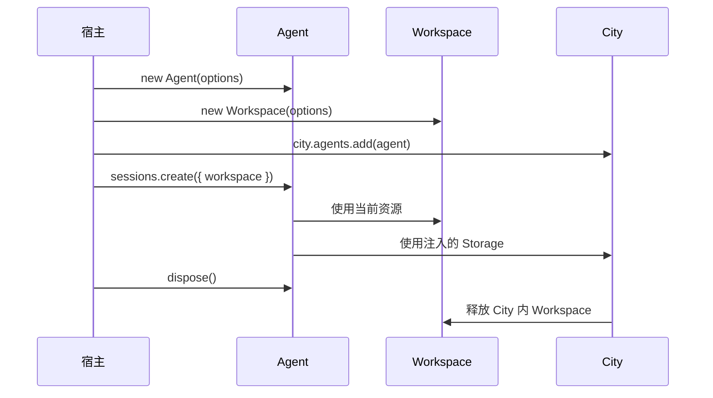

# Agent SDK 架构

Downcity 将执行主体、项目资源与扩展运行时分开。`Agent` 拥有身份、指令、模型、自定义 Tool 和 Session；`Workspace` 拥有项目资源与 Shell；`City` 持有 Plugin catalog、共享实例、生命周期与 Agent 绑定。

```ts
import { Agent, City } from "@downcity/agent";
import { create_builtin_plugin_registrations } from "@downcity/plugins";
import { Shell, Workspace } from "@downcity/workspace";

const agent = new Agent({ id, model, instruction });
const workspace = new Workspace({ id: "project", path, shell });
const city = new City({
  workspaces: [workspace],
  plugins: create_builtin_plugin_registrations(),
});
city.agents.add(agent, { plugins: [{ plugin_id: "memory" }] });
// Session 在创建时选择 Workspace。
const session = await agent.sessions.create({ workspace });
```

## 职责模型



依赖方向保持明确：

- `@downcity/workspace` 不依赖 Agent 或 Session。
- `@downcity/agent` 依赖 Workspace 协议，并负责解释 City Storage 中的 Agent 领域状态。
- 宿主选择平台 Sandbox，并组合 Agent 与 Workspace。
- Edge Adapter 使用 `@downcity/workspace/protocol`，不会加载 Node.js 本地实现。

## Agent 是主体

一个 Agent 可以跨项目复用，不能在配置中永久绑定单一 Workspace。

```ts
const agent = new Agent({
  id: "repo-helper",
  model,
  instruction: "维护当前项目。",
  tools: { company_search: company_search_tool },
});

city.agents.add(agent, { plugins: [{ plugin_id: "task" }] });

const frontend = await agent.sessions.create({ workspace: frontend_workspace });
const backend = await agent.sessions.create({ workspace: backend_workspace });
```

Agent 不持有 Plugin。City 按 `(plugin_id, profile_id)` 持有共享实例，并把绑定后的能力投影到 Agent/Workspace execution entry。每次 Plugin Action 都获得当前 `PluginContext`，可以直接使用受限的 Agent、Workspace、Session 与 Turn 句柄。共享实例使用 `start/stop`，Agent/Workspace scope 使用 `bind/unbind`。

## Workspace 是资源边界

`Workspace` 拥有：

- 稳定的 Workspace ID 与规范化项目路径。
- Rooted 项目文件能力和 File/Search 工具。
- Workspace 环境变量。
- 可选 Shell 及其 Sandbox Adapter。

Workspace 不创建 SessionStore，不理解 Agent ID，不注册 Plugin，不调用模型，也不创建 Storage。
构造参数中没有运行时数据根目录。

Shell 属于 Workspace，因为命令执行作用于 Workspace 资源。公开入口是：

```ts
import { Shell, Workspace } from "@downcity/workspace";
```

不再存在独立的 `@downcity/shell` 包。各平台 Sandbox 仍是独立安装的 package，由宿主注入 Shell。

## Session 是执行边界

`agent.sessions.create({ workspace })` 组合 Agent 与 Workspace，但不混合它们的所有权。Agent、Session 与 City 执行投影共同提供：

- Workspace Tool、Agent 自定义 Tool 与 Plugin 桥接 Tool 组成的最终工具集合。
- `AgentSessions` 与 Agent 领域的 `LocalSessionStore`。
- 带当前 Agent/Workspace/Session/Turn 的 PluginContext 与 execution lease。
- 日志、Plugin 调度任务和 Shell 绑定。

不同来源的 Tool 同名时直接失败，不会静默覆盖。同一个 Agent 可以持有绑定不同 Workspace 的多个
Session。Workspace 可以登记在 City 内，也可以由宿主在 City 外管理。

## 私有存储

City 注入本地持久化 Storage 时，运行状态集中保存在项目目录之外：

```text
~/.downcity/
└── agents/
    └── <agent_id>/
        ├── sessions/
        ├── plugins/
        ├── logs/
        └── schedule.jsonl
```

City Storage 只是底层文件或数据库能力。Agent 解释 `agents/<agent_id>/` 业务作用域，并在其中
创建 Session 与 Plugin Store。项目 File/Search 工具使用另一套 rooted FileSystem，无法读取或
修改 Session 历史、Plugin 状态与运行时数据。

## 环境变量与检查点

环境变量描述项目执行环境，因此属于 Workspace：

```text
<workspace>/.env < WorkspaceOptions.env
```

`set_env()` 与 `patch_env()` 更新 Workspace 快照并同步 Shell。已有 Session 会在下一个 Step
检查点提交新环境，避免模型调用执行到一半时上下文发生变化。

Plugin registry 更新、Session model 更新和 compact 也遵循相同的检查点规则。

## 生命周期



`city.close()` 会停止 Agent 与 Session，释放 City 内 Workspace、Storage 和 transport。City 外的
Workspace 仍由宿主负责释放。

## Package 边界

| Package | 拥有 | 不拥有 |
| --- | --- | --- |
| `@downcity/workspace` | Workspace 协议、本地项目资源、File/Search、Env、Shell | Agent 身份、Plugin registry、Session 语义、模型调用 |
| `@downcity/agent` | City、Agent、AgentSessions、Session、Store、Plugin runtime、模型 Tool Loop | 项目资源实现、平台 Sandbox、本地配置 Repository |
| Sandbox packages | 单个平台的原生进程隔离 | Workspace、Agent、Session 或 Plugin 业务 |
| `@downcity/agent` | Agent 索引与 HTTP/RPC transport | 本地配置 Repository 与 Agent 执行状态 |

继续阅读：[运行时架构](/zh/docs/agent/runtime-architecture)。
