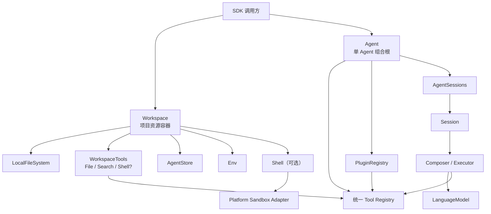

# Agent SDK 架构

`@downcity/agent` 是运行在 Node.js 进程中的单 Agent SDK。它将模型、指令、工具、Plugin、Session 历史和本地项目资源组合成一个可持续运行、可以恢复和观察的 Agent runtime。

最小组合只有两个核心对象：

```ts
const workspace = new Workspace({ path, shell });
const agent = new Agent({ id, workspace, model, instruction, plugins });
```

- `Workspace` 定义 Agent 可以使用的项目资源。
- `Agent` 组合模型、工具、Plugin 和 Session。
- `Session` 管理一段连续对话的状态与执行顺序。
- `Executor` 在一个 Step 中调用模型并完成 Tool Loop。
- `Shell` 在当前操作系统上执行命令和进程。

## 总体关系



依赖始终从组合层流向基础能力。FileSystem 不知道 Agent 和 Session，Shell 不知道历史和模型，Sandbox Adapter 也只负责受限进程启动。

## Workspace：统一项目资源容器

Workspace 将同一项目下的资源绑定到一个真实绝对根目录：

```ts
const workspace = new Workspace({
  path: process.cwd(),
  env: {
    NODE_ENV: "development",
  },
  shell,
});
```

它提供：

- `path`：解析后的稳定项目根目录。
- `files`：Workspace 根目录内的文件原子能力。
- `tools`：File、Search 与可选 Shell Tools。
- `get_env()`、`set_env()`、`patch_env()`：Workspace 执行环境。
- `AgentStore`：Session 和 Message 的结构化存储分支。
- `dispose()`：释放 Store、Shell、进程和 Sandbox 资源。

Workspace 不是 `Host`、`SystemHandler` 或通用 Service Container。Model、Plugin registry、Session 生命周期和网络 transport 都不属于 Workspace。

### 一个 Workspace 实例绑定一个 Agent

Workspace 实例只有一个生命周期所有者：

```text
一个 Workspace 实例 → 一个 Agent → 一次 dispose
```

多个 Agent 可以操作同一物理目录，但应分别创建 Workspace。Store 按 `agent_id` 分区，因此 Session 数据不会混合。

### 生命周期所有权

Workspace 由调用方创建，但绑定 Agent 后由 Agent 统一管理释放：

```text
调用方创建 Workspace → Agent 绑定 Workspace → agent.dispose() 统一释放
```

`agent.dispose()` 会依次关闭 Agent 长期运行状态并释放 Workspace 持有的 Store、Shell、进程和 Sandbox。正常使用中不需要再调用同一个 `workspace.dispose()`。如果构造 Agent 前的初始化失败，Workspace 尚未绑定，调用方才需要自行释放它。

## 三种 Workspace 能力

### LocalFileSystem

LocalFileSystem 是基于 Node.js 的 rooted 文件能力，负责安全路径解析、读写移动、原子覆盖、跨进程 lock 和有界搜索。它既是 WorkspaceTools 的底层能力，也是 AgentStore 的文件原语。

### WorkspaceTools

WorkspaceTools 是 Workspace 返回给 Agent 注册的模型工具：

- 结构化 File Tools。
- 项目 Search Tools。
- 存在 Shell 时的命令和 Shell Session Tools。

Plugin Tool 和调用方自定义 Tool 不属于 WorkspaceTools。File/Search 始终限制在 Workspace 根目录内，也不提供 unrestricted 模式。

### AgentStore

AgentStore 不是第二套权限系统，而是同一 FileSystem 上的领域分支。它负责路径布局、Session 列表、Message sequence、revision、归档、历史压缩和崩溃恢复。

Workspace 文件工具仍然可以读写 `.downcity`。Store 的价值是结构化语义和一致性，不是隐藏历史或 Instruction。

## Agent：统一 Tool 的组合根

Agent 持有完整的最终工具集合：

```text
Agent.tools
  = WorkspaceTools
  + PluginRegistry Tools
  + AgentOptions.tools
```

- Workspace 提供项目文件、搜索和可选 Shell 操作。
- PluginRegistry 在存在 Action 时提供 `plugin_read` 和 `plugin_call`。
- 调用方通过 `AgentOptions.tools` 注册业务 Tool。

任意来源出现同名 Tool 时，构造过程直接报错，不会静默覆盖。`plugin_read` 和 `plugin_call` 是 PluginRegistry 的保留名称。

```ts
const agent = new Agent({
  id: "repo-helper",
  workspace,
  model,
  plugins: [task_plugin],
  tools: {
    company_search: company_search_tool,
  },
});
```

## Env 属于 Workspace

环境变量描述项目执行环境，所以由 Workspace 而不是 Agent 持有：

```text
<workspace>/.env < WorkspaceOptions.env
```

SDK 不修改 `process.env`，也不把运行时修改写回 `.env`。`set_env()` 和 `patch_env()` 更新 Workspace 内存中的 configured env，并同步给 Shell。已有 Session 会在下一个 Step 检查点提交新环境，避免执行中的模型调用突然切换上下文。

## Shell 与平台 Sandbox

Agent 核心包不捆绑全部操作系统的原生 Sandbox。调用方只安装当前系统需要的平台包，并在应用组合根注入：

```ts
import { Shell } from "@downcity/shell";
import { MacOsSeatbeltSandbox } from "@downcity/sandbox-macos";

const shell = new Shell({
  sandbox: new MacOsSeatbeltSandbox(),
});

const workspace = new Workspace({
  path: process.cwd(),
  shell,
});
```

macOS、Linux 和 Windows 使用同一个 Workspace、Agent、Session 和 Store。不同平台只替换 Shell 的 Sandbox Adapter：

| 平台 | Adapter 包 | 原生边界 |
| --- | --- | --- |
| macOS | `@downcity/sandbox-macos` | Seatbelt |
| Linux | `@downcity/sandbox-linux` | Bubblewrap |
| Windows | `@downcity/sandbox-windows-mxc` 或 `@downcity/sandbox-windows-srt` | MXC 或 SRT |

`unrestricted` 是 Shell 专属的显式能力升级，需要经过审批。File/Search、Plugin 和自定义 Tool 没有统一 unrestricted 开关；Plugin 使用自身业务授权，自定义 Tool 的权限由注册它的宿主负责。

## 包边界

| 包 | 负责 | 不负责 |
| --- | --- | --- |
| `@downcity/agent` | Agent、Workspace、Session、Store、模型 Tool Loop、Plugin runtime | 平台 Sandbox 实现、多 Agent 控制面 |
| `@downcity/shell` | 命令、长期 Shell Session、输出、审批和 Sandbox 协议 | Session 历史、Agent 配置和模型调用 |
| Sandbox packages | 将统一 Policy 映射为当前 OS 的进程隔离 | Agent、Session 和 Store 业务 |
| `@downcity/server` | HTTP/RPC 服务端与 transport | 本地 Agent 的领域状态 |

用户级 `~/.downcity`、全局数据库和密钥由 CLI/City 宿主管理。需要全局账号等资源的 Plugin 通过自身构造参数接收最小 Store 接口，不反向依赖 CLI，也不把全局资源塞入 Workspace。

## 推荐组合

```ts
import { Agent, Workspace } from "@downcity/agent";
import { MacOsSeatbeltSandbox } from "@downcity/sandbox-macos";
import { Shell } from "@downcity/shell";

const shell = new Shell({
  sandbox: new MacOsSeatbeltSandbox(),
});

const workspace = new Workspace({
  path: process.cwd(),
  shell,
});

const agent = new Agent({
  id: "demo",
  workspace,
  model,
  instruction: "你负责维护当前项目。",
  plugins: [task_plugin],
  tools: { company_search: company_search_tool },
});

try {
  await agent.ready();
  const session = await agent.sessions.create();
  const turn = await session.prompt({ query: "理解并检查当前项目" });
  console.log(await turn.finished);
} finally {
  await agent.dispose();
}
```

继续阅读：[运行时架构](/zh/docs/agent/runtime-architecture)。
