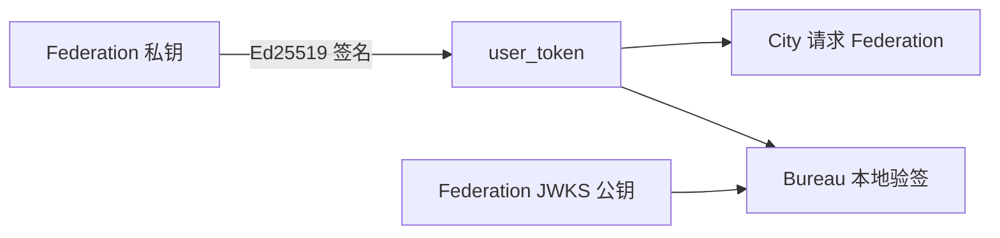
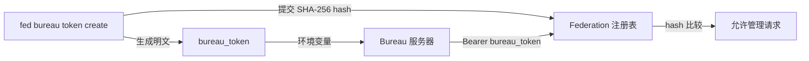

# City 用户身份

Federation 统一签发用户身份和账户数据，City 客户端直接访问 Federation。产品需要自己的后端能力时，再部署可选的 Bureau。一个 Federation 可以服务多个产品，每个产品由 `bureau_id` 隔离。

## 身份边界

- **Federation** — 保存 Ed25519 私钥并签发 `user_token`
- **City** — 保存 `federation_url + user_token` 并发起用户请求
- **Bureau** — 产品服务端，使用绑定 `bureau_id` 的 `bureau_token` 证明机器身份，
  并使用 Federation 公钥本地验证独立服务收到的用户

## 认证流程

1. 用户登录时选择产品 `bureau_id`
2. Federation 使用私钥签发绑定该 `bureau_id` 的 `user_token`
3. 用户通过 `new City({ federation_url, user_token })` 调用 Federation
4. 用户携带同一个 Bearer Token 调用产品后端
5. City 直接携带 `user_token` 调用 Federation 的 Profile、余额和标准 Service
6. 如果产品有自己的后端，City 使用 `city.get()` / `city.post()` 请求 Bureau 独立服务
7. Bureau 使用 Federation 公钥本地验证 `user_token`，需要当前数据时再携带同一个 Token 请求 Federation

```ts
const city = new City({
  federation_url: "https://fed.example.com",
  user_token,
});

const profile = await city.user().profile();
```

可选的产品后端：

先在 Federation 管理侧创建 Bureau 及其必填的一对一 Server 配置，再登记该 Bureau 的机器 Token。创建输入仍直接接收 `server_url`：

```bash
fed bureau token
```

该命令打开交互式管理界面。选择“创建 Bureau Token”，输入用途后，CLI 只显示一次明文
`DOWNCITY_BUREAU_TOKEN`。也可以直接运行 `fed bureau token create <bureau_id>`。Federation 数据库
保存用途和 hash，因此 Federation 和 Bureau 可以部署在不同服务器。

```ts
const bureau = new Bureau({
  federation_url: "https://fed.example.com",
  bureau_token: process.env.DOWNCITY_BUREAU_TOKEN!,
});

const identity = await bureau.identify(request);
const profile = await (await bureau.user(request)).profile();
```

`Bureau` 是可选的产品后端；它的 Token 在注册时已经绑定稳定的 `bureau_id`，构造时无需重复传入。它只代表该 Bureau 的机器身份，
不拥有 Federation Root 管理权限。`identify()` 会拒绝 audience 属于其他 Bureau 的 User Token。
`identify()` 只读取 Federation discovery 和 JWKS，不调用在线 introspection；只有需要当前
Profile、余额等数据时，Bureau 才请求 Federation。

City 请求 Bureau 独立服务时会从 Federation 返回的 `bureau.server.server_url` 解析当前入口，调用方只需传相对路径：

```ts
const result = await city.post(
  "/reports/summary",
  { range: "today" },
);
```

## User Token 与 Bureau Token

两种 Token 都放在 Bearer Header 中，但底层实现和信任对象不同：

| 项目 | `user_token` | `bureau_token` |
| --- | --- | --- |
| 服务对象 | Federation 用户 | Federation 管理端与 Bureau 服务端 |
| 格式 | `ub_<JWT>` | `fb_<token_id>.<secret>` |
| 实现 | Ed25519 非对称签名 | 随机不透明凭证与 SHA-256 hash |
| 验证 | 使用 Federation JWKS 公钥验签 | Federation 计算 hash 并查询注册表 |
| 携带身份 | `user_id`、`bureau_id`、`iss`、`aud`、`exp`、`jti` | 不携带用户身份，只映射到 Federation 注册表记录 |
| 本地验证 | Bureau 使用 Federation JWKS 验证 | 管理请求由 Federation 查询注册表 |
| 撤销 | 主要依赖有效期和 Federation 当前状态 | Federation 将注册记录设为 `revoked` |

### User Token

Federation 使用私钥签发用户 JWT，只通过 JWKS 发布公钥。Bureau 可以验证签名、
issuer、audience、过期时间以及 `bureau_id`，但公钥不能用于签发或篡改用户 Token。



`user_token` 泄露后，持有者可以在 Token 有效期内冒充该用户，因此用户 Token
必须设置有限有效期，并只通过 HTTPS 传输。

### Bureau Token

`bureau_token` 不是 JWT，也没有公钥私钥关系。`fed bureau token create` 要求输入用途，
在 CLI 本地生成明文和 hash，只将 `token_id + purpose + token_hash` 登记到 Federation。



运行时 Bureau 会通过 HTTPS 把明文 Token 发给 Federation 的机器身份端点。Federation 从中提取
`token_id`、计算 SHA-256，并与数据库记录比较。数据库不保存明文。

泄露 `bureau_token` 会让攻击者冒充该 Bureau 调用 Federation 管理 API，但不能生成
或伪造 `user_token`。发生泄露时使用 `fed bureau token revoke <token_id>` 立即撤销注册记录，
也可以在 `fed bureau token` 交互界面中选择对应 Token 撤销。
撤销不会回溯已经签发的 `user_token`；用户 Token 仍由有效期和 Federation 密钥策略控制。

Federation 仍会发布 Ed25519 公钥，供 Federation 自身和其他协议验证用户 Token：

```text
/.well-known/downcity.json
/.well-known/jwks.json
```

Federation Root 控制面由 `FederationAdmin` 持有。`Bureau` 只使用绑定自身的机器凭证读取
机器身份，并在本地验证目标 User Token；`fed bureau token create <bureau_id>` 由 CLI
生成明文并将归属、用途与 hash 写入 Federation 注册表。

## Plugin Resources

Chat Resource 完整 Item 加密存储在 `~/.downcity/downcity.db` 中，并通过稳定 ID 从 Chat Plugin Binding 引用：

```json
{
  "resource_ids": ["telegram-a1b2c3"]
}
```

继续阅读：

- [模型池](/zh/docs/city/model-pool)
- [用量与计费](/zh/docs/city/usage-billing)
