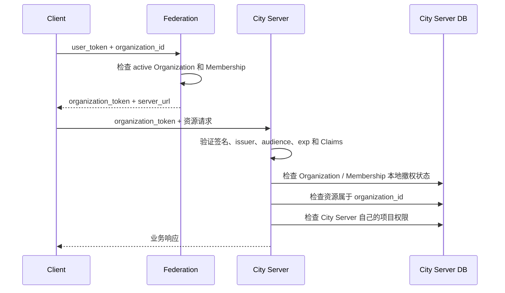

# City Server 接入 Organizations

这篇文档面向实现 City Server 的开发者。对 City Server 来说，Organizations Service
不是项目资源服务，而是外部身份与成员关系服务。它只回答一个问题：

> 这个 Federation 用户现在是否拥有某个 Organization 的有效 Membership？

Space、文档、Git Repository、项目角色和具体操作权限仍由 City Server 自己拥有。
Organization Token 只能作为进入 City Server 授权流程的第一层凭证。

## 先理解四个标识

| 字段 | City Server 应如何使用 |
| --- | --- |
| `user_id` | Federation 中的用户身份；可以映射到本地用户，但不能单独证明项目权限 |
| `city_id` | Organization 所属 City；必须与当前 City Server 配置一致 |
| `organization_id` | Organization 的稳定身份；用于关联 City Server 自己的项目资源 |
| `membership_id` | 本次成员关系的唯一身份；是 Membership 撤权的最小单位 |

同一用户退出后重新加入，会得到新的 `membership_id`。因此 City Server 必须按
`membership_id` 撤权，不能只按 `user_id` 撤权。旧 Token 不会因为用户重新加入而恢复。

Organization Token 不包含 Organization 的 Owner/Admin/Member 角色。这些角色用于
Federation 中的 Organization 治理，不等于 City Server 的 editor、viewer 或 push 权限。

## 完整请求链路



正常资源请求不访问 Federation。Federation 暂时不可用时，City Server 仍能使用缓存的
JWKS 和本地撤权状态处理已有 Token。

## 建立 Federation 信任

City Server 应显式配置允许信任的 Federation URL，不能根据未经验证 Token 中的 `iss`
动态请求任意 JWKS 地址。

从可信 Federation 获取发现信息：

```http
GET https://federation.example.com/.well-known/downcity.json
```

响应包含稳定 `issuer` 和 `jwks_uri`。JWKS 使用 Ed25519 公钥：

```http
GET https://federation.example.com/.well-known/jwks.json
```

City Server 应缓存 Discovery 和 JWKS，并在遇到未知 `kid` 时刷新一次。退休公钥仍可能
用于验证尚未过期的 Token，不能只缓存当前 active key。

## 验证 Organization Token

客户端发送的凭证形如：

```http
Authorization: Bearer ot_<JWT>
```

`ot_` 是 Downcity 的 Token 类型前缀，不属于 JWT。验签前先移除该前缀，并拒绝其他
前缀。JWT 使用 `alg: EdDSA`，Payload 包含：

```ts
type OrganizationTokenClaims = {
  iss: string;
  aud: string;
  sub: string;
  user_id: string;
  city_id: string;
  organization_id: string;
  membership_id: string;
  iat: number;
  exp: number;
  jti: string;
};
```

默认有效期为 7 天，最大不超过 30 天。City Server 每次请求必须依次验证：

1. Header 中 `alg` 只能是 `EdDSA`，`kid` 必须存在于可信 Federation JWKS；
2. 签名有效，`iss` 等于配置的 Federation issuer；
3. `aud` 精确等于当前 City Server 的公开 Origin，例如 `https://city.example.com`；
4. `exp` 未过期，`iat` 合理，并为时钟偏差设置很小的容忍窗口；
5. `sub === user_id`，四个业务 ID 都是非空字符串；
6. `city_id` 等于当前 City Server 配置的 City；
7. 请求资源归属于 Token 中的 `organization_id`；
8. 本地未撤销该 `organization_id` 和 `membership_id`；
9. 最后再执行 City Server 自己的资源权限检查。

使用 `jose` 时，核心逻辑可以写成：

```ts
import { createRemoteJWKSet, jwtVerify } from "jose";

const federation_issuer = "urn:downcity:federation:fed_...";
const server_origin = "https://city.example.com";
const city_id = "city_...";
const jwks = createRemoteJWKSet(
  new URL("https://federation.example.com/.well-known/jwks.json"),
);

export async function verify_organization_token(authorization: string) {
  const token = authorization.replace(/^Bearer\s+/iu, "");
  if (!token.startsWith("ot_")) throw new Error("ORGANIZATION_TOKEN_REQUIRED");

  const { payload } = await jwtVerify(token.slice(3), jwks, {
    algorithms: ["EdDSA"],
    issuer: federation_issuer,
    audience: server_origin,
  });

  if (payload.sub !== payload.user_id || payload.city_id !== city_id) {
    throw new Error("ORGANIZATION_TOKEN_INVALID");
  }
  if (typeof payload.organization_id !== "string"
    || typeof payload.membership_id !== "string") {
    throw new Error("ORGANIZATION_TOKEN_INVALID");
  }
  return payload;
}
```

示例只展示密码学验证和基础 Claims。生产实现还必须连接本地撤权表与资源授权。

## 本地必须保存什么

City Server 不需要复制完整 Membership 列表，只需要保存会改变本地验权结果的事实：

```sql
CREATE TABLE downcity_organization_events (
  federation_issuer TEXT NOT NULL,
  event_id TEXT NOT NULL,
  received_at TEXT NOT NULL,
  PRIMARY KEY (federation_issuer, event_id)
);

CREATE TABLE downcity_revoked_memberships (
  federation_issuer TEXT NOT NULL,
  membership_id TEXT NOT NULL,
  organization_id TEXT NOT NULL,
  revoked_at TEXT NOT NULL,
  PRIMARY KEY (federation_issuer, membership_id)
);

CREATE TABLE downcity_revoked_organizations (
  federation_issuer TEXT NOT NULL,
  organization_id TEXT NOT NULL,
  reason TEXT NOT NULL,
  revoked_at TEXT NOT NULL,
  PRIMARY KEY (federation_issuer, organization_id)
);
```

这些记录是安全状态，不是普通缓存。进程重启后必须保留，不能仅放在内存或带自动过期
的缓存中。Organization 归档和旧 Server 撤权都是不可逆事实。

City Server 自己的资源表应保存 `organization_id`，例如：

```sql
CREATE TABLE spaces (
  space_id TEXT PRIMARY KEY,
  organization_id TEXT NOT NULL,
  name TEXT NOT NULL
);
```

处理 `/v1/spaces/:space_id` 时，应先读取 Space，再比较 `space.organization_id` 与 Token
的 `organization_id`，不能接受客户端额外提交的 Organization ID 作为资源归属依据。

## 实现撤权事件端点

City Server 必须公开固定端点：

```http
POST /v1/downcity/organization-events
Content-Type: application/json

{
  "event_token": "oe_<JWT>"
}
```

`oe_` 同样只是前缀。Event Token 使用相同 Federation JWKS 签名，并以当前 Server
Origin 作为 `aud`。验证签名、issuer、audience 和时间后，可读取以下 Claims：

```ts
type OrganizationRevocationEvent = {
  event_id: string;
  event_type:
    | "organization.membership.removed"
    | "organization.archived"
    | "organization.server_url.changed";
  city_id: string;
  organization_id: string;
  membership_id: string;
  user_id: string;
  created_at: string;
};
```

三个事件的处理规则：

| Event | 持久化动作 |
| --- | --- |
| `organization.membership.removed` | 永久写入 `revoked_memberships`；拒绝这个 `membership_id` 的旧 Token |
| `organization.archived` | 永久写入 `revoked_organizations`；拒绝该 Organization 全部 Token |
| `organization.server_url.changed` | 在旧 Server 永久写入 `revoked_organizations`；新 Token 会绑定新 Server |

事件处理必须满足：

1. 只信任预先配置的 Federation；
2. 校验 `city_id` 与当前 City 一致；
3. 校验 `event_id === sub`，并用 `event_id` 保证幂等；
4. 在一个数据库事务中写入 Event 收件记录和撤权记录；
5. 数据库提交成功后才返回 `2xx`；
6. 重复 Event 直接返回 `204`；
7. 验签失败返回 `401`，Payload 不合法返回 `400`，持久化失败返回 `5xx`。

不要在 Event 处理过程中调用 Federation 回查 Membership。Event 本身已经是 Federation
签名的权威状态变化，额外网络依赖会降低撤权链路可靠性。

## 请求中间件的职责边界

推荐把一次请求拆成两层：

```text
Organization 基线认证
  ├─ Token 密码学验证
  ├─ City / audience / resource Organization 匹配
  └─ Organization / Membership 本地撤权检查

City Server 资源授权
  ├─ 本地项目角色
  ├─ Space / Document / Repository ACL
  └─ read / write / push 等具体 Action
```

第一层通过，只代表“这是某个 Organization 的有效成员”。它不代表用户能读取所有
Space，也不代表 Owner 自动拥有 Repository push 权限。

## Server URL 迁移

Owner 修改 Organization 的 `server_url` 后：

- Federation 停止签发面向旧 Origin 的 Token；
- 旧 Server 收到 `organization.server_url.changed` 并永久拒绝该 Organization；
- 新 Token 的 `aud` 只指向新 Origin；
- 新 Server 因 audience 不匹配，本来也不会接受旧 Token。

`aud` 比较必须使用部署时配置的公开 Origin，不能直接信任请求的 `Host` 或
`X-Forwarded-Host`。在反向代理后部署时，应显式配置外部 HTTPS Origin。

## 故障与安全语义

- Federation 离线：已有 Token 仍可本地验证；新用户暂时无法换取 Token。
- JWKS 刷新失败：已缓存且匹配 `kid` 的密钥可以继续使用；未知 `kid` 应拒绝。
- 撤权通知失败：Federation Outbox 会重试；最坏情况下 Token 在 7 天 TTL 到期后失效。
- City Server 落库失败：事件端点必须返回 `5xx`，促使 Federation 重试。
- Token 过期或签名无效：返回 `401`。
- Membership 或 Organization 已撤权：返回 `403`，不要删除撤权记录。

日志中可以记录 `iss`、`jti`、`organization_id`、`membership_id` 和拒绝原因，但不要记录
完整 Token。Event 端点应设置请求体大小限制、超时和速率限制，同时保留幂等重试能力。

## 接入完成检查表

- [ ] 只信任显式配置的 Federation issuer 与 JWKS URL
- [ ] 支持 EdDSA、`kid` 刷新和 JWKS 缓存
- [ ] 正确移除 `ot_` 与 `oe_` 前缀
- [ ] 校验 issuer、audience、City、Organization、时间和必要 Claims
- [ ] 资源表保存 `organization_id`，并与 Token 强制匹配
- [ ] 持久化 Membership 与 Organization 撤权状态
- [ ] 固定事件端点支持事务和 `event_id` 幂等
- [ ] 先执行 Organization 基线认证，再执行本地资源权限
- [ ] 不把原始 `user_token` 发送或保存到 City Server
- [ ] 不把 Organization Owner/Admin/Member 当作项目资源角色
