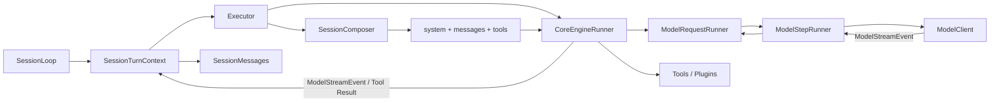

# Executor Module

`executor/` 是 Session 内部的模型与 Tool Loop 执行内核。普通 SDK 用户只通过 `Session` 调用它。

完整 Session Runtime 设计见 [`docs/session-runtime-architecture.md`](../../../../docs/session-runtime-architecture.md)。

## 边界

- `Session` 拥有输入队列并创建 Command；`SessionLoop` 负责消费、Turn Handle 与 Assistant Message 收口。
- `SessionTurnContext` 从 Turn 创建起唯一拥有取消信号、Step 快照和执行期资源。
- `SessionComposer` 根据只读 Session 快照组装 system、messages 和 tools。
- `Executor` 管理一次 Turn 的输入装配、上下文超限恢复和 Step Plugin Lease；它只对外提供 `execute()`。
- `ModelRequestRunner` 唯一拥有普通模型请求的五次重试、退避和逐次失败通知。
- `CoreEngineRunner` 执行 Tool Loop、续写和真实 usage 观测，不自行改写模型历史，也不维护普通请求重试状态。
- `SessionMessages` 是 Message 唯一事实源；Executor 不写文件、不持有 Store。

## 执行关系



每个模型 Step 前，`SessionLoop` 先消费排队的 Steer 和状态 Command。Executor 随后捕获最新 effective state，并调用 Composer 生成完整 Step 输入。

```text
Session.prompt()
  -> SessionLoop 持久化 canonical User Message
  -> Executor 捕获只读 Session 快照
  -> SessionComposer.compose()
  -> SessionModelMessages: SessionMessage -> ModelMessage
  -> CoreEngineRunner.execute()
  -> Federation / Provider 返回 ModelStreamEvent
  -> SessionAssistantOutput 直接更新 canonical Assistant Message
  -> SessionMessages 持久化并发布 Mutation
```

## 旧 Composer 去向

过去的四个独立 Composer 不再构成执行管线：

| 旧能力 | 当前归属 |
| --- | --- |
| `SystemComposer` | `DefaultSessionComposer.compose()` + `SessionSystem` |
| `HistoryComposer` | `SessionComposer` + `SessionContextPolicy` + `SessionModelMessages` |
| `ContextComposer` 的 tools | `Session.create_compose_input()` + `SessionComposer.compose()` |
| `ContextComposer` 的 Step Callback | `SessionLoop` + `CoreEngineRunner` |
| `ContextComposer` 的 fallback Assistant | `CoreEngineRunner` + `ExecutorRecoveryPolicy` |
| `CompactionComposer` | `SessionComposer.recover_context()` + Context Policy 派生表 |

统一 Composer 只回答一个策略问题：

1. 当前 Step 的 system、messages 和 tools 是什么？上下文超限时是否能由当前 Policy 推进派生状态？

Queue 消费、Turn 控制、Message 写入和 Mutation 发布都不是 Composer 职责。

## Context recovery

```text
SessionLoop / CoreEngine
  -> SessionComposer.recover_context()
  -> SessionContextPolicy 写入自己的派生表
  -> Composer 下一次 compose() 读取最新派生上下文
```

Composer 可以调用模型生成 Summary，但不能修改 canonical Message、Metadata 或发布事件。持久化提交始终由 `SessionStorage` 事务完成。

## 目录

```text
executor/
  Executor.ts
  core-engine/       模型与 Tool Loop
  composer/system/   可复用的默认 system prompt 领域实现
  messages/          Session 与 Model Protocol 消息转换
  services/          执行恢复策略
  tools/             Tool 运行辅助
  types/             Executor 内部类型
```
